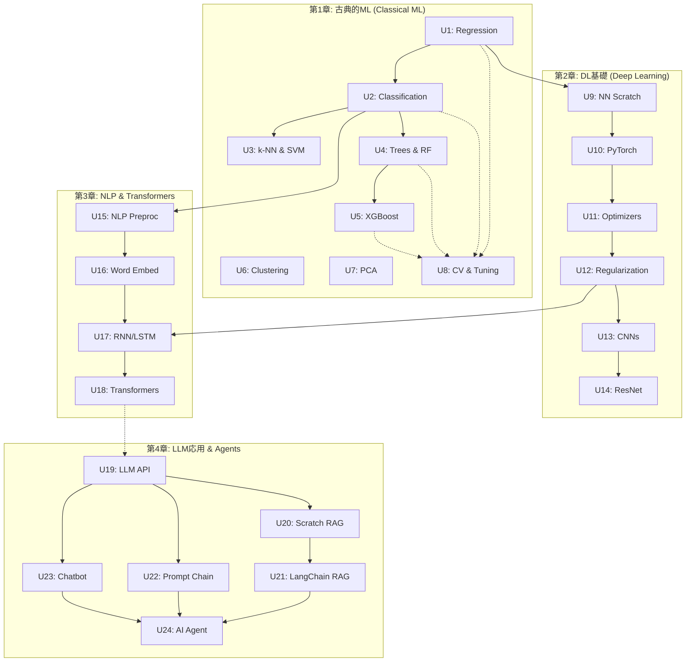

# ユニット間の依存関係 (Unit Dependencies)

本ドキュメントは、「ボトムアップ型」のアプローチに基づき、各Unit（学習トピック）間の学習順序と依存関係を定義します。

## 依存関係マトリックス

| 実行順序 | ユニット (Unit) | 必須の先行ユニット |
| :--- | :--- | :--- |
| **1** | Unit 1: Linear & Regularized Regression | なし |
| **2** | Unit 2: Logistic Regression & Metrics | Unit 1 |
| **3** | Unit 3: K-NN & SVM | Unit 2 |
| **4** | Unit 4: Decision Trees & Random Forests | Unit 2 |
| **5** | Unit 5: Gradient Boosting & XGBoost | Unit 4 |
| **6** | Unit 6: Clustering Algorithms | なし |
| **7** | Unit 7: Dimensionality Reduction (PCA) | なし |
| **8** | Unit 8: CV & Hyperparameter Tuning | Unit 1〜5 |
| **9** | Unit 9: NN from Scratch | Unit 1 |
| **10**| Unit 10: PyTorch Basics & MLP | Unit 9 |
| **11**| Unit 11: Optimizers & Loss Functions | Unit 10 |
| **12**| Unit 12: Regularization in DL | Unit 11 |
| **13**| Unit 13: CNN Basics | Unit 12 |
| **14**| Unit 14: Transfer Learning with ResNet | Unit 13 |
| **15**| Unit 15: NLP Preprocessing & TF-IDF | Unit 2 |
| **16**| Unit 16: Word Embeddings | Unit 15 |
| **17**| Unit 17: RNNs & LSTMs | Unit 12, Unit 16 |
| **18**| Unit 18: Attention & Transformers | Unit 17 |
| **19**| Unit 19: LLM API Usage & Prompting | なし |
| **20**| Unit 20: Vector DBs & RAG From Scratch | Unit 19 |
| **21**| Unit 21: LangChain Basics & RAG | Unit 20 |
| **22**| Unit 22: Prompt Chaining | Unit 19 |
| **23**| Unit 23: Context-Aware Chatbot | Unit 19 |
| **24**| Unit 24: AI Agent Implementation | Unit 21, Unit 22, Unit 23 |

## フロー図 (Dependency Flow)

