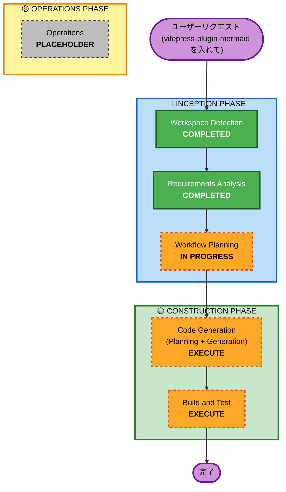
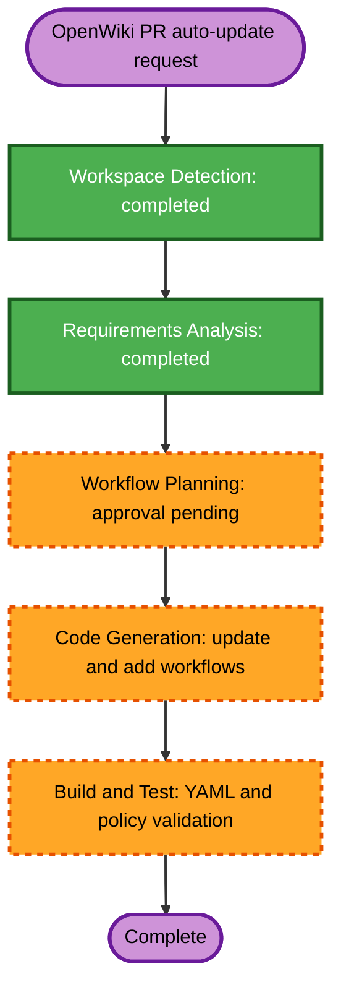

# 実行計画 (Execution Plan)

## 1. 詳細分析サマリー (Detailed Analysis Summary)

### 変更影響度アセスメント (Change Impact Assessment)

- **ユーザー直面変更 (User-facing changes)** : あり — ドキュメント内の Mermaid ダイアグラムが、生のコードブロックから美しくインタラクティブなグラフィカル図面へとレンダリングされるようになります。
- **構造変更 (Structural changes)** : なし — VitePress アプリケーションの基本構成は変わりません。
- **データモデル変更 (Data model changes)** : なし
- **API変更 (API changes)** : なし
- **NFR影響 (NFR impact)** : 軽微 — ブラウザ側での Mermaid レンダリング処理が発生しますが、静的ビルドおよび表示速度に大きな悪影響はありません。

### リスク評価 (Risk Assessment)

- **リスクレベル (Risk Level)** : 低 (Low) — パッケージの追加および設定ファイルの変更のみであり、安全にロールバック可能です。
- **ロールバック難易度 (Rollback Complexity)** : 容易 (Easy) — `git checkout` または設定の削除で即座に元に戻せます。
- **テスト難易度 (Testing Complexity)** : 容易 (Simple) — `pnpm docs:dev` または `pnpm docs:build` でビルドを確認し、ブラウザでレンダリングを視認するだけで確認できます。

---

## 2. ワークフロー可視化 (Workflow Visualization)

### Mermaid Diagram



### テキスト版代替表現 (Text Alternative)

- **Phase 1: INCEPTION (🔵 インセプションフェーズ)**
  - Stage 1: Workspace Detection (完了)
  - Stage 2: Requirements Analysis (完了)
  - Stage 3: Workflow Planning (進行中 - 本ドキュメント)
- **Phase 2: CONSTRUCTION (🟢 コンストラクションフェーズ)**
  - Stage 4: Code Generation (実行 - パッケージ追加と config 修正)
  - Stage 5: Build and Test (実行 - ローカルビルド確認とブラウザ表示確認)
- **Phase 3: OPERATIONS (🟡 オペレーションフェーズ)**
  - Stage 6: Operations (スキップ - 将来用プレースホルダー)

---

## 3. 各ステージの実行判断と根拠 (Phases to Execute & Skip)

### 🔵 INCEPTION PHASE

- **[x] Workspace Detection (COMPLETED)**
- **[x] Requirements Analysis (COMPLETED)**
- **[x] Workflow Planning (IN PROGRESS)**
- **[-] Application Design (SKIP)**
  - **根拠** : 新規コンポーネント構造や複雑なモジュール構成の設計は行わず、単一の設定ファイル変更のみであるため。
- **[-] Units Generation (SKIP)**
  - **根拠** : 今回の改修は小規模かつ単一の変更単位であり、作業の分割・依存関係定義を必要としないため。

### 🟢 CONSTRUCTION PHASE

- **[-] Functional Design (SKIP)**
  - **根拠** : 独自のビジネスロジックは存在せず、ライブラリの標準設定をインポートするだけであるため。
- **[-] NFR Requirements & Design (SKIP)**
  - **根拠** : パフォーマンス、セキュリティ、可観測性の個別実装は不要なため。
- **[-] Infrastructure Design (SKIP)**
  - **根拠** : クラウドインフラやデプロイストックの新規作成・変更は行わないため。
- **[EXECUTE] Code Generation (ALWAYS)**
  - **根拠** : `package.json` に `vitepress-plugin-mermaid` と `mermaid` を追記し、`.vitepress/config.js` に `withMermaid` 設定を組み込むための実装・コード生成が必要です。
- **[EXECUTE] Build and Test (ALWAYS)**
  - **根拠** : ローカル dev サーバーおよび `pnpm docs:build` での動作検証、および Mermaid のグラフィカルレンダリングを確認する必要があります。

---

## 4. 成功基準 (Success Criteria)

- **主要目的** : VitePress カリキュラム内で記述されているすべての Mermaid ブロック（` ```mermaid `）が、生のテキストコードではなく動的なグラフィカル図面としてレンダリングされること。
- **成果物** :
  - `package.json` へのパッケージの適切な導入。
  - `.vitepress/config.js` での `withMermaid` による設定ラップ。
- **品質ゲート** :
  - `pnpm docs:build` が警告・エラーなく完了すること。
  - `pnpm docs:dev` にて画面（例: Unit 22 などの Mermaid 使用箇所）で図面が崩れず表示されること。

---

## 5. OpenWiki PR Auto-update 実行計画 (2026-07-21)

### 5.1. 詳細分析

- **変更種別**: GitHub Actions CI/CD enhancement
- **既存workflow**: `.github/workflows/openwiki-update.yml`
- **新規workflow**: `.github/workflows/openwiki-pr-update.yml`
- **ユーザー影響**: 同一リポジトリPRのOpenWiki差分が自動的に同じPRへ追加される。
- **構造変更**: 定期・手動更新とPR更新を別workflowへ分離する。
- **データモデル／API変更**: なし。
- **NFR影響**: secretsと書き込み権限を扱うため、安全なイベント選択とfork／Dependabot除外が必要。
- **リスクレベル**: Medium。書き込み可能なCIだが、同一リポジトリPR限定、`pull_request` 使用、差分限定コミットで抑制する。
- **ロールバック**: 新規workflowの削除と既存workflowのAction指定復元で容易に戻せる。

### 5.2. Workflow Visualization



Text alternative: Workspace Detection and Requirements Analysis are complete. After Workflow Planning approval, update the existing scheduled workflow, add the PR-specific workflow, then validate YAML syntax, pinned Action versions, event guards, Node.js 24, and the no-change commit path.

### 5.3. Phase Decisions

- [x] Workspace Detection — Completed
- [x] Requirements Analysis — Completed
- [ ] Workflow Planning — Execute; approval pending
- [-] User Stories — Skip; internal CI configuration only
- [-] Application Design — Skip; no application components or service boundaries change
- [-] Units Generation — Skip; one cohesive workflow change
- [-] Functional Design — Skip; no business logic or data model
- [-] NFR Requirements / Design — Skip; security constraints are fully specified in requirements
- [-] Infrastructure Design — Skip; no deployed infrastructure resources change
- [ ] Code Generation — Execute
- [ ] Build and Test — Execute

### 5.4. Planned Change Sequence

1. Update `.github/workflows/openwiki-update.yml`:
   - pin `actions/checkout` to `de0fac2e4500dabe0009e67214ff5f5447ce83dd # v6.0.2`;
   - pin `actions/setup-node` to `48b55a011bda9f5d6aeb4c2d9c7362e8dae4041e # v6.4.0`;
   - set Node.js to `24`;
   - pin `peter-evans/create-pull-request` to `5f6978faf089d4d20b00c7766989d076bb2fc7f1 # v8.1.1`.
2. Create `.github/workflows/openwiki-pr-update.yml`:
   - trigger on `pull_request` activities `opened`, `synchronize`, and `reopened`;
   - run only for same-repository, non-Dependabot PRs;
   - checkout `github.head_ref` with the pinned checkout Action;
   - use pinned setup-node with Node.js 24;
   - run OpenWiki with existing secrets;
   - stage only OpenWiki-managed paths and push a commit only when staged changes exist;
   - use per-PR concurrency to cancel superseded runs.
3. Validate both workflow files without running OpenWiki or accessing secrets.

### 5.5. Success Criteria

- Existing schedule and manual dispatch behavior remains unchanged apart from Action and Node upgrades.
- PR workflow cannot run for fork or Dependabot PRs.
- PR workflow updates the checked-out head branch rather than creating a second PR.
- Every `uses:` reference is pinned to a verified full SHA with a full version comment.
- Node.js 24 is configured in both workflows.
- No OpenWiki diff produces no commit and no push.
- YAML parsing and repository diff checks pass.
