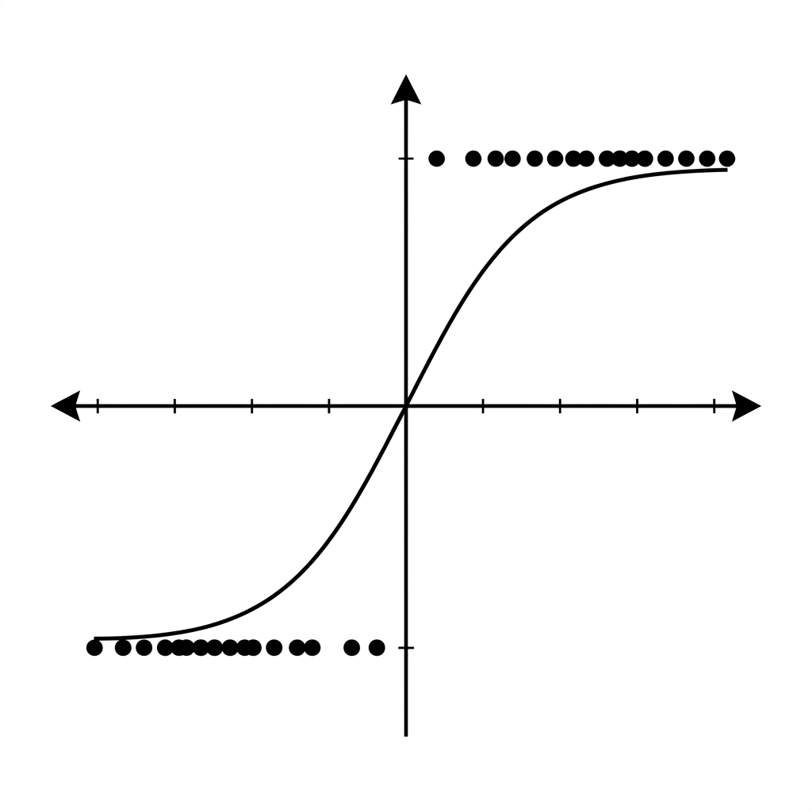

# Unit 2: ロジスティック回帰と分類評価指標

## 1. ロジスティック回帰と分類評価指標の理解



### ロジスティック回帰とは？ 〜「0か1か」の境界線を引く〜
名前に「回帰（Regression）」と付いていますが、実はこれは**「分類（Classification）」**のためのアルゴリズムです。

Unit 1で学んだ線形回帰は、「家賃はいくらか？」「明日の気温は何度か？」といった「連続する数値」を予測するものでした。
一方、今回のロジスティック回帰は、**「このメールは迷惑メールか？（Yes/No）」「この画像は犬か猫か？」「この顧客は商品を買うか買わないか？」**といった、カテゴリーを予測する（分類する）ための手法です。

#### 例え話：試験の合否予測
学生の「勉強時間」から「試験の合否（合格=1, 不合格=0）」を予測するとしましょう。
線形回帰の真っ直ぐな直線を無理やり当てはめると、予測結果が「マイナス0.2」や「1.5」といった意味不明な数値になってしまいます。

そこで登場するのが、数値を必ず「0〜1の間」に押し込める**「S字型の魔法のカーブ（シグモイド関数）」**です。
このカーブを使うことで、予測結果が「0.8」なら「合格する確率が80%だから、たぶん合格（1）！」、「0.2」なら「確率20%だから、不合格（0）だろう」といったように、**確率ベースで0か1かを判定**できるようになります。

### 分類を評価する指標たち 〜「正解率」だけではダメな理由〜
モデルができた後、「どれくらい賢いか」をテストする必要があります。
「全問中、何問正解したか」を示す**正解率（Accuracy）**は一番分かりやすい指標です。しかし、これだけでは不十分なケースがあります。

#### 例え話：「オオカミ少年」と病気の検査
100人に1人しかかからない珍しい病気の検査AIを作ったとします。
このAIが、全員に対して適当に「あなたは健康です！」と言い続けた場合、正解率はどうなるでしょうか？
100人中99人は健康なので、**何も考えていないのに正解率は99%**という素晴らしい数字になってしまいます！しかし、本当に病気の人を見逃してしまうため、AIとしては失格です。

これを防ぐために、以下のような複数の「評価指標（Metrics）」を使います。

| 指標名 | 英語名 | 意味（何を見ているか？） | どんな時に重視する？ |
| :--- | :--- | :--- | :--- |
| **適合率** | Precision | AIが「陽性（例: 病気）」と予測した中で、**本当に陽性だった割合**。誤報（狼が来たぞ！）を嫌う場合。 | 迷惑メール判定（大事なメールを迷惑に入れたくない） |
| **再現率** | Recall | 実際の「陽性」の人たちのうち、**AIが正しく見つけ出せた割合**。見逃しを嫌う場合。 | 病気の検査（間違って健康と言って見逃すのが最悪） |
| **F1スコア** | F1-Score | 適合率と再現率の「バランス」をとった平均点。 | どちらも程よく大事な時 |

### 💡 具体的なビジネスユースケース

- **金融機関の与信審査（クレジットスコアリング）**：顧客の年収、借入残高、過去の支払い履歴などのデータから、将来ローンをデフォルト（債務不履行）する確率を予測し、融資の可否を判断する。
- **サブスクリプションサービスの解約（チャーン）予測**：ユーザーのログイン頻度、機能の利用状況、問い合わせ回数などから、翌月にサービスを解約しそうなユーザーを特定し、事前にキャンペーンなどの引き止め施策を打つ。
- **スパムメールフィルタリング**：メールに含まれる特定の単語の出現頻度や送信元の情報から、受信したメールが迷惑メールである確率を算出し、自動で迷惑メールフォルダに振り分ける。

---

## 2. 実装例 (Implementation Example)

それでは、実際にPythonでロジスティック回帰を実装してみましょう。
ここでは、「乳がんの診断データ（Breast Cancer dataset）」を使って、腫瘍の大きさなどの特徴から「悪性（0）」か「良性（1）」かを分類するモデルを作ります。

```python
# 必要なツールのインポート
import pandas as pd
from sklearn.datasets import load_breast_cancer
from sklearn.model_selection import train_test_split
from sklearn.linear_model import LogisticRegression
from sklearn.metrics import accuracy_score, precision_score, recall_score, f1_score

# 1. データの準備
cancer_data = load_breast_cancer()
X = cancer_data.data      # 腫瘍の大きさや形などの数値データ
y = cancer_data.target    # 悪性か良性かの答え（0 or 1）

# データを学習用（80%）とテスト用（20%）に分割
X_train, X_test, y_train, y_test = train_test_split(X, y, test_size=0.2, random_state=42)
```

**【コードの解説】**
`load_breast_cancer()` でデータを読み込みます。ここでも Unit 1 と同じように、カンニングを防ぐためにデータを `train_test_split` で「学習用」と「テスト用」に切り分けています。

```python
# 2. モデルの準備と学習
# ロジスティック回帰モデルを作成（max_iterは計算の試行回数の上限）
model = LogisticRegression(max_iter=10000)

# 学習データを使って、0と1を分ける最適な境界線を引く（学習）
model.fit(X_train, y_train)

# 3. テストデータで予測
y_pred = model.predict(X_test)
```

**【コードの解説】**
`LogisticRegression` モデルを作成し、`.fit()` で学習させます。（`max_iter=10000` は、データが少し複雑なので「諦めずに1万回まで計算してね」と指示を出しているおまじないです）。
その後、`.predict()` でテストデータの答えを予測します。ここまでは線形回帰と全く同じ流れですね！

```python
# 4. 答え合わせ（分類の評価指標を計算）
acc = accuracy_score(y_test, y_pred)
prec = precision_score(y_test, y_pred)
rec = recall_score(y_test, y_pred)
f1 = f1_score(y_test, y_pred)

print(f"正解率 (Accuracy):  {acc:.3f}")
print(f"適合率 (Precision): {prec:.3f}")
print(f"再現率 (Recall):    {rec:.3f}")
print(f"F1スコア (F1-Score): {f1:.3f}")
```

**【コードの解説】**
予測結果（`y_pred`）と実際の答え（`y_test`）を比べて、先ほど学んだ4つの評価指標を計算しています。`sklearn.metrics` にはこれらの計算を一瞬でやってくれる便利な機能が全て揃っています。

---

## 3. 実践 (Practice)

さあ、あなたの番です！以下の要件に従って、分類モデルを構築してみましょう。

**【課題の要件】**
ワインの成分データセット（Wine dataset）を使って、ワインに含まれるアルコール度数や色の濃さなどの成分から、そのワインが「どの農家で作られたか（3種類のどれか）」を分類します。（今回は「0か1か」の2択ではなく、3択の分類問題になりますが、ロジスティック回帰はそのまま使えます！）

1. `sklearn.datasets` から `load_wine` を使ってデータを読み込んでください。
2. データを学習用（70%）とテスト用（30%）に分割してください。（`test_size=0.3`）
3. `LogisticRegression` モデルを作成して学習させてください。（`max_iter=10000`を指定）
4. テストデータに対して予測を行い、**正解率（Accuracy）**を表示してください。

**【ヒント】**
- 今回は3つのカテゴリに分ける問題なので、`precision_score` などをそのまま使うと少し複雑な設定が必要になります。まずは一番シンプルな `accuracy_score`（正解率）だけで評価してみましょう！

---

## 4. 答え合わせ (Answer Key)

自分でコードを書いてから、以下の答えを開いて確認してみましょう。

<details>
<summary>解答例を見る（クリックで展開）</summary>

```python
from sklearn.datasets import load_wine
from sklearn.model_selection import train_test_split
from sklearn.linear_model import LogisticRegression
from sklearn.metrics import accuracy_score

# 1. データの読み込み
wine = load_wine()
X = wine.data
y = wine.target

# 2. データの分割 (今回はテストデータを30%にする)
X_train, X_test, y_train, y_test = train_test_split(X, y, test_size=0.3, random_state=42)

# 3. ロジスティック回帰モデルの作成と学習
model = LogisticRegression(max_iter=10000)
model.fit(X_train, y_train)

# 4. 予測と評価 (正解率の計算)
y_pred = model.predict(X_test)
accuracy = accuracy_score(y_test, y_pred)

print(f"ワインの分類 正解率: {accuracy:.3f}")
```

**【解答コードの解説】**
ロジスティック回帰は本来「2択（バイナリ）」の分類が得意ですが、scikit-learnのロジスティック回帰は自動的に「3つ以上のカテゴリ（多クラス分類）」にも対応してくれます。「Aかそれ以外か」「Bかそれ以外か」という計算を裏で勝手にやってくれているのです。とても賢いですね！
</details>
