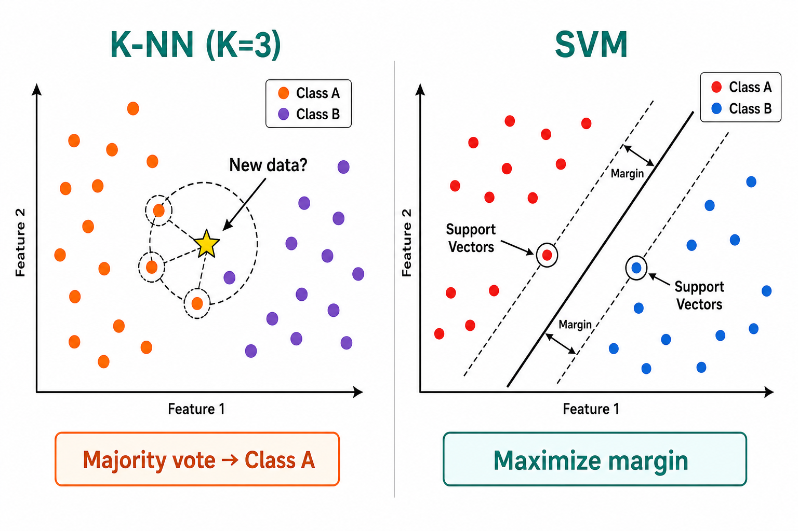
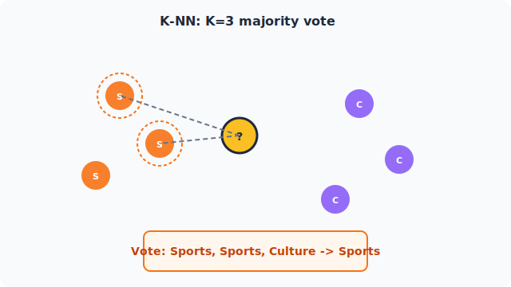
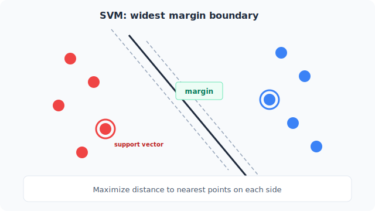
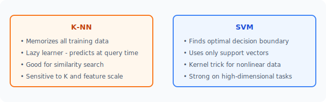

# Unit 3: K-NN とサポートベクターマシン

<p class="unit-hero">
  
</p>

## 1. K-NNとSVMの理解

この章では、全く異なるアプローチでデータを分類する2つの有名なアルゴリズム、「K-NN（K近傍法）」と「SVM（サポートベクターマシン）」について学びます。どちらも直感的で面白い特徴を持っています。

### K-NN（K近傍法）とは？ 〜「類は友を呼ぶ」アルゴリズム〜
K-NN（K-Nearest Neighbors）は、機械学習の中でも **「一番サボり魔」** なアルゴリズムです。なぜなら、事前に複雑な数式を「学習」することは一切せず、ただ **過去のデータを丸暗記しておく** だけだからです。

では、どうやって未知のデータを予測するのでしょうか？
それは **「類は友を呼ぶ（近くにいる人と同じカテゴリだろう）」** という多数決のルールです。

#### 例え話：転校生の所属グループ予想
ある学校に転校生（未知のデータ）がやってきました。この子が「運動部タイプ」か「文化部タイプ」かを予測したいとします。
K-NNはこう考えます。
1. その転校生の趣味や性格（特徴）と一番似ている **K人（例えば3人）** の生徒を見つけます。
2. その3人が「運動部、運動部、文化部」だったら、多数決で「この転校生も運動部だろう！」と予測します。

下図は、K=3 のときに未知のデータの近くにいる3つのデータ点で多数決を行い、所属グループを決める様子を表したものです。



| Kの数（何人の意見を聞くか） | メリット | デメリット |
| :--- | :--- | :--- |
| **Kが小さすぎる（例: K=1）** | 複雑な境界線を引ける | 偶然近くにいた変なデータ（ノイズ）に騙されやすい |
| **Kが大きすぎる（例: K=100）** | ノイズに強く、安定する | 細かい特徴を無視してしまい、全部大雑把な予測になる |

### SVM（サポートベクターマシン）とは？ 〜「最も広い道路」を作る職人〜
一方のSVM（Support Vector Machine）は、非常に厳格で優秀な **「境界線引き職人」** です。

データを2つのグループ（例えば、赤チームと青チーム）に分ける直線を引く時、ただ分ければいいというものではありません。SVMは **「両方のチームから、できるだけ遠く離れた安全な境界線（道路）を引く」** ことを目指します。

#### 例え話：領土の境界線とマージン
赤の国と青の国の間に国境（境界線）を引くとします。
国境がギリギリ赤い家に近すぎると、少しでもデータがブレた時に誤検知してしまいます。そこでSVMは、一番国境に近い赤い家と青い家（これを **サポートベクター** と呼びます）を見つけ、その両方から「最大に広い緩衝地帯（マージン）」を取れるように国境を引きます。

下図は、SVMがサポートベクターを基準にして、両グループから最も離れた「最大マージン」の境界線を引く様子を表したものです。



さらにSVMには **「カーネルトリック（Kernel Trick）」** という必殺技があります。
データが複雑に混ざり合って直線で分けられない時、データを「2次元から3次元の空間にポンッと放り投げて、空中でスパッと平面で切る」という魔法のような計算を行い、複雑な分類を可能にします。

### 忘れてはいけない下準備 〜特徴量スケーリング〜
K-NNとSVMには、実は共通の重要な注意点があります。それは、どちらも **「データ同士の距離」を基準に判断するアルゴリズム** だということです。

例えば、「身長（150〜190cm）」と「年収（300万〜1000万円）」という2つの特徴量があると、数値の桁が大きい年収ばかりが距離の計算を支配してしまい、身長の違いがほとんど無視されてしまいます。これでは正しい「ご近所さん」や「境界線」を見つけられません。

そこで、学習の前にすべての特徴量を同じくらいのスケール（ものさし）に揃える **特徴量スケーリング（標準化）** を行うのが鉄則です。scikit-learn では `StandardScaler` を使うことで、各特徴量を「平均0・標準偏差1」に変換できます。次の実装例で実際に使ってみましょう。

### 💡 具体的なビジネスユースケース

- **ECサイトの類似商品レコメンド (K-NN)** ：商品の特徴（価格、カテゴリ、ユーザーの評価など）が似ている商品を見つけ出し、「この商品を買った人はこんな商品も見ています」と提案する。
- **製造業における外観検査・異常検知 (SVM)** ：製品の表面画像などのデータから、良品と不良品を分ける複雑な境界線を学習し、目視検査を自動化して品質管理の精度を向上させる。
- **医療分野での疾患診断支援 (SVM)** ：患者の血液検査の数値やバイタルデータなどの複雑な特徴量から、特定の病気の陽性・陰性を高精度に分類し、医師の診断をサポートする。

---

## 2. 実装例 (Implementation Example)

今回は有名な「アヤメ（Iris）の花のデータセット」を使って、花の「がく」と「花びら」の長さや幅から、3種類のアヤメの品種を分類してみましょう。K-NNとSVMの両方を同時に実装して比較します。

下図は、これから実装するK-NNとSVMそれぞれの特徴を比較したものです。



```python
# 必要なツールのインポート
from sklearn.datasets import load_iris
from sklearn.model_selection import train_test_split
from sklearn.preprocessing import StandardScaler
from sklearn.neighbors import KNeighborsClassifier
from sklearn.svm import SVC
from sklearn.metrics import accuracy_score

# 1. データの準備
iris = load_iris()
X = iris.data
y = iris.target

# 学習用（80%）とテスト用（20%）に分割
X_train, X_test, y_train, y_test = train_test_split(X, y, test_size=0.2, random_state=42)

# 2. 特徴量スケーリング（標準化）
# K-NNもSVMも「距離」で判断するため、ものさしを揃えます
scaler = StandardScaler()

# 学習データで「平均と標準偏差」を計算しつつ変換（fit_transform）
X_train_scaled = scaler.fit_transform(X_train)

# テストデータは「学習データのものさし」でそのまま変換（transform）
X_test_scaled = scaler.transform(X_test)
```

**【コードの解説】**
おなじみのデータ読み込みと分割に加えて、今回は `StandardScaler` による標準化を行っています。ここで重要なのは、 **学習データには `fit_transform`、テストデータには `transform` を使う** ことです。テストデータで `fit` をやり直してしまうと、本番では知り得ないテストデータの情報がものさし作りに漏れてしまう（カンニングになる）ため、必ず学習データで作ったものさしを使い回します。

```python
# 3. K-NNモデルの学習と予測
# K=3 (一番近い3つのデータを見て多数決する) に設定
knn_model = KNeighborsClassifier(n_neighbors=3)

# スケーリング済みの過去データを丸暗記（学習）
knn_model.fit(X_train_scaled, y_train)

# 予測して正解率を計算
knn_pred = knn_model.predict(X_test_scaled)
knn_acc = accuracy_score(y_test, knn_pred)

print(f"K-NNの正解率: {knn_acc:.3f}")
```

**【コードの解説】**
`KNeighborsClassifier` を使います。`n_neighbors=3` が「3人の友達を見る」という設定です。K-NNの `.fit()` は実際には計算をせず、データをメモリに保存しているだけです。

```python
# 4. SVMモデルの学習と予測
# kernel='rbf' は、先ほど説明した「次元を飛ばして曲線を引く魔法（カーネルトリック）」の設定です
svm_model = SVC(kernel='rbf', random_state=42)

# 最大の道路幅を見つける（学習）
svm_model.fit(X_train_scaled, y_train)

# 予測して正解率を計算
svm_pred = svm_model.predict(X_test_scaled)
svm_acc = accuracy_score(y_test, svm_pred)

print(f"SVMの正解率:  {svm_acc:.3f}")
```

**【コードの解説】**
`SVC` (Support Vector Classification) がSVMのクラスです。`kernel='rbf'` は最も一般的に使われる強力なカーネルで、複雑な境界線を自動で作ってくれます。結果を見ると、どちらのアルゴリズムも非常に優秀であることが分かります！

---

## 3. 実践 (Practice)

以下の要件に従って、SVMを使った分類器を構築してみましょう！

**【課題の要件】**
今回は「手書き数字のデータセット（Digits dataset）」を使います。これは、8×8ピクセルの粗い画像データから、0〜9の数字のどれが書かれているかを当てるAIを作ります。

1. `sklearn.datasets` から `load_digits` を使ってデータを読み込んでください。
2. データを学習用（80%）とテスト用（20%）に分割してください。
3. `SVC` モデル（SVM）を作成して学習させてください。
4. テストデータに対して予測を行い、正解率（Accuracy）を表示してください。

**【標準化について】** 今回は全特徴量が同じ単位・範囲の画素値なので、`StandardScaler` は必須ではありません。余裕があれば標準化あり・なしの結果も比較して、データの単位が異なる場合との違いを確認してみましょう。

**【オプション課題】** 余裕があれば `KNeighborsClassifier` でも同じデータを試して、SVMと正解率を比べてみましょう。

**【ヒント】**
- データの読み込みは `digits = load_digits()` です。画像データですが、すでに機械学習に使いやすい数値のリスト（`digits.data`）に変換されているので、今までと同じように `X = digits.data` として扱うことができます。

---

## 4. 答え合わせ (Answer Key)

自分でコードを書いてから、以下の答えを開いて確認してみましょう。

<details>
<summary>解答例を見る（クリックで展開）</summary>

```python
from sklearn.datasets import load_digits
from sklearn.model_selection import train_test_split
from sklearn.svm import SVC
from sklearn.metrics import accuracy_score

# 1. データの読み込み
digits = load_digits()
X = digits.data
y = digits.target

# 2. データの分割
X_train, X_test, y_train, y_test = train_test_split(X, y, test_size=0.2, random_state=42)

# 3. SVMモデルの作成と学習
# 今回はデフォルトの設定で作成します
svm_model = SVC(random_state=42)
svm_model.fit(X_train, y_train)

# 4. 予測と評価
y_pred = svm_model.predict(X_test)
accuracy = accuracy_score(y_test, y_pred)

print(f"手書き数字認識(SVM)の正解率: {accuracy:.3f}")
```

**【解答コードの解説】**
手書き数字のような「ピクセルの集まり」のように少し複雑なデータでも、SVMを使うと98%前後の非常に高い正解率を簡単に叩き出すことができます！SVMが強力なアルゴリズムだということが実感できたのではないでしょうか。

なお、この解答では本文で「鉄則」とした `StandardScaler` による標準化をあえて省略しています。digits データセットはすべての特徴量が「ピクセルの濃さ（0〜16）」という **同じ単位・同じ範囲** で揃っているため、標準化してもしなくても結果がほとんど変わらないからです。実データのように「年収（数百万円）」と「年齢（数十）」など単位がバラバラな特徴量を扱うときは、鉄則どおり必ず標準化を行ってください。
</details>
