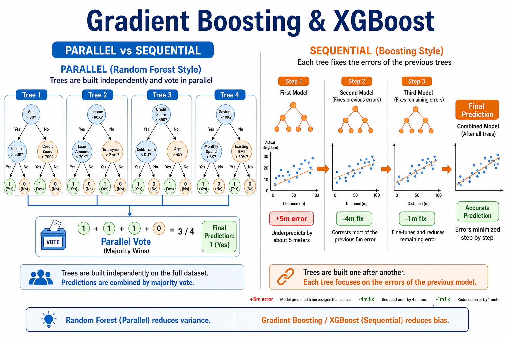
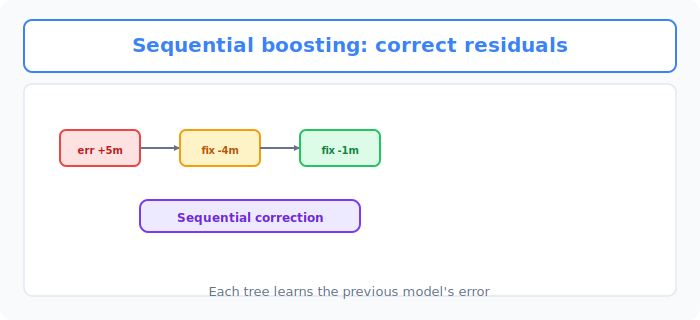
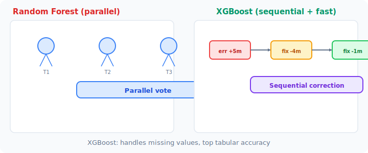

# Unit 5: 勾配ブースティングと XGBoost

<p class="unit-hero">
  
</p>

## 1. 勾配ブースティングとXGBoostの理解

前章のランダムフォレストは、「たくさんの木を作って多数決をとる（アンサンブル学習）」という手法でした。今回は、同じアンサンブル学習でも別のアプローチをとる **「勾配ブースティング（Gradient Boosting）」** と、その実用的な実装の一つである **「XGBoost」** について学びます。

### 勾配ブースティングとは？ 〜「弱点をカバーし合うリレー競技」〜
ランダムフォレストが「100人がせーので予測して多数決をとる」のに対し、勾配ブースティングは **「前の人の失敗（誤差）を、次の人が全力でカバーするリレー競技」** です。

#### 例え話：チームでゴルフのホールインワンを狙う
ゴルフで、スタート地点から遠く離れたカップ（正解）にボールを入れるとします。
1. **1人目の木（モデル）** ：まずは思い切り打ちます。大体近づきますが、まだカップから「右に5メートル」ずれています。
2. **2人目の木** ：1人目の木が残した「右に5メートル」という **誤差だけを修正する** ように打ちます。今度は「手前に1メートル」ずれました。
3. **3人目の木** ：「手前に1メートル」を修正するように優しく打ちます。
4. これを繰り返すことで、最終的にピタリと正解に辿り着きます！

このように、「前の木が間違えた部分（誤差）を、次の木が予測して修正する」というプロセスを順番に繰り返すことで、少しずつ精度を高めていくのがブースティングの仕組みです。

| 手法 | アプローチ | メリット・デメリット |
| :--- | :--- | :--- |
| **ランダムフォレスト** | 並列（みんなで一斉に解く） | 計算が速い。過学習しにくい。 |
| **ブースティング** | 直列（前の失敗を次に活かす） | 高い精度を得やすい代表的な手法。ただし計算に時間がかかり、調整（チューニング）が難しい。 |

下図は、前のモデルの **残差（誤差）** を次の木が順番に補正していくブースティングの流れです。



### XGBoostとは？ 〜実用的な勾配ブースティング〜
ブースティングは高い精度を得やすい一方、「直列（順番）に計算するから時間がかかる」という弱点があります。

そこで登場したのが **XGBoost (eXtreme Gradient Boosting)** です！
XGBoostでは、ブースティングの木を順番に作っていく流れ自体は直列のままです。その代わり、 **1本の木を作る内部の計算（どの特徴量のどの値で分割するかの探索）を並列化** することで、 **爆速化** を実現しました。さらに「データの欠損（空欄）を自動で処理する」などの便利な機能も詰め込まれています。

なお、勾配ブースティングそのものは scikit-learn の `GradientBoostingClassifier` でも手軽に使うことができます。ただし、XGBoostは速度・精度・欠損値処理の面で優れているため、実務ではこちらが主流となっています。なお、XGBoost をはじめとする多くの ML アルゴリズムは数値しか扱えないため、「東京/大阪」のような **カテゴリ変数** はあらかじめ数値に変換（エンコーディング）してから渡します。その代表的な方法（One-Hot エンコーディング）は Unit 9 で実際に使います。

その圧倒的な精度とスピードから、世界中のデータサイエンティストが競い合う大会（Kaggleなど）で **「優勝者のほとんどがXGBoostを使っている」** という一時代を築いた、伝説のアルゴリズムです。

下図は、左の **並列投票（Random Forest）** と、右の **逐次補正（XGBoost）** の違いを比較したものです。



### 💡 具体的なビジネスユースケース

- **ダイナミックプライシング（価格最適化）** ：ホテルや航空券などの価格を、需要予測、競合の価格、曜日や季節などの複雑なデータに基づいてXGBoostで高精度に予測し、リアルタイムで利益が最大化する価格に自動変更する。
- **ネット広告のクリック率（CTR）予測** ：ユーザーの閲覧履歴、属性データ、広告のクリエイティブ情報から、その広告がクリックされる確率をXGBoostで極めて高い精度で予測し、最も効果的な広告を配信する。
- **在庫最適化と需要予測** ：小売業において何万点もの商品の翌週の需要を予測する際、数多くの要因（天候、トレンド、過去のプロモーション効果）を考慮し、XGBoostの精度を活かして過剰在庫と欠品を最小限に抑える。

---

## 2. 実装例 (Implementation Example)

今回は、XGBoostのライブラリを使って、乳がんの診断データを分類してみましょう。（※ `xgboost` はscikit-learnとは別のライブラリなので、事前にインストールされている必要があります。）

```python
# 必要なツールのインポート
import xgboost as xgb
from sklearn.datasets import load_breast_cancer
from sklearn.model_selection import train_test_split
from sklearn.metrics import accuracy_score

# 1. データの準備と分割
cancer = load_breast_cancer()
X = cancer.data
y = cancer.target

X_train, X_test, y_train, y_test = train_test_split(X, y, test_size=0.2, random_state=42)
```

**【コードの解説】**
データの準備は今までと全く同じです。scikit-learnのデータセットをそのままXGBoostに渡すことができます。

```python
# 2. XGBoostモデルの作成
# XGBClassifier を使います。
# n_estimators: 作る木の数（リレーのバトンを渡す回数）
# learning_rate: 学習率（1回のスイングの強さ。大きすぎるとカップを通り過ぎてしまいます）
xgb_model = xgb.XGBClassifier(
    n_estimators=100,
    learning_rate=0.1,
    random_state=42,
    eval_metric='logloss' # 評価指標を明示的に指定（二値分類では logloss が定番）
)

# 3. 学習
xgb_model.fit(X_train, y_train)

# 4. 予測と評価
y_pred = xgb_model.predict(X_test)
acc = accuracy_score(y_test, y_pred)

print(f"XGBoostの正解率: {acc:.3f}")
```

**【コードの解説】**
`xgb.XGBClassifier` を使ってモデルを作成します。使い方はscikit-learnのモデル（`.fit()` と `.predict()`）と完全に同じになるように作られているため、とても使いやすいです！
`learning_rate`（学習率）はXGBoostで最も重要な設定値の1つで、少しずつ慎重に修正するか（小さい値）、一気に大きく修正するか（大きい値）を決めます。

---

## 3. 実践 (Practice)

さて、XGBoostを使って自分自身でモデルを構築してみましょう。

**【課題の要件】**
ワインの分類データセット（Wine dataset）を使い、XGBoostで3種類のワインを分類するモデルを作ってください。

1. `sklearn.datasets` から `load_wine` を読み込んでください。
2. データを学習用（80%）とテスト用（20%）に分割してください。
3. `xgb.XGBClassifier` を使ってモデルを作成してください。（パラメーターは `n_estimators=50`、`learning_rate=0.2` としてみましょう）
4. 学習データで学習し、テストデータに対して予測を行い、正解率（Accuracy）を表示してください。

**【ヒント】**
- インポート忘れに注意しましょう。`import xgboost as xgb` と `from sklearn.metrics import accuracy_score` が必要です。

---

## 4. 答え合わせ (Answer Key)

自分でコードを書いてから、以下の答えを開いて確認してみましょう。

<details>
<summary>解答例を見る（クリックで展開）</summary>

```python
import xgboost as xgb
from sklearn.datasets import load_wine
from sklearn.model_selection import train_test_split
from sklearn.metrics import accuracy_score

# 1. データの読み込み
wine = load_wine()
X = wine.data
y = wine.target

# 2. データの分割
X_train, X_test, y_train, y_test = train_test_split(X, y, test_size=0.2, random_state=42)

# 3. XGBoostモデルの作成と学習
# wineデータは3クラス分類（0, 1, 2）ですが、XGBoostは自動的に対応してくれます
xgb_model = xgb.XGBClassifier(
    n_estimators=50,
    learning_rate=0.2,
    random_state=42,
    eval_metric='mlogloss' # 多クラス分類用の評価指標
)
xgb_model.fit(X_train, y_train)

# 4. 予測と評価
y_pred = xgb_model.predict(X_test)
accuracy = accuracy_score(y_test, y_pred)

print(f"ワイン分類(XGBoost)の正解率: {accuracy:.3f}")
```

**【解答コードの解説】**
たった数十行のコードで、表形式データに強いことで知られるアルゴリズムを動かせます。XGBoostは有力な選択肢ですが、データ分割、チューニング、評価指標、運用条件を含めて他のモデルと比較します。
</details>
