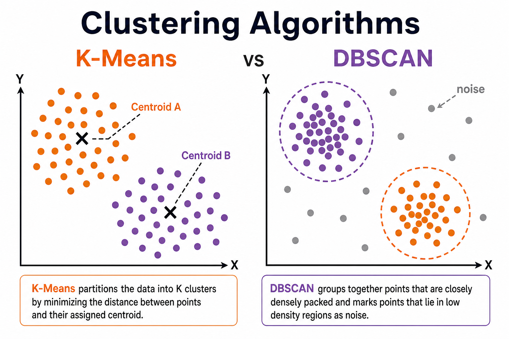
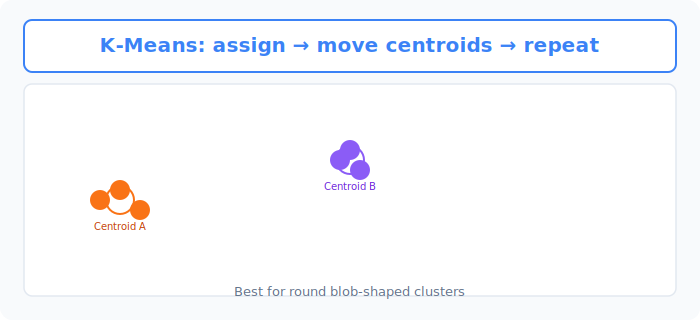
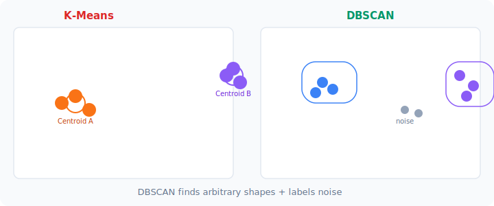

# Unit 6: クラスタリングアルゴリズム

<p class="unit-hero">
  
</p>

## 1. クラスタリングの理解

これまでのUnit（線形回帰やランダムフォレストなど）はすべて、 **「正解（目的変数）」が分かっているデータ** を使って、「このデータはAですか？Bですか？」と予測する手法でした。これを「教師あり学習」と呼びます。

しかし、世の中のデータには「正解のラベル」がついていないことの方が圧倒的に多いです。例えば、「自社の顧客10万人の購買データ」があったとして、「この顧客はAグループ、この人はBグループ」という正解は誰にも分かりません。

このように **「正解がないデータの中から、似た者同士を集めて自動的にグループ分けする」** 手法を **「クラスタリング（教師なし学習）」** と呼びます。

### K-Means（K平均法）とは？ 〜「パーティの席決め」アルゴリズム〜
クラスタリングの中で最も有名でシンプルなのが **K-Means（K-ミーンズ）** です。
「データをK個のグループ（クラスタ）に分ける」というアルゴリズムで、その仕組みはまるで「パーティ会場での自動的な席決め」のようです。

#### 例え話：立食パーティの席決め
広い会場に、お客さんがバラバラに立っているとします。あなたは彼らを「2つのグループ（テーブル）」に分けたいです。
K-Meansは以下のステップでこれを自動で行います。

1. **適当にテーブルを置く（初期化）**
   会場の適当な場所に、2つのテーブル（赤・青）を置きます。
2. **一番近いテーブルに所属させる（割り当て）**
   お客さん全員に、「自分から一番近いテーブルの色」のバッジを胸に付けてもらいます。
3. **テーブルをグループの中心に移動させる（更新）**
   「赤いバッジ」を付けたお客さんたちの **ド真ん中** に、赤いテーブルをズズズッと移動させます。青のテーブルも同じように移動させます。
4. **ステップ2と3を繰り返す**
   テーブルが移動したので、「一番近いテーブル」が変わったお客さんがいます。バッジを付け直してもらい、またテーブルを真ん中に移動させます。
   これを繰り返し、 **「誰もバッジを付け直さなくなった（テーブルが動かなくなった）」ら、席決め完了！** です。

下図は、収束後の K-Means の結果イメージです。オレンジと紫の2つの **重心（centroid）** を中心に、各データ点が最も近いクラスタに割り当てられています。ステップ3の「テーブルを真ん中に移動」は、この重心の更新に相当します。



| K-Meansの特徴 | 解説 |
| :--- | :--- |
| **必要な設定** | 最初に「いくつ（K個）のグループに分けるか」を人間が決める必要があります。 |
| **得意なこと** | 丸く集まっているデータ（球状のデータ）を綺麗に分けること。 |
| **苦手なこと** | 三日月型のように複雑に絡み合ったデータを分けることや、外れ値（極端に変なデータ）に引っ張られやすいこと。 |

### DBSCAN とは？ 〜「密度の濃い集団」を見つける〜
K-Means の弱点を補う代表的な手法が **DBSCAN（Density-Based Spatial Clustering of Applications with Noise）** です。あらかじめクラスタ数 K を決める必要がなく、 **データの密度** が高い領域をクラスタとして検出します。密度の薄い孤立点は「ノイズ（外れ値）」として除外できます。

下図は K-Means（左）と DBSCAN（右）の違いを比較したものです。左ではオレンジ・紫の **重心** を中心に丸いクラスタが形成されます。右では密度の高い領域（青・紫の枠内）だけがクラスタとなり、孤立した灰色の点は **ノイズ** として除外されます。



| アルゴリズム | 向いている場面 |
| :--- | :--- |
| **K-Means** | クラスタ数が分かっている、データが球状にまとまっている |
| **DBSCAN** | クラスタ数が不明、形が不規則、ノイズ除去もしたい |

### 💡 具体的なビジネスユースケース

- **顧客セグメンテーション** ：マーケティングにおいて、顧客の購買履歴や行動データからK-Means等で似たような顧客をグループ化し、「優良顧客層」「離反予備軍」などのペルソナを自動で発見してターゲット施策を打つ。
- **不動産・エリアマーケティング** ：各地域の人口動態、平均所得、店舗数などのデータから地域をクラスタリングし、新規出店に最適な類似エリアを特定する。
- **ニュースアプリの記事グルーピング** ：毎日配信される大量のニュース記事のテキストデータを解析し、トピック（政治、スポーツ、エンタメなど）ごとに自動でグループ分けしてユーザーの興味に合わせたタブに表示する。

---

## 2. 実装例 (Implementation Example)

今回は、自分で「正解がないランダムなデータの塊」を作って、K-Meansに自動でグループ分けさせてみましょう。

```python
# 必要なツールのインポート
import matplotlib.pyplot as plt
from sklearn.datasets import make_blobs
from sklearn.cluster import KMeans

# 1. データの準備（正解のないデータを作る）
# make_blobs は、人工的に「塊（クラスタ）」を作るための便利ツールです
# 今回は4つの塊（centers=4）を作りますが、K-Meansにはその正解を教えません！
X, _ = make_blobs(n_samples=300, centers=4, cluster_std=0.6, random_state=42)

# データをグラフに描いて確認してみましょう
plt.scatter(X[:, 0], X[:, 1], c='gray', s=30)
plt.title("Grouping without answers")
plt.show()
# ※グレーの点がバラバラに配置されたグラフが表示されます
```

**【コードの解説】**
`make_blobs` で作ったデータ `X` には、縦軸と横軸の数値しか入っていません。「誰がどのグループか」という正解ラベル（`y`）は使わずに進めます。

```python
# 2. K-Meansモデルの作成と学習
# n_clusters=4：今回は「4つのグループに分けてね」と指示します
kmeans = KMeans(n_clusters=4, random_state=42)

# 学習（教師なしなので、Xだけを渡します。yは不要です！）
kmeans.fit(X)

# 3. 予測（各データがどのグループに振り分けられたかを取得）
labels = kmeans.predict(X)

# 4. グループ分けの結果を色分けしてグラフに描画
plt.scatter(X[:, 0], X[:, 1], c=labels, cmap='viridis', s=30)
plt.title("K-Means Clustering Result")
plt.show()
```

**【コードの解説】**
`KMeans(n_clusters=4)` でモデルを作り、`.fit(X)` で学習させます。ここで重要なのは、 **`.fit(X)` の中に正解データ（y）を入れていない** ことです！
学習後、`.predict(X)` を実行すると、AIが勝手に「これはグループ0、あれはグループ1...」とラベル（`labels`）を付けて返してくれます。グラフを描画すると、見事に4つの色（グループ）に分かれていることが確認できます。

なお、K-Means や DBSCAN も「距離」を手がかりにするアルゴリズムです。今回の `make_blobs` のデータは各特徴量のスケールが揃っていますが、実データで単位がバラバラな特徴量を使うときは、Unit 3 と同じく `StandardScaler` による標準化を行ってからクラスタリングするのが鉄則です。

最後に、もう1つのクラスタリング手法である DBSCAN も同じデータで動かしてみましょう。

```python
# 5. DBSCANによるクラスタリング
from sklearn.cluster import DBSCAN

# eps: 「ご近所さん」とみなす距離の半径
# min_samples: その半径内に何個データがあれば「密度が濃い」とみなすか
dbscan = DBSCAN(eps=0.5, min_samples=5)

# K-Meansと違い、クラスタ数（n_clusters）は指定しません！
dbscan_labels = dbscan.fit_predict(X)

# ラベルが -1 のデータは、どのクラスタにも属さない「ノイズ（外れ値）」です
print("DBSCANが見つけたクラスタ番号:", set(dbscan_labels))
print("ノイズと判定されたデータの数:", list(dbscan_labels).count(-1))

# 結果を色分けして描画（ノイズは同じ色でまとめて表示されます）
plt.scatter(X[:, 0], X[:, 1], c=dbscan_labels, cmap='viridis', s=30)
plt.title("DBSCAN Clustering Result")
plt.show()
```

**【コードの解説】**
`eps` は「ここまでの距離なら仲間とみなす」という半径、`min_samples` は「仲間が最低何人いれば密集地帯（クラスタ）と認めるか」という人数の設定です。K-Meansと違ってクラスタ数を人間が指定する必要はなく、密度の濃い塊を自動で見つけてくれます。また、どの塊にも入れなかった孤立点には `-1`（ノイズ）というラベルが付くのも、K-Meansにはない大きな特徴です。

---

## 3. 実践 (Practice)

さて、今度は実データを使ってクラスタリングを行ってみましょう！

**【課題の要件】**
アヤメ（Iris）のデータセットを使います。このデータには本来「3種類の品種」という正解がありますが、今回はその正解を隠して、花びらの長さなどの「数値データだけ」を使ってクラスタリングを行います。

1. `sklearn.datasets` から `load_iris` を読み込んでください。
2. データの数値部分だけを取り出してください。（`X = iris.data`）
3. `KMeans` を使って、データを **3つ** のクラスタ（`n_clusters=3`）に分けてください。
4. 各データに割り当てられたクラスタの番号（0, 1, 2）を取得して、最初の20個だけ表示（`print(labels[:20])`）してみてください。

**【ヒント】**
- 教師なし学習なので、`train_test_split` でデータを分割する必要はありません。すべてのデータを一気に `fit()` に突っ込んで大丈夫です。

---

## 4. 答え合わせ (Answer Key)

自分でコードを書いてから、以下の答えを開いて確認してみましょう。

<details>
<summary>解答例を見る（クリックで展開）</summary>

```python
from sklearn.datasets import load_iris
from sklearn.cluster import KMeans

# 1. データの読み込み
iris = load_iris()
# 教師なし学習なので、目的変数(iris.target)は見ないフリをします！
X = iris.data

# 2. K-Meansモデルの作成
# アヤメは3品種だと知っているので、3グループに設定します
kmeans = KMeans(n_clusters=3, random_state=42)

# 3. 学習（クラスタリングの実行）
kmeans.fit(X)

# 4. 各データのクラスタ番号を取得
labels = kmeans.predict(X)

# 最初の20個の割り当て結果を表示
print("最初の20個のクラスタ分類結果:")
print(labels[:20])

# (おまけ) AIが自動で見つけた「3つのグループの中心点(重心)」を表示
print("\n各クラスタの中心点の座標:")
print(kmeans.cluster_centers_)
```

**【解答コードの解説】**
正解（花の品種）を一切教えていないのに、AIは花びらの長さなどのデータだけを見て、似ているアヤメを自動的に同じグループ（例えばすべて「1」）に分類してくれました。
このように、「よく分からない大量のデータ」が手に入った時、まずK-Meansを使って「とりあえずいくつかのグループに分けて傾向を見てみる」という分析アプローチは非常に強力です！
</details>
