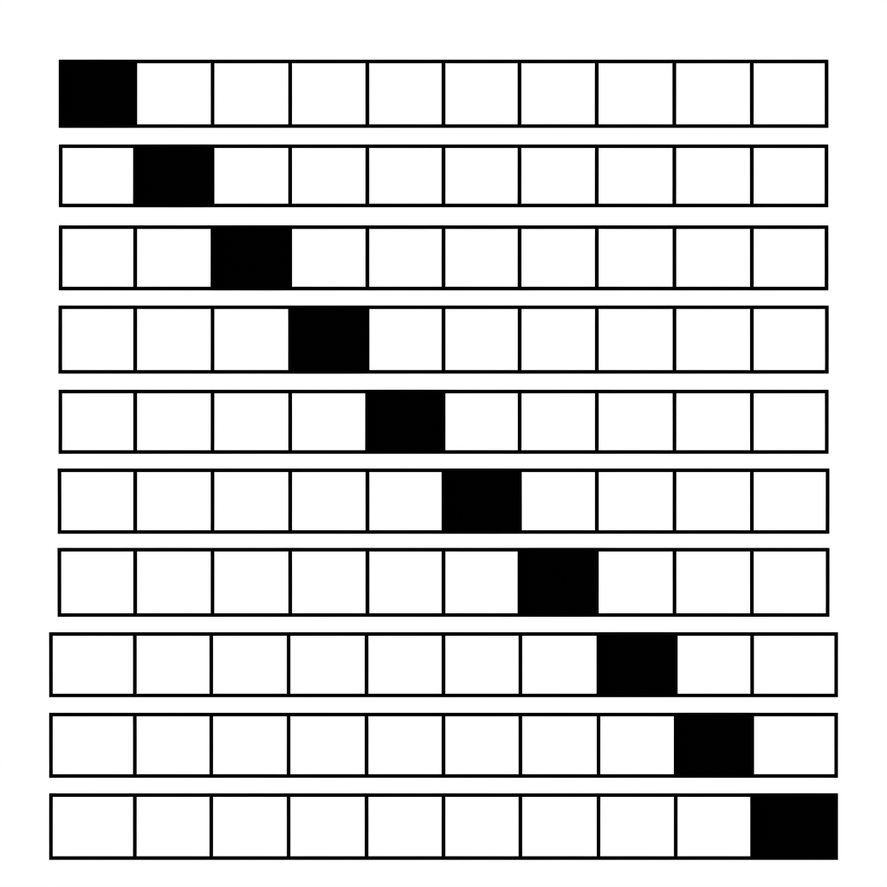

# Unit 8: 交差検証とハイパーパラメータ調整

## 1. 交差検証とハイパーパラメータ・チューニングの理解



機械学習モデルを作るとき、私たちは今まで「データを学習用とテスト用に分ける（`train_test_split`）」ことや、「モデルを作るときに `n_neighbors=3` のように設定を書き込む」ことを行ってきました。
しかし、現場のデータサイエンティストは「適当に分けた1回のテスト結果」や「勘で決めた設定値」を信用しません。この章では、AIの実力をより**正確に測る方法**と、AIの性能を**限界まで引き出す設定の探し方**を学びます。

### 交差検証（Cross Validation）とは？ 〜「模擬試験」は複数回受けるべき〜
これまで使ってきた `train_test_split` は、データを1回だけ「学習用（80%）」と「テスト用（20%）」に切って精度を計算していました。
しかし、これには弱点があります。**「たまたまテストデータに簡単な問題ばかり集まって、正解率が高く出ただけ（ラッキーだっただけ）」**かもしれないのです。

これを防ぐのが**交差検証（K-Fold Cross Validation）**です。
例えるなら、「模擬試験を1回だけ受けて一喜一憂するのではなく、**出題範囲を変えて5回模擬試験を受け、その平均点で本当の実力を測る**」というアプローチです。

1. データを例えば5つのブロックに分けます（K=5）。
2. 「ブロック1」をテスト用に、「残り4つ」を学習用にしてテストを受けます。
3. 次は「ブロック2」をテスト用に、「残り4つ」を学習用にしてテストを受けます。
4. これを5回繰り返し、**5回の正解率の平均**を最終的なAIの「本当の実力」とみなします。

### ハイパーパラメータ・チューニングとは？ 〜「究極の設定値」を探せ！〜
機械学習モデルには、人間が手動で決めなければならない「設定値」がいくつか存在します。これを**ハイパーパラメータ**と呼びます。

- **K-NNのハイパーパラメータ**：何人の意見を聞くか？（`n_neighbors`）
- **ランダムフォレストのハイパーパラメータ**：木を何本作るか？（`n_estimators`）、木の深さは？（`max_depth`）

これらの数値をカンで決めるのはやめて、**「考えられる設定の組み合わせを、コンピューターに全部試させて、一番スコアが高かった設定を採用する」**という手法が**グリッドサーチ（Grid Search）**です。

| 手法の名前 | 仕組みの例え |
| :--- | :--- |
| **グリッドサーチ (Grid Search)** | 「テレビの色合い設定」で、明るさ（0〜10）とコントラスト（0〜10）の**全100通りの組み合わせを全て試して**一番綺麗に見えるものを探す。確実だが時間がかかる。 |
| **ランダムサーチ (Random Search)** | 全通り試すのは時間がかかりすぎるので、**ランダムに数十個の組み合わせをピックアップして**試す。速くてそこそこ良い結果が出る。 |

### 💡 具体的なビジネスユースケース

- **医療AIの安全性保証**：病気を予測するAIにおいて、交差検証を用いて「特定の病院のデータでしか当たらない」という過学習を防ぎ、どんな患者のデータでも安定して高い精度を出せることを厳密に証明する。
- **金融トレーディングアルゴリズムの最適化**：株価予測アルゴリズムのパラメータをグリッドサーチで徹底的にチューニングし、バックテストでの収益率が最大かつリスクが最小になるような「究極の設定値」を探索する。
- **AI開発プロジェクトの効率化**：パイプライン構築時にハイパーパラメータ・チューニングを自動化することで、データサイエンティストが手動で設定を試行錯誤する時間を削減し、より本質的な特徴量エンジニアリングに時間を割けるようにする。

---

## 2. 実装例 (Implementation Example)

今回は「乳がんの診断データ」と「ランダムフォレスト」を使って、**「交差検証（5回テスト）」をしながら「全通りの設定を試す（グリッドサーチ）」**という、現場で必ず行われる最強の手法（`GridSearchCV`）を実装してみましょう。

```python
# 必要なツールのインポート
from sklearn.datasets import load_breast_cancer
from sklearn.model_selection import train_test_split, GridSearchCV
from sklearn.ensemble import RandomForestClassifier

# 1. データの準備
cancer = load_breast_cancer()
X = cancer.data
y = cancer.target

# 全データの20%は、グリッドサーチが一切見ない「最終テスト用」として隠しておきます
X_train, X_test, y_train, y_test = train_test_split(X, y, test_size=0.2, random_state=42)
```

**【コードの解説】**
まずは普通にデータを分けます。ここで分けた `X_test` は、すべての設定探しが終わった後に「本当に未知のデータでも通用するか」を確かめるための、いわば「本番の入試問題」として最後まで大切にとっておきます。

```python
# 2. 試したい設定値（ハイパーパラメータ）のリストを辞書型で作る
param_grid = {
    'n_estimators': [10, 50, 100],  # 木の数：3パターン
    'max_depth': [None, 5, 10]      # 木の深さ制限：3パターン
}
# -> 合計 3 × 3 = 9通りの組み合わせを試すことになります

# 3. グリッドサーチの設定
rf_model = RandomForestClassifier(random_state=42)

# cv=5 は「交差検証を5回（5分割）でやってね」という指示です
grid_search = GridSearchCV(
    estimator=rf_model, 
    param_grid=param_grid, 
    cv=5, 
    scoring='accuracy'
)

# 4. 全通りの組み合わせを試す（学習とテストの繰り返し）実行！
grid_search.fit(X_train, y_train)
```

**【コードの解説】**
ここがメインです！`param_grid` という辞書に、「試してほしい設定」をリストアップします。
`GridSearchCV` は、この9通りの設定ひとつひとつに対して「5回の交差検証（模擬試験）」を行います。つまり、裏側で `9 × 5 = 45回` もモデルを作って精度を計算してくれているのです！

```python
# 5. 最強の設定と、その時のスコアを確認する
print("最も良かった設定（ベストパラメータ）:", grid_search.best_params_)
print(f"その設定の時の交差検証スコア（平均）: {grid_search.best_score_:.3f}")

# 6. 「最強の設定になったモデル」を使って、最後に隠しておいた「本番のテストデータ」に挑戦！
best_model = grid_search.best_estimator_
final_score = best_model.score(X_test, y_test)
print(f"最終テストデータでの正解率: {final_score:.3f}")
```

**【コードの解説】**
`.fit()` が終わると、`best_params_` の中にAIが見つけ出した「究極の設定値」が入っています。そして `best_estimator_` には、その究極の設定で作られた最強のモデルが格納されています。このモデルを使って、最後に `X_test` で評価を行えば完璧なパイプラインの完成です！

---

## 3. 実践 (Practice)

さて、最後はあなた自身でグリッドサーチに挑戦してみましょう。

**【課題の要件】**
ワインの分類データセット（Wine dataset）を使い、**K-NN（K近傍法）**の最適な「友達の数（K）」を探し出します。

1. `sklearn.datasets` から `load_wine` を読み込み、`train_test_split` で分割してください。
2. K-NNのモデル `KNeighborsClassifier()` を用意してください。
3. 試したい設定 `param_grid` として、`'n_neighbors'` を `[1, 3, 5, 7, 9]` の5パターン用意してください。
4. `GridSearchCV` を使って（`cv=5`）、最も良かった設定（`best_params_`）を画面に表示させてください。

**【ヒント】**
- `from sklearn.neighbors import KNeighborsClassifier` をインポートします。
- `param_grid` の書き方は、`{'n_neighbors': [1, 3, 5, 7, 9]}` となります。

---

## 4. 答え合わせ (Answer Key)

自分でコードを書いてから、以下の答えを開いて確認してみましょう。

<details>
<summary>解答例を見る（クリックで展開）</summary>

```python
from sklearn.datasets import load_wine
from sklearn.model_selection import train_test_split, GridSearchCV
from sklearn.neighbors import KNeighborsClassifier

# 1. データの読み込みと分割
wine = load_wine()
X = wine.data
y = wine.target

X_train, X_test, y_train, y_test = train_test_split(X, y, test_size=0.2, random_state=42)

# 2. モデルと試したいパラメータの準備
knn = KNeighborsClassifier()
param_grid = {
    'n_neighbors': [1, 3, 5, 7, 9]
}

# 3. グリッドサーチの設定と実行
# cv=5 で5回の交差検証を行います
grid_search = GridSearchCV(knn, param_grid, cv=5, scoring='accuracy')
grid_search.fit(X_train, y_train)

# 4. 結果の確認
print("最も良かったKの数:", grid_search.best_params_)
print(f"その時の交差検証スコア: {grid_search.best_score_:.3f}")

# (おまけ) 最終テスト
best_knn = grid_search.best_estimator_
print(f"テストデータでの正解率: {best_knn.score(X_test, y_test):.3f}")
```

**【解答コードの解説】**
これであなたも、AIの「カンに頼った設定」から卒業できました！実務では、様々なアルゴリズムを用意し、それぞれに `GridSearchCV` をかけて「設定も極めた状態のモデル同士」を戦わせて、最終的に本番システムに組み込むAIを決定します。
</details>
