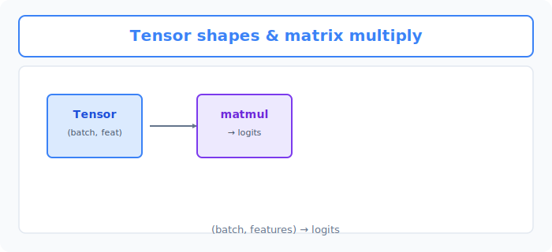
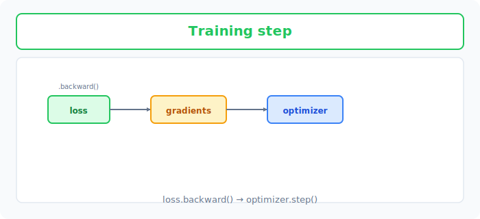

# Unit 11: PyTorch の基礎とシンプルな多層パーセプトロン

<p class="unit-hero">
  
</p>

> [!TIP]
> **Google Colab で学習を進める方へ**
> PyTorchによる計算を高速化するために、ランタイムで **GPU (T4 GPU)** を有効にすることをお勧めします。詳しい設定手順は [Appendix (学習環境とキーの準備)](../appendix/index.md) の「Google Colaboratory での学習の進め方」のセクションをご覧ください。


## 1. PyTorch Basics & Simple MLP の理解

前回のUnit 10では、ニューラルネットワークの仕組みを理解するためにすべてを「手作り（NumPy）」で実装しました。しかし、毎回あの複雑な数式（誤差逆伝播など）を書くのは大変ですよね。

ここで登場するのが **PyTorch (パイトーチ)** という強力なディープラーニングのフレームワークです。

**PyTorchは「魔法のレゴブロック」**

前回の「ゼロからの実装」が、木を切ってカンナをかけ、釘を打って家具を作る「DIY」だとしたら、PyTorchは **「説明書付きの魔法のレゴブロック」** です。

| NumPy（手作り） | PyTorch（レゴブロック） | 説明 |
|---|---|---|
| 配列 (`np.ndarray`) | テンソル (`torch.Tensor`) | データを入れる箱。PyTorchの箱はGPU（超高速計算機）でも使えます。 |
| 手計算の微分 | `autograd` (自動微分) | 勝手に間違えた原因（微分）を計算してくれる魔法の機能。 |
| 自分で関数を作る | `torch.nn` モジュール | 「隠れ層」や「活性化関数」がすでにブロックとして用意されています。 |

PyTorchを使うと、面倒な計算をAIに任せて、私たちは「どんな形のネットワークを作るか（ブロックの組み立て）」に集中することができます。このUnitでは、PyTorchを使ってシンプルな「多層パーセプトロン（MLP: 最も基本的なニューラルネットワーク）」を作ってみましょう！


下図は、 **Tensor** の形状と `matmul` による順伝播のイメージです。



続いて下図は、`loss.backward()` で勾配を求め、 **optimizer** で重みを更新する学習1ステップの流れです。



### 💡 具体的なビジネスユースケース

- **需要予測システム** : 過去の売上、天候、曜日、キャンペーンの有無などの多角的なデータを組み合わせて、翌日の商品の販売数を予測する。
- **カスタマーサポートの自動振り分け** : 顧客からのお問い合わせ内容（テキストを数値化したもの）を解析し、担当すべき適切な部署（技術、請求、返品など）を自動で判別する。
- **不動産の価格推定** : 広さ、築年数、駅からの距離などの条件を入力して、適正な家賃や物件の販売価格を高精度に予測する。

## 2. 実装例 (Implementation Example)

ここでは、PyTorchの基本的な書き方を学びながら、簡単なダミーデータを使ってネットワークを学習させてみます。

まずは、PyTorchと必要なツールを読み込み、データを用意します。

```python
import torch
import torch.nn as nn
import torch.optim as optim

# 1. データの準備（ダミーデータ）
# 入力データ (例: 勉強時間, 睡眠時間)
X = torch.tensor([[2.0, 7.0], [3.0, 6.0], [5.0, 8.0], [1.0, 5.0]], dtype=torch.float32)

# 正解ラベル (例: テストの点数が合格=1、不合格=0)
y = torch.tensor([[0.0], [0.0], [1.0], [0.0]], dtype=torch.float32)
```

`torch.tensor` は、PyTorch専用のデータ形式（テンソル）です。見た目はNumPyとほとんど同じですが、PyTorchの魔法（自動微分）を使うための特別な箱です。

次に、ネットワークの形（レゴブロックの組み立て）を定義します。

```python
# 2. ネットワークの定義
class SimpleMLP(nn.Module):
    def __init__(self):
        super(SimpleMLP, self).__init__()
        # ブロックの準備
        self.hidden = nn.Linear(in_features=2, out_features=4) # 隠れ層（2入力 → 4出力）
        self.output = nn.Linear(in_features=4, out_features=1) # 出力層（4入力 → 1出力）
        self.sigmoid = nn.Sigmoid()                            # 活性化関数（0〜1に収める）

    def forward(self, x):
        # 組み立て方（データがどう流れるか）
        x = self.hidden(x)
        x = self.sigmoid(x)
        x = self.output(x)
        x = self.sigmoid(x)
        return x

# モデルの実体を作る
model = SimpleMLP()
```

ここでは、`nn.Module`という「モデルの設計図」の書き方に従って、自分だけのネットワークを作っています。
- `__init__`: どんなパーツを使うかを準備する場所。
- `forward`: 準備したパーツをどう繋げるかを決める場所（データの通り道）。

準備ができたら、どうやって間違いを評価し、修正していくかのルールを決めます。

```python
# 3. 損失関数と最適化手法の定義
criterion = nn.BCELoss() # 損失関数: 答え合わせの採点基準（今回は2値分類用）
optimizer = optim.SGD(model.parameters(), lr=0.1) # 最適化手法: 採点をもとにパラメータをどう直すか（SGD）
```

最後に、学習のメインループを回します。

```python
# 4. 学習ループ
epochs = 1000

for epoch in range(epochs):
    # ① 予測（順伝播）
    predictions = model(X)
    
    # ② 誤差の計算
    loss = criterion(predictions, y)
    
    # ③ 前の反省をリセット（PyTorchのルール）
    optimizer.zero_grad()
    
    # ④ 誤差逆伝播（魔法の自動計算！）
    loss.backward()
    
    # ⑤ 重みの更新（反省を活かして修正）
    optimizer.step()

    if (epoch+1) % 200 == 0:
        print(f"Epoch {epoch+1}/{epochs}, Loss: {loss.item():.4f}")

# 学習後の予測を確認
print("\n学習後の予測結果:")
print(model(X).detach().numpy())
```

**解説:**
PyTorchの学習ループは、基本的にこの **「5つのステップ」** がお決まりのパターンです。
1. `model(X)` で予測する。
2. `criterion` で正解とのズレ（Loss）を計算する。
3. `optimizer.zero_grad()` で前回の計算のゴミを消す。
4. `loss.backward()` で「誰をどれくらい直せばいいか（微分）」を自動計算する！ここがPyTorch最大の魔法です。
5. `optimizer.step()` で実際に重みを直す。

このお決まりの型を覚えてしまえば、どんな複雑なAIでも基本の流れは同じです。

## 3. 実践 (Practice)

PyTorchの書き方に慣れるため、少し形を変えたネットワークを自分で書いてみましょう！

**要件定義:**
- 上記の実装例のコードをベースにして、新しいモデル `PracticeMLP` を作成してください。
- ネットワークの構造を以下のように変更してください：
  - 入力層：2
  - **隠れ層1** ：8 （活性化関数：ReLU `nn.ReLU()` を使用）
  - **隠れ層2** ：4 （活性化関数：ReLU `nn.ReLU()` を使用）
  - 出力層：1 （活性化関数：Sigmoid `nn.Sigmoid()` を使用）
- 損失関数は `nn.MSELoss()`（平均二乗誤差）を使ってみてください。（回帰や単純な予測などでよく使われます）
- 学習ループはそのままコピーして、エポック数 500 で学習させてみましょう。

**ヒント:**
- `__init__` の中に、`self.hidden1 = nn.Linear(2, 8)`、`self.hidden2 = nn.Linear(8, 4)` のようにパーツを追加します。
- `forward` の中で、それらのパーツを順番にデータ `x` に通していくように書きます。ReLU関数を通すのを忘れないように！

## 4. 答え合わせ (Answer Key)

<details>
<summary>解答例を見る（クリックで展開）</summary>

```python
import torch
import torch.nn as nn
import torch.optim as optim

# 1. データの準備
X = torch.tensor([[2.0, 7.0], [3.0, 6.0], [5.0, 8.0], [1.0, 5.0]], dtype=torch.float32)
y = torch.tensor([[0.0], [0.0], [1.0], [0.0]], dtype=torch.float32)

# 2. ネットワークの定義 (隠れ層を2つに変更、ReLUを使用)
class PracticeMLP(nn.Module):
    def __init__(self):
        super(PracticeMLP, self).__init__()
        self.hidden1 = nn.Linear(in_features=2, out_features=8)
        self.relu1 = nn.ReLU()
        self.hidden2 = nn.Linear(in_features=8, out_features=4)
        self.relu2 = nn.ReLU()
        self.output = nn.Linear(in_features=4, out_features=1)
        self.sigmoid = nn.Sigmoid()

    def forward(self, x):
        x = self.hidden1(x)
        x = self.relu1(x)
        x = self.hidden2(x)
        x = self.relu2(x)
        x = self.output(x)
        x = self.sigmoid(x)
        return x

model = PracticeMLP()

# 3. 損失関数と最適化手法の定義 (MSELossに変更)
criterion = nn.MSELoss()
optimizer = optim.SGD(model.parameters(), lr=0.1)

# 4. 学習ループ
epochs = 500

for epoch in range(epochs):
    predictions = model(X)
    loss = criterion(predictions, y)
    
    optimizer.zero_grad()
    loss.backward()
    optimizer.step()

    if (epoch+1) % 100 == 0:
        print(f"Epoch {epoch+1}/{epochs}, Loss: {loss.item():.4f}")

print("\n学習後の予測結果:")
print(model(X).detach().numpy())
```

### 解説

今回の変更点には、それぞれ意味があります。まず隠れ層の活性化関数を Sigmoid から **ReLU に変えたのは「非線形性」を効率よく導入するため** です。もし活性化関数を挟まずに `nn.Linear` を重ねるだけだと、何層積んでも結局は1つの線形変換と同じになってしまい、層を深くする意味がなくなってしまいます。ReLU は「0以下なら0、正ならそのまま通す」という単純なフィルターですが、これを挟むだけでネットワークは複雑な曲線的パターンを表現できるようになり、Sigmoid よりも勾配が消えにくいため深いネットワークの学習で標準的に使われています。一方、出力層に Sigmoid を残しているのは、最終的な予測を「0〜1の確率らしい値」に収めるためです。また、損失関数を `nn.BCELoss` から `nn.MSELoss` に変えても学習自体は動きますが、MSE は本来「数値のズレ」を測る回帰向けの採点基準なので、確率のズレに対するペナルティのかかり方が緩く、分類問題では BCELoss の方が誤りに対して強く修正がかかり収束しやすい、という違いがあります。今回はデータが4件と単純なのでどちらでも正解に近づけますが、実務の分類タスクでは BCELoss（または CrossEntropyLoss）を選ぶのが基本です。

</details>
