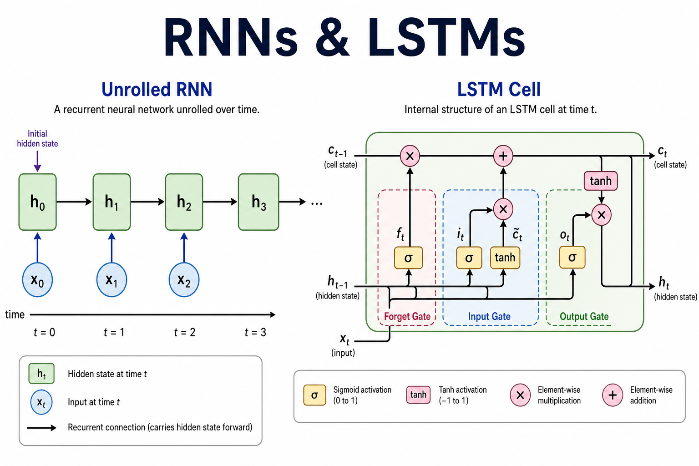
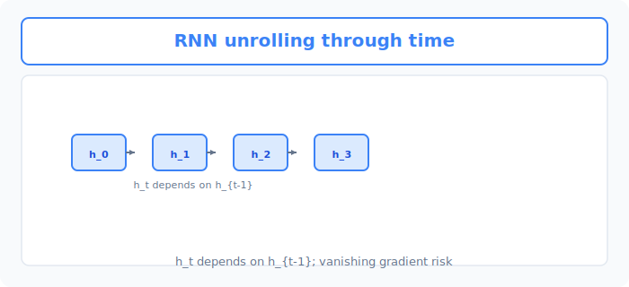
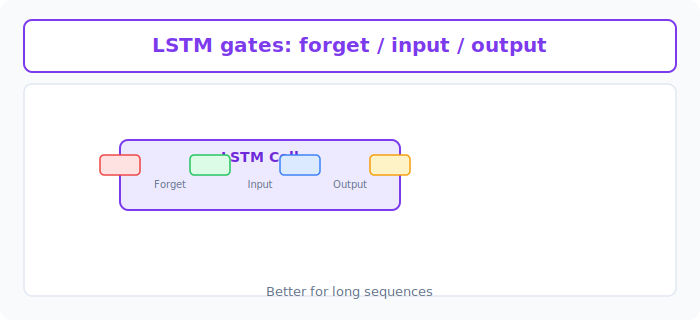

# Unit 19: リカレントニューラルネットワークと LSTM

<p class="unit-hero">
  
</p>

## 1. RNN と LSTM の理解

Word Embeddings（単語の分散表現）によって、AIは単語の意味を理解できるようになりました。しかし、まだ足りないものがあります。それは **「文脈（時間の流れ）」** です。
例えば、「私は」「昨日」「リンゴを」「_____」と来た時、次に続く言葉は「食べた」や「買った」になる可能性が高いですよね。これは、前の単語の流れ（記憶）があるからです。

過去の情報を記憶しながら順番にデータを処理する仕組みが、 **RNN (Recurrent Neural Network: 再帰型ニューラルネットワーク)** と **LSTM (Long Short-Term Memory)** です。

### 📌 日常的な例え：本を読む時の「記憶」
あなたが推理小説を読んでいるところを想像してください。

**普通のAI（これまでのモデル）の読み方：**
毎ページ、記憶をリセットして読みます。
「犯人はAだ」というページを読んでも、次のページに行くと「あれ、誰の話だっけ？」と忘れてしまいます。

**RNN（再帰型ネットワーク）の読み方：**
前のページで起きたことを **「メモ」** しながら読み進めます。
「前のページのメモ」＋「今のページ」を組み合わせて理解します。
しかし、RNNには弱点があります。 **「昔の記憶をすぐに忘れてしまう（勾配消失問題）」** という点です。10ページ前の伏線は忘れてしまいます。

**LSTM（Long Short-Term Memory）の読み方：**
RNNの進化版です。「この情報は重要だから長期記憶ノートに残そう」「この情報は重要じゃないから消そう」という **「記憶の取捨選択」** ができる賢い読者です。これによって、100ページ前の重要な伏線も覚えていられるようになりました。

| モデル | 記憶力 | 得意なこと | 弱点 |
| :--- | :--- | :--- | :--- |
| **RNN** | 直前までの内容を1つの隠れ状態に圧縮して持ち運ぶ（古い情報ほど薄れていく） | 短い文章の予測 | 長い文章だと最初の方を忘れる |
| **LSTM** | 長期記憶＋短期記憶 | 長い文章の文脈理解 | 仕組みが複雑で計算が重い |


下図は、時刻ごとに **隠れ状態 h_t** が前の状態に依存して伝わる RNN の展開です。



### 📌 LSTMの3つのゲート機構

LSTMが「記憶の取捨選択」を実現できる秘密は、内部に **3つのゲート（門）** を持っていることにあります。
推理小説を読む賢い読者に例えると、このゲートたちは次のような役割を果たしています。

| ゲート名 | 役割 | 推理小説での例え |
| :--- | :--- | :--- |
| **忘却ゲート（Forget Gate）** | どの記憶を **消すか** を決める | 「容疑者Bのアリバイは証明済み。メモから消そう」 |
| **入力ゲート（Input Gate）** | どの新情報を **記憶するか** を決める | 「新証人Cの証言は重要だ。長期記憶ノートに書き込もう」 |
| **出力ゲート（Output Gate）** | どの記憶を **出力に使うか** を決める | 「今のページでは凶器の話をしているから、凶器に関する記憶を引き出そう」 |

この3つのゲートが毎ステップごとに協調して動くことで、LSTMは「不要な情報は忘れ、重要な情報は長く保持し、今必要な情報だけを取り出す」という高度な記憶管理を実現しています。
これが、100ページ前の伏線でも正確に覚えていられる理由です。


下図は、LSTM の **Forget / Input / Output** ゲートが情報の保持と更新を制御する様子です。



### 💡 具体的なビジネスユースケース
- **工場の機械の故障予測（異常検知）** : センサーから時系列で送られてくる温度や振動のデータをLSTMで分析し、「過去のパターンから推測すると、数時間後に故障する可能性が高い」とアラートを出すシステム。
- **株価や売上の時系列予測** : 過去の数ヶ月〜数年間の売上データ、天気、カレンダー情報などを系列データとして学習し、来月の売上見込みを予測して在庫管理を最適化するシステム。
- **音声認識デバイス（スマートスピーカー）** : ユーザーが話す音声を時系列データとして受け取り、文脈を考慮しながら「前の音と今の音の繋がり」から正確なテキストに変換する機能。

## 2. 実装例 (Implementation Example)

ここでは、PyTorchを使って「1文字入力されたら、次の1文字を予測する」というシンプルなRNN/LSTMモデルを作ってみましょう。"hello" という単語を学習させます。

### まずはシンプルな RNN

本命のLSTMの前に、PyTorchの `nn.RNN` がどのようにデータを受け取り、何を返すのかを最小のコードで確認しておきましょう。

```python
import torch
import torch.nn as nn

# 入力1次元、隠れ状態8次元のRNN層を作成
rnn = nn.RNN(input_size=1, hidden_size=8)

# ダミーの系列データ（形: 系列長4, バッチサイズ1, 入力サイズ1）
x = torch.randn(4, 1, 1)

# outには「各時刻の隠れ状態」、hには「最後の時刻の隠れ状態」が入る
out, h = rnn(x)
print(out.shape)  # torch.Size([4, 1, 8])
print(h.shape)    # torch.Size([1, 1, 8])
```

RNNは、系列データを1ステップずつ読みながら「前の時刻の隠れ状態（メモ）」を次の時刻へ引き継いでいきます。これから使う `nn.LSTM` も使い方（入出力の形）はほぼ同じで、内部に3つのゲートによる記憶管理の仕組みが追加されたものです。

### コードの解説
1. **データの準備** : 文字を数字に変換します（h=0, e=1, l=2, o=3）。AIは文字を直接読めないためです。
2. **モデルの定義** : PyTorchの `nn.LSTM` を使って、過去の文字を記憶しながら次の文字を予測するネットワークを作ります。
3. **学習（トレーニング）** : "h"→"e", "e"→"l", "l"→"l", "l"→"o" というパターンの学習を繰り返します。
4. **予測テスト** : "h" を入力して、続きの文字が正しく出力されるか確認します。

> 💡 **注記** : 以下のコードでは、文字のインデックス（数字）を float のスカラー値としてそのままモデルに入力しています。実務では通常、文字や単語は Embedding 層（Unit 18 参照）でベクトル化してから入力します。ここでは仕組みの理解を優先してシンプルにしています。

```python
import torch
import torch.nn as nn

# 1. データの準備
# "hello" という文字列を学習させます
# 文字と数字（インデックス）の対応表を作ります
chars = ['h', 'e', 'l', 'o']
char_to_idx = {ch: i for i, ch in enumerate(chars)}
idx_to_char = {i: ch for i, ch in enumerate(chars)}

# "hello" の入力と正解ラベルの準備
# 入力: h, e, l, l
# 正解: e, l, l, o
x_data = [char_to_idx[c] for c in "hell"]
y_data = [char_to_idx[c] for c in "ello"]

# PyTorchのテンソル（多次元配列）に変換し、形を整えます
# 形: (系列長, バッチサイズ, 入力サイズ) = (4, 1, 1)
x_tensor = torch.tensor(x_data, dtype=torch.float32).view(4, 1, 1)
y_tensor = torch.tensor(y_data, dtype=torch.long)

# 2. モデルの定義 (LSTMを使った予測モデル)
class SimpleLSTM(nn.Module):
    def __init__(self, input_size, hidden_size, output_size):
        super(SimpleLSTM, self).__init__()
        self.hidden_size = hidden_size
        # LSTM層：過去の記憶を保持する
        self.lstm = nn.LSTM(input_size, hidden_size)
        # 出力層：記憶をもとに次の文字（4種類のどれか）を予測する
        self.fc = nn.Linear(hidden_size, output_size)

    def forward(self, x):
        # LSTMにデータを順番に流し込む（outには各ステップの出力が入る）
        out, _ = self.lstm(x)
        # 最後の層で、どの文字になるかのスコアを計算
        out = self.fc(out.view(-1, self.hidden_size))
        return out

input_size = 1
hidden_size = 8
output_size = len(chars) # 4種類 (h, e, l, o)
model = SimpleLSTM(input_size, hidden_size, output_size)

# 学習の設定
criterion = nn.CrossEntropyLoss()
optimizer = torch.optim.Adam(model.parameters(), lr=0.05)

# 3. 学習（トレーニング）
print("学習を開始します...")
for epoch in range(100):
    optimizer.zero_grad()
    # モデルに予測させる
    outputs = model(x_tensor)
    # 正解との誤差（Loss）を計算
    loss = criterion(outputs, y_tensor)
    # 誤差を元にモデルを賢くする（逆伝播）
    loss.backward()
    optimizer.step()
    
    if (epoch+1) % 20 == 0:
        print(f"Epoch: {epoch+1}/100, Loss: {loss.item():.4f}")
print("学習が完了しました！\n")

# 4. 予測テスト
print("--- 予測テスト ---")
# 学習したモデルに "hell" を入力して、次に来る文字を予測させます
with torch.no_grad():
    test_out = model(x_tensor)
    # 最もスコアが高い（確率が高い）文字のインデックスを取得
    _, predicted_indices = torch.max(test_out, 1)
    
    # 数字を文字に戻す
    predicted_chars = [idx_to_char[idx.item()] for idx in predicted_indices]
    print(f"入力: hell -> 予測結果: {''.join(predicted_chars)}")
```

### コード実行後の理解ポイント
- 初期状態ではデタラメな文字を予測しますが、100回の学習（Epoch）を通じて、Loss（誤差）が減少し、"hell"という入力に対して "ello" という正しい続きを予測できるようになります。
- LSTMの内部には「前の文字の情報（記憶）」を次のステップに渡す仕組みが組み込まれているため、順番のあるデータを扱うのに適しています。

## 3. 実践 (Practice)

今度は "apple" という単語を予測するLSTMモデルを学習させてみましょう。

**【課題の要件】**
1. 文字リストを `chars = ['a', 'p', 'l', 'e']` とします。
2. 入力データを `"appl"`、正解データを `"pple"` として、学習データを作成してください。
3. `SimpleLSTM` モデルを作成し、100エポック学習させてください（設定は実装例と同じで構いません）。
4. 学習後、予測テストを行って、入力 `"appl"` に対して `"pple"` が出力されることを確認してください。

**【ヒント】**
- `x_data` は "appl" のインデックスのリスト、`y_data` は "pple" のインデックスのリストになります。
- 辞書の作り方やテンソルへの変換は、実装例のコードをそのまま真似して書き換えるだけでOKです。

## 4. 答え合わせ (Answer Key)

<details>
<summary>解答例を見る（クリックで展開）</summary>

```python
import torch
import torch.nn as nn

# 1. データの準備
chars = ['a', 'p', 'l', 'e']
char_to_idx = {ch: i for i, ch in enumerate(chars)}
idx_to_char = {i: ch for i, ch in enumerate(chars)}

# "apple" の学習データ（入力: appl, 正解: pple）
x_data = [char_to_idx[c] for c in "appl"]
y_data = [char_to_idx[c] for c in "pple"]

x_tensor = torch.tensor(x_data, dtype=torch.float32).view(4, 1, 1)
y_tensor = torch.tensor(y_data, dtype=torch.long)

# 2. モデルの定義
class SimpleLSTM(nn.Module):
    def __init__(self, input_size, hidden_size, output_size):
        super(SimpleLSTM, self).__init__()
        self.hidden_size = hidden_size
        self.lstm = nn.LSTM(input_size, hidden_size)
        self.fc = nn.Linear(hidden_size, output_size)

    def forward(self, x):
        out, _ = self.lstm(x)
        out = self.fc(out.view(-1, self.hidden_size))
        return out

input_size = 1
hidden_size = 8
output_size = len(chars)
model = SimpleLSTM(input_size, hidden_size, output_size)

criterion = nn.CrossEntropyLoss()
optimizer = torch.optim.Adam(model.parameters(), lr=0.05)

# 3. 学習
print("学習を開始します...")
for epoch in range(100):
    optimizer.zero_grad()
    outputs = model(x_tensor)
    loss = criterion(outputs, y_tensor)
    loss.backward()
    optimizer.step()

# 4. 予測テスト
with torch.no_grad():
    test_out = model(x_tensor)
    _, predicted_indices = torch.max(test_out, 1)
    predicted_chars = [idx_to_char[idx.item()] for idx in predicted_indices]
    print(f"入力: appl -> 予測結果: {''.join(predicted_chars)}")
```

**解答の解説：**
「p」の次は「p」が来るパターンと、「p」の次は「l」が来るパターンが存在します。LSTMは「今までどの文字が来たか」という文脈（記憶）を持っているため、1つ目のpなのか2つ目のpなのかを判断し、正しく次の文字を予測することができます。

</details>
