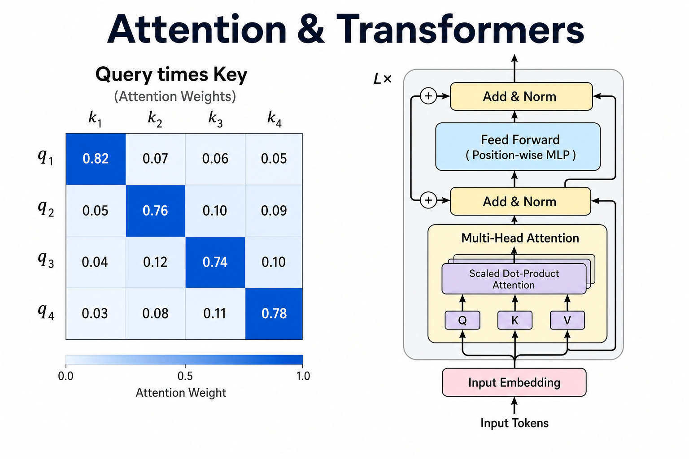
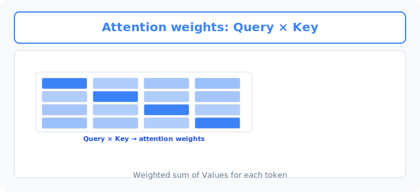
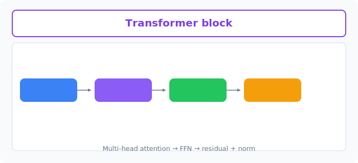

# Unit 20: 注意機構と Transformer

<p class="unit-hero">
  
</p>

## 1. Attention Mechanism と Transformer の理解

RNNやLSTMは「記憶をバケツリレーのように渡していく」仕組みでした。しかし、長い文章になると最後のほうで最初の内容を忘れてしまう問題がありました。
これを完全に解決し、現代のAI（ChatGPTなど）の心臓部となったのが **Attention（注意機構）** と、それを使った **Transformer** というアーキテクチャです。

### 📌 日常的な例え：会議での「発言の注目度」
あなたが10人が参加する会議の議事録を作っているとします。

**RNN（これまでのAI）の聞き方：**
全員の発言を一字一句、順番に聞いて覚えようとします。会議が長引くと「最初の方、誰が何言ったっけ…」とパンクしてしまいます。

**Attention（注意機構）の聞き方：**
発言の「キーワード」に注目（Attention）します。
「『売上』という言葉が出たら、さっき社長が言った『目標』という言葉と強く関連しているな！」と、 **離れた場所にある単語同士の関係性を直接計算** します。

さらに、Transformerで使われる **Self-Attention（自己注意機構）** では、文の中のすべての単語が、他のすべての単語と「どれくらい関連しているか」を同時に見渡します。

| 単語 | The | animal | didn't | cross | the | street | because | it | was | too | tired |
| :--- | :--- | :--- | :--- | :--- | :--- | :--- | :--- | :--- | :--- | :--- | :--- |

上の文で「it（それ）」は何を指しているでしょうか？人間なら「tired（疲れている）」のは「animal（動物）」だとすぐに分かります（streetが疲れることはないからです）。
Self-Attentionは、「it」という単語を処理するときに、「animal」と「tired」という単語に **強い注意（Attention）** を向けることで、この関係性を理解します。


下図は、 **Query × Key** で得た重みを使い、各トークンが他トークンを参照する Attention です。



### 📌 Transformerとは？
RNNのように順番に処理するのをやめ、「すべての単語を一気に読み込んで、Attentionで関係性を計算する」という画期的な手法です。これにより、計算を並列化（超高速化）でき、ChatGPTのような巨大なモデルの学習が可能になりました。


下図は、Transformer ブロックの **Multi-head Attention → FFN → Add+Norm** の流れです。



### 📌 Positional Encoding（位置エンコーディング）— 順番情報の保持
ここで一つ疑問が生まれます。RNNは単語を **一つずつ順番に** 処理していたからこそ、「この単語は文の最初にある」「この単語は最後にある」という **語順の情報** を自然に持っていました。
しかし、Transformerはすべての単語を **一気に並列で** 読み込みます。これは高速化の大きな利点ですが、裏を返せば「どの単語が何番目にあるか」という **順番の情報が失われてしまう** のです。

先ほどの会議の例えで言えば、10人の発言内容（キーワード）はすべて把握できるのに、「誰が **先に** 発言して、誰が **後から** それに反論したのか」という **時系列** が分からなくなるようなものです。「猫が犬を追いかけた」と「犬が猫を追いかけた」では意味がまったく違いますが、語順の情報がなければ区別できません。

この問題を解決するのが **Positional Encoding（位置エンコーディング）** です。仕組みはシンプルで、各単語の入力ベクトルに **「自分は何番目の位置にいるか」を表す特別なベクトル** を加算します。こうすることで、Transformerは並列処理の速度を保ちながらも、単語の順番の情報をしっかりと保持できるのです。
実装上も、入力の埋め込みベクトルにこの位置情報を加算してから Attention 層へ渡します（後述の実装例では、仕組みの理解を優先してこの加算を省略しています）。

### 💡 具体的なビジネスユースケース
- **高精度な機械翻訳サービス** : 長い文章でも、文頭と文末の関係性をAttentionで正確に捉えることで、自然で文脈に沿った翻訳（例：Google翻訳、DeepLなど）を提供するシステム。
- **複雑な社内Q&A対応チャットボット** : 大規模言語モデル（LLM）の基盤技術として、複雑な質問の意図を正確に理解し、社内規定などの長文ドキュメントから適切な箇所に「注意」を向けて回答を生成するAIアシスタント。
- **契約書の自動レビューシステム** : 長文で複雑な法務ドキュメントの中から、「支払い条件」や「機密保持」といった特定の条項がどのように書かれているか、文脈を捉えてリスクのある表現を抽出・警告するシステム。

## 2. 実装例 (Implementation Example)

ここでは、PyTorchを使って「Self-Attention」の核となる計算（どの単語がどの単語に注目しているかのスコア計算）を、シンプルなコードで体験してみましょう。

### コードの解説
Self-Attentionは、各単語から3つのベクトルを作ります。
1. **Query (Q)** : 自分が何を探しているか（例：「私はitです。私の正体を探しています」）
2. **Key (K)** : 自分が何者か（例：「私はanimalです」「私はstreetです」）
3. **Value (V)** : 自分が持っている実際の中身・意味

計算の手順：
- `Q` と `K` を掛け算（内積）して、「どのくらい関連しているか（Attention Score）」を出します。
- スコアを確率（合計が1になる割合）に変換します（Softmax）。
- その割合を `V` に掛け算して、最終的な結果を作ります。

> 💡 **注記** : 以下のコードは、学習可能な重み行列 W_q / W_k / W_v を省略した簡略版です。実際の Transformer では、入力ベクトルをこれらの重み行列で変換して Q・K・V を作ってから Attention を計算します。

```python
import torch
import torch.nn.functional as F

# 1. データの準備（簡単のため、3つの単語がそれぞれ4次元のベクトルを持っているとします）
# 例: [animal, street, it] という3単語を想定
x = torch.tensor([
    [1.0, 0.0, 1.0, 0.0],  # 単語1 (animal) の特徴
    [0.0, 1.0, 0.0, 1.0],  # 単語2 (street) の特徴
    [1.0, 0.0, 0.5, 0.0],  # 単語3 (it) の特徴。animalに似た特徴を持つ
])

# 2. Q, K, V の準備
# 実際のモデルではここに行列の掛け算（重み）が入りますが、今回は簡単のため x をそのまま使います
Q = x
K = x
V = x

# 3. Attention Scoreの計算 (Q と Kの転置を掛け算)
# これにより、各単語同士の類似度が計算されます
scores = torch.matmul(Q, K.transpose(0, 1))
print("--- Attention Scores (関連度スコア) ---")
print(scores)

# 4. Softmax関数で確率（0〜1の割合）に変換
# 注目度の合計が100% (1.0) になるように調整します
attention_weights = F.softmax(scores, dim=-1)
print("\n--- Attention Weights (注目度の割合) ---")
print(attention_weights)

# 5. 最終的な出力の計算 (注目度を使って V を混ぜ合わせる)
output = torch.matmul(attention_weights, V)
print("\n--- Self-Attentionの最終出力 ---")
print(output)
```

### コード実行後の理解ポイント
- `scores` を見ると、単語3（it）と単語1（animal）の交差する部分のスコアが高くなっていることがわかります（特徴が似ているため）。
- `attention_weights` によって、「it」が意味を理解するときに「animal」の情報（Value）を多く取り込んでいる（注目している）ことが数値として確認できます。これがAttentionの正体です。

## 3. 実践 (Practice)

今度は、実際の PyTorch に用意されている `nn.MultiheadAttention` という完成済みのレイヤーを使って、Attentionの計算を行ってみましょう。

**【課題の要件】**
1. 以下の `query`, `key`, `value` データ（すべてランダムな値）を使用してください。
2. `nn.MultiheadAttention` を使って、Attention層（`embed_dim=8`, `num_heads=2`）を作成してください。
3. `query`, `key`, `value` をAttention層に入力し、出力結果 (`attn_output`) を表示してください。

**【データセット】**
```python
import torch
import torch.nn as nn

# 系列長=5 (5つの単語), バッチサイズ=1, 埋め込み次元数(embed_dim)=8
# 全てランダムな数値で生成します
sequence_length = 5
batch_size = 1
embed_dim = 8

query = torch.rand(sequence_length, batch_size, embed_dim)
key = torch.rand(sequence_length, batch_size, embed_dim)
value = torch.rand(sequence_length, batch_size, embed_dim)
```

**【ヒント】**
- Attention層の作り方: `attention_layer = nn.MultiheadAttention(embed_dim=8, num_heads=2)`
- 使い方: `attn_output, attn_weights = attention_layer(query, key, value)`
- PyTorchの実装済みレイヤーを使えば、Q・K・Vの面倒な計算をすべて1行でやってくれます！

## 4. 答え合わせ (Answer Key)

<details>
<summary>解答例を見る（クリックで展開）</summary>

```python
import torch
import torch.nn as nn

# 1. データの準備
sequence_length = 5
batch_size = 1
embed_dim = 8

# Query, Key, Valueのテンソルを作成
query = torch.rand(sequence_length, batch_size, embed_dim)
key = torch.rand(sequence_length, batch_size, embed_dim)
value = torch.rand(sequence_length, batch_size, embed_dim)

# 2. MultiheadAttention層の定義
# embed_dim: 単語のベクトルの次元数
# num_heads: Attentionをいくつに分割して計算するか（マルチヘッド）
attention_layer = nn.MultiheadAttention(embed_dim=embed_dim, num_heads=2)

# 3. Attentionの計算を実行
print("Attention計算を実行します...")
attn_output, attn_weights = attention_layer(query, key, value)

# 4. 結果の確認
print("\n--- Attentionの出力 (attn_output) ---")
print(attn_output.shape) # 形が元のqueryと同じ (5, 1, 8) になることを確認
print(attn_output)

print("\n--- Attentionの重み (attn_weights) ---")
print(attn_weights.shape) # どの単語がどの単語に注目したかの割合 (1, 5, 5)
```

**解答の解説：**
実際のAI開発では、数式をゼロから書くことは少なく、このようにPyTorchの `nn.MultiheadAttention` や、Transformerの層（`nn.TransformerEncoderLayer`）をブロックのように組み合わせてモデルを作ります。
このAttentionの仕組みを何層にも重ねて、大量のデータで学習させたものが、皆さんがよく知る大規模言語モデル（LLM）なのです。

</details>
