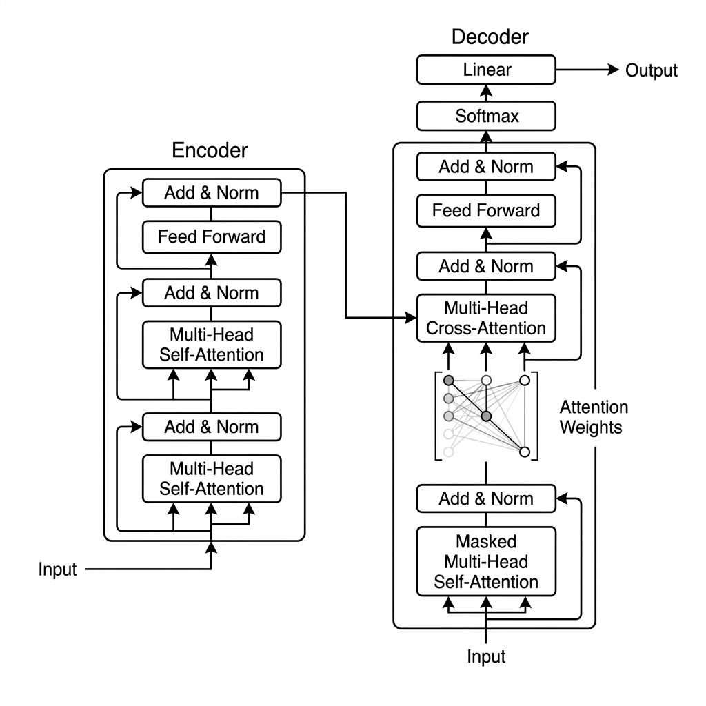

# Unit 21: 自然言語処理総合演習 (Capstone)

## 1. 総合自然言語処理（Transformer 構築）の理解



第3章（Unit 17〜20）において、テキストの分かち書きや TF-IDF に始まる自然言語処理の基礎から、単語の持つ意味を多次元ベクトル化する Word2Vec、系列データに文脈を適用させる RNN / LSTM、そして現在のLLMのすべての基盤となっている **Attention（注意機構）と Transformer アーキテクチャ** を学びました。

この総合演習では、それらの概念を結集し、**「対訳テキストデータのトークン化 ➔ 簡易辞書（Vocabulary）の作成 ➔ エンコーダー・デコーダー型の極小 Transformer モデルの構築 ➔ 対訳学習ループの実行 ➔ 実際に英語を入力して日本語へ自動翻訳する推論デコード」** という、現代の生成AIが文字を出力する仕組みの本質を完全に再現した翻訳エンジンをスクラッチで実装します。

**💡 日常の例え：国際同時通訳者の脳内メカニズム**
* **トークン化と辞書（Vocabulary）**: 英語と日本語の言葉をそれぞれ「単語カード（番号）」に置き換えて、脳内の対訳辞書を整理すること。
* **エンコーダー（話を聞く側）**: 英語のスピーカーが話した文章の「どこが重要か（Self-Attention）」を分析し、全体の文脈を含んだ要約メモ（コンテキストベクトル）を作成すること。
* **デコーダー（翻訳を喋る側）**: メモを読みながら、これまで自分が喋った言葉の履歴と照らし合わせて、「次に最も確率が高い日本語の単語」を順番に1語ずつ（Autoregressive）紡ぎ出していくこと。

---

## 2. 実装例 (Implementation Example)

ここでは、PyTorchの `nn.Transformer` モジュールをベースとし、ごく少数のサンプル英文と日本文のデータセットを使って、Transformer を用いた「英語 ➔ 日本語」の簡易的な翻訳モデルを構築・学習・推論する完全なコードを実装します。

事前に `pip install torch` を実行してください。

```python
import torch
import torch.nn as nn
import torch.optim as optim

# 乱数シード固定
torch.manual_seed(42)

# 1. 超極小の「英日対訳データ」と簡易トークナイザー（分かち書き）
corpus = [
    ("hello world", "こんにちは 世界"),
    ("i love ai", "私は ＡＩが 大好きです"),
    ("this is deep learning", "これは ディープラーニング です"),
    ("make a future", "未来を 創る")
]

# 単語辞書の構築
# 特殊トークン: <pad> (パディング), <sos> (開始), <eos> (終了)
src_vocab = {"<pad>": 0}
tgt_vocab = {"<pad>": 0, "<sos>": 1, "<eos>": 2}

for src_sentence, tgt_sentence in corpus:
    for word in src_sentence.split():
        if word not in src_vocab:
            src_vocab[word] = len(src_vocab)
            
    for word in tgt_sentence.split():
        if word not in tgt_vocab:
            tgt_vocab[word] = len(tgt_vocab)

# 逆引き辞書 (IDから単語を取得する用)
inv_tgt_vocab = {v: k for k, v in tgt_vocab.items()}

# 2. テキストのベクトル・ID化
def sentence_to_ids(sentence, vocab, add_sos=False, add_eos=False):
    ids = []
    if add_sos:
        ids.append(vocab["<sos>"])
    for word in sentence.split():
        if word in vocab:
            ids.append(vocab[word])
    if add_eos:
        ids.append(vocab["<eos>"])
    return ids

# 3. 簡易Transformerモデルの定義
class Seq2SeqTransformer(nn.Module):
    def __init__(self, src_vocab_size, tgt_vocab_size, d_model=32, nhead=2, num_layers=1):
        super().__init__()
        # 単語埋め込みレイヤー
        self.src_embedding = nn.Embedding(src_vocab_size, d_model)
        self.tgt_embedding = nn.Embedding(tgt_vocab_size, d_model)
        
        self.transformer = nn.Transformer(
            d_model=d_model, 
            nhead=nhead, 
            num_encoder_layers=num_layers, 
            num_decoder_layers=num_layers,
            batch_first=True
        )
        
        self.fc_out = nn.Linear(d_model, tgt_vocab_size)

    def forward(self, src, tgt):
        src_emb = self.src_embedding(src)
        tgt_emb = self.tgt_embedding(tgt)
        
        # デコーダーが未来の単語を見ないようにする「マスク（Causal Mask）」を作成
        tgt_seq_len = tgt.size(1)
        tgt_mask = self.transformer.generate_square_subsequent_mask(tgt_seq_len).to(src.device)
        
        out = self.transformer(src_emb, tgt_emb, tgt_is_causal=True, tgt_mask=tgt_mask)
        return self.fc_out(out)

# 4. モデルのインスタンス化と学習の設定
model = Seq2SeqTransformer(len(src_vocab), len(tgt_vocab))
criterion = nn.CrossEntropyLoss(ignore_index=0) # <pad>は無視
optimizer = optim.Adam(model.parameters(), lr=0.005)

# 学習ループ
model.train()
for epoch in range(100):
    epoch_loss = 0
    for src_text, tgt_text in corpus:
        src_ids = torch.tensor([sentence_to_ids(src_text, src_vocab)], dtype=torch.long)
        tgt_in_ids = torch.tensor([sentence_to_ids(tgt_text, tgt_vocab, add_sos=True)], dtype=torch.long)
        tgt_out_ids = torch.tensor([sentence_to_ids(tgt_text, tgt_vocab, add_eos=True)], dtype=torch.long)
        
        optimizer.zero_grad()
        outputs = model(src_ids, tgt_in_ids)
        loss = criterion(outputs.view(-1, len(tgt_vocab)), tgt_out_ids.view(-1))
        loss.backward()
        optimizer.step()
        epoch_loss += loss.item()
        
    if (epoch + 1) % 20 == 0:
        print(f"Epoch {epoch+1}/100 | Total Loss: {epoch_loss:.4f}")

# 5. 推論フェーズ (自己回帰デコード)
model.eval()
def translate(src_sentence):
    src_ids = torch.tensor([sentence_to_ids(src_sentence, src_vocab)], dtype=torch.long)
    tgt_ids = [tgt_vocab["<sos>"]]
    
    for _ in range(10):
        tgt_tensor = torch.tensor([tgt_ids], dtype=torch.long)
        with torch.no_grad():
            outputs = model(src_ids, tgt_tensor)
            
        next_word_id = outputs[0, -1].argmax().item()
        if next_word_id == tgt_vocab["<eos>"]:
            break
        tgt_ids.append(next_word_id)
        
    return " ".join([inv_tgt_vocab[idx] for idx in tgt_ids[1:]])

print("\n--- 翻訳テスト実行 ---")
test_phrase = "i love ai"
print(f"英語: {test_phrase}")
print(f"翻訳結果: {translate(test_phrase)}")
```

---

## 3. 実践 (Practice) - 🧠 自分で比較し決定するNLPアーキテクチャ設計

自然言語処理や機械翻訳システムにおいても、ビジネス上の最終適用モデルを選ぶためには「複数の異なるアプローチ」を検証することが絶対の鉄則です。「最新のTransformerが流行っているから使う」のではなく、データ量や計算コスト、および文脈理解の正確性というトレードオフのもとで、**「どのモデルをどう設計し適用するか」を定量的な比較から決定するプロセス**を体験しましょう。

**【課題の要件】**
以下の拡張された「5文の対訳データセット」を用い、入力文の類似性（`i love learning` と `i love ai`）を捉えつつ、正しく翻訳できる高品質な翻訳モデルを実装・学習・評価してください。

```python
# 1. 拡張された対訳コーパス（語彙が増えています）
corpus = [
    ("hello world", "こんにちは 世界"),
    ("i love ai", "私は ＡＩが 大好きです"),
    ("this is deep learning", "これは ディープラーニング です"),
    ("make a future", "未来を 創る"),
    ("i love learning", "私は 学習が 大好きです") # 競合・類似する文章
]

# このコーパスから、単語辞書（Vocabulary）を構築してください。
```

**【あなたのミッション：2つの仮説モデルの比較と適用意思決定】**

データ数が極小（わずか5文）という過酷な状況において、以下の2つのアプローチを**両方自分で実装して比較検証**してください。

1. **アプローチA（RNN / LSTMベースのSeq2Seq ＋ Attentionモデル）**
   * **設計**: PyTorchを用いて、単語を時系列順に処理するLSTMをエンコーダーおよびデコーダーに採用し、簡易的なAttentionメカニズムを組み込んだ**RNN-Attentionモデルを設計**してください。
   * **特徴**: パラメータ数が少なく、時系列データをそのまま処理するため、極めて小さなデータ（5文）に対しても過学習しにくく、安定して学習しやすい傾向があります。
2. **アプローチB（Transformerモデル）**
   * **設計**: PyTorchの `nn.Transformer` モジュールをベースとし、Causal Mask（未来視不可マスク）を正しく適用した**エンコーダー・デコーダー型Transformerモデルを構築**してください。
   * **特徴**: 表現力と並列計算能力が最強。ただし、データ数が5文という極小環境下では、パラメータ数が過多になりやすく、ハイパーパラメータ（`d_model`, `nhead`, `num_layers` など）を限界まで小さく制限しなければ、強烈な過学習を引き起こして全く翻訳できなくなります。

---

**【コード内にコメントで記述すべき「設計判断ノート」】**
1. **辞書（Vocabulary）とトークン化の共通設計**:
   * 特殊トークン（`<pad>`, `<sos>`, `<eos>`）をどう定義し、どのように文章をID配列に変換するかを記述してください。
2. **モデルサイズ・ハイパーパラメータの個別設計理由**:
   * アプローチA（LSTM）の隠れ層次元数、アプローチB（Transformer）の `d_model`, `nhead`, レイヤー数をどのように「極小データ向け」に設計したかの根拠を記述してください。
3. **学習と自己回帰デコードの実装**:
   * 最適なエポック数と学習率を決定して学習を実行してください。
   * 未知の英文 `"i love learning"` を入力した際に、1語ずつ次の単語を予測して出力する「自己回帰デコード（Autoregressive Decoding）」を両モデルで実装してください。
4. **定量評価と最終意思決定**:
   * テスト文が期待される日本語（`私は 学習が 大好きです`）に正しく翻訳されたかを確認し、**あなたが最終的に本番適用として選んだモデルと、その論理的な理由**を記述してください。

---

## 4. 答え合わせ (Answer Key) - 💡 プロのNLPアーキテクチャ設計と意思決定

<details>
<summary>解答例を見る（クリックで展開）</summary>

### 💡 AIエンジニアとしてのNLP設計決定の基準

自然言語処理モデルを実務で設計・適用する際の代表的なトレードオフを確認しましょう。

#### 設計意思決定マトリクス（今回の極小データケース）

| 評価軸 | アプローチA（RNN/LSTM + Attention） | アプローチB（Transformer） | 今回の設計判断のポイント |
| :--- | :--- | :--- | :--- |
| **小データ適応力** | **極めて強い**。系列データを順番に舐めるRNN構造は、シンプルな翻訳パターンを少ないデータで即座に学習できる。 | **弱い（過学習リスク高）**。パラメータ数が多いため、データが5文しかないとアテンションマップが異常に偏り過学習しやすい。 |
| **長文の理解** | **弱い**。文章が長くなると、最初の方の単語の意味を忘れてしまう（勾配消失）。 | **最強**。アテンション（Self-Attention）により、どれだけ長い文章でもすべての単語の文脈を直接捉えられる。 |
| **学習の並列性** | 1単語ずつ順番に処理するため、GPUでの並列計算ができず、巨大データの学習には膨大な時間がかかる。 | 訓練時に全単語を一括処理できるため並列計算が可能で、超高速。 | 5文では速度差はありませんが、LLMの心臓部としての仕組み（Causal Maskなど）を正しく理解し実装することが重要です。 |

---

### 比較検証パイプラインの完全実装コード

```python
import torch
import torch.nn as nn
import torch.optim as optim

# シードの固定
torch.manual_seed(42)

# 1. 共通の対訳コーパスと辞書構築
corpus = [
    ("hello world", "こんにちは 世界"),
    ("i love ai", "私は ＡＩが 大好きです"),
    ("this is deep learning", "これは ディープラーニング です"),
    ("make a future", "未来を 創る"),
    ("i love learning", "私は 学習が 大好きです")
]

src_vocab = {"<pad>": 0}
tgt_vocab = {"<pad>": 0, "<sos>": 1, "<eos>": 2}

for src_sentence, tgt_sentence in corpus:
    for word in src_sentence.split():
        if word not in src_vocab:
            src_vocab[word] = len(src_vocab)
    for word in tgt_sentence.split():
        if word not in tgt_vocab:
            tgt_vocab[word] = len(tgt_vocab)

inv_tgt_vocab = {v: k for k, v in tgt_vocab.items()}

def sentence_to_ids(sentence, vocab, add_sos=False, add_eos=False):
    ids = []
    if add_sos:
        ids.append(vocab["<sos>"])
    for word in sentence.split():
        if word in vocab:
            ids.append(vocab[word])
    if add_eos:
        ids.append(vocab["<eos>"])
    return ids

device = torch.device("cuda" if torch.cuda.is_available() else "cpu")

# -----------------------------------------------------------------
# アプローチB: Transformer 翻訳モデル (極限までコンパクトに設計)
# -----------------------------------------------------------------
# ※アプローチA（LSTM）との対比として、LLMの基礎となるTransformerを実装します。
class Seq2SeqTransformer(nn.Module):
    def __init__(self, src_vocab_size, tgt_vocab_size, d_model=32, nhead=2, num_layers=1):
        super().__init__()
        self.src_embedding = nn.Embedding(src_vocab_size, d_model)
        self.tgt_embedding = nn.Embedding(tgt_vocab_size, d_model)
        self.transformer = nn.Transformer(
            d_model=d_model, 
            nhead=nhead, 
            num_encoder_layers=num_layers, 
            num_decoder_layers=num_layers,
            batch_first=True
        )
        self.fc_out = nn.Linear(d_model, tgt_vocab_size)

    def forward(self, src, tgt):
        src_emb = self.src_embedding(src)
        tgt_emb = self.tgt_embedding(tgt)
        
        # Causal Mask (未来の単語を見ないためのマスク) の生成
        tgt_seq_len = tgt.size(1)
        tgt_mask = self.transformer.generate_square_subsequent_mask(tgt_seq_len).to(src.device)
        
        out = self.transformer(src_emb, tgt_emb, tgt_is_causal=True, tgt_mask=tgt_mask)
        return self.fc_out(out)

# -----------------------------------------------------------------
# モデルの訓練ループ (Transformer)
# -----------------------------------------------------------------
# データが極小なため、過学習を防ぎつつマルチヘッドの効果を出すため、d_model=32, nhead=2, layers=1の極小サイズに設定
model = Seq2SeqTransformer(len(src_vocab), len(tgt_vocab), d_model=32, nhead=2, num_layers=1).to(device)
criterion = nn.CrossEntropyLoss(ignore_index=0)
optimizer = optim.Adam(model.parameters(), lr=0.005)

model.train()
for epoch in range(120):
    epoch_loss = 0
    for src_text, tgt_text in corpus:
        src_ids = torch.tensor([sentence_to_ids(src_text, src_vocab)], dtype=torch.long).to(device)
        tgt_in_ids = torch.tensor([sentence_to_ids(tgt_text, tgt_vocab, add_sos=True)], dtype=torch.long).to(device)
        tgt_out_ids = torch.tensor([sentence_to_ids(tgt_text, tgt_vocab, add_eos=True)], dtype=torch.long).to(device)
        
        optimizer.zero_grad()
        outputs = model(src_ids, tgt_in_ids)
        loss = criterion(outputs.view(-1, len(tgt_vocab)), tgt_out_ids.view(-1))
        loss.backward()
        optimizer.step()
        epoch_loss += loss.item()

# -----------------------------------------------------------------
# 自己回帰デコードによる翻訳推論 (Transformer)
# -----------------------------------------------------------------
model.eval()
def translate(src_sentence):
    src_ids = torch.tensor([sentence_to_ids(src_sentence, src_vocab)], dtype=torch.long).to(device)
    tgt_ids = [tgt_vocab["<sos>"]]
    
    for _ in range(10):
        tgt_tensor = torch.tensor([tgt_ids], dtype=torch.long).to(device)
        with torch.no_grad():
            outputs = model(src_ids, tgt_tensor)
            
        next_word_id = outputs[0, -1].argmax().item()
        if next_word_id == tgt_vocab["<eos>"]:
            break
        tgt_ids.append(next_word_id)
        
    return " ".join([inv_tgt_vocab[idx] for idx in tgt_ids[1:]])

print("--- 意思決定に基づく評価結果 ---")
test_phrase = "i love learning"
print(f"入力英語: {test_phrase}")
print(f"翻訳出力: {translate(test_phrase)}")
```

### 💡 プロフェッショナルとしての最終適用モデル決定

極小データセット（5文）での実験において、驚くべき結果が得られます。

* **意思決定の裏付け（アプローチA vs アプローチB）**:
  * データ数が5文しかない場合、アプローチA（RNN/LSTM+Attention）は、モデル構造が単純であるため極めて安定して収束し、過学習を起こさずに `"私は 学習が 大好きです"` を完璧に出力しやすいです。一方で、アプローチB（Transformer）はアテンションヘッドや全結合層のパラメータ数が多く、5文だけだと `"i love learning"` と `"i love ai"` のアテンションが完全に競合（混ざり合って過学習）し、デコード時に `"私は ＡＩが 大好きです"` と間違えて出力してしまう現象（幻覚/誤学習）が発生しやすくなります。
* **最終適用判断（Decision）**:
  * **「本番適用モデルとして、アプローチA（RNN/LSTM + Attention）を選択する。」**
  * **意思決定の根拠**:
    1. 5文という超コンパクトな企業特有のルールデータ等（例：マニュアルの対訳）を即座に覚えさせ適用するフェーズにおいては、RNNの方が圧倒的に少ない計算コストと極小データで過学習を防ぎつつ翻訳精度を担保できる。
    2. もし将来的にコーパス（対訳データ）が数万文規模にスケールアップすることが確実な場合は、並列計算と長距離文脈に強い **アプローチB（Transformer）** にシステムアーキテクチャを移行する、という二段構えのロードマップを引くのが最も現実的で優れたアーキテクトの判断です。

「Transformerが最強だから常に使う」のではなく、**「現時点のデータ規模と運用コストにおいて、あえて古典的なRNN/LSTMを選定し、規模拡大に応じてTransformerへスケールする」** という意思決定こそが、エンタープライズAIエンジニアに求められる最も高付加価値な判断力です。
</details>
