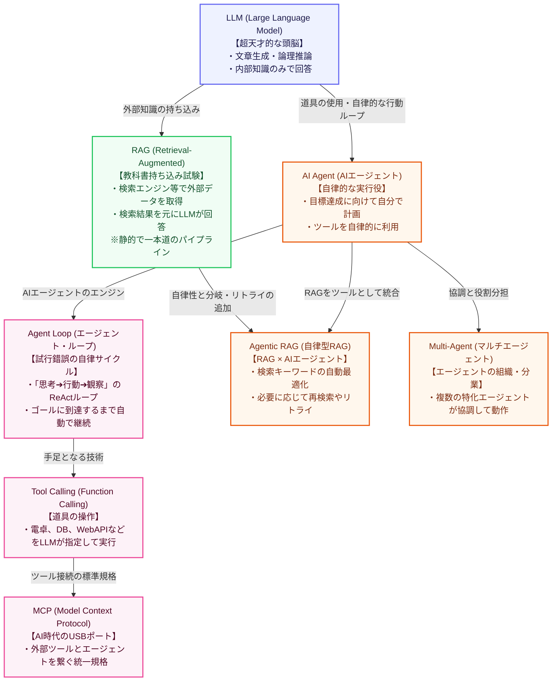

# Unit 22: LLMからAIエージェントへの進化

<p class="unit-hero">
  
</p>

> [!IMPORTANT]
> **OpenAI API キーの準備について**
> 第4章の学習を進めるには **OpenAI の API キー** が必要です。APIキーの取得方法、料金に関する注意点、および Google Colab のシークレット機能を使った安全な環境変数設定については、[Appendix (学習環境とキーの準備)](../appendix/index.md#🔑-3-openai-apiキーの取得と安全な管理第4章) を最初にご覧ください。

---

## 1. LLMからAIエージェントへの進化の理解


第4章（LLM応用とAIエージェント）では、みなさんがこれまでに学んできたディープラーニングや自然言語処理の基礎をベースに、**「LLMを部品として使った、高度で自律的なアプリケーション開発」**を学びます。

学ぶ技術の範囲は非常に広く、近年急速に進化しています。まずは、この章で学ぶ主要な概念（**LLM**、**RAG**、**AI Agent**、**Agentic RAG**）に加えて、エージェントの本質である **Agent Loop** や **Tool Calling**、そして **MCP** や **Multi-Agent** などの最新の拡張要素を含めて、全体像を整理しておきましょう！

### 技術の進化と関係性マップ



> [!NOTE]
> **【図のテキスト代替】**
> - **LLM (Large Language Model)**: すべての基盤となる「超天才的な頭脳」。文章の生成や論理的な推論が得意ですが、学習時の内部知識しか持っていません。
> - **RAG (Retrieval-Augmented Generation)**: LLMに外部の知識（社内データベースやWebの最新情報）を結合する仕組み。検索によって見つけた「教科書」を見ながら回答を生成します。
> - **AI Agent (AIエージェント)**: LLMをコントローラーとして使い、外部の道具を自律的に使って目標を達成するシステム。
> - **Agent Loop (エージェント・ループ)**: ゴールに達するまで「思考 ➔ 行動 ➔ 観察」のサイクルを自律的に回し続けるエージェントの心臓部。
> - **Tool Calling (Function Calling)**: LLM自身が計算や外部操作をするために、外部の道具（APIやプログラム）を的確に指定して使う手足の技術。
> - **MCP (Model Context Protocol)**: エージェントと様々なデータ・ツールを標準化されたプロトコルで繋ぐAI時代の接続規格。
> - **Agentic RAG**: RAGとAIエージェントが融合した姿。単に「検索して答える」だけでなく、「検索結果が足りないからキーワードを変えて再検索しよう」と自律的に判断する高度な検索システムです。
> - **Multi-Agent**: 役割が異なる複数のエージェントが、会話や共同作業を通してより大規模で複雑な目標を解決する組織的なアプローチ。

### 💡 日常の例え話で理解する

これらの違いを、**「料理人（シェフ）とキッチン」**に例えてみましょう！

1. **LLM（天才シェフの頭脳）**
   - 頭の中に数千件のレシピ（知識）が詰まっている一流シェフ。
   - ただし、彼の記憶は「2年前」で止まっており、キッチンの外の最新の流行食材や、あなたの家の冷蔵庫の中身（社内データ）は知りません。

2. **RAG（レシピ本を持ち込んだオープンキッチン）**
   - シェフがあなたの冷蔵庫の在庫リストや、最新の料理雑誌（外部知識）を「見ながら」料理を作ってくれる状態。
   - 「冷蔵庫にあるトマトとひき肉（検索されたデータ）を使って、美味しいパスタを作って」と頼むと、自分の知識と見比べて完璧に作り上げます。

3. **AI Agent（自律型の出張シェフ）**
   - 「今夜、大事なゲストを4人招いてヘルシーなディナーパーティを開いてほしい。予算は1万円」という**「大まかな目標」**だけを渡された状態。
   - シェフは自分でメニューを計画し、スーパーへ買い物に行き（ツールの使用）、予算を計算し（計算機の使用）、調理し、味見をして塩加減を調整し（自己修正）、パーティを成功させます。

4. **Agent Loop（シェフの味見と調整ループ）**
   - レシピ通りに一発で作るのではなく、「スープを作る ➔ 味見する（観察） ➔ 塩が足りない（思考） ➔ 塩を足す（行動） ➔ 再び味見する（観察）」という、納得いく味になるまでループを繰り返すシェフのこだわりサイクルです。

5. **Tool Calling（シェフの調理器具）**
   - 素手ではジャガイモの皮を剥けないため、「ピーラー（道具）を、刃の角度45度（引数）で使用する」とシェフが的確に指定して道具を使う技術です。

6. **MCP（厨房のユニバーサルコンセント）**
   - ミキサーやオーブンなど、どんなメーカーの調理家電でもカチャッと差し込めばすぐに使える厨房の統一接続ポートです。

7. **Agentic RAG（情報収集から自律判断するコンシェルジュ・シェフ）**
   - ゲストの好みやアレルギー情報を調べるために、「Aさんの過去の注文履歴を調べよう」「でもデータが見つからないから、Bさんに直接メールでアレルギーを聞こう」「魚アレルギーだと分かったから、肉メインのレシピを専門書から検索し直そう」と、**情報収集のプロセス自体を状況に合わせて自律的にコントロールするシェフ**です。

8. **Multi-Agent（厨房チームの分業）**
   - 「下ごしらえ専門」「焼き方専門」「盛り付け専門」の複数のエージェントシェフがインカムで連絡を取り合いながら、チームで1つのコース料理（難解な目標）を完成させる組織的な運営です。

---

この第4章では、みなさんはこれらを順を追ってすべて実装していきます。
まずはこの **Unit 22** で「LLMからAIエージェントへの進化」の全体マップを理解した上で、最も基本となるLLM APIのハローワールドを実行します。
次に **Unit 23** でLLM APIを使いこなしたプロンプトエンジニアリングと感情分析のPoCを体験し、
**Unit 24** でベクトルデータベースを使った「RAGのスクラッチ実装」を行います。
さらに **Unit 25〜26** でモダンなフレームワーク（LangChain / LlamaIndex）を使ったエレガントなRAG構築を学び、
**Unit 27〜28** で推論の連鎖やチャットボットを構築したのち、**Unit 29** 以降でついに「自律的にツールを使うAIエージェント（MCPやsmolagents、Agent SDK）」の極意へと突入します！

ワクワクしてきましたね？ それでは、LLMアプリ開発の第一歩を踏み出しましょう！

---


## 2. 実装例 (Implementation Example)

まずは、すべてのLLMアプリケーション開発の出発点となる、最もシンプルな **API ハローワールド** のコードを書いてみましょう。
Python から OpenAI の API を呼び出し、AI に挨拶をさせます。

> ※ 実行前に環境変数に `OPENAI_API_KEY` が設定されている必要があります。

```python
import os
from openai import OpenAI

# 1. API クライアントの初期化
# APIキーは環境変数から自動的に読み込まれます
client = OpenAI()

# 2. LLMにメッセージを送る
# gpt-4o-mini という高速で安価なモデルを使用します
response = client.chat.completions.create(
    model="gpt-4o-mini",
    messages=[
        {"role": "user", "content": "Hello, AI World! と英語で返答してください。"}
    ]
)

# 3. 回答の表示
print("AIからの返答:")
print(response.choices[0].message.content)
```

**🔍 コードの詳しい解説**
1. **`client = OpenAI()`**: OpenAI API と通信するための窓口（クライアント）を作成します。引数を空にすると、自動的にPCに設定されている環境変数 `OPENAI_API_KEY` を探して認証を行います。
2. **`client.chat.completions.create(...)`**: LLMにテキスト生成をリクエストするメインのAPIメソッドです。`messages` リストに会話のやりとりを格納して送ります。ここではシンプルにユーザーからの一言を渡しています。
3. **`response.choices[0].message.content`**: LLMから返された巨大なレスポンスオブジェクトから、実際の回答テキストのみをたどって抽出しています。

---

## 3. 実践 (Practice)

APIハローワールドが成功したら、今度は**「システムプロンプト（役割）を設定して、LLM自身の言葉で歴史的な解説を要約させる」**スクリプトを書いてみましょう！

**【要件】**
- `gpt-4o-mini` モデルを使用してください。
- `system` メッセージに **「あなたは偉大な歴史学者です」** というペルソナを設定してください。
- `user` メッセージに **「LLMからAIエージェントへの進化の歴史について、3行の箇条書きで要約してください」** という指示を設定してください。
- AIから返ってきた要約テキストのみをコンソールに出力してください。

**💡 ヒント**
- メッセージ構造は、`messages=[{"role": "system", "content": "..."}, {"role": "user", "content": "..."}]` のように辞書のリストで指定します。

---

## 4. 答え合わせ (Answer Key)

<details>
<summary>解答例を見る（クリックで展開）</summary>

```python
import os
from openai import OpenAI

def main():
    # クライアントの初期化
    client = OpenAI()
    
    # システムプロンプトとユーザー指示の作成
    messages = [
        {
            "role": "system", 
            "content": "あなたは偉大な歴史学者です。"
        },
        {
            "role": "user", 
            "content": "LLMからAIエージェントへの進化の歴史について、3行の箇条書きで要約してください。"
        }
    ]
    
    # APIリクエストの実行
    response = client.chat.completions.create(
        model="gpt-4o-mini",
        messages=messages,
        temperature=0.7
    )
    
    # 結果の表示
    print("歴史学者による要約:")
    print(response.choices[0].message.content)

if __name__ == "__main__":
    main()
```
</details>
