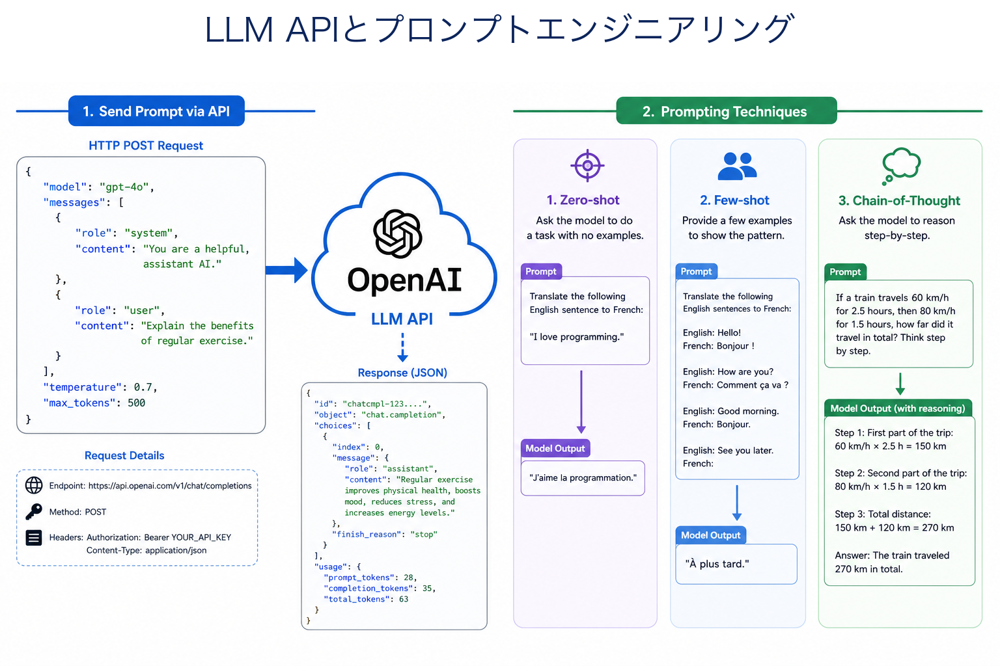
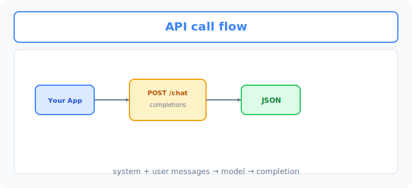
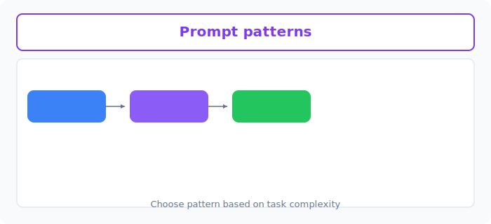

# Unit 23: LLM API の利用とプロンプトエンジニアリング

<p class="unit-hero">
  
</p>

> [!IMPORTANT]
> **OpenAI API キーの準備について**
> 第4章の学習を進めるには **OpenAI の API キー** が必要です。APIキーの取得方法、料金に関する注意点、および Google Colab のシークレット機能を使った安全な環境変数設定については、[Appendix (学習環境とキーの準備)](../appendix/index.md) の「OpenAI APIキーの取得と安全な管理」のセクションを最初にご覧ください。

---

## 1. LLM API の利用とプロンプティングの理解

### LLM APIとは？
みなさんは普段、ChatGPTを使う時にブラウザを開いて文字を打ち込んでいると思います。しかし、自作のアプリやシステムにAIを組み込む場合、毎回人間が手で打ち込むわけにはいきません。

そこで登場するのが **API (Application Programming Interface)** です。
APIは **「プログラム同士の窓口」** のようなものです。

**💡 日常の例え：レストランの注文システム**
- **ブラウザ版のChatGPT** ：あなたが直接ウェイター（AI）に話しかけて料理（回答）を注文する。
- **API版のChatGPT** ：あなたがスマホの注文アプリ（あなたのPythonプログラム）を通して、厨房（AIのサーバー）に直接デジタルで注文を送る。

| 比較項目 | ブラウザ版（Web UI） | API版 |
| :--- | :--- | :--- |
| **利用者** | 人間 | プログラム（Pythonなど） |
| **目的** | 個人的な質問や作業 | 自動化、自作アプリへの組み込み |
| **カスタマイズ** | 制限あり | 温度感（ランダム性）など細かく設定可能 |
| **料金** | 月額固定など | 使った分だけの従量課金が多い |


下図は、アプリから **POST /chat/completions** へ送り、JSON で応答を受け取る API フローです。



### プロンプティング（Prompting）とは？
APIを通してAIに送る「指示書」のことです。
AIは賢いですが、「空気を読む」ことは苦手です。そのため、「どのような役割で」「どのようなフォーマットで」「何を重視して」答えてほしいかを具体的に書く必要があります。

### 💡 具体的なビジネスユースケース
- **カスタマーサポートの自動化** ：自社のFAQデータベースとAPIを連携させ、顧客からの問い合わせに24時間365日自動で一次回答を行うシステム。
- **営業資料の自動生成** ：顧客情報や商談メモをAPIに渡し、パーソナライズされた提案書のドラフトやメール文面を瞬時に作成するツール。
- **社内文書の要約と翻訳** ：海外拠点のレポートや長大な会議議事録をシステム上で自動的に要約・多言語翻訳し、社内の情報共有スピードを向上させる。

---

## 2. プロンプトエンジニアリングの3大基礎手法 (Core Prompting Techniques)

実務でLLMの出力をコントロールし、狙い通りの回答を安定して得るためには、プロンプトの設計技術である **プロンプトエンジニアリング (Prompt Engineering)** を身につける必要があります。ここでは、あらゆるAI開発の基礎となる3大手法を学びます。

### ① Zero-shot Prompting (ゼロショット・プロンプティング)
* **概念** : LLMに「具体的な解答の例（Shot）」を一切与えずに、タスクの指示（Systemメッセージ等）と入力データのみを渡して回答させる最もシンプルな手法です。
* **例え** : 学校のテストで、練習問題を解かずに「この文章を要約してください」といきなり本番の問題を渡す状態。
* **プロンプト例** :
  ```
  ユーザー入力: "次のスマートフォンのレビューを、ポジティブかネガティブで分類してください：画面が大きくて見やすいが、少し重たい。"
  ```
* **メリット** : プロンプトが最も短く、APIのトークン消費（コスト）を最小に抑えられます。
* **デメリット** : 複雑なフォーマットの指定や、独自の分類基準に従わせることが難しく、回答がブレやすくなります。

### ② Few-shot Prompting (フューショット・プロンプティング)
* **概念** : LLMに「入力と望ましい出力のペア（例）」をいくつかプロンプト内に含めて提示し、AIに回答のパターンを学習（コンテキスト内学習）させてから本番のタスクを解かせる手法です。
* **例え** : テストの前に、「問い：A ➔ 答え：B」という例題と解答のセットをいくつか見せて、「では、この問題を解いて」と本番の問題を渡す状態。
* **プロンプト例** :
  ```
  指示: "入力された文章の感情を、[ポジティブ] または [ネガティブ] のいずれか1つのタグで答えてください。"
  入力例1: "配送がとても早くて助かりました！" -> 出力例1: "[ポジティブ]"
  入力例2: "ボタンの反応が悪く、たまにフリーズします。" -> 出力例2: "[ネガティブ]"
  
  本番入力: "デザインは可愛いけれど、充電の持ちがイマイチです。"
  期待される出力: "[ネガティブ]"
  ```
* **なぜ例示（Few-shot）が必要なのか？** : 
  LLMに「出力は必ず `[ポジティブ]` というブラケット付きの形式にしてね」と言葉（テキスト）だけで指示しても、稀に「感情はポジティブです。」のように普通の文章で答えてしまうバグが起きます。しかし、 **「お手本（例）」を提示することで、AIはその『形式』や『トーン』を強力に模倣し、出力フォーマットをほぼ確実に遵守するようになります。**

### ③ Chain-of-Thought (CoT) Prompting (思考の連鎖プロンプティング)
* **概念** : LLMに直接答えを出させるのではなく、 **「結論に至るまでの思考プロセス（推論ステップ）」を順を追って出力するように促す** 手法です。プロンプト内に「ステップバイステップで段階的に考えてください」と記述するだけで発動させることができます（Zero-shot CoT）。
* **例え** : 数学のテストで、「答えだけを書きなさい」と言わずに、「計算の途中式もすべて書きなさい」と指示する状態。途中式を書くことで計算ミスが劇的に減るのと同じ効果をAIに与えます。
* **プロンプト例** :
  ```
  指示: "次の数学の問題を、段階的に順を追って考えながら解いてください。"
  問題: "リンゴが5個あります。2個食べました。その後、3個入りのパックを3つ買いました。今リンゴは何個ですか？"
  ```
  * *CoTなしのAIの誤答*: 「今リンゴは6個です。」（計算を頭の中で一気に行おうとして 5 - 2 + 3 = 6 と短絡し、「3個入りパックを3つ（×3）」を見落として失敗する）
  * *CoTありのAIの正答*:
    > 1. 最初にリンゴが 5 個ありました。
    > 2. 2 個食べたので、残りは 5 - 2 = 3 個になります。
    > 3. 次に、3個入りのパックを 3 つ買ったので、新しく増えたリンゴは 3 × 3 = 9 個です。
    > 4. よって、最終的な合計は 3 + 9 = 12 個になります。答：12個。
* **なぜ精度が上がるのか？** :
  LLMは「次に出力する単語」を確率的に予測するシステムです。一瞬で答えを出させようとすると、最初の1語を間違えた時点で、その後のすべての推論が崩壊します。しかし、思考プロセスを出力させることで、 **「自らが直前に出力した正しい推論テキスト」を文脈（コンテキスト）として利用しながら次のステップを予測できるため、複雑な計算や論理的思考の精度が爆発的に向上します。**


下図は、 **Zero-shot / Few-shot / Chain-of-thought** のプロンプトパターンの比較です。



---

### 📊 プロンプト手法の選定・使い分けマトリクス

実務のシステム構築では、タスクの難易度に応じて適切なプロンプト手法を選択します。

| 手法 | 適したタスク | 開発コスト | トークン消費（料金） | 判定の安定性 |
| :--- | :--- | :--- | :--- | :--- |
| **Zero-shot** | 単純なテキスト翻訳、大雑把な要約、一般的な質問への回答 | 極めて低い | 非常に安い | 低〜中 |
| **Few-shot** | 厳格なJSONフォーマット出力、特定業界の独自ルールに基づく感情分類、出力文字数の制御 | 低（例を用意するだけ） | 中程度 | 非常に高い |
| **Chain-of-Thought** | 算数・数学の計算問題、複雑な法律やビジネスロジックの判定、複数条件の交絡する推論 | 低〜中 | 高い（思考プロセスの文字数分） | 極めて高い |

---

## 3. 実装例 (Implementation Example)

ここでは、世界中で最も使われているOpenAIのAPIを使って、PythonからAIに質問をする基本のコードを書いてみましょう。

> ※ 事前に `pip install openai` を実行し、OpenAIのAPIキーを取得しておく必要があります。

```python
import os
from openai import OpenAI

# 1. APIクライアントの準備
# APIキーは環境変数から読み込むのが安全です
client = OpenAI(api_key=os.environ.get("OPENAI_API_KEY"))

# 2. プロンプト（指示書）の作成
# system: AIの「役割」や「前提条件」を指定します
# user: あなたからの「具体的な質問やお願い」を指定します
messages = [
    {"role": "system", "content": "あなたは初心者向けに優しく教えるプログラミング講師です。"},
    {"role": "user", "content": "APIとは何ですか？小学生にもわかるように説明してください。"}
]

# 3. AI（LLM）に注文（リクエスト）を送る
response = client.chat.completions.create(
    model="gpt-4o-mini", # 使用するAIのモデル名
    messages=messages,   # 先ほど作成したプロンプト
    temperature=0.7      # 回答の「創造性」（0に近いほど正確、1に近いほど自由な発想）
)

# 4. 返ってきた回答を取り出して表示する
# responseの中には様々なデータが含まれているので、文章の部分だけを抽出します
print("AIの回答:")
print(response.choices[0].message.content)
```

**🔍 コードの詳しい解説**
1. **APIクライアントの準備** ：`OpenAI`クラスを使って、あなたのAPIキーをセットします。これは「私はお金を払って注文する権利を持っていますよ」という身分証明書のようなものです。
2. **プロンプトの作成** ：`messages`というリストの中に辞書型で会話の履歴を入れます。`system`で「あなたは優しい先生です」とキャラ設定をし、`user`で具体的な質問を投げかけています。
3. **AIに注文を送る** ：`client.chat.completions.create`で実際に通信を行います。`model`で賢さや速さのバランスを選び、`temperature`で回答の「ランダムさ（創造性）」を調整します。
4. **回答の取り出し** ：AIからは「消費した計算量」などのメタデータを含んだ巨大な箱（オブジェクト）が返ってきます。そこから `response.choices[0].message.content` をたどることで、AIが書いたテキストだけを取り出しています。

---

## 4. 実践 (Practice)

APIの使い方がわかったところで、今度は **「感情分析 (Sentiment Analysis)」** を行う関数を作ってみましょう。

**【要件】**
- 関数名: `analyze_sentiment(text)`
- 引数 `text` には、商品に対するレビューなどの文字列が渡されます。
- 返り値として、AIにそのレビューが「ポジティブ」か「ネガティブ」か「ニュートラル」のどれであるかを判定させ、その **結果の単語のみ** （例: "ポジティブ"）を文字列として返してください。

**💡 ヒント**
- `system` メッセージで「あなたは感情分析システムです。入力された文章に対し、『ポジティブ』『ネガティブ』『ニュートラル』のいずれか1つの単語のみを出力してください。余計な説明は一切しないでください。」と強く指示（プロンプト）を出しましょう。

---

## 5. 答え合わせ (Answer Key)

<details>
<summary>解答例を見る（クリックで展開）</summary>

```python
import os
from openai import OpenAI

def analyze_sentiment(text):
    # クライアントの初期化
    client = OpenAI(api_key=os.environ.get("OPENAI_API_KEY"))
    
    # 役割と指示を細かく設定したプロンプト
    messages = [
        {
            "role": "system", 
            "content": "あなたは優秀な感情分析アシスタントです。ユーザーの入力に対して、「ポジティブ」「ネガティブ」「ニュートラル」のいずれか1つの単語のみで答えてください。説明や句読点も含めないでください。"
        },
        {
            "role": "user", 
            "content": text
        }
    ]
    
    # APIへリクエスト
    response = client.chat.completions.create(
        model="gpt-4o-mini",
        messages=messages,
        temperature=0.0 # 感情分析のように正確性が求められるタスクは0にするのがコツです
    )
    
    # 結果のテキストだけを返す
    return response.choices[0].message.content

# テスト実行
if __name__ == "__main__":
    test_review_1 = "この商品は最高です！人生が変わりました。"
    print(f"「{test_review_1}」 -> {analyze_sentiment(test_review_1)}")
    
    test_review_2 = "すぐに壊れてしまいました。最悪です。"
    print(f"「{test_review_2}」 -> {analyze_sentiment(test_review_2)}")
```

### 解説

この解答のポイントは、大きく2つあります。1つ目は `temperature=0.0` を選んでいることです。感情分析のような **分類タスクでは、同じ入力に対して毎回同じ結果が返ってくる「再現性・一貫性」が最も重要** なので、回答のランダム性を最小にする0.0が適しています（実装例の0.7は、文章生成のような「表現の幅」が欲しいタスク向けの設定でした）。2つ目は `system` メッセージで「いずれか1つの単語のみで答えてください。説明や句読点も含めないでください」と **出力フォーマットを強く縛っている** ことです。この縛りがないと、AIは「この文章はポジティブな内容です。」のように文章で答えてしまうことがあり、返り値をプログラムでそのまま利用（例：`if result == "ポジティブ"` のような分岐）できなくなります。関数として組み込む以上、「余計な出力をさせない」プロンプト設計が実用上の鍵になるのです。

</details>
