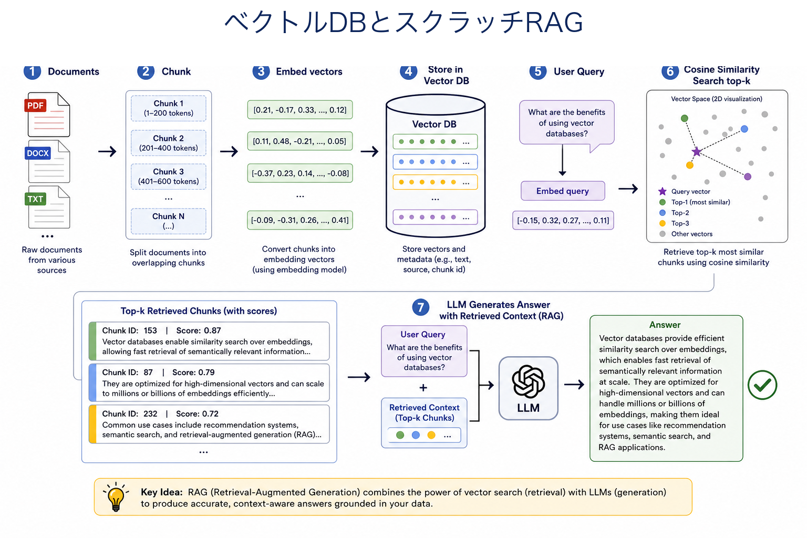
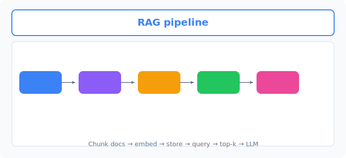
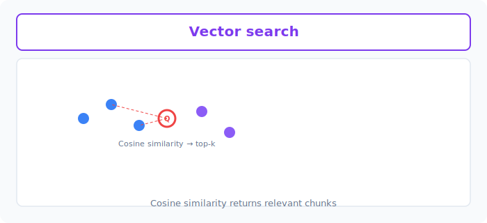

# Unit 24: ベクトルデータベースとスクラッチ RAG

<p class="unit-hero">
  
</p>

> [!IMPORTANT]
> **OpenAI API キーの設定**
> このUnitでは OpenAI API を使用します。APIキーの安全な設定方法は [Appendix (学習環境とキーの準備)](../appendix/index.md) の「OpenAI APIキーの取得と安全な管理」のセクションを参照してください。


## 1. Vector DBs & RAG From Scratch の理解

### Vector DB（ベクトルデータベース）とは？
AIに言葉を理解させるには、言葉を **「数値の羅列（ベクトル）」** に変換する必要があります（これを **埋め込み / Embedding** と呼びます）。
Vector DBは、この「数値の羅列」を保存し、「意味が似ているもの」を瞬時に探し出すことに特化したデータベースです。

**💡 日常の例え：本屋さんの陳列方法**
- **従来のデータベース（キーワード検索）** ：「あいうえお順」で本を並べている本屋さん。「リンゴ」と検索すると、「リンゴ」という文字が含まれる本だけが見つかります。「アップル」という文字の本は見つかりません。
- **ベクトルデータベース（意味検索）** ：「内容の近さ」で本を並べている本屋さん。「リンゴ」と検索すると、文字が一致しなくても「フルーツ」や「アップル」についての本が近くにあるため、すぐに見つけ出してくれます。

### RAG（Retrieval-Augmented Generation）とは？
ChatGPTなどのLLMは、自分が学習した過去のデータしか知りません。最新のニュースや、あなたの会社の社外秘ルールなどを聞かれても答えられません。
そこで、 **「先に資料を探して（検索: Retrieval）、それをAIに渡して回答を作らせる（生成: Generation）」** という手法が生まれました。これがRAGです。

**💡 日常の例え：オープンブック形式のテスト**
- **通常のLLM** ：自分の記憶だけを頼りにテストを受ける学生（忘れていたり、知らないと間違える）。
- **RAG** ：問題文を読んで、まず教科書（Vector DB）の関連するページを開き、そのページを見ながら回答を書く学生（正確で最新の情報に基づいた回答ができる）。

| プロセス | 学生の例え | RAGシステムでの動き |
| :--- | :--- | :--- |
| **1. 質問入力** | 「テストの問題を読む」 | ユーザーが「社内規定の有給の取り方は？」と入力 |
| **2. 検索 (Retrieval)** | 「教科書の目次から関連ページを探す」| 質問をベクトル化し、Vector DBから似た意味の文章を検索 |
| **3. 情報付与 (Augmentation)** | 「見つけたページを開いて机に置く」 | 検索で見つかった参考文章をプロンプトに貼り付ける |
| **4. 生成 (Generation)** | 「ページを見ながら自分の言葉で解答を書く」| 「参考文章を基に質問に答えて」とLLMに指示を出し、回答を得る |


下図は、文書の **Chunk → Embed → Retrieve → LLM** という RAG パイプラインです。



### 💡 具体的なビジネスユースケース
- **社内規定・マニュアル検索システム** ：膨大な社内ドキュメントをベクトル化して保存し、社員が「〜の手続きはどうする？」と質問すると、関連する規定を瞬時に探し出して正確に回答するヘルプデスク。
- **ECサイトのセマンティック検索** ：ユーザーが「夏に海で着る涼しい服」などと入力した際、商品名に単語が含まれていなくても、意味合い（ベクトル）の近い商品を推薦する高度な検索機能。
- **過去のトラブルシューティング検索** ：エンジニアがエラーメッセージや事象を入力すると、過去の類似インシデントの報告書や解決策をVector DBから検索し、迅速な障害対応を支援するシステム。


下図は、クエリ **Q** からコサイン類似度で **top-k** チャンクを検索する様子です。



## 2. 実装例 (Implementation Example)

ライブラリに頼らず、Pythonの基本機能やシンプルなベクトルライブラリを使って、RAGの仕組みをゼロから作ってみましょう。

> ※ 事前に `pip install scikit-learn openai` などをインストールしておきます。（今回は分かりやすくするため、scikit-learnの類似度計算を用います）

```python
import os
from openai import OpenAI
from sklearn.metrics.pairwise import cosine_similarity
import numpy as np

client = OpenAI(api_key=os.environ.get("OPENAI_API_KEY"))

# =========================================
# 【準備編】Vector DBの代わりを作ろう
# =========================================

# 1. 知識となる文書リスト（これが社内マニュアルなどの代わりです）
documents = [
    "AIの学習には大量のデータが必要です。",
    "弊社の有給休暇は、入社半年後に10日付与されます。",
    "経費精算は月末までにシステムXから申請してください。",
    "PythonはAI開発に非常に適したプログラミング言語です。"
]

# 2. 文章を「ベクトル（数値の羅列）」に変換する関数
def get_embedding(text):
    response = client.embeddings.create(
        input=text,
        model="text-embedding-3-small" # OpenAIの埋め込みモデル
    )
    return response.data[0].embedding

# 3. すべての文書をベクトル化して保存（簡易的なVector DBの完成）
print("文書をベクトル化しています...")
doc_embeddings = [get_embedding(doc) for doc in documents]

# =========================================
# 【実行編】RAGパイプラインを動かそう
# =========================================

# 4. ユーザーからの質問
question = "有給休暇はいつもらえますか？"
print(f"質問: {question}")

# 5. 質問もベクトル化する
question_embedding = get_embedding(question)

# 6. 【Retrieval: 検索】質問のベクトルと、各文書のベクトルの「似ている度合い」を計算
# cosine_similarity（コサイン類似度）は1に近いほど意味が似ていることを示します
similarities = cosine_similarity([question_embedding], doc_embeddings)[0]

# 一番類似度が高かった（意味が近かった）文書のインデックスを取得
best_index = np.argmax(similarities)
best_document = documents[best_index]
print(f"見つかった参考資料: {best_document}")

# 7. 【Augmentation & Generation: 情報付与と生成】
# 見つけた資料をプロンプトに埋め込んで、LLMに回答させる
prompt = f"""
以下の【参考資料】のみに基づいて、ユーザーの【質問】に答えてください。

【参考資料】
{best_document}

【質問】
{question}
"""

response = client.chat.completions.create(
    model="gpt-4o-mini",
    messages=[{"role": "user", "content": prompt}],
    temperature=0.0
)

print("\nAIの最終回答:")
print(response.choices[0].message.content)
```

**🔍 コードの詳しい解説**
1. **準備（データベース作り）** ：まず、AIに教えたい知識のリストを用意します。
2. **ベクトル化（Embedding）** ：文章を数値の配列に変換します。これにより、コンピュータが文章の「意味の近さ」を計算できるようになります。
3. **検索（Retrieval）** ：ユーザーからの質問もベクトル化し、「コサイン類似度」という数学的な方法を使って、データベースの中から最も意味が近い文章を探し出します。キーワードが一致しなくても見つけることができます。
4. **プロンプト作成（Augmentation）** ：「この資料を元に答えてね」という指示文を作り、そこに先ほど検索で見つけた文章を挿入します。
5. **回答生成（Generation）** ：完成したプロンプトをLLMに投げると、見つけた資料の内容だけをもとにした、正確な回答が返ってきます。

**💡 自作の全探索と専用 Vector DB の違い**
今回の実装は、すべての文書との類似度を総当たりで計算する「リスト全探索」であり、文書が数十件程度であれば十分に機能します。しかし、ChromaDB や Pinecone のような専用の Vector DB は、 **ANN（近似最近傍探索）インデックス** を使うことで、文書が数百万件規模になっても高速に検索できるように設計されています。さらに、メタデータによる絞り込みフィルタや、データの永続化・スケーリングといった運用に必要な機能も備えており、本番システムではこうした専用 DB を利用するのが一般的です。

## 3. 実践 (Practice)

先ほどの実装例を応用して、 **「トップ3の関連文書」** を検索してプロンプトに埋め込むように改良してみましょう。

**【要件】**
- データベースの文書を8〜10個ほど適当に増やしてください（AI関連や会社のルールなど何でもOKです）。
- 先ほどは `np.argmax()` を使って1番似ている文書を1つだけ取り出しましたが、今回は類似度が高い上位3つの文書を取り出してください。
- その3つの文書すべてを、プロンプトの【参考資料】セクションに結合して埋め込み、AIに回答させてください。

**💡 ヒント**
- numpyの `np.argsort()` を使うと、配列を並び替えた際のインデックスを取得できます。これを逆順（降順）にすれば、類似度が高い順になります。

## 4. 答え合わせ (Answer Key)

<details>
<summary>解答例を見る（クリックで展開）</summary>

```python
import os
from openai import OpenAI
from sklearn.metrics.pairwise import cosine_similarity
import numpy as np

client = OpenAI(api_key=os.environ.get("OPENAI_API_KEY"))

def get_embedding(text):
    response = client.embeddings.create(
        input=text, model="text-embedding-3-small"
    )
    return response.data[0].embedding

# 1. 知識となる文書リスト（データを増やしました）
documents = [
    "AIの学習には大量のデータが必要です。",
    "弊社の有給休暇は、入社半年後に10日付与されます。",
    "経費精算は月末までにシステムXから申請してください。",
    "PythonはAI開発に非常に適したプログラミング言語です。",
    "有給休暇を申請する場合は、1週間前までに上長に報告してください。",
    "システムXのログインパスワードは3ヶ月ごとに変更が必要です。",
    "特別休暇として、夏季休暇が3日間付与されます。",
    "機械学習には教師あり学習と教師なし学習があります。"
]

print("文書をベクトル化しています...")
doc_embeddings = [get_embedding(doc) for doc in documents]

question = "有給休暇を取るためのルールと付与日数を教えてください。"
question_embedding = get_embedding(question)

# 2. 類似度計算
similarities = cosine_similarity([question_embedding], doc_embeddings)[0]

# 3. 類似度の上位3つのインデックスを取得
# argsortは昇順なので、[::-1]で降順に反転させ、先頭3つ（[:3]）を取得
top_3_indices = np.argsort(similarities)[::-1][:3]

# 4. 上位3つの文書を取り出して結合する
retrieved_docs = []
for idx in top_3_indices:
    retrieved_docs.append(documents[idx])

# 文書を改行でつなげる
context_text = "\n- ".join(retrieved_docs)
print(f"【検索された資料】\n- {context_text}\n")

# 5. プロンプトに埋め込んで生成
prompt = f"""
以下の【参考資料】のみに基づいて、ユーザーの【質問】に答えてください。

【参考資料】
- {context_text}

【質問】
{question}
"""

response = client.chat.completions.create(
    model="gpt-4o-mini",
    messages=[{"role": "user", "content": prompt}],
    temperature=0.0
)

print("【AIの回答】")
print(response.choices[0].message.content)
```

### 解説

なぜ1件ではなく **top-3の文書を検索** するのでしょうか。今回の質問「有給休暇を取るためのルールと付与日数」に完全に答えるには、「入社半年後に10日付与」という文書と「1週間前までに上長に報告」という文書の **両方** が必要です。1件しか取得しないと、どちらか片方の情報が欠けたまま回答を生成することになり、AIが足りない部分を推測で埋めてしまう（ハルシネーションを起こす）リスクが高まります。複数の文書を参照させることで回答の根拠が豊かになり、より正確で網羅的な回答が得られるのです。ただし、`k`（取得件数）を大きくしすぎると、今度は「機械学習には教師あり学習と…」のような **質問と無関係な文書がプロンプトに混ざり込み** 、AIの回答がぼやけたりトークン消費（コスト）が増えたりするトレードオフがあります。実務のRAGでは、この `k` の値をデータの粒度や質問の性質に合わせてチューニングします。コードの面では、`np.argsort(similarities)[::-1][:3]` が「昇順ソートのインデックスを反転して降順にし、先頭3つを取る」という定番イディオムであることも押さえておきましょう。

</details>
