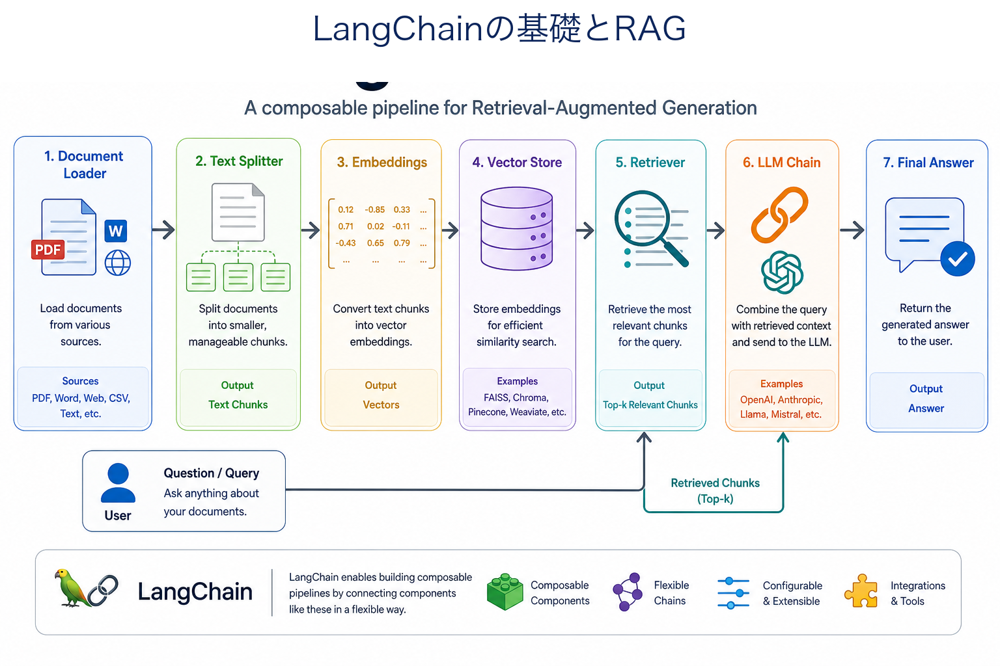
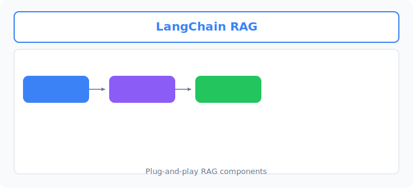
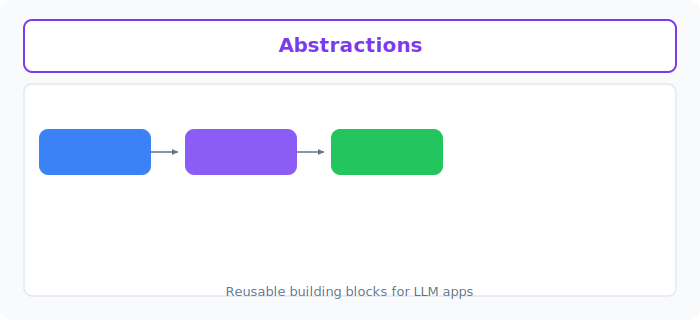

# Unit 25: LangChainの基礎とRAG

<p class="unit-hero">
  
</p>

> [!IMPORTANT]
> **前提知識とライブラリのインストール**
> このユニットを進めるには、`langchain` および `langchain-openai` ライブラリが必要です。
> 手元の環境で以下のコマンドを実行してインストールしてください。
> ```bash
> pip install langchain langchain-openai
> ```

---

## 1. LangChainの基礎とRAGの理解

前回の Unit 24 では、APIを直接叩き、自分でドキュメントの分割、ベクトル化、コサイン類似度の計算などを行って **「RAGをスクラッチで手組み」** しました。手組みすることで、RAGの裏側で何が起きているか（検索と生成の組み合わせ）が深く理解できたはずです。

しかし、実際のプロダクト開発でこれらすべてを手組みするのは大変です。また、LLMのモデルを OpenAI から Anthropic（Claude）に切り替えたり、プロンプトを整理したり、複雑な推論ステップを繋ぐ（チェイニング）となると、コードがすぐにスパゲッティ化してしまいます。

そこで登場するのが、LLMアプリ開発フレームワークとして広く使われる代表的な存在である **LangChain** です。
### LangChainとは？

LangChainは、LLMを用いたアプリケーション開発を効率化するための共通パーツ（コンポーネント）と、それらを繋ぐための強力な仕組みを提供するライブラリです。

#### 💡 日常の例え：システムキッチンと規格パーツ
手組み開発が「木を切って、ネジを一本ずつ締めて、オリジナルの棚やシンクを手作りする」のだとすれば、LangChainは **「あらかじめ規格が統一されたシステムキッチンのパーツ（ガスコンロ、収納棚、食洗機など）」** を組み合わせるようなものです。
コンロ（LLM）をガス（OpenAI）からIH（Claude）に変えたい時も、規格が同じなのでカチャッと入れ替えるだけで済みます。


下図は、LangChain における **Document loader → Vector store → RetrievalQA** の RAG チェーンです。



### LangChainの4大主要コンポーネント

LangChainは様々な機能を持っていますが、まずは最も重要な以下の4つのパーツを理解しましょう。

| コンポーネント | 役割 | 該当クラスの例 |
| :--- | :--- | :--- |
| **Models** | LLMとの通信を担当する窓口。異なるAIベンダーのモデルを共通のインターフェースで扱えます。 | `ChatOpenAI` |
| **Prompts** | プロンプトのテンプレート化や変数埋め込みを管理します。 | `ChatPromptTemplate` |
| **OutputParsers** | LLMから返ってきたテキスト（JSONやカンマ区切りなど）を、プログラムが扱いやすい形式に解析・変換します。 | `StrOutputParser` |
| **Chains (LCEL)** | 上記のパーツを一本のパイプラインとして結合します。 | `prompt \| model \| parser` |

### LCEL (LangChain Expression Language)

LangChainでは、複数のパーツを繋ぐために **LCEL（エルセル）** という直感的な記述方法を採用しています。
Pythonのビット演算子である **パイプ記号 `|`** を使って、データを左から右へと流すパイプラインを定義します。

```python
# シンプルなLCELチェーンの例
chain = prompt | model | output_parser
```

データを `prompt` に流し込むと、自動で変数が埋め込まれ、`model`（LLM）に送られ、結果が `output_parser`（文字列抽出）に渡されて最終的な回答が得られます。手組みだと10行以上かかっていた「プロンプト埋め込み ➔ APIリクエスト ➔ レスポンスパース」が、たった1行でエレガントに記述できます。

### 💡 具体的なビジネスユースケース

- **社内ドキュメント横断検索システム** ：PDFや社内Wiki内の情報をLangChainのRetriever（検索機）で統合し、最新の社内規則に則って回答するQAアシスタント。
- **マルチベンダー対応チャットツール** ：入力データの機密性やコストに応じて、OpenAIのモデルとAnthropicのモデルを背後でシームレスに切り替える企業用チャットUI。
- **データ分析パイプライン** ：CSVデータやSQLの検索結果をプロンプトテンプレートに流し込み、LCELチェーンを使って自動で要因分析とグラフ描画用のJSONデータを生成するシステム。


下図は、 **Prompt templates / Output parsers / Chains** などの再利用可能な抽象化です。



---

## 2. 実装例 (Implementation Example)

それでは、LangChainのLCELを使用して、 **「インメモリのベクターストアを用いたシンプルなRAGシステム」** を構築してみましょう。
前回のスクラッチ実装で行った「コサイン類似度の計算」などが、LangChainによってどれほどシンプルに記述できるかに注目してください。
なお、冒頭の概念図にある Document loader の部分は、今回のサンプルでは `from_texts` でテキストのリストを直接渡すことで代替しています。また、図中の RetrievalQA（旧 API の名称）に相当する部分は、これから LCEL チェーンとして自分の手で組み立てます。

> ※ 実行には `OPENAI_API_KEY` が環境変数に設定されている必要があります。

```python
import os
from langchain_openai import ChatOpenAI, OpenAIEmbeddings
from langchain_core.prompts import ChatPromptTemplate
from langchain_core.output_parsers import StrOutputParser
from langchain_core.runnables import RunnablePassthrough
from langchain_core.vectorstores import InMemoryVectorStore

# 1. 簡易的な社内ドキュメント（知識ソース）の用意
documents = [
    "株式会社テックアカデミーの夏季休暇は、8月13日から8月16日までの4日間です。",
    "福利厚生として、年間最大5万円の書籍購入補助（テックブックサポート）が利用可能です。",
    "経費精算は、毎月25日までにシステム「マネーフォワード」経由で申請する必要があります。"
]

# 2. Embedding（ベクトル化モデル）とベクターストアの準備
# LangChainが提供する軽量なインメモリベクターストアを使用します
embeddings = OpenAIEmbeddings(model="text-embedding-3-small")
vectorstore = InMemoryVectorStore.from_texts(documents, embedding=embeddings)

# 3. Retriever（検索機）の作成
# これにより、ユーザーの質問に関連する文書を自動でトップK件探してくる「窓口」ができます
retriever = vectorstore.as_retriever(search_kwargs={"k": 1})

# 4. LLMモデルとプロンプトテンプレートの準備
model = ChatOpenAI(model="gpt-4o-mini", temperature=0.0)

# context（検索された文書）と question（ユーザーの質問）を受け取るテンプレート
prompt = ChatPromptTemplate.from_template(
    """以下の参考情報を元に、ユーザーの質問に正確に答えてください。
情報が見つからない場合は「申し訳ありませんが、その情報は見つかりませんでした」と答えてください。

【参考情報】
{context}

【質問】
{question}
"""
)

# 5. LCELによる RAG パイプライン（チェーン）の構築
# RunnablePassthrough は、入力された質問をそのまま下流のプロンプトに流すための仕組みです
rag_chain = (
    {"context": retriever, "question": RunnablePassthrough()}
    | prompt
    | model
    | StrOutputParser()
)

# 6. 実行
if __name__ == "__main__":
    # テスト質問 1
    query_1 = "お盆休みはいつからいつまでですか？"
    response_1 = rag_chain.invoke(query_1)
    print(f"質問: {query_1}")
    print(f"回答: {response_1}\n")

    # テスト質問 2
    query_2 = "本を買うための補助制度はありますか？"
    response_2 = rag_chain.invoke(query_2)
    print(f"質問: {query_2}")
    print(f"回答: {response_2}\n")

    # テスト質問 3
    query_3 = "会社の給料日はいつですか？"
    response_3 = rag_chain.invoke(query_3)
    print(f"質問: {query_3}")
    print(f"回答: {response_3}\n")
```

**🔍 コードの詳しい解説**
1. **InMemoryVectorStore** : 前回のスクラッチ実装で自分で書いていた「ベクトルのデータベース」に該当します。入力された文書を `OpenAIEmbeddings` でベクトル化し、メモリ上に保存します。
2. **Retriever** : `as_retriever` を呼ぶことで、「質問を投げると、関連度の高いドキュメントを検索して返してくれるオブジェクト」へと変換されます。コサイン類似度の計算やソートの処理がすべてこの裏に隠蔽されています。
3. **LCELチェーンのデータフロー** :
   - `{"context": retriever, "question": RunnablePassthrough()}`
     入力された文字列（質問）が2つのルートに分岐します。片方は `retriever` に送られて関連ドキュメント（`context`）が検索され、もう片方は `RunnablePassthrough` によってそのまま `question` として保持されます。なお、`retriever` の出力は `Document` オブジェクトのリストのままプロンプトに埋め込まれます（今回は動作します）。実務では `"\n".join(doc.page_content for doc in docs)` のような整形関数（`format_docs`）を間に挟み、本文テキストだけを渡すのが定番です。
   - `| prompt`
     検索結果（`context`）と元の質問（`question`）がテンプレートの `{context}` と `{question}` に自動的に埋め込まれます。
   - `| model`
     完成したプロンプトがLLM（GPT-4o-mini）に送られ、生成タスクが実行されます。
   - `| StrOutputParser()`
     LLMから返された応答オブジェクトから、回答テキスト部分だけが抽出されます。

---

## 3. 実践 (Practice)

LangChainを使ったRAG構築の感覚が掴めたら、今度は社内の **「セキュリティ規約に関する相談アシスタント」** を構築してみましょう！

**【要件】**
- 以下の「セキュリティ規約データ」をベクターストアに格納してください。
- ユーザーからの質問に対して、関連する規約を検索し、それに基づいた回答を出力する LCEL チェーンを構築してください。
- 関数名: `create_security_qa_chain()`
  - 戻り値として、構築した `rag_chain` オブジェクトを返してください。

**【セキュリティ規約データ】**
```python
security_policies = [
    "社内PCのパスワードは、英大文字・小文字・数字・記号を組み合わせた12文字以上とし、90日ごとに変更しなければならない。",
    "顧客の個人情報や機密ファイルを外部に送信する際は、必ず会社の指定する共有リンクにパスワードと有効期限（最大7日間）を設定すること。",
    "業務時間外に社外で仕事をする場合は、必ず前日までに「リモートワーク申請」を上長に提出し、承認を得る必要がある。"
]
```

**💡 ヒント**
- 実装例と同様に、`InMemoryVectorStore.from_texts` を使ってベクトルデータベースを作成します。
- プロンプトテンプレートを工夫して、「セキュリティポリシーに厳格に従うこと。記載がないルールについては『セキュリティ規約に該当する記載がありません』と答えること」と指示してください。

---

## 4. 答え合わせ (Answer Key)

<details>
<summary>解答例を見る（クリックで展開）</summary>

```python
import os
from langchain_openai import ChatOpenAI, OpenAIEmbeddings
from langchain_core.prompts import ChatPromptTemplate
from langchain_core.output_parsers import StrOutputParser
from langchain_core.runnables import RunnablePassthrough
from langchain_core.vectorstores import InMemoryVectorStore

def create_security_qa_chain():
    # 1. セキュリティ規約データの用意
    security_policies = [
        "社内PCのパスワードは、英大文字・小文字・数字・記号を組み合わせた12文字以上とし、90日ごとに変更しなければならない。",
        "顧客の個人情報や機密ファイルを外部に送信する際は、必ず会社の指定する共有リンクにパスワードと有効期限（最大7日間）を設定すること。",
        "業務時間外に社外で仕事をする場合は、必ず前日までに「リモートワーク申請」を上長に提出し、承認を得る必要がある。"
    ]
    
    # 2. Embeddingモデルとベクターストアの初期化
    embeddings = OpenAIEmbeddings(model="text-embedding-3-small")
    vectorstore = InMemoryVectorStore.from_texts(security_policies, embedding=embeddings)
    
    # 3. Retriever（検索機）の設定
    retriever = vectorstore.as_retriever(search_kwargs={"k": 1})
    
    # 4. LLMモデルの設定（実務用途なのでランダム性を排除するため temperature=0.0）
    model = ChatOpenAI(model="gpt-4o-mini", temperature=0.0)
    
    # 5. セキュリティ相談専用のプロンプト
    prompt = ChatPromptTemplate.from_template(
        """あなたは社内の情報セキュリティに関する質問に答える専門アシスタントです。
以下のセキュリティ規約情報を元に、ユーザーの相談に正確に答えてください。
規約に明示的に記載されていない事柄については、勝手に推測して答えず、「セキュリティ規約に該当する記載がありません」と厳格に答えてください。

【セキュリティ規約情報】
{context}

【質問】
{question}
"""
)
    
    # 6. LCELによるチェーンの構築
    rag_chain = (
        {"context": retriever, "question": RunnablePassthrough()}
        | prompt
        | model
        | StrOutputParser()
    )
    
    return rag_chain

# テスト実行
if __name__ == "__main__":
    qa_chain = create_security_qa_chain()
    
    # テスト 1: 規約に記載のある質問
    q1 = "パスワードは何日ごとに変更すればいいですか？"
    print(f"質問: {q1}")
    print(f"回答: {qa_chain.invoke(q1)}\n")
    
    # テスト 2: 規約に記載のある質問
    q2 = "社外に顧客データを送る場合の共有リンクの期限は？"
    print(f"質問: {q2}")
    print(f"回答: {qa_chain.invoke(q2)}\n")
    
    # テスト 3: 規約に記載のない質問
    q3 = "オフィスの入退館カードを紛失した場合はどうすればいいですか？"
    print(f"質問: {q3}")
    print(f"回答: {qa_chain.invoke(q3)}\n")
```

### 解説

この解答のポイントは、コードの形よりも **「実務で事故を起こさないための設定」** にあります。

1. **`temperature=0.0` を指定する理由** : セキュリティ規約の回答は「毎回同じ質問には同じ答え」が返ることが絶対条件です。temperature を 0 にすることで出力のランダム性を排除し、再現性のある堅い回答に固定しています（創作系タスクとは真逆の設定です）。
2. **防御プロンプトの重要性** : 「規約に記載がない事柄は推測せず『該当する記載がありません』と答える」という指示がこのチェーンの生命線です。これがないと、LLM は入退館カードの質問（テスト3）に対して一般論をもっともらしく創作（ハルシネーション）してしまい、誤った社内ルールが広まる事故につながります。
3. **`k=1` の検索設定** : 規約データが3件と少ないため、最も関連度の高い1件だけを `context` に渡しています。規約が増えてきたら `k` を 2〜3 に増やし、複数の規約を横断して回答できるようにするのが次のステップです。
</details>
