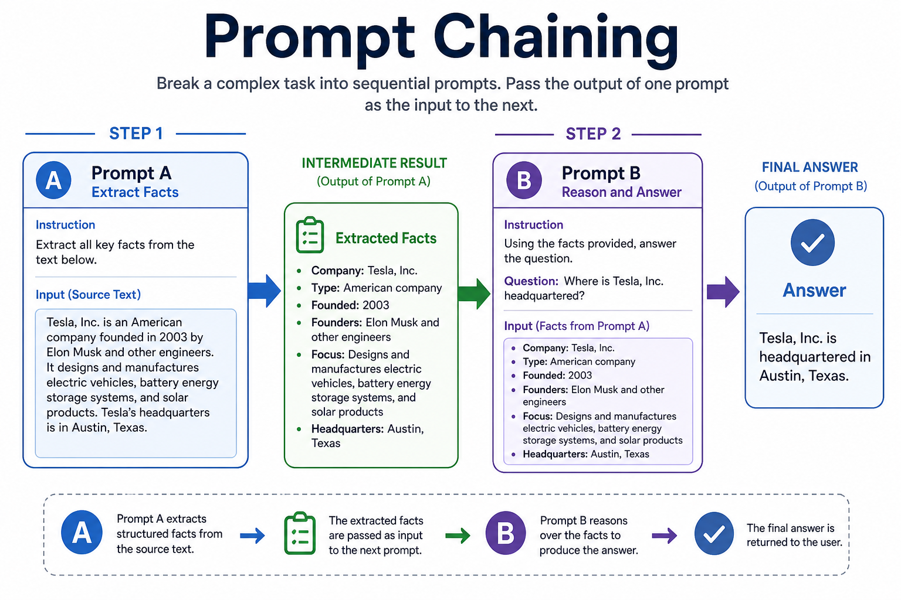
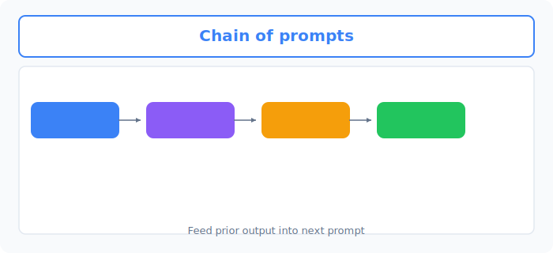
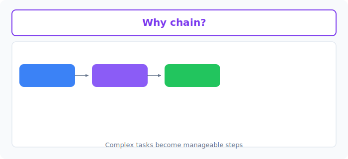

# Unit 27: プロンプトの連鎖による段階的推論

<p class="unit-hero">
  
</p>

> [!IMPORTANT]
> **OpenAI API キーの設定**
> このUnitでは OpenAI API を使用します。APIキーの安全な設定方法は [Appendix (学習環境とキーの準備)](../appendix/index.md) の「OpenAI APIキーの取得と安全な管理」のセクションを参照してください。


## 1. Prompt Chaining の理解

### プロンプトチェーン（Prompt Chaining）とは？
複雑な仕事をAIにお願いする時、1回の大きな質問で全てをやらせようとすると、AIは混乱して失敗しやすくなります。
そこで、 **「AIの処理を小さなステップに分け、前のステップの結果を次のステップに渡す（数珠つなぎにする）」** というテクニックが使われます。これがプロンプトチェーンです。

**💡 日常の例え：工場の流れ作業（アセンブリライン）**
一つの製品を完成させるのに、1人の職人が全てを行うのではなく、役割分担をします。
1. **担当者A（AI-1）** がリンゴの皮をむく。
2. **担当者B（AI-2）** がむかれたリンゴを受け取り、細かく刻む。
3. **担当者C（AI-3）** が刻まれたリンゴを受け取り、ジャムに煮詰める。
このように、前の人の作業結果（出力）を次の人の作業材料（入力）としてバケツリレーしていくイメージです。


下図は、 **Prompt A の出力を Prompt B に渡す** チェーンの流れです。



### Unit 25 の応用：LCEL によるプロンプトチェーンの数珠つなぎ
Unit 25において、単一のチェーンを `prompt | model | parser` のようにパイプ記号 `|` で構築する方法を学習しました。

プロンプトチェーンの真髄は、 **「すでに構築した複数の独立したチェーンを、さらに `|` で結合し、データのバケツリレーを行う」** 点にあります。

たとえば、ステップ1のチェーン（お題からキャッチコピーを作る）と、ステップ2のチェーン（キャッチコピーからツイートを作る）を繋ぐデータフローは、LangChain(LCEL)では以下のように記述されます。

| ステップ | 処理データフローのイメージ | LCELでの表現 |
| :--- | :--- | :--- |
| **お題の入力** | ユーザーがお題を入力する | `{"topic": "お題"}` |
| **第一のチェーン (Chain 1)** | お題からキャッチコピーを出力する | `chain1 = prompt1 \| llm \| parser` |
| **バケツのリレー** | Chain 1の出力を、次の入力辞書の特定のキー（`ad_copy`）にマッピングする | `{"ad_copy": chain1}` |
| **第二のチェーン (Chain 2)** | キャッチコピーから最終ツイートを出力する | `final_chain = {"ad_copy": chain1} \| prompt2 \| llm \| parser` |

このように、LangChainの `|` 記号は、単純なパーツの結合だけでなく、 **チェーンそのものを入力データソースとして扱い、次のチェーンにシームレスに流し込む強力な抽象化** を提供します。

### 💡 具体的なビジネスユースケース
- **マーケティングコンテンツの全自動生成ライン** ：「ターゲット層と訴求ポイント」を入力すると、①キャッチコピーを生成 → ②それに合うブログ記事の構成を作成 → ③各章の本文を執筆 → ④SNS用のプロモーション文を作成、という一連の流れを自動化。
- **長文レポートの階層的要約** ：数十ページに及ぶ市場調査レポートを処理する際、①まず章ごとに要約を作成 → ②各章の要約をつなぎ合わせて全体の要約を作成 → ③そこから経営陣向けの3箇条のエグゼクティブサマリーを抽出、という段階的な要約プロセス。
- **カスタマーフィードバックの詳細分析** ：アンケート結果に対し、①まずは感情分析（ポジ/ネガ）を実行 → ②ネガティブなものに対しては原因のカテゴライズを実行 → ③カテゴリごとに改善案を立案、というステップで深い分析を行うシステム。


下図は、タスク分割・デバッグ・品質向上といった **チェーン化の利点** です。



## 2. 実装例 (Implementation Example)

今回は、LCELを使って以下のような2つのステップからなるチェーンを作ります。
- **ステップ1** ：指定されたお題から「キャッチコピー」を考える。
- **ステップ2** ：そのキャッチコピーを使って、「宣伝ツイート」を書く。

```python
import os
from langchain_openai import ChatOpenAI
from langchain_core.prompts import ChatPromptTemplate
from langchain_core.output_parsers import StrOutputParser

# 1. LLMの準備
llm = ChatOpenAI(model="gpt-4o-mini", temperature=0.7)
# 結果を単なる文字列（String）として綺麗に取り出すための便利ツール
output_parser = StrOutputParser()

# =========================================
# チェーン1：キャッチコピーを作る
# =========================================
prompt1 = ChatPromptTemplate.from_template(
    "お題「{topic}」の魅力的なキャッチコピーを1文で考えてください。"
)
# | (パイプ) を使って、プロンプト → LLM → 文字列抽出 と処理をつなぎます
chain1 = prompt1 | llm | output_parser

# =========================================
# チェーン2：ツイートを作る
# =========================================
prompt2 = ChatPromptTemplate.from_template(
    "以下のキャッチコピーを使って、SNS向けの宣伝ツイートを作成してください。ハッシュタグも含めてください。\n\nキャッチコピー：{ad_copy}"
)
chain2 = prompt2 | llm | output_parser

# =========================================
# 全体を結合する（プロンプトチェーン）
# =========================================
# 辞書型 {"ad_copy": chain1} とすることで、
# chain1の実行結果が自動的に "ad_copy" という変数に入り、chain2に渡されます
overall_chain = {"ad_copy": chain1} | chain2

# 実行
topic = "空飛ぶスニーカー"
print(f"お題: {topic}\n")

print("チェーン実行中...")
result = overall_chain.invoke({"topic": topic})

print("\n【最終結果：宣伝ツイート】")
print(result)
```

**🔍 コードの詳しい解説**
1. **部品の準備** ：LLMと、結果をきれいなテキストにする `StrOutputParser` を用意します。
2. **チェーン1** ：`prompt1` で {topic} を受け取り、キャッチコピーを生成する一連の流れを `|` で繋いで作成します。
3. **チェーン2** ：`prompt2` で {ad_copy} を受け取り、ツイート文を生成する流れを作ります。
4. **チェーンの結合** ：`{"ad_copy": chain1} | chain2` が最大のポイントです。これは「まずchain1を実行し、その結果を `ad_copy` という名前の変数としてchain2に渡せ！」という見事なバケツリレーの指示になります。

## 3. 実践 (Practice)

今度は、ステップを3つに増やしたプロンプトチェーンを作ってみましょう。

**【お題：ブログ記事の自動生成パイプライン】**
1. **ステップ1** : 与えられたテーマ `{topic}` から、「ブログ記事のタイトル」を考える。
2. **ステップ2** : そのタイトル `{title}` から、「記事の目次（アウトライン）」を考える。
3. **ステップ3** : そのタイトル `{title}` と目次 `{outline}` の両方を使って、「記事の序文（リード文）」を書く。

**💡 ヒント**
- RunnablePassthrough という機能を使うと、途中の変数をそのまま次のステップに受け渡すことができますが、少し難しい場合は以下のように辞書で繋いでみましょう。
- 最終ステップへの受け渡しは `{"title": chain1, "outline": chain2_that_uses_title}` のように複雑になるため、LangChainの強力な記法に挑戦してみてください。

## 4. 答え合わせ (Answer Key)

<details>
<summary>解答例を見る（クリックで展開）</summary>

```python
import os
from langchain_openai import ChatOpenAI
from langchain_core.prompts import ChatPromptTemplate
from langchain_core.output_parsers import StrOutputParser
from langchain_core.runnables import RunnablePassthrough

llm = ChatOpenAI(model="gpt-4o-mini", temperature=0.7)
parser = StrOutputParser()

# 1. タイトル生成チェーン
prompt_title = ChatPromptTemplate.from_template("テーマ「{topic}」のブログ記事の惹きつけられるタイトルを1つ考えてください。")
chain_title = prompt_title | llm | parser

# 2. 目次生成チェーン
prompt_outline = ChatPromptTemplate.from_template("タイトル「{title}」のブログ記事の目次（3章構成）を作成してください。")
chain_outline = prompt_outline | llm | parser

# 3. 序文生成チェーン
prompt_intro = ChatPromptTemplate.from_template("""
以下のタイトルと目次を持つブログ記事の、魅力的な「序文（導入部分）」を200文字程度で書いてください。

タイトル：{title}
目次：\n{outline}
""")
chain_intro = prompt_intro | llm | parser

# =========================================
# 高度なチェーン結合 (RunnablePassthroughの活用)
# =========================================
# RunnablePassthrough.assign を使うと、既存の入力（ここではtitle）を保持したまま、
# 新しい変数（outline）を追加して次のステップに渡すことができます。

overall_chain = (
    # 最初に入力 {"topic": "..."} を受け取り、title変数を追加する
    {"title": chain_title} 
    # 今の辞書 {"title": "..."} を引き継ぎつつ、outline変数を追加する
    | RunnablePassthrough.assign(outline=chain_outline)
    # 辞書 {"title": "...", "outline": "..."} が chain_intro に渡される
    | chain_intro
)

# 実行
result = overall_chain.invoke({"topic": "初心者向けの観葉植物の育て方"})

print("【最終的に生成された序文】")
print(result)
```

### 解説

この解答の最大のポイントは、 `RunnablePassthrough.assign` を使っている点です。単純に `{"outline": chain_outline}` と辞書で繋いでしまうと、その時点で辞書が丸ごと作り直されてしまい、前段で生成した `title` が失われてしまいます。 `RunnablePassthrough.assign(outline=chain_outline)` は「今流れている辞書の中身（`title`）をそのまま保持したまま、新しいキー `outline` だけを追加する」という動きをするため、データを失わずにバケツリレーを続けられるのです。チェーン内のデータフローを追うと、まず `{"topic": "..."}` が入力され、 `{"title": chain_title}` で `{"title": "..."}` に変換され、 `assign` によって `{"title": "...", "outline": "..."}` へと育っていき、最後に両方のキーを必要とする `chain_intro` に渡ります。このように「後のステップが複数の中間結果を必要とする」場面では、 `RunnablePassthrough.assign` が定石になります。
</details>
