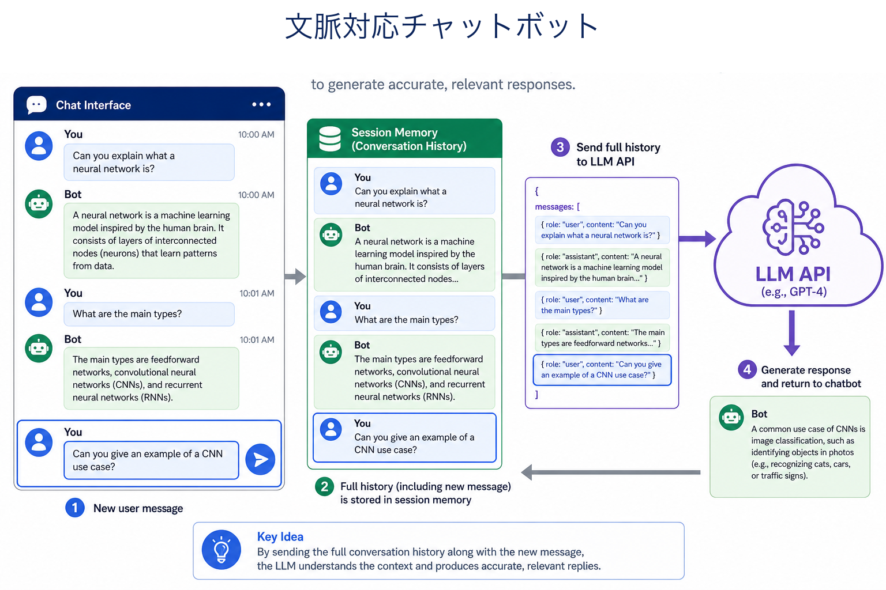
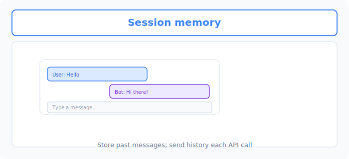
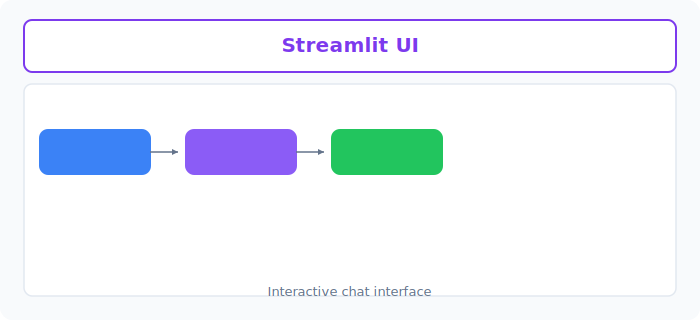

# Unit 28: 文脈を記憶するチャットボット

<p class="unit-hero">
  
</p>

> [!IMPORTANT]
> **OpenAI API キーの設定**
> このUnitでは OpenAI API を使用します。APIキーの安全な設定方法は [Appendix (学習環境とキーの準備)](../appendix/index.md) の「OpenAI APIキーの取得と安全な管理」のセクションを参照してください。


## 1. Context-Aware Chatbot の理解

### メモリ（記憶）の必要性とは？
APIを通して使うLLMは、基本的に **「記憶喪失」** です。
1回目の質問で「私の名前はタロウです」と教えても、2回目の質問で「私の名前は何ですか？」と聞くと「わかりません」と答えます。これは、毎回完全に独立した通信を行っているためです。

Context-Aware Chatbot（文脈を理解するチャットボット）を作るためには、AIに記憶力を持たせる必要があります。

**💡 日常の例え：物忘れの激しいウェイター**
- **記憶がないAI** ：毎回あなたが誰か忘れ、「ご注文は何ですか？」と聞いてくる。さっき「水のおかわり」と言った文脈も覚えていない。
- **記憶があるAI（Chatbot）** ：過去の会話記録（ノート）を常にポケットに入れており、あなたが話しかけるたびに **「直前までの会話記録すべて」をこっそり読んでから** 返事をしてくれる。


下図は、過去の **User / Bot メッセージを履歴として保持** し、毎回 API に送る構成です。



### LangChainでの記憶の仕組み
LangChainでは、「会話履歴（ノート）」をプロンプトに自動的に継ぎ足してくれる機能が備わっています。

| 記憶の仕組み | メリット | デメリット |
| :--- | :--- | :--- |
| **すべて記憶（Buffer Memory）** | 最初からの文脈を完璧に理解する | 会話が長くなると、送信するデータ量が膨大になりAPI料金が高くなる |
| **直近だけ記憶（Window Memory）** | 過去N回分だけ記憶。トークン数（コスト）を節約できる | 昔の話題に戻ると忘れている |

### 💡 具体的なビジネスユースケース
- **パーソナライズされたAIメンター・コーチング** ：社員の目標設定や日々の進捗を記憶し、「先週は〇〇で悩んでいたけど、その後どうだった？」など、前回の会話を踏まえた継続的なサポートを行う1on1ボット。
- **長期的な顧客対応（CRM連携チャット）** ：顧客の過去の購入履歴や過去の問い合わせ内容（文脈）をすべて記憶・参照しながら、「前回ご購入いただいた〇〇の調子はいかがですか？」と寄り添った提案ができる高度なカスタマーサポート。
- **ゲームやエンタメのNPC（ノンプレイヤーキャラクター）** ：プレイヤーが過去に取った行動や話した内容を記憶し、次に会ったときの態度やセリフが変化する、よりリアリティのあるゲーム内キャラクター。


下図は、 **ユーザー入力を履歴に追加し、API を呼んで応答を返す** チャットループの流れです。



## 2. 実装例 (Implementation Example)

LangChainの新しい標準機能である `RunnableWithMessageHistory` を使って、過去の会話を記憶するチャットボットを作ってみましょう。

> ※ LangChainのバージョン更新により、以前の `ConversationBufferMemory` よりもシンプルで汎用的な履歴管理メソッドが推奨されています。

事前に `pip install langchain-openai langchain-community` を実行し、環境変数に `OPENAI_API_KEY` を設定してください（`ChatMessageHistory` は `langchain-community` パッケージに含まれています）。

```python
import os
from langchain_openai import ChatOpenAI
from langchain_core.prompts import ChatPromptTemplate, MessagesPlaceholder
from langchain_community.chat_message_histories import ChatMessageHistory
from langchain_core.runnables.history import RunnableWithMessageHistory

# 1. LLMの準備
llm = ChatOpenAI(model="gpt-4o-mini", temperature=0.7)

# 2. プロンプトの準備
# MessagesPlaceholder を使うことで、「ここに過去の会話履歴を挿入する」という予約席を作れます
prompt = ChatPromptTemplate.from_messages([
    ("system", "あなたは親友のようにフランクに話すチャットボットです。"),
    MessagesPlaceholder(variable_name="chat_history"), # 会話履歴が入る場所
    ("user", "{input}")
])

# チェーンを作成
chain = prompt | llm

# 3. 記憶（メモリ）の保存場所（データベースの代わり）
# ユーザーごとの会話履歴を保存する辞書を用意します
store = {}

# セッションID（ユーザーID）を受け取り、その人の会話履歴を返す関数
def get_session_history(session_id: str):
    if session_id not in store:
        store[session_id] = ChatMessageHistory() # 新規ユーザーなら新しいノートを作成
    return store[session_id]

# 4. チェーンに「記憶機能」を合体させる
# history_messages_key に、プロンプトで予約した変数名(chat_history)を指定します
with_message_history = RunnableWithMessageHistory(
    chain,
    get_session_history,
    input_messages_key="input",
    history_messages_key="chat_history",
)

# =========================================
# チャットボットとの会話シミュレーション
# =========================================
# 同じセッションIDを使うことで、「同一人物との連続した会話」になります
config = {"configurable": {"session_id": "user_123"}}

print("ユーザー: 私の名前はタロウです。リンゴが好きです。")
response1 = with_message_history.invoke(
    {"input": "私の名前はタロウです。リンゴが好きです。"},
    config=config
)
print("AI:", response1.content, "\n")

print("ユーザー: 私の名前を覚えていますか？好きな食べ物は何でしたっけ？")
response2 = with_message_history.invoke(
    {"input": "私の名前を覚えていますか？好きな食べ物は何でしたっけ？"},
    config=config
)
print("AI:", response2.content)
```

**🔍 コードの詳しい解説**
1. **プロンプトの工夫** ：`MessagesPlaceholder` は非常に重要です。AIに質問を投げる直前に、LangChainがこれまでの会話履歴（ユーザーの質問、AIの回答）をこの場所にガサッと挿入してくれます。
2. **履歴の保存場所** ：`store = {}` という辞書の中に、ユーザーごとの履歴を保管します。実際のアプリ開発では、これをRedisやデータベースに保存します。
3. **記憶の合体** ：`RunnableWithMessageHistory` という魔法のラッパー（包み紙）でチェーンを包むことで、自動的に履歴の読み出しと保存を行ってくれるようになります。
4. **会話の維持** ：`session_id` をキーにして通信することで、AIはタロウさんのこれまでの発言を思い出して回答します。

**💡 記憶の仕組みの表との対応関係**
「1. Context-Aware Chatbot の理解」で紹介した表の **Buffer Memory（すべて記憶）** に相当するのが、この `RunnableWithMessageHistory` 実装です。`ChatMessageHistory` は過去の全メッセージを保持し、毎回すべてをプロンプトに挿入するためです。もし **Window Memory（直近だけ記憶）** 型にしたい場合は、履歴オブジェクトが持つ `messages` を直近 N 件だけに絞ってからプロンプトに挿入するラッパー（例: `history.messages[-10:]` を返す独自の履歴クラス）を挟むことで、トークン数を節約できます。

## 3. 実践 (Practice)

ターミナル（黒い画面）上で、あなたがキーボードから直接AIと対話できる **「無限ループのチャットボット」** を作成してください。

**【要件】**
- `while True:` の無限ループを使って、`input("あなた: ")` でユーザーの入力を受け取ります。
- ユーザーが「exit」または「quit」と入力したら、ループを終了（break）します。
- 先ほどの `with_message_history` を使って、文脈を維持したまま対話を続けてください。

**💡 ヒント**
- 会話履歴がどんどん蓄積されるので、直前の会話だけでなく、数ターン前の会話についても質問して、記憶が維持されているかテストしてみましょう。

## 4. 答え合わせ (Answer Key)

<details>
<summary>解答例を見る（クリックで展開）</summary>

```python
import os
from langchain_openai import ChatOpenAI
from langchain_core.prompts import ChatPromptTemplate, MessagesPlaceholder
from langchain_community.chat_message_histories import ChatMessageHistory
from langchain_core.runnables.history import RunnableWithMessageHistory

llm = ChatOpenAI(model="gpt-4o-mini", temperature=0.7)

prompt = ChatPromptTemplate.from_messages([
    ("system", "あなたは優秀なアシスタントです。会話の文脈を把握して自然に応答してください。"),
    MessagesPlaceholder(variable_name="chat_history"),
    ("user", "{input}")
])

chain = prompt | llm
store = {}

def get_session_history(session_id: str):
    if session_id not in store:
        store[session_id] = ChatMessageHistory()
    return store[session_id]

chatbot = RunnableWithMessageHistory(
    chain,
    get_session_history,
    input_messages_key="input",
    history_messages_key="chat_history",
)

config = {"configurable": {"session_id": "my_interactive_session"}}

print("=======================================")
print("チャットボットが起動しました。")
print("終了するには 'exit' または 'quit' と入力してください。")
print("=======================================\n")

while True:
    # ユーザーからの入力を受け取る
    user_input = input("あなた: ")
    
    # 終了コマンドの確認
    if user_input.lower() in ["exit", "quit"]:
        print("AI: お話しできて楽しかったです。さようなら！")
        break
        
    # 入力が空でなければAIに送信
    if user_input.strip() != "":
        response = chatbot.invoke(
            {"input": user_input},
            config=config
        )
        print(f"AI: {response.content}\n")
```

### 解説

この解答のポイントは、実装例で作った「記憶付きチェーン」を `while True:` の無限ループで包むだけで、対話型チャットボットが完成するという点です。ループの各周回で `input()` によりユーザーの発言を受け取り、同じ `session_id` を使い続けることで、`RunnableWithMessageHistory` が過去の全発言を自動的にプロンプトへ挿入してくれます。そのため、数ターン前に話した内容についても文脈を保ったまま回答できます。終了判定（`exit` / `quit`）を LLM への送信より先にチェックしているのは、無駄な API 呼び出し（＝料金）を発生させないための小さな工夫です。また、空文字の入力をスキップしているのも、意味のないリクエストを防ぐ実務的な防御です。
</details>
