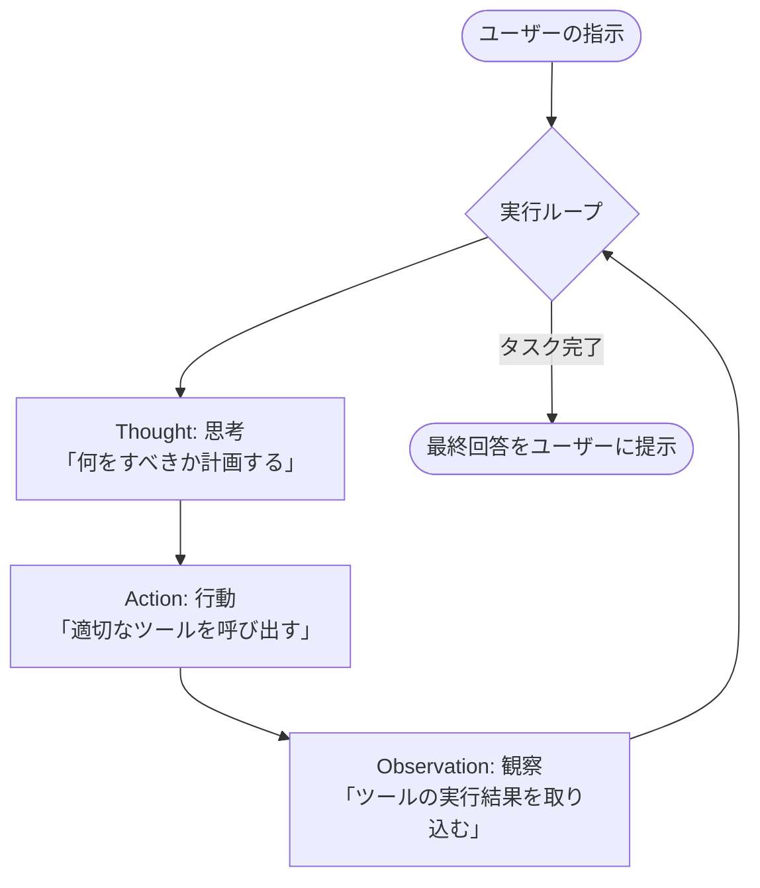

# Unit 29: AIエージェントの基本原理とスクラッチReAct実装

> [!IMPORTANT]
> **OpenAI API キーの準備について**
> 第4章の学習を進めるには **OpenAI の API キー** が必要です。APIキーの取得方法、料金に関する注意点、および Google Colab のシークレット機能を使った安全な環境変数設定については、[Appendix (学習環境とキーの準備)](../appendix/index.md#🔑-3-openai-apiキーの取得と安全な管理第4章) を最初にご覧ください。

## 1. AIエージェントと手組みReActループの理解

近年、LLM（大規模言語モデル）の進化に伴い、単にユーザーの入力に対してテキストを生成するだけでなく、**「自律的に目標を達成するために思考し、必要な外部ツールを自分で選択して実行し、その結果を観察して次の行動を決定するシステム」**、すなわち **AIエージェント (AI Agent)** が急速に普及しています。

多くの開発者は LangChain や LlamaIndex、あるいは smolagents といった高度なフレームワークを使ってエージェントを構築しますが、その内部で動いている「自律ループ」の基本構造を理解していなければ、予期せぬ挙動や無限ループが発生した際のトラブルシューティングが困難になります。

本ユニットでは、フレームワークに頼らず、OpenAI API の **Tool Calling (Function Calling)** と Python の **While ループ** だけを用いて、自律エージェントの最も代表的なパラダイムである **ReAct (Reasoning and Acting)** パイプラインをゼロから手組み（スクラッチ）で実装し、エージェントの根本原理をマスターします。

### 1.1 ReAct (Reasoning and Acting) とは？
ReAct は、LLMに「思考（Reasoning）」と「行動（Acting）」を交互に行わせることで、複雑なタスクを段階的に解決する手法です。具体的には、以下の **Thought ➔ Action ➔ Observation** というサイクルをループ実行します。



#### テキストによるシステム構成の代替表現
1. **Thought（思考）**: LLMが「目標を達成するために、次にどのツールを実行すべきか、またはすでに十分な情報が揃っているか」を考えます。
2. **Action（行動）**: LLMが特定の「ツール名」と「引数」を出力し、外部システムがそれを実行します。
3. **Observation（観察）**: ツール実行によって得られたデータ（エラーログや検索結果など）をLLMのコンテキストにフィードバックし、LLMに「観察」させます。

### 1.2 OpenAI Tool Calling の仕組み
OpenAI API の Tool Calling は、LLMに対して「利用可能なツールのスキーマ定義（名前、説明、パラメータ）」を渡し、LLMに「どのツールをどのような引数で呼び出すべきか」を決定させる機能です。
LLM自身がコードを実行するのではなく、**「プログラム側でツールを実行するための指示書（JSON）」をLLMが出力し、実行自体はホストプログラム（Pythonなど）側が安全に行う**という協調設計（インプロセス）になっています。

### 💡 具体的なビジネスユースケース
* **自律カスタマーサポート**: ユーザーからの「配送ステータスを教えて」という要望に対し、エージェントが自律的に「配送追跡データベース検索ツール」を呼び出して追跡番号を検索し、その結果から遅延理由を判断してユーザーに報告する。
* **社内データ分析アシスタント**: 「今月の売上上位5商品をグラフにして」という指示に対し、SQL生成ツール、データ可視化ツールを順次自律実行し、最終的な画像を生成してレポートを作成する。
* **ITシステム監視・復旧自動化**: サーバーのアラート検知時に、エージェントが「ログ取得ツール」でエラー原因を自律調査し、判明した原因に基づいて「再起動ツール」や「パッチ適用ツール」を安全な承認フックを介して実行する。

---

## 2. 実装例 (Implementation Example)

ここでは、OpenAI の Tool Calling を用い、エージェントが「自ら計算機ツールと在庫検索ツールを自律的に使いこなし、ユーザーの質問に答える」完全な ReAct 実行ループをスクラッチ実装します。

事前に `pip install openai` を実行し、環境変数に `OPENAI_API_KEY` を設定してください。

### サンプルコード実装

```python
import os
import json
from openai import OpenAI

# 1. クライアントの初期化
client = OpenAI(api_key=os.environ.get("OPENAI_API_KEY"))

# 2. エージェントが利用できる外部ツールの実体定義
def get_product_price(product_name: str) -> str:
    """データベースから製品の単価を取得する模擬ツール"""
    catalog = {
        "smartphone": 800,
        "laptop": 1200,
        "headphones": 150
    }
    price = catalog.get(product_name.lower())
    if price:
        return json.dumps({"product": product_name, "price_usd": price})
    return json.dumps({"error": f"製品 '{product_name}' は見つかりません。"})

def calculate_total_with_tax(price: float, quantity: int, tax_rate: float = 0.10) -> str:
    """数量と税率を加算して最終支払総額を計算する計算機ツール"""
    subtotal = price * quantity
    total = subtotal * (1 + tax_rate)
    return json.dumps({
        "subtotal": subtotal,
        "tax_rate": tax_rate,
        "total_amount": round(total, 2)
    })

# 3. OpenAI APIへ提示するツールのスキーマ定義 (Tool Definition)
tools_schema = [
    {
        "type": "function",
        "function": {
            "name": "get_product_price",
            "description": "データベースから指定された製品の現在の単価を取得します。",
            "parameters": {
                "type": "object",
                "properties": {
                    "product_name": {
                        "type": "string",
                        "description": "製品の名前 (例: smartphone, laptop)"
                    }
                },
                "required": ["product_name"]
            }
        }
    },
    {
        "type": "function",
        "function": {
            "name": "calculate_total_with_tax",
            "description": "商品の価格と個数、および税率（デフォルト10%）を入力して、消費税を加算した最終支払総額を算出します。",
            "parameters": {
                "type": "object",
                "properties": {
                    "price": {"type": "number", "description": "商品の単価"},
                    "quantity": {"type": "integer", "description": "購入個数"},
                    "tax_rate": {"type": "number", "description": "消費税率 (例: 0.10)"}
                },
                "required": ["price", "quantity"]
            }
        }
    }
]

# 4. ツールのマッピング定義 (名前から関数実体へのマッピング)
available_functions = {
    "get_product_price": get_product_price,
    "calculate_total_with_tax": calculate_total_with_tax
}

# 5. 自律 ReAct ループエンジンの実装
def run_react_agent(user_prompt: str, max_iterations: int = 5):
    print(f"🤖 [Agent Core] タスクを受信しました: '{user_prompt}'")
    
    # 会話履歴のコンテキスト初期化
    # システムプロンプトで「思考プロセス (Thought) を経てツールを呼ぶ」ように指示します
    messages = [
        {
            "role": "system", 
            "content": (
                "あなたは優秀な自律エージェントです。目標を達成するために必要な情報を Thought（思考）し、"
                "利用可能なツールを適切に Action（実行）してください。ツールの結果（Observation）を受け取ったら、"
                "さらに必要となる思考・行動を繰り返してください。すべての必要な情報が揃ったら、"
                "ユーザーに対して最終的な丁寧な回答を作成してループを終了してください。"
            )
        },
        {"role": "user", "content": user_prompt}
    ]
    
    step = 0
    while step < max_iterations:
        step += 1
        print(f"\n🌀 === Loop Iteration {step} ===")
        
        # LLMへ現在の履歴と利用可能ツールを渡して思考させる
        response = client.chat.completions.create(
            model="gpt-4o-mini",
            messages=messages,
            tools=tools_schema,
            tool_choice="auto"
        )
        
        response_message = response.choices[0].message
        messages.append(response_message)
        
        # 思考内容の出力
        if response_message.content:
            print(f"💭 [Thought]: {response_message.content}")
        
        tool_calls = response_message.tool_calls
        
        # ツール呼び出し（Action）の要求がない場合は、タスク完了とみなしてループを抜ける
        if not tool_calls:
            print("🎉 [Agent Core] 必要な情報が揃いました。回答を生成します。")
            return response_message.content
        
        # ツール呼び出しの処理
        for tool_call in tool_calls:
            function_name = tool_call.function.name
            function_args = json.loads(tool_call.function.arguments)
            
            print(f"🛠️ [Action]: ツール '{function_name}' を実行します。引数: {function_args}")
            
            # 関数の実行
            function_to_call = available_functions.get(function_name)
            if function_to_call:
                # 実行結果（Observation）の取得
                observation = function_to_call(**function_args)
                print(f"👁️ [Observation]: 実行結果: {observation}")
                
                # 観察結果をコンテキストへ追加
                messages.append({
                    "role": "tool",
                    "tool_call_id": tool_call.id,
                    "name": function_name,
                    "content": observation
                })
            else:
                print(f"❌ エラー: ツール '{function_name}' は定義されていません。")
                
    print("⚠️ [Agent Core] 最大実行ループ数を超過しました。")
    return "申し訳ありません、時間内にタスクを完了できませんでした。"

# 6. エージェントの実行デモ
if __name__ == "__main__":
    task = "smartphoneを3台欲しいです。最終的な消費税10%込みの支払総額はいくらになりますか？"
    final_answer = run_react_agent(task)
    print(f"\n======== 最終回答 ========\n{final_answer}")
```

---

## 3. 実践 (Practice)

### 🧠 自分で設計し実装する: 自律型返品・払い戻し審査エージェント

実業務において、エージェントは「データベースの確認」と「ビジネスルールの判定」を組み合わせて、申請の自動承認・却下を行う自律的な意思決定を任される場面が多くあります。

**【課題の要件】**
あなたは、アパレルECサイトの「自動返品・払い戻し審査エージェント」の構築を任されました。
エージェントに提供する以下の2つの模擬ツールを利用し、購入後 **「30日以内」** の申請であれば自動承認して払い戻しを実行し、それ以上の期間（31日以上）が経過している、または購入履歴が見つからない場合は自動却下（または確認の返答）を行う自律審査エージェントの **手組み ReAct ループ** を実装してください。

### 提供される模擬データベース・API

```python
import json
from datetime import datetime

def check_purchase_date(order_id: str) -> str:
    """指定された注文IDの『購入日（YYYY-MM-DD）』をデータベースから取得するツール"""
    orders_db = {
        "order_101": "2026-05-15", # 本日の日付(2026-05-29)から14日前（承認対象）
        "order_202": "2026-04-10", # 本日の日付から49日前（期間超過のため自動却下対象）
    }
    order_date = orders_db.get(order_id.lower())
    if order_date:
        return json.dumps({"order_id": order_id, "purchase_date": order_date})
    return json.dumps({"error": f"注文ID '{order_id}' はデータベースに存在しません。"})

def execute_refund(order_id: str, amount: int) -> str:
    """払い戻し決済処理を実行する決済連携ツール"""
    return json.dumps({
        "status": "REFUNDED",
        "order_id": order_id,
        "amount_refunded_jpy": amount,
        "timestamp": datetime.now().isoformat()
    })
```

**【あなたのミッション】**
1. 上記の2つの関数をツールスキーマとして定義し、OpenAIの Tool Calling に登録してください。
2. **「本日のシステム日付は 2026-05-29 である」** という情報をシステムプロンプト等でエージェントに正確に教えてください。
3. エージェントが自律的かつ正確に以下の思考とアクションを行えるように、ReActの While ループ（最大3ループ制限等）を実装してください。
   * **思考 (Thought)**: 注文ID `order_101` に対応する購入日を調べる。
   * **行動 (Action)**: `check_purchase_date` ツールを実行。
   * **観察 (Observation)**: 購入日（`2026-05-15`）から本日（`2026-05-29`）までの経過日数が「14日（30日以内）」であると算出。
   * **行動 (Action)**: 払い戻し条件を満たすため、`execute_refund` ツールを実行して払い戻しを実施。
   * **最終回答**: ユーザーに「自動承認され、払い戻しが完了した」旨を報告。
4. `order_202`（49日前）に対して同様に実行した際、エージェントが自動的に払い戻しツールの実行をスキップし、「30日を超過しているため返品をお受けできません」と自律却下の最終回答を生成することを確認してください。

---

## 4. 答え合わせ (Answer Key)

<details>
<summary>解答例を見る（クリックで展開）</summary>

以下は、自律返品審査ReActエージェントを OpenAI API を用いてスクラッチ実装した完全なコードです。

```python
import os
import json
from datetime import datetime
from openai import OpenAI

client = OpenAI(api_key=os.environ.get("OPENAI_API_KEY"))

# ==========================================
# 1. 外部API・データベースの実体関数
# ==========================================
def check_purchase_date(order_id: str) -> str:
    orders_db = {
        "order_101": "2026-05-15",
        "order_202": "2026-04-10",
    }
    order_date = orders_db.get(order_id.lower())
    if order_date:
        return json.dumps({"order_id": order_id, "purchase_date": order_date})
    return json.dumps({"error": f"注文ID '{order_id}' はデータベースに存在しません。"})

def execute_refund(order_id: str, amount: int) -> str:
    return json.dumps({
        "status": "REFUNDED",
        "order_id": order_id,
        "amount_refunded_jpy": amount,
        "timestamp": datetime.now().isoformat()
    })

# ==========================================
# 2. OpenAI ツールスキーマ定義
# ==========================================
tools_schema = [
    {
        "type": "function",
        "function": {
            "name": "check_purchase_date",
            "description": "指定された注文IDの『購入日（YYYY-MM-DD）』をデータベースから検索して取得します。",
            "parameters": {
                "type": "object",
                "properties": {
                    "order_id": {
                        "type": "string",
                        "description": "注文のID (例: order_101)"
                    }
                },
                "required": ["order_id"]
            }
        }
    },
    {
        "type": "function",
        "function": {
            "name": "execute_refund",
            "description": "返品条件に適合した注文に対して、指定された金額（日本円）の払い戻し処理を実行します。",
            "parameters": {
                "type": "object",
                "properties": {
                    "order_id": {"type": "string", "description": "対象の注文ID"},
                    "amount": {"type": "integer", "description": "払い戻す金額 (円)"}
                },
                "required": ["order_id", "amount"]
            }
        }
    }
]

available_functions = {
    "check_purchase_date": check_purchase_date,
    "execute_refund": execute_refund
}

# ==========================================
# 3. 自律返品・払い戻しエージェントの実行
# ==========================================
def run_refund_agent(user_prompt: str, max_iterations: int = 5):
    print(f"\n🔍 [Refund Agent] タスク開始: '{user_prompt}'")
    
    # システムプロンプトでビジネスルールと本日のシステム日付を厳密に指示
    messages = [
        {
            "role": "system", 
            "content": (
                "あなたはアパレルECサイトの自律型返品審査エージェントです。\n"
                "【本日のシステム日付】: 2026-05-29\n"
                "【ビジネスルール】:\n"
                "1. 返品を希望する注文の『購入日』を check_purchase_date ツールで確認してください。\n"
                "2. 本日のシステム日付(2026-05-29)と購入日の差分（経過日数）を計算してください。\n"
                "3. 購入日から『30日以内』であれば、execute_refund ツールを実行して払い戻しを自動承認・実行してください。\n"
                "4. 購入日から『31日以上』経過している場合は、払い戻しを実行せず、速やかに『返品ポリシーの30日を超過しているため却下されました』という旨を最終回答としてユーザーに提示してください。"
            )
        },
        {"role": "user", "content": user_prompt}
    ]
    
    step = 0
    while step < max_iterations:
        step += 1
        print(f"\n[Loop Step {step}] 思考中...")
        
        response = client.chat.completions.create(
            model="gpt-4o-mini",
            messages=messages,
            tools=tools_schema,
            tool_choice="auto"
        )
        
        response_message = response.choices[0].message
        messages.append(response_message)
        
        if response_message.content:
            print(f"💭 [Thought]: {response_message.content}")
        
        tool_calls = response_message.tool_calls
        if not tool_calls:
            print("🎉 [Refund Agent] 意思決定プロセス完了。最終判断を提示します。")
            return response_message.content
        
        for tool_call in tool_calls:
            function_name = tool_call.function.name
            function_args = json.loads(tool_call.function.arguments)
            
            print(f"🛠️ [Action]: {function_name} 実行要求。引数: {function_args}")
            
            function_to_call = available_functions.get(function_name)
            if function_to_call:
                observation = function_to_call(**function_args)
                print(f"👁️ [Observation]: {observation}")
                
                messages.append({
                    "role": "tool",
                    "tool_call_id": tool_call.id,
                    "name": function_name,
                    "content": observation
                })
            else:
                print(f"❌ エラー: 指定されたツールが見つかりません。")

    return "処理がタイムアウトしました。"

# ==========================================
# 4. 承認と却下の両シナリオテスト
# ==========================================
if __name__ == "__main__":
    # シナリオ 1: 承認ケース (order_101: 14日前)
    print("\n--- シナリオ 1: 自動承認ケース (order_101) ---")
    ans1 = run_refund_agent("注文 order_101 のスニーカー（15,000円分）を返品したいので払い戻しをお願いします。")
    print(f"\n最終判定結果:\n{ans1}")
    
    # シナリオ 2: 却下ケース (order_202: 49日前)
    print("\n--- シナリオ 2: 自動却下ケース (order_202) ---")
    ans2 = run_refund_agent("注文 order_202 のジャケット（25,000円分）の返品・払い戻しをお願いします。")
    print(f"\n最終判定結果:\n{ans2}")
```
</details>
