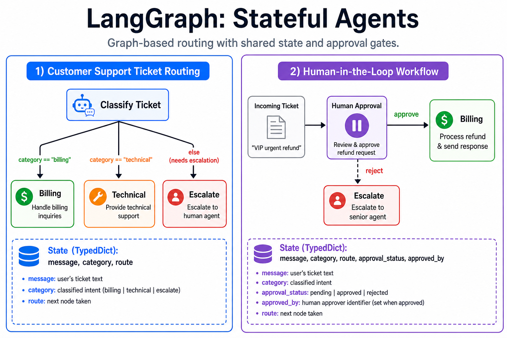
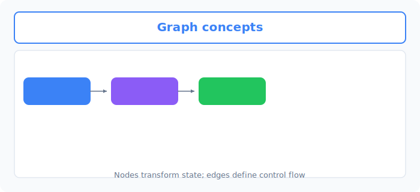
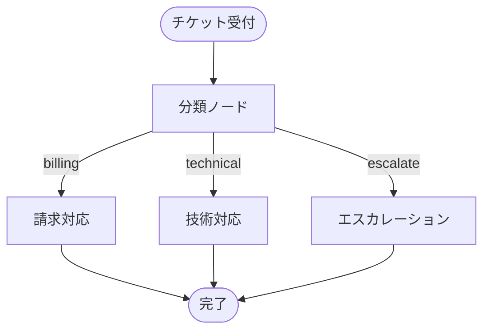
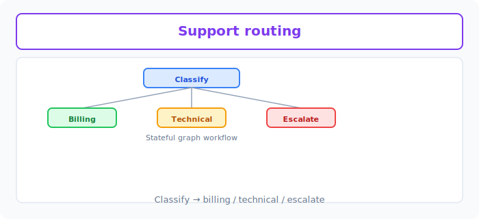

# Unit 32: LangGraph — グラフベースのステートフルエージェント

<p class="unit-hero">
  
</p>

Unit 31 では smolagents の **コード生成型エージェント（Code Agent）** を学びました。本ユニットでは、**グラフベースのワークフロー制御** という別のパラダイムを学びます。LangGraph は、エージェントの処理を「ノード」と「エッジ」で明示的に設計し、**共有ステート（State）** をノード間で受け渡しながら、条件分岐や人間の承認（Human-in-the-loop）を組み込めるフレームワークです。

---

## 1. LangGraph とステートフルワークフローの理解



### 1.1 なぜグラフなのか？

Unit 29 の ReAct は **While ループ内の暗黙的な制御フロー** でした。Unit 31 の smolagents は **LLM が書いたコードの実行** に特化しています。一方、業務システムでは次のような要件が頻出します。

- 「分類結果に応じて、処理経路を**明示的に分岐**したい」
- 「重要案件だけ**人間の承認**を挟みたい」
- 「途中状態を**永続化**し、後から再開したい」

LangGraph は、こうした要件を **有向グラフ（Directed Graph）** として設計します。

| 概念 | 役割 | 日常の例え |
| :--- | :--- | :--- |
| **State（ステート）** | ノード間で共有するデータ（辞書 / TypedDict） | カスタマーサポートの「チケット票」 |
| **Node（ノード）** | ステートを読み取り、更新する処理単位 | 「分類する」「請求担当へ渡す」 |
| **Edge（エッジ）** | 次に実行するノードを決める遷移 | 「請求系なら Billing ノードへ」 |

### 1.2 smolagents（Code Agent）との比較

| 評価軸 | smolagents (Code Agent) | LangGraph (Graph Workflow) |
| :--- | :--- | :--- |
| **制御の見え方** | LLM が生成した Python コードの中に埋もれる | グラフとして**可視化・監査しやすい** |
| **条件分岐** | コード内の if 文に依存 | **エッジ関数**で明示的に定義 |
| **Human-in-the-loop** | 実装は可能だが設計が散らばりやすい | **専用ノード**として組み込みやすい |
| **向いているタスク** | 計算・データ加工の一撃解決 | 部門振り分け、承認フロー、長寿命ワークフロー |

### 1.3 代表的なユースケース

* **カスタマーサポートの自動振り分け**: 問い合わせを billing / technical / escalate にルーティング
* **Human-in-the-loop**: VIP 顧客や高額案件のみ人間承認を必須化
* **マルチステップ業務フロー**: 検索 → 要約 → 承認 → 送信 を段階的に実行



---



## 2. 実装例 (Implementation Example)

ここでは **OpenAI API キー不要** のローカル完結シミュレーションで、LangGraph の設計思想（State / Node / 条件分岐）を再現します。キーワードベースの簡易分類器で、カスタマーサポートチケットを **classify ➔ billing / technical / escalate** に振り分けます。

```python
from typing import Literal, TypedDict


class TicketState(TypedDict):
    message: str
    category: str
    route: str
    response: str


def classify_node(state: TicketState) -> TicketState:
    """チケット本文からカテゴリを推定するノード"""
    text = state["message"].lower()
    if any(k in text for k in ("refund", "billing", "invoice", "請求", "返金")):
        state["category"] = "billing"
    elif any(k in text for k in ("error", "bug", "crash", "障害", "動かない")):
        state["category"] = "technical"
    else:
        state["category"] = "escalate"
    return state


def route_ticket(state: TicketState) -> Literal["billing", "technical", "escalate"]:
    """条件分岐エッジ: 次に実行するノード名を返す"""
    return state["category"]  # type: ignore[return-value]


def billing_node(state: TicketState) -> TicketState:
    state["route"] = "billing"
    state["response"] = "請求チームが24時間以内にご連絡します。"
    return state


def technical_node(state: TicketState) -> TicketState:
    state["route"] = "technical"
    state["response"] = "技術サポートがログを確認し、再現手順をお伺いします。"
    return state


def escalate_node(state: TicketState) -> TicketState:
    state["route"] = "escalate"
    state["response"] = "専任担当者が優先対応します。"
    return state


# --- グラフ実行（LangGraph 相当の手組みオーケストレータ） ---
NODE_MAP = {
    "billing": billing_node,
    "technical": technical_node,
    "escalate": escalate_node,
}


def run_support_graph(message: str) -> TicketState:
    state: TicketState = {
        "message": message,
        "category": "",
        "route": "",
        "response": "",
    }
    state = classify_node(state)
    next_node = route_ticket(state)
    state = NODE_MAP[next_node](state)
    return state


if __name__ == "__main__":
    samples = [
        "先月の請求書の金額がおかしいです。返金できますか？",
        "アプリが起動直後にクラッシュします。",
        "サービス全般について相談したいです。",
    ]
    for msg in samples:
        result = run_support_graph(msg)
        print(f"[{result['route']}] {result['response']}")
```

**実行結果のイメージ**

```text
[billing] 請求チームが24時間以内にご連絡します。
[technical] 技術サポートがログを確認し、再現手順をお伺いします。
[escalate] 専任担当者が優先対応します。
```

> [!TIP]
> 本番では `langgraph` パッケージの `StateGraph` を使い、上記のノードとエッジを宣言的に登録します。本 PoC では **制御フローの原理** を API キーなしで理解することに集中しています。

---

## 3. 実践 (Practice)

**【課題】** 上記の振り分けグラフに、次の **Human-in-the-loop** を追加してください。

1. チケット本文に `VIP` または `緊急` が含まれる場合、自動応答の前に **人間承認ノード** で処理を一時停止する
2. 承認が得られた場合のみ、元のルーティング（billing / technical / escalate）へ進む
3. 承認が拒否された場合は、「担当者が後日ご連絡します」と応答して終了する

**設計メモとしてコメントで書くこと**

- なぜ「暗黙の if 文」ではなく **グラフ上の専用ノード** として承認を切り出すと保守しやすいか
- smolagents の Code Agent ではなく LangGraph を選ぶ理由（本課題の文脈で）

---

## 4. 答え合わせ (Answer Key)

<details>
<summary>解答例を見る（クリックで展開）</summary>

```python
from typing import Literal, TypedDict


class TicketState(TypedDict):
    message: str
    category: str
    route: str
    needs_human: bool
    approved: bool | None
    response: str


def classify_node(state: TicketState) -> TicketState:
    text = state["message"].lower()
    if any(k in text for k in ("refund", "billing", "invoice", "請求", "返金")):
        state["category"] = "billing"
    elif any(k in text for k in ("error", "bug", "crash", "障害", "動かない")):
        state["category"] = "technical"
    else:
        state["category"] = "escalate"
    return state


def detect_human_gate(state: TicketState) -> TicketState:
    # 重要チケットは自動応答前に人間承認へ
    text = state["message"]
    state["needs_human"] = any(k in text for k in ("VIP", "緊急"))
    return state


def human_approval_node(state: TicketState) -> TicketState:
    # 実務では UI / Slack 承認に接続。ここではシミュレーション
    print(f"[HUMAN REVIEW] {state['message']}")
    answer = input("Approve? (y/n): ").strip().lower()
    state["approved"] = answer in ("y", "yes")
    if not state["approved"]:
        state["response"] = "担当者が後日ご連絡します。"
    return state


def billing_node(state: TicketState) -> TicketState:
    state["route"] = "billing"
    state["response"] = "請求チームが24時間以内にご連絡します。"
    return state


def technical_node(state: TicketState) -> TicketState:
    state["route"] = "technical"
    state["response"] = "技術サポートがログを確認し、再現手順をお伺いします。"
    return state


def escalate_node(state: TicketState) -> TicketState:
    state["route"] = "escalate"
    state["response"] = "専任担当者が優先対応します。"
    return state


NODE_MAP = {
    "billing": billing_node,
    "technical": technical_node,
    "escalate": escalate_node,
}


def after_classify(state: TicketState) -> Literal["human", "route"]:
    return "human" if state["needs_human"] else "route"


def after_human(state: TicketState) -> Literal["route", "done"]:
    return "route" if state.get("approved") else "done"


def run_support_graph_with_hitl(message: str) -> TicketState:
    state: TicketState = {
        "message": message,
        "category": "",
        "route": "",
        "needs_human": False,
        "approved": None,
        "response": "",
    }
    state = classify_node(state)
    state = detect_human_gate(state)

    if after_classify(state) == "human":
        state = human_approval_node(state)
        if after_human(state) == "done":
            return state

    next_node = state["category"]
    return NODE_MAP[next_node](state)


if __name__ == "__main__":
    result = run_support_graph_with_hitl("VIP顧客です。請求書の返金を緊急でお願いします。")
    print(result["response"])
```

### 💡 プロとしての設計判断

* **Human-in-the-loop は専用ノードに分離する**: 承認ロジックを各応答ノードに散らすと、監査ログや UI 連携が困難になる。グラフ上で `human_approval` を1箇所に置くと、本番の Slack 承認や管理画面へ差し替えやすい。
* **LangGraph を選ぶ理由**: 本課題は「計算一発」ではなく **部門振り分け + 承認ゲート** が主役。制御フローを明示的に可視化・変更できるグラフパラダイムが適している。

</details>
