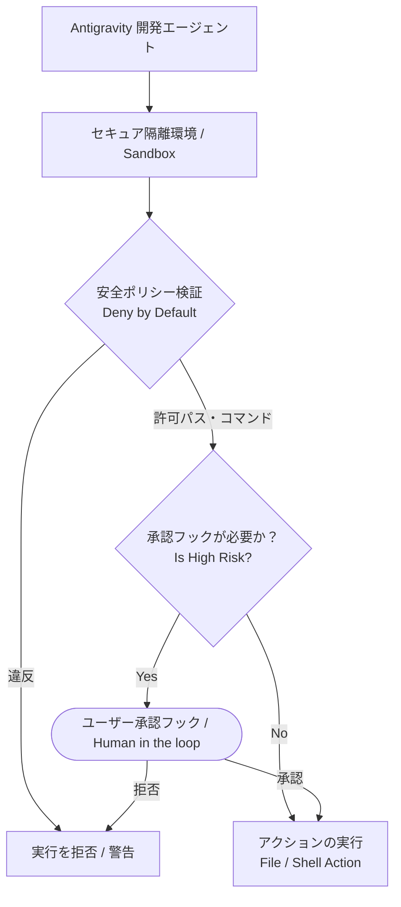

# Unit 33: Agent SDK: コーディング・自律開発

前ユニット（Unit 32）では、商用 Agent SDK を用いた **汎用・業務自動化エージェント**（受付、在庫照会、決済など）の構築を学びました。本ユニットでは、その延長として、**コーディング・自律開発に特化した Agent SDK** の活用を学びます。自律開発エージェントは業務自動化エージェントとは異なり、ファイルシステムやシェルに対する強力な操作権限を持つため、より厳格な安全設計が求められます。

ソフトウェア開発の自動化において、コードの生成や修正、コマンドの実行を自律的に行う **自律開発エージェント (SWE Agents / Coding Agents)** の技術は急速に進化しています。
しかし、システム（ファイルや端末）に対して破壊的・不可逆的な操作を行う権限を持つため、一般的な情報処理エージェントとは比較にならないほど **厳格な安全設計とサンドボックス分離** が要求されます。
本ユニットでは、自律開発エージェント特有のアーキテクチャ、安全ポリシー（Deny by Default）、および Human-in-the-loop (承認フック) の実装手法について学びます。

---

## 1. 説明フェーズ (Explanation)

### 1.1 自律コーディング・ソフトウェア開発エージェントの特異性
一般的な業務自動化エージェントが「メールの送信」や「カレンダーの予約」といった限定的なAPI連携を行うのに対し、自律開発エージェントは以下のような強力かつ広範なツールバインディングを持ちます。

- **ファイルシステム操作**: プロジェクトソースコードの読み込み、新規作成、上書き編集、削除。
- **シェル/ターミナル実行**: ビルドコマンドの実行、単体テストの実行、コンパイル、外部モジュールのインストール。
- **Linter/LSP (Language Server Protocol) 連携**: リアルタイムのシンタックスチェックと自動修正。

これらの操作は、一歩間違えれば「無限ループによるシステムリソースの枯渇」「重要なソースコードの誤消去」「意図しない悪意あるコマンドの実行」といった甚大な被害を引き起こすため、商用の開発用 Agent SDK には強力な保護機構がビルトインされています。

### 1.2 自律開発 Agent SDK の代表例

#### A. OpenAI Codex SDK (Legacy / Current Assistants)
初期の自律コーディングモデルである Codex から進化し、現在の Assistants API やインラインコーディングツールは、ユーザーのソースコード文脈を正確に理解して修正パッチを生成する機能に特化しています。

#### B. Google Antigravity SDK
Googleが開発する **Google Antigravity SDK (`google-antigravity`)** は、開発環境の安全性を極限まで高めるために設計された最先端の開発エージェント向けフレームワークです。
- **Deny by Default（デフォルト拒否）**: 明示的に許可された操作以外のすべてのアクションを自動的に拒否するポリシー設計。
- **Fine-Grained Sandbox**: エージェントの活動範囲を特定のプロジェクトディレクトリ（Workspace）に制限し、システム保護を行います。
- **インタラクティブ承認フック**: エージェントがファイルシステムに変更を加える、またはシェルコマンドを実行する直前に、ユーザー（人間）の明示的な承認を求めるライフサイクルフック。

### 1.3 開発エージェントにおける極めて重要な安全設計

自律開発エージェントを本番や実環境で運用する場合、以下の 3 つの安全レイヤーが必須となります。



#### テキストによるシステム構成の代替表現
1. **隔離環境 (Sandbox)**: エージェントは必ず Docker コンテナなどの隔離環境内で動作させ、ホストシステムへの直接アクセスを断ちます。
2. **Deny by Default (デフォルト拒否)**: 許可されたディレクトリパス・許可されたコマンドパターン以外は検証レイヤーで即座に遮断 (Block) します。
3. **Human-in-the-loop (承認フック)**: 許可範囲内であっても、高リスク操作（ファイルを書き換える、ビルドコマンドを実行するなど）は実行前に人間の承認を必要とします。

---

## 2. 実践 (Practice)

ここでは、Google Antigravity SDK の核心的な安全機能である **「Deny by Default安全ポリシー」** と **「Human-in-the-loop（承認フック）」** の動作をシミュレーションするための Python コードを実装します。
エージェントが特定のソースコードファイルを書き換えたり、テストコマンドを実行したりする際、システムが安全ポリシーを検証し、必要に応じて対話的な承認を求めるパイプラインを構築します。

### サンプルコード実装
以下のコードをコピーし、手元で実行して安全制御プロセスを確認してください。

```python
import os
import re
from typing import Dict, Any, List, Tuple, Callable

# ==========================================
# 1. 宣言的安全ポリシーの定義 (Deny by Default)
# ==========================================
class SafetyPolicy:
    def __init__(self, allowed_directory: str, allowed_commands: List[str]):
        # 絶対パス化して統一
        self.allowed_directory = os.path.abspath(allowed_directory)
        # 許可されたコマンドの正規表現リスト
        self.allowed_commands = allowed_commands

    def is_path_safe(self, target_path: str) -> bool:
        """指定されたファイルパスが許可ディレクトリ内にあるか検証 (Path Traversal 防御)"""
        abs_target = os.path.abspath(target_path)
        # 許可ディレクトリ配下で始まっているかをチェック
        return abs_target.startswith(self.allowed_directory)

    def is_command_safe(self, command: str) -> bool:
        """実行しようとしているシェルコマンドが許可パターンに合致するか検証"""
        for allowed_pattern in self.allowed_commands:
            if re.match(allowed_pattern, command):
                return True
        return False

# ==========================================
# 2. 模擬的な Google Antigravity Agent 環境
# ==========================================
class AntigravityAgentSandbox:
    def __init__(self, policy: SafetyPolicy):
        self.policy = policy
        # 承認用コールバックフック
        self.pre_execute_hook: Callable[[str, str], bool] = self.default_approval_prompt
        # 模擬ファイルシステム
        self.virtual_files: Dict[str, str] = {}

    @staticmethod
    def default_approval_prompt(action_type: str, detail: str) -> bool:
        """デフォルトのHuman-in-the-loop承認画面"""
        print(f"\n⚠️  [HUMAN-IN-THE-LOOP] 承認要求:")
        print(f"   アクション: {action_type}")
        print(f"   詳細: {detail}")
        user_choice = input("   このアクションを承認しますか？ (y/n): ").strip().lower()
        return user_choice == 'y'

    def write_file(self, file_path: str, content: str) -> Tuple[bool, str]:
        """安全ポリシーに従ってファイルを書き込む"""
        # 1. デフォルト拒否 (Deny by Default) のパスチェック
        if not self.policy.is_path_safe(file_path):
            return False, f"[SECURITY ERROR] 許可されていないパスへの書き込みは拒否されました: {file_path}"
        
        # 2. 承認フック (Human-in-the-loop)
        # 新規作成か上書きかにかかわらず、ファイル書き込みは高リスクとして承認を求める
        is_overwrite = file_path in self.virtual_files
        action_name = "ファイル上書き" if is_overwrite else "新規ファイル作成"
        
        if self.pre_execute_hook(action_name, f"パス: {file_path}"):
            self.virtual_files[file_path] = content
            return True, f"ファイルの書き込みに成功しました: {file_path}"
        else:
            return False, "[USER REJECTED] ユーザーによって書き込みが拒否されました。"

    def execute_command(self, command: str) -> Tuple[bool, str]:
        """安全ポリシーに従ってシェルコマンドを実行する"""
        # 1. デフォルト拒否 (Deny by Default) のコマンドチェック
        if not self.policy.is_command_safe(command):
            return False, f"[SECURITY ERROR] 実行不可能なコマンドまたは危険なコマンドです: {command}"
        
        # 2. 承認フック (Human-in-the-loop)
        # コマンド実行は常に承認を必要とする設計にする
        if self.pre_execute_hook("シェルコマンド実行", f"コマンド: {command}"):
            # 実際の実行を模した処理
            print(f"[Sandbox Console] Running: {command} ...")
            if "test" in command:
                return True, "模擬テスト実行結果: 3/3 テストが正常に通過しました。"
            return True, "コマンド実行成功。"
        else:
            return False, "[USER REJECTED] ユーザーによってコマンドの実行が拒否されました。"

# ==========================================
# 3. テストシミュレーション
# ==========================================
if __name__ == "__main__":
    # 安全ポリシーの設定
    # - ワークスペース: 現在の作業用ダミーディレクトリ内のみ許可
    # - コマンド: pytest または pnpm test に類するもののみ許可 (rm や sudo は自動拒否)
    my_workspace = "./sandbox_workspace"
    my_policy = SafetyPolicy(
        allowed_directory=my_workspace,
        allowed_commands=[
            r"^pytest\s+[\w\.\-/]+$",        # pytest [ファイルパス]
            r"^python\s+-m\s+unittest\s+[\w\.]+$" # python -m unittest [モジュール名]
        ]
    )

    # サンドボックス環境の構築
    sandbox = AntigravityAgentSandbox(my_policy)

    # ------------------------------------------
    # シナリオ A: 許可されたパスへのファイル書き込み (承認 -> 成功)
    # ------------------------------------------
    print("\n=== シナリオ A: 安全なパスへの書き込み ===")
    safe_file_path = os.path.join(my_workspace, "app.py")
    success, msg = sandbox.write_file(safe_file_path, "def add(a, b): return a + b")
    print(f"結果: {success} | メッセージ: {msg}")

    # ------------------------------------------
    # シナリオ B: パス外への書き込み (Deny by Default で即エラー)
    # ------------------------------------------
    print("\n=== シナリオ B: システム領域への書き込み要求 ===")
    dangerous_file_path = "/etc/hosts" # 外部の危険なパス
    success, msg = sandbox.write_file(dangerous_file_path, "127.0.0.1 dangerous.site")
    print(f"結果: {success} | メッセージ: {msg}")

    # ------------------------------------------
    # シナリオ C: 許可されたテストコマンドの実行 (承認 -> 成功)
    # ------------------------------------------
    print("\n=== シナリオ C: 許可されたコマンドの実行 ===")
    success, msg = sandbox.execute_command("pytest test_app.py")
    print(f"結果: {success} | メッセージ: {msg}")

    # ------------------------------------------
    # シナリオ D: 危険なコマンドの実行要求 (Deny by Default で即エラー)
    # ------------------------------------------
    print("\n=== シナリオ D: 危険なコマンドの実行 ===")
    success, msg = sandbox.execute_command("rm -rf /") # 破壊的コマンド
    print(f"結果: {success} | メッセージ: {msg}")
```

---

## 3. 独力で実装（課題: Assignment）

### 課題要件
上記の `AntigravityAgentSandbox` システムを元に、さらに高度な自律開発タスクを行う「自律エージェント」自身を実装してください。

1. **「自律デバッガー・エージェント (DebuggerAgent)」** クラスを実装してください。
2. このエージェントは、以下の複数ステップの自律ワークフローを実行します。
   - **ステップ 1 (ファイル読み込みと解析)**: ワークスペース内の Python コード `app.py` を読み込みます（擬似的な文字列ロードで可）。
   - **ステップ 2 (コードのデバッグ修正)**: コードに明らかなエラー（例: 閉じ括弧の不足や `ZeroDivisionError` のリスク）を発見した場合、修正コードを生成し、`sandbox.write_file` を用いて `app.py` に書き込みます。
   - **ステップ 3 (検証テスト実行)**: 修正が正しいことを確認するため、`sandbox.execute_command` を呼び出してテストコマンド `pytest test_app.py` を実行します。
3. エージェントの自律的な処理中に、**「ファイル書き込み」や「コマンド実行」が安全ポリシーによって妨げられずに、かつユーザーの承認フックを経て安全に完遂する一連の流れ**をコンソールに出力して検証してください。

---

## 4. 答え合わせ (Answer Key)

<details>
<summary>解答例を見る（クリックで展開）</summary>

以下は、自律デバッガー・エージェントを実装し、安全ポリシーの範囲内で「ソース修正 ──> 書き込み ──> テスト実行」までを安全にシミュレーション駆動する完全な解答コード例です。

```python
# ==========================================
# 課題解答: 自律デバッガー・エージェントの実装
# ==========================================
class DebuggerAgent:
    def __init__(self, sandbox: AntigravityAgentSandbox):
        self.sandbox = sandbox

    def run_auto_debug(self, workspace_dir: str):
        print(f"\n[DebuggerAgent] 🔧 自律デバッグタスクを開始します。")
        
        target_file = os.path.join(workspace_dir, "app.py")
        
        # 1. 模擬コードの解析 (バグがあるコード)
        broken_code = "def divide(a, b):\n    return a / b  # バグ: b=0 の対策がない"
        print(f"[DebuggerAgent] 対象ファイルを解析中: {target_file}")
        
        # 2. 修正コードの生成
        fixed_code = "def divide(a, b):\n    if b == 0:\n        return 0\n    return a / b"
        print(f"[DebuggerAgent] バグを検知しました。修正案を適用します。")
        
        # サンドボックス経由で書き込みを実行 (ユーザー承認が必要)
        success, msg = self.sandbox.write_file(target_file, fixed_code)
        if not success:
            print(f"[DebuggerAgent] ❌ 修正ファイルの書き込みに失敗: {msg}")
            return
        
        print(f"[DebuggerAgent] ✅ {msg}")

        # 3. テストコマンドの実行による検証 (ユーザー承認が必要)
        test_command = "pytest test_app.py"
        print(f"[DebuggerAgent] テストによる検証を実行します: {test_command}")
        
        success, test_msg = self.sandbox.execute_command(test_command)
        if not success:
            print(f"[DebuggerAgent] ❌ テスト実行が拒否または失敗: {test_msg}")
            return
            
        print(f"[DebuggerAgent] 🎉 デバッグ完了！: {test_msg}")

# ==========================================
# 自律エージェントの安全運転テスト
# ==========================================
if __name__ == "__main__":
    # ポリシーのセットアップ
    workspace = "./sandbox_workspace"
    policy = SafetyPolicy(
        allowed_directory=workspace,
        allowed_commands=[r"^pytest\s+[\w\.\-/]+$"]
    )
    
    # 隔離サンドボックス
    sandbox_env = AntigravityAgentSandbox(policy)
    
    # デバッグエージェントの起動
    agent = DebuggerAgent(sandbox_env)
    
    # タスク実行
    agent.run_auto_debug(workspace)
```
</details>
