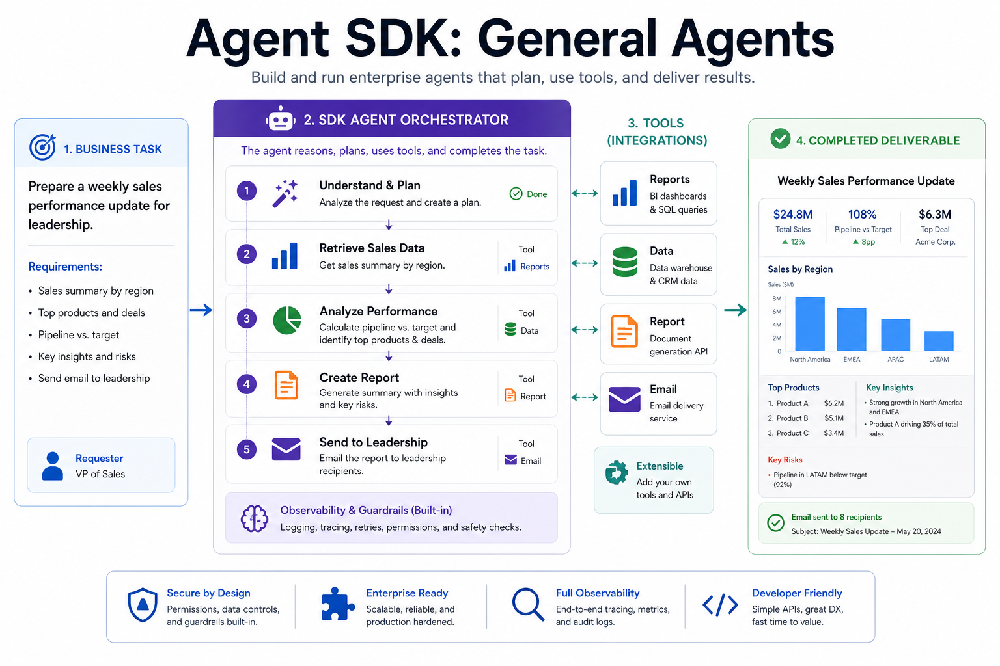
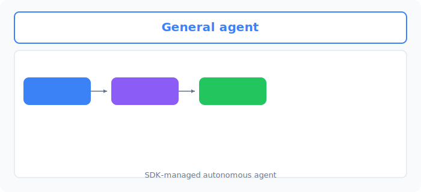
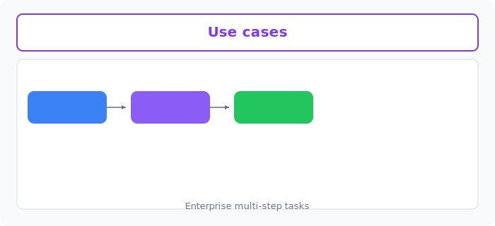
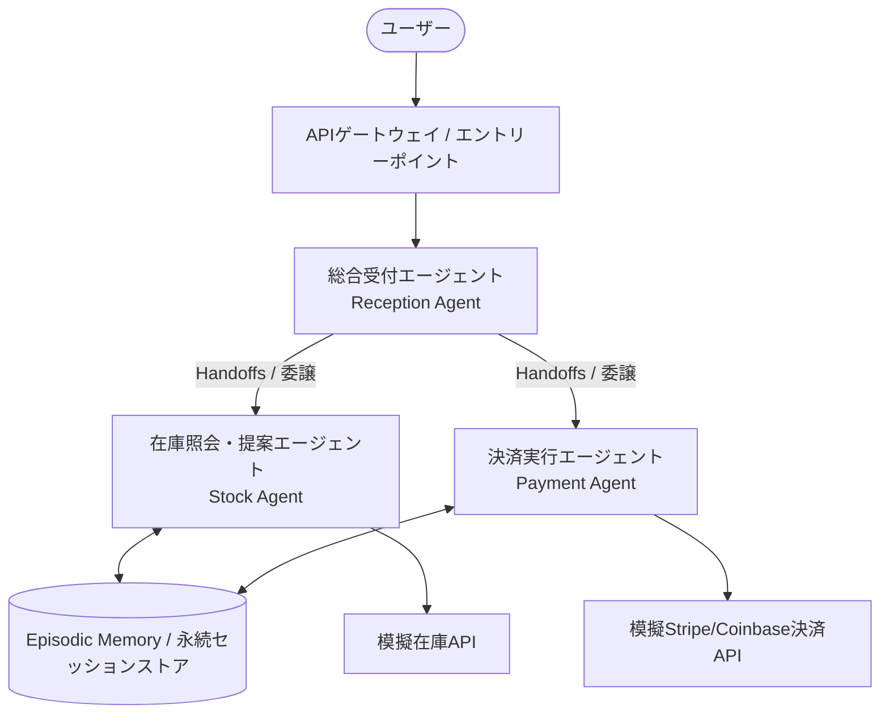

# Unit 33: Agent SDK: 汎用・業務自動化

<p class="unit-hero">
  
</p>

Unit 29〜31 では、スクラッチでの ReAct 実装や MCP、smolagents といった **OSSベースのアプローチ** を学びました。Unit 32 では **LangGraph によるグラフベースのステートフルワークフロー** を学びました。本ユニット（Unit 33）では、エンタープライズ環境でスケーラビリティ・セキュリティ・状態管理をマネージドに提供する **商用 Agent SDK** によるエージェント構築を学びます。

商用のAIシステム構築において、OSSのフレームワーク（LangGraphやsmolagentsなど）と並び、主要なクラウド/AIベンダーが提供するマネージドな **商用 Agent SDK** も選択肢になります。
本ユニットでは、商用Agent SDKに共通して見られるアーキテクチャ上の考え方、永続状態管理、ビジネス機能との統合を学びます。ベンダーごとにAPI、提供範囲、料金、廃止予定、セキュリティ責任分界が異なるため、本文のコードは特定SDKの完全な実装ではなく、概念を確認するシミュレーションです。利用時は対象ベンダーの最新ドキュメントで確認してください。

---

## 1. 汎用エージェント SDK の理解

### 1.1 マネージド Agent SDK の台頭と OSS との違い
OSSのエージェントフレームワークは高い柔軟性を持ち、ローカル環境での迅速なプロトタイピングに適していますが、本番環境へのデプロイにおいては、スケーラビリティ、セキュリティ、および状態管理の永続化を自前で設計・運用する必要があります。
これに対し、AIベンダーが提供するマネージドAgent基盤には、以下のような機能が提供される場合があります。すべての製品が同じ機能や同じ責任範囲を持つわけではありません。

1. **インフラのマネージド化** : エージェントのホスティングやスケーリングを一部委任できる場合がある。
2. **状態永続化** : 会話セッションやコンテキストの保存・復元機能が提供される場合がある。
3. **安全機能との統合** : ガードレールや監査機能を組み合わせやすい場合がある。


下図は、 **Define agent → Add tools → Run task** という汎用エージェントの流れです。



### 1.2 主要ベンダーの Agent SDK アーキテクチャ

#### A. OpenAI Agents SDK
OpenAI は、エージェント開発向けに2つの異なるアプローチを提供してきました。
- **Agents SDK（オープンソースの Python ライブラリ）** : アプリケーション側でエージェントを組み立てるための SDK。目玉機能が **エージェント間委譲 (Handoffs)** で、あるエージェントから別の特化型エージェントへ、会話のコンテキストを維持したまま制御を動的に引き渡せます。
- **Assistants API（サーバー側の状態管理）** : 会話履歴（Thread）を OpenAI のサーバー側に自動保存し、開発者はスレッドIDを指定するだけで以前の状態から会話を再開できる API。「状態管理をクラウド側に移す」流れを先導しましたが、現在は後継の **Responses API** への移行が進められており、Assistants API 自体は廃止（deprecation）が予告されています。

#### B. AWS Bedrock Agents / AgentCore SDK
AWSの **Bedrock Agents** および **AgentCore SDK** は、AWSのエンタープライズ向けインフラと深く統合されたエージェント開発基盤です。
- **Episodic Memory** : エージェントが過去のセッションを記憶し、長期的なコンテキストに基づいた意思決定を支援する長期記憶メカニズム。
- **APIゲートウェイ連携** : OpenAPI（Swagger）スキーマを登録するだけで、エージェントがAWS Lambda経由で社内データベースやAPI（例: 注文管理システム、ERP）と直接連携する仕組みを自動生成します。

#### C. Meta Llama Stack
Metaが提唱する **Llama Stack** は、特定のクラウドベンダーに依存しない「ポータビリティ（アーキテクチャ主権）」を重視した標準化API群です。
- **Llama Guard 3** : 入出力コンテンツの安全性を多層的に評価・監視するセキュリティモデルがビルトインされています。
- **Agents API** : Llama Stack が標準化するエージェント実行 API。ローカル環境からマルチクラウドまで、同一の標準APIを用いてエージェントをシームレスに移植可能にします。

### 1.3 ビジネス連携機能と決済（Payments）の統合
業務自動化エージェントは、情報の検索や要約に留まらず、 **「自律的なアクションの完遂」** を期待されます。
これには、 **Episodic Memory（長期文脈記憶）** を用いて「ユーザーが過去にどの商品を好んだか」を記憶しつつ、 **Stripe や Coinbase などの外部決済API** と連携し、予約や支払いを自動で安全に実行するアーキテクチャが含まれます。各ベンダーもエージェント向けの決済・業務システム統合の機能を拡充しつつあり、この領域は今後さらに発展が見込まれます。

### 1.4 アーキテクチャ選定基準
| 評価軸 | OSSフレームワーク (LangGraph 等) | 商用マネージド SDK (Bedrock/OpenAI 等) |
|---|---|---|
| **インフラ管理** | 自前でのホスティング・スケーリングが必要 | 完全サーバーレス、自動スケーリング |
| **セキュリティ・認証** | IAMや認証層を自前で実装・結合 | AWS IAMやベンダーAPIキーによる強固な統合 |
| **移植性・ポータビリティ** | 極めて高い（任意のコンテナ環境で動作） | ベンダーロックインのリスクあり（Llama Stack は例外） |
| **長期記憶 (Memory)** | 自前でデータベース（Redis/PostgreSQL）を構築 | SDK側でフルマネージド提供 |

---


下図は、レポート生成・データ処理・自動化など **SDK エージェントのユースケース** です。



## 2. 実装例 (Implementation Example)

ここでは、OpenAI AgentsやAWS Bedrock AgentCoreなどで検討される **「セッション状態とHandoffs（役割委譲）」** の考え方を理解するため、Pythonによるシミュレーション実装を行います。実際のSDKが提供する永続化、認証、監査、スケーリングを再現するものではありません。
総合窓口となるエージェントがユーザーを認識し、目的のタスク（在庫検索、注文と支払い）に応じて専門エージェントへ状態を引き継ぎながら、外部APIを模した決済処理までを自律的に完遂するパイプラインを構築します。

### アーキテクチャ視覚化



#### テキストによるシステム構成の代替表現
1. **ユーザー要求** : APIエントリーポイントに到達。
2. **Reception Agent** : セッションIDに基づいてユーザーの「長期記憶（Episodic Memory）」をロードし、要求を解釈。
3. **Handoffs (委譲)** : 在庫確認なら「Stock Agent」、購入・支払いなら「Payment Agent」へ会話コンテキストと状態を保持したまま制御を渡す。
4. **外部API実行** : 専門エージェントが模擬在庫APIや模擬Stripe決済APIを呼び出し、結果を永続ストアに反映して応答。

### サンプルコード実装
以下のコードをコピーし、手元で実行してエージェント間の協調動作を確認してください。

```python
import json
import uuid
from typing import Dict, Any, List, Tuple

# ==========================================
# 1. 永続セッションストア (Episodic Memory のシミュレーション)
# ==========================================
class EpisodicMemoryStore:
    def __init__(self):
        # メモリ上の擬似データベース
        self.db: Dict[str, Dict[str, Any]] = {}

    def get_session(self, session_id: str) -> Dict[str, Any]:
        if session_id not in self.db:
            # 初期状態システム
            self.db[session_id] = {
                "user_name": "ゲスト",
                "preferences": [],
                "cart": [],
                "purchase_history": [],
                "current_agent": "Reception"
            }
        return self.db[session_id]

    def save_session(self, session_id: str, data: Dict[str, Any]):
        self.db[session_id] = data
        print(f"[Memory Store] セッション {session_id} の状態を永続化しました。")

# ==========================================
# 2. 外部ビジネスAPI (模擬在庫 & 決済)
# ==========================================
class MockBusinessAPI:
    @staticmethod
    def check_stock(item_name: str) -> Dict[str, Any]:
        # 模擬的な在庫照会データベース
        catalog = {
            "laptop": {"price": 1200, "stock": 5},
            "smartphone": {"price": 800, "stock": 12},
            "headphones": {"price": 150, "stock": 0}  # 在庫切れ
        }
        return catalog.get(item_name.lower(), {"price": 0, "stock": 0})

    @staticmethod
    def execute_payment(session_id: str, amount: int, item: str) -> Tuple[bool, str]:
        # StripeやCoinbase Payments APIのシミュレーション
        if amount <= 0:
            return False, "決済金額が無効です。"
        tx_id = f"tx_{uuid.uuid4().hex[:8]}"
        return True, f"決済成功 (Stripe ID: {tx_id}) - 商品: {item}, 金額: ${amount}"

# ==========================================
# 3. エージェント定義 & Handoffs アーキテクチャ
# ==========================================
class Agent:
    def __init__(self, name: str):
        self.name = name

    def process(self, session_id: str, user_input: str, session_data: Dict[str, Any]) -> Tuple[str, Dict[str, Any]]:
        raise NotImplementedError

# 総合受付エージェント
class ReceptionAgent(Agent):
    def __init__(self):
        super().__init__("Reception")

    def process(self, session_id: str, user_input: str, session_data: Dict[str, Any]) -> Tuple[str, Dict[str, Any]]:
        print(f"\n[{self.name} Agent] ユーザー入力を解析中: '{user_input}'")
        
        # ユーザー名の自己紹介があれば記憶に保存
        if "私の名前は" in user_input:
            name = user_input.split("私の名前は")[-1].replace("です", "").strip()
            session_data["user_name"] = name
            return f"はじめまして、{name}様。ご用件を伺います（在庫検索、または購入決済）。", session_data
        
        # 意図解析 (在庫検索)
        if "在庫" in user_input or "検索" in user_input or "ある？" in user_input:
            print(f"[{self.name} Agent] ──> 在庫照会エージェントへ制御を委譲 (Handoff)")
            session_data["current_agent"] = "Stock"
            return "在庫照会エージェントへお繋ぎします。", session_data

        # 意図解析 (決済購入)
        if "買う" in user_input or "購入" in user_input or "決済" in user_input:
            print(f"[{self.name} Agent] ──> 決済エージェントへ制御を委譲 (Handoff)")
            session_data["current_agent"] = "Payment"
            return "決済エージェントへお繋ぎします。", session_data

        return f"こんにちは、{session_data['user_name']}様。在庫検索、または商品の購入決済についてサポートできます。どちらをご希望ですか？", session_data

# 在庫検索専門エージェント
class StockAgent(Agent):
    def __init__(self):
        super().__init__("Stock")

    def process(self, session_id: str, user_input: str, session_data: Dict[str, Any]) -> Tuple[str, Dict[str, Any]]:
        print(f"\n[{self.name} Agent] 在庫状況と価格を確認します...")
        
        # キーワードから商品名を抽出する簡易ロジック
        target_item = None
        for item in ["laptop", "smartphone", "headphones"]:
            if item in user_input.lower():
                target_item = item
                break
        
        if not target_item:
            return "どの商品の在庫をお探しですか？ (例: laptop, smartphone, headphones)", session_data
        
        # 外部APIの呼び出し
        result = MockBusinessAPI.check_stock(target_item)
        if result["stock"] > 0:
            # カートに自動保存（Episodic Memoryへの書き込み）
            session_data["cart"].append({"item": target_item, "price": result["price"]})
            # 好み情報への学習保存
            if target_item not in session_data["preferences"]:
                session_data["preferences"].append(target_item)
                
            # 自動的に受付エージェントに戻す (Implicit Handoff)
            session_data["current_agent"] = "Reception"
            return (
                f"{session_data['user_name']}様、{target_item}の在庫はあります！価格は ${result['price']} です。\n"
                f"商品をカートに追加しました。購入に進みますか？", 
                session_data
            )
        else:
            session_data["current_agent"] = "Reception"
            return f"申し訳ありません、{target_item}は現在在庫切れとなっております。", session_data

# 決済・支払い専門エージェント
class PaymentAgent(Agent):
    def __init__(self):
        super().__init__("Payment")

    def process(self, session_id: str, user_input: str, session_data: Dict[str, Any]) -> Tuple[str, Dict[str, Any]]:
        print(f"\n[{self.name} Agent] カートと支払い情報を検証中...")
        
        cart = session_data.get("cart", [])
        if not cart:
            session_data["current_agent"] = "Reception"
            return "カートが空です。まずは在庫検索をして商品を追加してください。", session_data
        
        # 最新のカート内商品情報を取得
        target_purchase = cart[-1]
        item_name = target_purchase["item"]
        price = target_purchase["price"]
        
        # 決済処理の実行 (外部Stripe等とのセキュア連携)
        success, message = MockBusinessAPI.execute_payment(session_id, price, item_name)
        
        if success:
            # 購入履歴の更新
            session_data["purchase_history"].append(item_name)
            # カートのクリア
            session_data["cart"] = []
            
            # 受付に戻す
            session_data["current_agent"] = "Reception"
            return f"決済が成功しました！\n詳細: {message}\nまた何かお手伝いできることはありますか？", session_data
        else:
            return f"決済エラーが発生しました: {message}", session_data

# ==========================================
# 4. エージェント・オーケストレーション実行エンジン
# ==========================================
class AgentOrchestrator:
    def __init__(self):
        self.memory = EpisodicMemoryStore()
        self.agents: Dict[str, Agent] = {
            "Reception": ReceptionAgent(),
            "Stock": StockAgent(),
            "Payment": PaymentAgent()
        }

    def handle_request(self, session_id: str, user_input: str) -> str:
        # 1. 永続ストアからセッション状態をロード
        session_data = self.memory.get_session(session_id)
        
        # 2. 現在アクティブなエージェントを特定
        active_agent_name = session_data.get("current_agent", "Reception")
        agent = self.agents[active_agent_name]
        
        # 3. エージェントによるビジネスロジック処理
        response, updated_session_data = agent.process(session_id, user_input, session_data)
        
        # 4. 委譲(Handoff)が発生した場合、委譲先エージェントが同一ターン内で続けて応答する
        # 「お繋ぎします」で会話を切ってユーザーに再入力させるのではなく、
        # 委譲先の応答までを1回の応答にまとめて返すのが実際のHandoffsの挙動に近い設計
        next_agent_name = updated_session_data.get("current_agent", "Reception")
        if next_agent_name != active_agent_name and next_agent_name in self.agents:
            delegated_agent = self.agents[next_agent_name]
            delegated_response, updated_session_data = delegated_agent.process(
                session_id, user_input, updated_session_data
            )
            response = f"{response}\n{delegated_response}"
            
        # 5. 更新したセッション状態を永続ストアへ保存
        self.memory.save_session(session_id, updated_session_data)
        
        return response

# ==========================================
# 5. シミュレーション実行テスト
# ==========================================
if __name__ == "__main__":
    orchestrator = AgentOrchestrator()
    my_session = "session_user_99"
    
    # ターン 1: 自己紹介と記憶のチェック
    print("\n=== TURN 1 ===")
    res1 = orchestrator.handle_request(my_session, "私の名前はアリスです。")
    print(f"Agent -> {res1}")
    
    # ターン 2: 在庫検索 (Handoffが同一ターン内で起き、在庫エージェントが応答してReceptionに戻る)
    print("\n=== TURN 2 ===")
    res2 = orchestrator.handle_request(my_session, "laptop の在庫を検索してほしい")
    print(f"Agent -> {res2}")
    
    # ターン 3: 購入の要望 (Paymentエージェントへ同一ターンで遷移して決済)
    print("\n=== TURN 3 ===")
    res3 = orchestrator.handle_request(my_session, "カートの商品を決済してください。")
    print(f"Agent -> {res3}")
```

---

## 3. 実践 (Practice)

### 課題要件
上記の協調エージェント・シミュレーション基盤をベースに、より高度な顧客サービス要件を満たすエージェントを追加拡張してください。

1. **「割引提案エージェント (DiscountAgent)」** を新しく定義してください。
2. ユーザーが「割引して」「安くならない？」などの言葉を発した際、`ReceptionAgent` から `DiscountAgent` へ制御を委譲してください。
3. `DiscountAgent` は、`EpisodicMemoryStore` からユーザーの **購入履歴 (`purchase_history`)** を参照してください。
   - もしユーザーが過去に **1回以上決済を完了させている（リピーター）** のであれば、カート内の最後の商品に対して「10% のリピーター割引」を適用し、カート情報を書き換えてください。
   - 初回ユーザー（購入履歴が空）であれば、「新規登録クーポン」として一律 $10 の割引を適用してください。
4. 割引の計算・適用を完了したら、自動的に制御を `ReceptionAgent` に戻し、ユーザーに割引後の価格を提示して購入へと促してください。

---

## 4. 答え合わせ (Answer Key)

<details>
<summary>解答例を見る（クリックで展開）</summary>

以下は、`DiscountAgent` の定義、`ReceptionAgent` への分岐追加、`AgentOrchestrator` への登録、そして実行例（入出力のデモ）までを含めた Python 実装例です。実装例のサンプルコードの後ろに追記して実行できます。（追記する際は、実装例側の `if __name__ == "__main__":` ブロックを削除するかコメントアウトしてください。残したままだと2つの実行ブロックが両方動いてしまいます。）

```python
# ==========================================
# 課題解答 1: 割引エージェントの定義
# ==========================================
class DiscountAgent(Agent):
    def __init__(self):
        super().__init__("Discount")

    def process(self, session_id: str, user_input: str, session_data: Dict[str, Any]) -> Tuple[str, Dict[str, Any]]:
        print(f"\n[{self.name} Agent] 割引の適用資格を審査中...")
        
        cart = session_data.get("cart", [])
        if not cart:
            session_data["current_agent"] = "Reception"
            return "カートが空のため、割引を適用できません。まずは商品をカートに追加してください。", session_data
        
        # 割引対象となる最新の商品
        target_purchase = cart[-1]
        original_price = target_purchase["price"]
        item_name = target_purchase["item"]
        
        # ユーザー履歴の確認 (リピーター判定)
        purchase_history = session_data.get("purchase_history", [])
        
        if len(purchase_history) >= 1:
            # リピーター特典: 10% OFF
            discounted_price = int(original_price * 0.9)
            discount_type = "リピーター特別10%割引"
        else:
            # 初回特典: $10 OFF (マイナスにならないよう配慮)
            discounted_price = max(0, original_price - 10)
            discount_type = "新規登録記念 $10 割引"
        
        # カートデータの更新 (Episodic Memoryへの書き換え)
        cart[-1]["price"] = discounted_price
        session_data["cart"] = cart
        
        # 制御を受付エージェントへ戻す
        session_data["current_agent"] = "Reception"
        
        return (
            f"おめでとうございます！ {discount_type}が適用されました。\n"
            f"商品: {item_name}\n"
            f"価格: ${original_price} ──> ${discounted_price}\n"
            f"このまま購入に進みますか？ (はい/いいえ)", 
            session_data
        )

# ==========================================
# 課題解答 2: ReceptionAgent への割引分岐の追加
# ==========================================
class ExtendedReceptionAgent(ReceptionAgent):
    def process(self, session_id: str, user_input: str, session_data: Dict[str, Any]) -> Tuple[str, Dict[str, Any]]:
        # 割引要求を最優先で検知し、DiscountAgent へ制御を委譲 (Handoff)
        if "割引" in user_input or "安く" in user_input:
            print(f"[{self.name} Agent] ──> 割引提案エージェントへ制御を委譲 (Handoff)")
            session_data["current_agent"] = "Discount"
            return "割引の確認処理へお繋ぎします。", session_data
        # それ以外（自己紹介・在庫検索・決済）は既存の分岐をそのまま利用
        return super().process(session_id, user_input, session_data)

# ==========================================
# 課題解答 3: AgentOrchestrator への登録
# ==========================================
orchestrator = AgentOrchestrator()
orchestrator.agents["Reception"] = ExtendedReceptionAgent()  # 受付を拡張版に差し替え
orchestrator.agents["Discount"] = DiscountAgent()            # 割引エージェントを新規登録

# ==========================================
# 課題解答 4: 実行例（入出力のデモ）
# ==========================================
if __name__ == "__main__":
    session_id = "session_bob_01"
    
    # 事前状態のセットアップ (カートに laptop $1200 を追加済み、かつ過去の購入履歴に smartphone あり = リピーター)
    session = orchestrator.memory.get_session(session_id)
    session["user_name"] = "ボブ"
    session["cart"].append({"item": "laptop", "price": 1200})
    session["purchase_history"].append("smartphone")
    orchestrator.memory.save_session(session_id, session)
    
    # ターン 1: 割引要求 (Reception ──> Discount へ Handoff し、同一ターンで割引結果まで応答)
    print("\n=== TURN 1: 割引要求 ===")
    res1 = orchestrator.handle_request(session_id, "この laptop、安くならない？")
    print(f"Agent -> {res1}")
    
    # ターン 2: 割引後の価格で決済 (Reception ──> Payment へ Handoff)
    print("\n=== TURN 2: 決済 ===")
    res2 = orchestrator.handle_request(session_id, "カートの商品を購入・決済してください。")
    print(f"Agent -> {res2}")
```

実行すると、リピーター（購入履歴あり）のボブに対して次のような入出力が得られます。

```text
=== TURN 1: 割引要求 ===
[Reception Agent] ──> 割引提案エージェントへ制御を委譲 (Handoff)

[Discount Agent] 割引の適用資格を審査中...
[Memory Store] セッション session_bob_01 の状態を永続化しました。
Agent -> 割引の確認処理へお繋ぎします。
おめでとうございます！ リピーター特別10%割引が適用されました。
商品: laptop
価格: $1200 ──> $1080
このまま購入に進みますか？ (はい/いいえ)

=== TURN 2: 決済 ===
[Reception Agent] ──> 決済エージェントへ制御を委譲 (Handoff)

[Payment Agent] カートと支払い情報を検証中...
[Memory Store] セッション session_bob_01 の状態を永続化しました。
Agent -> 決済エージェントへお繋ぎします。
決済が成功しました！
詳細: 決済成功 (Stripe ID: tx_xxxxxxxx) - 商品: laptop, 金額: $1080
また何かお手伝いできることはありますか？
```

ポイントは、オーケストレーターの同一ターン Handoff 機構により、「お繋ぎします」の直後に委譲先エージェントの応答（割引結果や決済結果）まで1回の応答として返っていることです。
</details>
