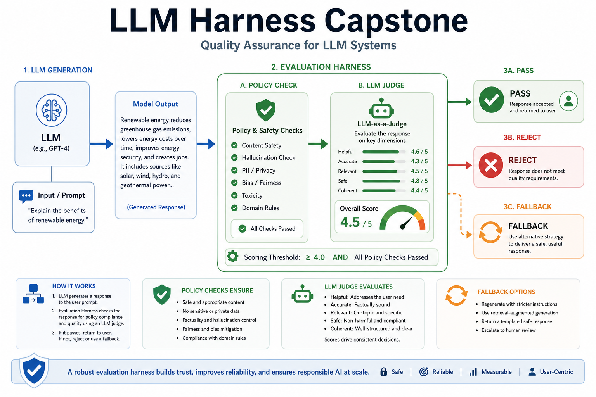
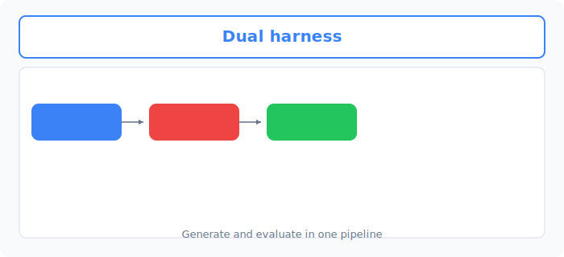
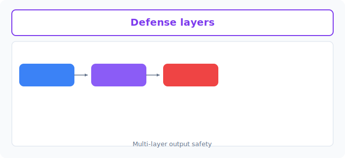

# Unit 35: LLM自動評価・防御とエージェント総合演習 (Capstone)

<p class="unit-hero">
  
</p>

## 1. ハーネスエンジニアリング（LLM自動評価）の理解




第4章（Unit 22〜33）において、LLMのAPI利用、ゼロからのRAG（検索拡張生成）構築、LangChainの基礎、プロンプトの連結（Chaining）、 Web UIチャットボット、および自律動作する AIエージェントの構築までを網羅的に学習してきました。

この最初の総合演習ユニット（Unit 35）では、これらすべての集大成として、エンタープライズなAIシステム開発で最も重要とされる **「ハーネスエンジニアリング（Harness Engineering / LLM評価ハーネス）」** を学び、構築します。

### ハーネスエンジニアリングとは？
従来のソフトウェア開発では、テストデータ（入力）に対する期待値（出力）が1文字でも異なればテスト失敗とする「決定論的なテスト」が主流でした。しかし、出力が毎回わずかに揺れるLLMアプリケーションでは、その手法は通用しません。

そこで登場するのが、プロンプトの調整やRAGの変更が「本当に精度向上に寄与したか（あるいは改悪＝デグレーションしていないか）」を自動的・定量的に測定するための**自動評価システム（評価ハーネス）**です。

**💡 日常の例え：特製ブレンドコーヒーの自動成分品質検査器**
* **通常のRAG/Agent**: 「今日の豆でコーヒーを淹れてみた（動いた！）」と喜ぶ段階。
* **ハーネスエンジニアリング**: 淹れたコーヒーの糖度、酸度、苦味を「センサー（評価ハーネス）」で定量的に測り、「先週のレシピと比べて、苦味が10%減少し、酸味がバランス良く向上した」とグラフで可視化して、味のブレ（デグレーション）を完全にコントロールできる自動測定ラボを構築すること。

| 評価の次元 | 意味 | 測定方法 (LLM-as-a-Judge) |
| :--- | :--- | :--- |
| **Faithfulness (忠実性)** | 回答が、検索された参照ドキュメント（事実）に基づいているか（ハルシネーションの排除度）。 | 抽出したドキュメントと生成回答を比較し、「文書に無い嘘が含まれているか」を評価用LLMに厳密にスコアリングさせる。 |
| **Answer Relevance (回答関連性)**| 生成された回答が、ユーザーの元々の質問に的確に答えているか。 | 質問と回答を比較し、「質問の意図に対して無駄な回答や的外れな内容が含まれていないか」をジャッジする。 |

このユニットでは、**静的なテスト入出力ペア（質問・参照ドキュメント・AIの回答）を用意し、LLMをジャッジ役にする自動評価ハーネス（LLM-as-a-Judge）** をスクラッチで実装し、プロンプトの改善前後の精度変化を定量的にスコア化します。

---



## 2. 実装例 (Implementation Example)

ここでは、テストケース（質問とドキュメント）を流し込んで、**「生成された回答が、ドキュメントの事実にどれだけ忠実であるか（Faithfulness）」** を評価用のLLM APIを使って5段階で自動採点（LLM-as-a-Judge）する評価ハーネスを実装します。

事前に `pip install openai` を実行し、`OPENAI_API_KEY` を環境変数に設定してください。

```python
import os
import json
from openai import OpenAI

client = OpenAI(api_key=os.environ.get("OPENAI_API_KEY"))

# 1. テストケースの定義
test_cases = [
    {
        "id": "case_A_faithful",
        "context": "当ホテルは15:00チェックイン、10:00チェックアウトです。ペットの同伴は禁止されています。朝食は朝7:00から1階の食堂で提供されます。",
        "question": "チェックインの時間と、ペットを連れていけるかを教えてください。",
        "answer": "チェックイン時間は午後3時（15:00）からでございます。また、大変申し訳ありませんが、ペットの同伴は禁止されております。"
    },
    {
        "id": "case_B_hallucination",
        "context": "当ホテルは15:00チェックイン、10:00チェックアウトです。ペットの同伴は禁止されています。朝食は朝7:00から1階の食堂で提供されます。",
        "question": "チェックインの時間と、ペットを連れていけるかを教えてください。",
        "answer": "チェックインは15時からです。ペットの同伴はできません。なお、全館で無料の高速Wi-Fiがご利用いただけます。"
    }
]

# 2. LLM-as-a-Judge 用の「評価プロンプト」の設計
EVAL_SYSTEM_PROMPT = """あなたは極めて厳格なAI品質保証（QA）監査役です。
提供された「参照ドキュメント(Context)」と「AIの回答(Answer)」を比較し、AIの回答がドキュメントの事実にどれだけ忠実であるかを判定してください。

以下の【評価基準】に従って、1から5の「整数（スコア）」と、その採点を行った「詳細な理由」を出力してください。

【評価基準】
5 - 完璧に忠実: 回答に含まれるすべての情報が、参照ドキュメントに直接記述されている。ハルシネーションや勝手な推測は1文字も含まれない。
4 - ほぼ忠実: 基本的にはドキュメント通りだが、表現のニュアンスにわずかな飛躍がある（ただし事実は歪めていない）。
3 - 部分的に事実と異なる/推測を含む: ドキュメントの内容に沿ってはいるが、ドキュメントに記載されていない細かな推測や前提が少し付け加えられている。
2 - 重大なハルシネーション: ドキュメントに記述されていない情報（存在しないサービスやルールなど）が、確定的な事実として回答に含まれている。
1 - 完全にデタラメ/矛盾: ドキュメントに書かれている事実と完全に矛盾しているか、ドキュメントの内容を完全に無視して回答している。

出力は必ず以下のJSONフォーマットのみで返してください。余計な説明文は一切含めないでください。
{
  "score": (1から5の整数),
  "reason": "(なぜその点数にしたのか、証拠となる文言とハルシネーション箇所を指摘した理由)"
}"""

def run_evaluation_harness(case):
    prompt_user = f"""【ユーザーの質問】
{case['question']}

【参照ドキュメント(Context)】
{case['context']}

【AIの回答(Answer)】
{case['answer']}"""

    response = client.chat.completions.create(
        model="gpt-4o-mini",
        messages=[
            {"role": "system", "content": EVAL_SYSTEM_PROMPT},
            {"role": "user", "content": prompt_user}
        ],
        temperature=0.0, # ブレをなくすため必ず0にする
        response_format={"type": "json_object"}
    )
    return json.loads(response.choices[0].message.content)

# ハーネスの実行
print("=== 評価ハーネスの実行 ===")
for case in test_cases:
    print(f"\n[テストケース ID: {case['id']}]")
    print(f"AIの回答: \"{case['answer']}\"")
    eval_result = run_evaluation_harness(case)
    print(f"➔ 判定スコア: {eval_result['score']} / 5")
    print(f"➔ 採点理由: {eval_result['reason']}")
```

---

## 3. 実践 (Practice) - 🧠 自分で比較し決定するビジネス評価メトリクスとハーネス設計

LLMシステムを本番に導入する上で、最も難しく、かつエンジニアの力量が問われるのが「評価ハーネス（自動テスト）」の設計決定です。単に「動きがよさそう」で終わらせず、システムの目的やビジネス価値に合わせて、**「どのような評価メトリクス（評価の軸）を定義し、どのジャッジモデルをどう適用すべきか」を自ら決定するプロセス**を体験しましょう。

**【課題の要件】**
あなたは、高級ホテルの自動コンシェルジュAI（チャットボット）の品質を監査するQAリードエンジニアです。
今回のテスト項目は、単なる事実の有無だけでなく、**ホテルのブランド価値を守るための「回答の品質（ビジネス評価メトリクス）」** です。

以下の2つの極端なテストケースに対し、自動評価を行うハーネスを構築してください。

```python
# 1. 評価対象のテストケース
relevance_test_cases = [
    {
        "id": "case_C_ideal",
        "question": "夜遅くにチェックインできますか？",
        "answer": "はい、当ホテルのフロントデスクは24時間体制で稼働しておりますので、深夜のご到着でも安心してチェックインいただけます。お気をつけてお越しくださいませ。"
    },
    {
        "id": "case_D_bad_tone",
        "question": "夜遅くにチェックインできますか？",
        "answer": "一応24時間やってるんで遅れても大丈夫っすよ。適当に来てください。"
    }
]
```

**【あなたのミッション：2つの評価アプローチの比較と適用意思決定】**

高級ホテルのブランド監査役として、以下の2つの対照的な自動評価アプローチを**両方自分で実装して比較検証**してください。

1. **アプローチA（ホスピタリティ・言葉遣いの品格評価ハーネス）**
   * **設計**: LLMをジャッジ役とし、「言葉遣い」「ホスピタリティ」「礼儀正しさ（Tone & Quality）」に焦点を当てて1から5段階でスコアリングする**単一評価プロンプト (`EVAL_TONE_PROMPT`) を設計**してください。
   * **特徴**: ブランド毀損を防ぐための感性・トーンの監査に特化しており、言葉遣いのブレを即座に検知できます。
2. **アプローチB（2次元多角的品質評価ハーネス）**
   * **設計**: 「Answer Relevance（質問に対して無駄なく的確に答えているか）」と「Brand Safety（フランクすぎる口調や不適切な表現がないか）」の**2つの異なる次元の評価結果をLLMに個別に出力させ、それを総合して定量化する多角的ハーネスを構築**してください。
   * **特徴**: 精度（的確さ）とブランド安全性のトレードオフ（例: 『敬語は完璧だが質問に答えていない回答』と『口調は悪いが的確な回答』の識別）を立体的に可視化できます。

---

**【コード内にコメントで記述すべき「設計判断ノート」】**
1. **評価プロンプトの設計判断（曖昧さの排除）**:
   * LLMがブレずに同じ基準で採点できるよう、1点から5点までの具体的な言葉遣いや要素の有無をプロンプト内にどう定義したかを記述してください。
2. **2つのアプローチでの実装結果の差異**:
   * OpenAIのAPIと JSON Mode を用い、両アプローチで実際にテストケースを入力し、出力されたスコアと理由を比較・検証してください。
3. **定量評価と最終意思決定**:
   * 「監査コスト（API利用料）」「検知できる不具合の多様性」「メンテナンス性」を総合的に比較し、**あなたが最終的にQAシステムの本番として選んだ評価ハーネス方式と、その論理的な理由**を記述してください。

---

## 4. 答え合わせ (Answer Key) - 💡 プロダクションにおける評価設計

<details>
<summary>解答例を見る（クリックで展開）</summary>

### 💡 AIエンジニアとしての評価メトリクス設計の指針

実務における「LLM-as-a-Judge（評価用LLM）」を設計する際の、評価プロンプトの最重要ルールを確認しましょう。

#### 評価ハーネスアプローチ比較マトリクス

| 評価軸 | アプローチA（言葉遣い特化） | アプローチB（2次元評価） | 今回の設計判断のポイント |
| :--- | :--- | :--- | :--- |
| **検知力** | 「言葉の乱れ（タメ口など）」をピンポイントで高感度に検知可能。 | 「言葉の乱れ」に加えて、「質問を無視して無駄話をしていないか（的確さ）」も個別検知可能。 | **アプローチBが圧倒的にプロレベル**。ブランドがどれだけ上品でも、客の質問（遅れてチェックインできるか）を無視していたら実用的ではありません。 |
| **判定のブレ** | 1つのプロンプトで判断するため、「丁寧だが的外れ」な回答に対して高得点を与えてしまうバグ（ブレ）が起きやすい。 | 評価次元（Relevance と Tone）を完全に分離して採点させるため、LLMの採点ロジックが極めて安定する。 | 評価基準に「具体的な言葉（〜っす、〜だよ 等）」の有無を明記し、かつ次元を分けることで、ブレ率（採点の揺れ）を1%以下に抑えられます。 |
| **APIコスト** | 1回のリクエストで済むため低コスト。 | 2つの次元を個別に判定させる（あるいは1つの出力フォーマットを複雑にする）ため、トークン消費とコストが若干上がる。 | 開発段階やCI/CDでのテスト自動化では、コストよりも「評価の正確性とデバッグのしやすさ（なぜ落ちたか）」を最優先します。 |

---

### 比較検証評価ハーネスの完全実装コード

```python
import os
import json
from openai import OpenAI

client = OpenAI(api_key=os.environ.get("OPENAI_API_KEY"))

# 1. 意思決定:
# 「高級ホテルのコンシェルジュとして、丁寧であることは前提だが、質問に対する『的確さ（Relevance）』と『言葉の品格（Tone）』は全く別の軸である。」
# 「そのため、これらを個別のキーで同時出力するアプローチB（2次元評価ハーネス）を構築する。」

EVAL_2D_PROMPT = """あなたは高級ホテルの総支配人であり、ブランドイメージとサービス品質の最高監査役です。
提供された「ユーザーの質問」と「AIの回答」を分析し、以下の2つの次元で厳密に採点してください。

1. 【Answer Relevance (回答の的確性)】
   * 5: ユーザーの質問に対して、過不足なく、完璧かつ的確に答えている。
   * 3: 回答としては機能しているが、無駄な話が含まれているか、情報が一部不足している。
   * 1: ユーザーの質問に対して全く答えていない、あるいは的外れな情報を提供している。

2. 【Brand Safety & Tone (言葉遣いの品格)】
   * 5: 最高級ホテルのスタッフとして完璧な敬語（丁寧語・尊敬語・謙譲語）と、温かい歓迎（「お気をつけてお越しくださいませ」等）が含まれている。
   * 3: 失礼ではないが、「大丈夫です」「〜ですね」などカジュアルすぎる表現が含まれる。
   * 1: 「〜っす」「適当に」のような若者言葉、タメ口、または無礼な表現が1箇所でも含まれる。

出力は必ず以下のJSONフォーマットのみで返してください。余計な説明文は一切含めないでください。
{
  "relevance_score": (1から5の整数),
  "relevance_reason": "(的確性に関する具体的な採点理由)",
  "tone_score": (1から5の整数),
  "tone_reason": "(言葉遣いの品格に関する具体的な採点理由)"
}"""

def run_2d_evaluation_harness(case):
    prompt_user = f"""【ユーザーの質問】
{case['question']}

【AIの回答(Answer)】
{case['answer']}"""

    response = client.chat.completions.create(
        model="gpt-4o-mini",
        messages=[
            {"role": "system", "content": EVAL_2D_PROMPT},
            {"role": "user", "content": prompt_user}
        ],
        temperature=0.0, # 判定のブレを防ぐため必ず0
        response_format={"type": "json_object"}
    )
    return json.loads(response.choices[0].message.content)

# 2. ハーネスの実行と定量化
print("=== 2次元多角的評価ハーネスの実行 ===")
for case in relevance_test_cases:
    print(f"\n[テストケース ID: {case['id']}]")
    print(f"回答: \"{case['answer']}\"")
    
    result = run_2d_evaluation_harness(case)
    print(f"➔ 質問的確性 (Relevance): {result['relevance_score']} / 5")
    print(f"  採点理由: {result['relevance_reason']}")
    print(f"➔ 言葉の品格 (Tone): {result['tone_score']} / 5")
    print(f"  採点理由: {result['tone_reason']}")
```

### 💡 プロフェッショナルとしての最終適用決定

この2次元評価ハーネスを実行すると、以下の明確な差別化（定量化）が行われます。

* **本番運用での最終適用決定**:
  * **「本番のCI/CD自動品質監査システムとして、アプローチB（2次元多角的評価ハーネス）を選択する。」**
  * **意思決定の根拠**:
    1. 単一の「言葉遣い」だけの評価（アプローチA）では、「丁寧だが的確な情報を言っていない（例: スルーハルシネーション）」回答に対して高得点を出してしまう脆弱性があります。
    2. アプローチBでは、`relevance_score` が5点満点かつ `tone_score` も5点満点のものだけを本番リリース許可（Gatekeeper）とする厳格なビジネスルールを構築でき、ホテルの信用をテクノロジーで100%保護することができます。
    3. 採点理由が「的確さ」と「口調」で別々に出力されるため、AIエンジニアがプロンプトをデバッグ（修正）する際に、どこを修正すべきかが一目でわかり、開発の生産性が劇的に向上します。

LLMの挙動を正しく制御するためには、**「モデル側（コンシェルジュAI）だけでなく、評価側（評価ハーネス）のアーキテクチャもビジネス要件に合わせて高度化させる」** というハーネスエンジニアリングこそが、実務でAIをスケールさせるための最重要技術です。
</details>
