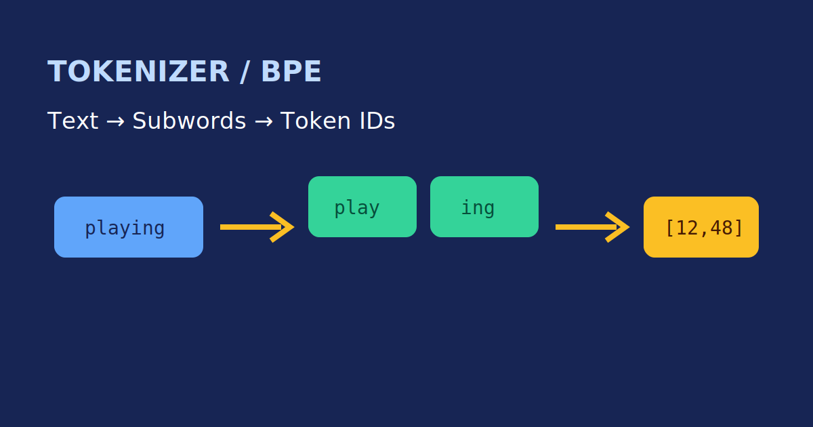
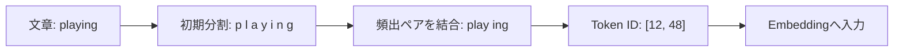

# Unit 35: TokenizerとBPEの基礎

<p class="unit-hero">
  
</p>

> [!NOTE]
> このUnitでは、LLMが文章をToken IDへ変換する流れを理解します。大規模モデルを訓練するのではなく、小さな例でBPEの考え方とToken数の影響を確認します。

## 1. TokenizerとBPEの理解

> Unit 23では、モデル付属のTokenizer（`tiktoken`）を呼び出して実際のToken数を測定しました。このUnitでは、その内部を完全に再現するのではなく、頻出ペアのマージというBPEの中心的な考え方だけを小さな実装で確認します。

LLMは文章をそのまま受け取らず、Tokenという小さな単位へ分割してから整数のToken IDに変換します。単語単位ではなく、頻出する文字列のまとまり（サブワード）を使うことで、未知の単語や日本語、コードも扱いやすくします。

### BPEの基本的な考え方

Byte Pair Encoding（BPE）は、最初に文字やバイトを単位にし、データ中で頻出する隣接ペアを順番に結合してVocabularyを作る考え方です。実際のLLMでは実装やVocabularyが異なるため、ここで作る小さなTokenizerの結果をそのまま実用Tokenizerの結果とみなしてはいけません。



Token数はモデルのコンテキスト長、API料金、推論時間に関係します。同じ文字数でも言語や表現によってToken数が変わるため、LLMアプリケーションでは実際のTokenizerで測定することが重要です。

## 2. 実装例 (Implementation Example)

まずは外部ライブラリを使わず、頻出ペアを結合する最小のBPE風アルゴリズムを実装します。

```python
from collections import Counter


def pair_counts(tokens):
    return Counter(zip(tokens, tokens[1:]))


def merge_pair(tokens, pair):
    merged = []
    i = 0
    while i < len(tokens):
        if i < len(tokens) - 1 and (tokens[i], tokens[i + 1]) == pair:
            merged.append(tokens[i] + tokens[i + 1])
            i += 2
        else:
            merged.append(tokens[i])
            i += 1
    return merged


def train_toy_bpe(words, merges=3):
    tokens = [list(word) + ["</w>"] for word in words]
    for _ in range(merges):
        counts = Counter()
        for word_tokens in tokens:
            counts.update(pair_counts(word_tokens))
        if not counts:
            break
        best_pair, frequency = counts.most_common(1)[0]
        if frequency < 2:
            break
        tokens = [merge_pair(word_tokens, best_pair) for word_tokens in tokens]
        print("merge:", best_pair, "frequency:", frequency)
    return tokens


corpus = ["playing", "played", "player", "playing"]
print(train_toy_bpe(corpus))
```

この例は学習用の簡略版です。実際のTokenizerには正規化、特殊Token、Unicode、Vocabulary保存、未知入力の扱いなどが加わります。

## 3. 実践 (Practice)

次の入力を使って、Tokenizer設計の違いを観察してください。

- 英語、日本語、Pythonコードをそれぞれ3文ずつ用意する
- toy BPEの結合回数を変え、Tokenのまとまりがどう変わるか確認する
- Unit 23の` tiktoken `実装で同じ文章の実際のToken数を測定する
- toy BPEと実用Tokenizerの結果が異なる理由を3つ説明する

## 4. 答え合わせ (Answer Key)

<details>
<summary>解答例を見る（クリックで展開）</summary>

- 結合回数を増やすと頻出する文字列が長いTokenへまとまり、Token数は減る傾向があります。
- toy BPEと実用Tokenizerの差は、学習コーパス、正規化、Unicodeや空白の扱い、特殊Token、Vocabularyのサイズなどから生じます。
- Token数は文字数に単純比例しません。日本語・英語・コードを実用Tokenizerで測定し、コンテキスト長と費用を見積もる必要があります。

</details>
