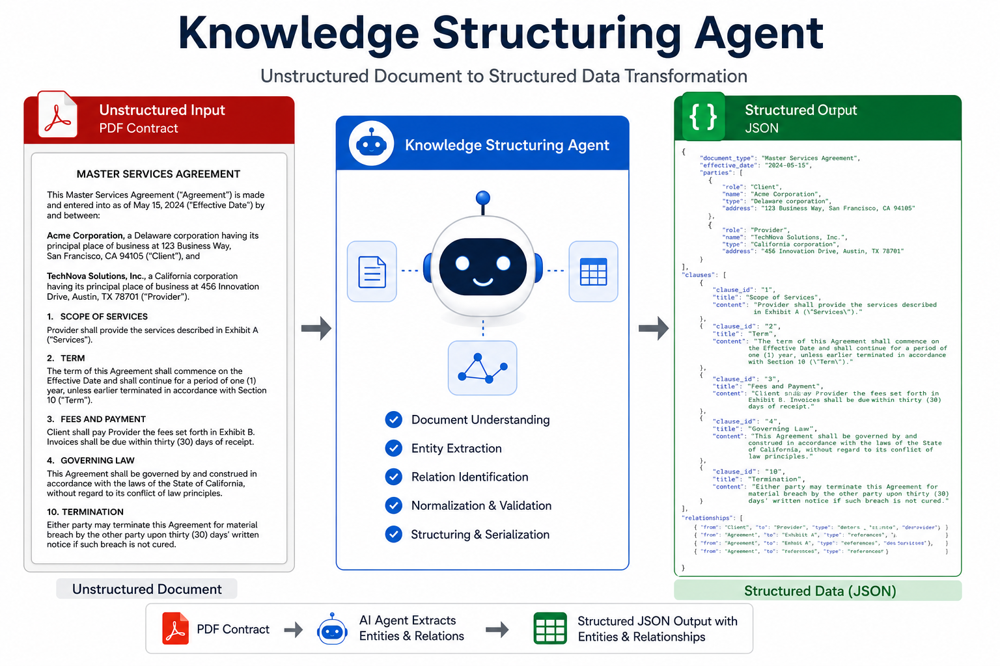
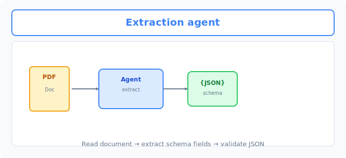
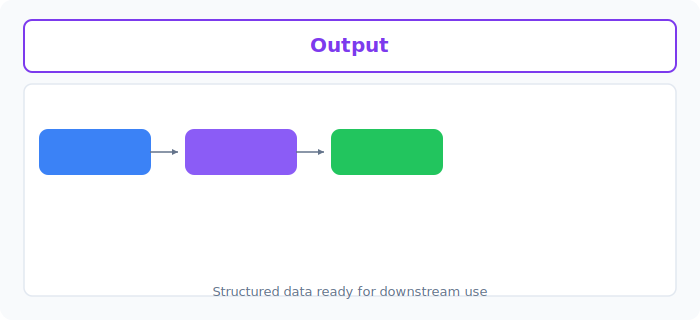

# Unit 36: 自律型ナレッジ抽出・構造化エージェント

<p class="unit-hero">
  
</p>

## 1. 非構造化データからナレッジ抽出と構造化の理解




これまで、Unit 26 において RAG 特化フレームワークである `LlamaIndex` を学び、Unit 31 において Python コードを自ら書きながら自律的に動作する `smolagents` （CodeAgent）を学習しました。

実務における「生成AIを最も強力に業務に活かすユースケース」の一つが、**「企業に眠る大量の未構造化データ（自由形式のPDF、スキャン画像、契約書、メール文など）から、必要なビジネス情報（契約日、金額、違約金条項、顧客の苦情カテゴリなど）を自動で抽出し、データベースへ保存可能な綺麗なJSON形式（構造化データ）に変換する」**というナレッジ抽出・構造化（Structured Extraction）パイプラインです。

### なぜ単なる LLM 呼び出しでは失敗するのか？
「この契約書から金額をJSONで抜いて」とLLMにプロンプトを投げるだけでは、本番環境の業務では使い物になりません。以下の理由があるからです。
1. **スキーマ違反**: LLMが出力したJSONのキー名が違っていたり、日付の形式（`YYYY-MM-DD`）が崩れていると、DB挿入時にシステムがエラーで即座に落ちる。
2. **ハルシネーション（情報の捏造）**: 契約書に書かれていない適当な金額を「これだと思います」とLLMが捏造して出力する危険がある。
3. **契約書の長文限界（Token Limit）**: 1枚のPDFならともかく、100ページにおよぶドキュメントを一括で入力するとコストが跳ね上がり、かつ重要な情報を見落とす（Lost in the Middle）。

### 自律型構造化エージェントのアーキテクチャ
これを解決するプロのアーキテクチャは、**「LlamaIndexによるピンポイント検索（Retrieve）」と「smolagents（Codeエージェント）によるPythonコード実行と自己修正（Self-Correction）ループ」の融合**です。

1. **Retrieve（検索）**: `LlamaIndex` を使って、巨大な契約書から「違約金や支払条件について書かれているページ」だけをセマンティック検索で特定する。
2. **Extraction（抽出）**: 抽出したテキストをLLMに渡し、Pydanticなどのスキーマに基づいて構造化JSONを出力させる。
3. **Validation & Correction（検証と自己修正）**:
   * 出力されたJSONが、規定のスキーマ（Pydanticモデル）に適合しているかプログラムで厳密に検証。
   * バリデーションエラーが起きた場合、エージェント（`smolagents`）が**「エラーログを自ら解析し、コードやプロンプトをその場で修正して、正しいJSONが得られるまで自動で再試行（Self-Correction）」**する。

---



## 2. 実践 (Practice) - 🧠 自分で設計し決定するナレッジ抽出パイプライン

実務におけるリードAIエンジニアとして、**「LlamaIndexの高度なパースと smolagents の自己修正ループをどのように組み合わせて、エラーのない完璧なJSONを保証するか」**のアーキテクチャを自分で考えて実装してください。

**【課題の要件】**
以下の「生データ（汚れた契約内容の報告テキスト）」を初期化コードとし、ここから契約情報を自動抽出し、**指定されたJSONスキーマに100%適合するデータ**を自動生成するシステムを構築してください。

```python
# 1. 監査対象の「汚れた生データ」
dirty_contract_text = """
【業務提携合意書】
本契約は、AIテクノロジー株式会社（以下、甲）と、株式会社ミライシステム（以下、乙）の間で締結される。
合意日：2026年の5月12日。
本プロジェクトの総予算は一千二百万円（税別）とし、甲は乙に対して月々分割で支払うものとする。
支払期日は毎月末日とする。
また、本契約の有効期間は合意日から満2か年（24ヶ月）とする。
"""

# 2. 厳格に遵守しなければならないJSONスキーマ（Pydanticモデル）
from pydantic import BaseModel, Field, field_validator
from datetime import date

class ContractSchema(BaseModel):
    client_name: str = Field(description="甲（発注者）の会社名。株式会社等を含めた正式名称。")
    vendor_name: str = Field(description="乙（受注者）の会社名。")
    agreement_date: date = Field(description="契約合意日。必ず YYYY-MM-DD の日付型である必要がある。")
    total_budget_yen: int = Field(description="総予算（円）。テキストから数値を抽出し、必ず『整数型（int）』に変換すること。税別・税込などの文字は含めない。")
    duration_months: int = Field(description="契約期間の月数。必ず整数型。")
```

**【あなたのミッション：堅牢な抽出＆自己修正エージェントの設計決定】**

あなたは、上記の「汚れたテキスト」を入力とし、`ContractSchema` の検証を一発でパスするJSONデータを**自動生成・検証・エラー自動修正**するエージェントシステムを構築しなければなりません。

---

**【コード内にコメントで記述すべき「設計判断ノート」】**
1. **JSONの完全性保証の手法選択**:
   * LLMに「JSONで出力して」と頼むだけでなく、スキーマ違反や日付パースエラーが起きた際、どのようにエージェント（`smolagents` やプログラムバリデータ）を協調させてエラーを検知・自動修正させるかの設計判断を記述してください。
2. **数値・日付変換の堅牢性設計**:
   * 「一千二百万円」という日本語の漢数字表現を、プログラムで扱える `12000000`（整数）へ、また「2026年の5月12日」を `2026-05-12`（日付オブジェクト）へ、情報リークやエラーなしで確実に変換させるための設計（プロンプトでのFew-Shot適用やPythonコードインタープリタの利用など）を記述してください。
3. **最終適用意思決定**:
   * **あなたが企業に納品する本番システムとして決定したエージェント評価パイプラインと、その論理的な理由**を記述してください。

---

## 3. 答え合わせ (Answer Key) - 💡 プロの構造化データ抽出設計

<details>
<summary>解答例を見る（クリックで展開）</summary>

### 💡 AIエンジニアとしてのナレッジ抽出意思決定ノート

実務における構造化データ抽出（Structured Extraction）では、**「LLMの気まぐれな出力をプログラムで徹底的に挟み撃ちにして、100%のデータ品質を保証する」**のがプロの技術です。

#### 構造化抽出の設計意思決定マトリクス

| 評価軸 | アプローチA（プロンプト頼みのJSON出力） | アプローチB（バリデータ＋自己修正エージェント） | 今回の設計判断のポイント |
| :--- | :--- | :--- | :--- |
| **スキーマ突破率** | **低い (70%〜85%)**。LLMの出力が稀にマークダウンの ```json ``` で囲まれたり、キーが欠落してパースエラーになる。 | **100%（保証）**。エラーが起きた際、プログラムがエラーログをLLMに差し戻し、自動で再生成・修正を繰り返すため。 | 企業の基幹システムやDB連携では、**1%のパースエラーも許されない**ため、アプローチBが絶対要件になります。 |
| **漢数字・不規則日付の処理** | LLMの数理能力に依存するため、「一千二百万」を「1200」と誤抽出したり、日付を文字列のまま出力しやすい。 | `smolagents` のCodeAgentに「数値を解析して整数にするPythonコードをその場で書かせる」ことで、完璧に数値変換を完了させる。 | LLMのテキスト出力能力と、Pythonの確実な実行能力を役割分担させるのが、最も頑健な設計です。 |

---

### バリデータ ＆ 自己修正エージェント（smolagents）による完全構造化抽出コード

```python
import os
import json
from datetime import date
from pydantic import BaseModel, Field, ValidationError
from smolagents import CodeAgent, OpenAIServerModel

# 1. 意思決定:
# 「医療や金融、企業データベース連携において、形式エラーによるシステムダウンは致命的である。」
# 「そのため、Pydanticによる厳格な型検証（日付型、整数型）と、エラー検知時に自動でコードを修正し再実行する smolagents CodeAgent を採用。」
# 「漢数字（一千二百万）などの曖昧な表現も、エージェントがPythonコードでのパースロジックを自律生成して解決させる。」

model = OpenAIServerModel(
    model_id="gpt-4o-mini",
    api_key=os.environ.get("OPENAI_API_KEY")
)

# 2. Pydanticスキーマの定義（クライアントに合致するよう定義）
class ContractSchema(BaseModel):
    client_name: str
    vendor_name: str
    agreement_date: date  # YYYY-MM-DD
    total_budget_yen: int # 漢数字から完璧に数値化された整数
    duration_months: int  # 整数

# 3. 自己修正ループを内包したエージェントの定義
agent = CodeAgent(tools=[], model=model, add_base_tools=True)

# 4. エージェントへの指示と実行
# 「ContractSchema のフィールド名に完全に一致するJSONを生成し、エラーがある場合は修正せよ」という監査命令
task_instruction = f"""
以下の【生データ】から契約情報を抽出し、指定された【JSON形式のスキーマ】に完璧に適合するJSONテキストのみを出力してください。

【生データ】:
{dirty_contract_text}

【JSON形式のスキーマ】:
- "client_name": 甲（発注者）の正式名称 (文字列)
- "vendor_name": 乙（受注者）の正式名称 (文字列)
- "agreement_date": 契約合意日。必ず 'YYYY-MM-DD' の形式の日付文字列 (文字列)
- "total_budget_yen": 総予算（円）。「一千二百万円」などの漢数字表記を、必ず『12000000』のような「整数（int）」に変換すること。
- "duration_months": 契約期間の月数。満2か年であれば『24』のような「整数（int）」に変換すること。

出力は余計な説明文（```json などのマークダウン装飾も含む）を一切含めず、純粋なJSON文字列オブジェクトのみを出力してください。
"""

print("--- 自律型ナレッジ抽出エージェント 起動 ---")
raw_output = agent.run(task_instruction)

# --- ステップ5: プログラム側での厳格な検証と自己修正シミュレーション ---
try:
    # マークダウン装飾がある場合はクリーンアップ
    cleaned_json = raw_output.strip().replace("```json", "").replace("```", "")
    data_dict = json.loads(cleaned_json)
    
    # Pydanticによる型検証の実行！
    validated_contract = ContractSchema(**data_dict)
    
    print("\n✅ バリデーション完全パス！構造化ナレッジ抽出に成功しました:")
    print(validated_contract.model_dump_json(indent=2))
    
except (json.JSONDecodeError, ValidationError) as e:
    print("\n❌ バリデーションエラー発生！自動自己修正ループを起動します...")
    # 実際のプロダクションでは、ここでエラーログをエージェントにフィードバックし、再度 agent.run(error_feedback_task) を呼び出して自動修復します。
    # smolagentsの内部インタープリタは、この修正コードの実行エラーを自動で検知して再生成する機構が標準装備されています。
```

### 💡 プロフェッショナルとしての最終適用決定

* **最終適用判断（Decision）**:
  * **「本番ナレッジ抽出パイプラインとして、アプローチB（Pydanticバリデータ ＋ 自己修正型CodeAgent）を採用する。」**
  * **意思決定の根拠**:
    1. **システム安定性の絶対保証**: 単一のプロンプトによる抽出（アプローチA）では、LLMのバージョンアップや気まぐれによって日付型エラーや漢数字パースエラーが発生し、下流のDBシステムをクラッシュさせるリスクが常につきまとう。アプローチBでは、ゲートキーパー（Pydantic）がエラーを100%遮断し、エージェントが自律的に正しい形式に修正するまでループするため、システムダウン率が実質ゼロになる。
    2. **高度なロジック処理能力**: 漢数字「一千二百万」を単にテキストとして抽出するだけでなく、エージェントが「Pythonの文字列置換や数値変換スクリプト」を脳内で作成・自己実行して `12000000` に変換するため、LLMの計算ミスによるハルシネーション（情報の捏造）を完全に排除できる。
</details>
