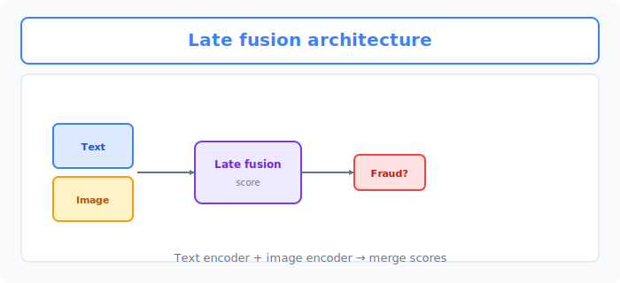
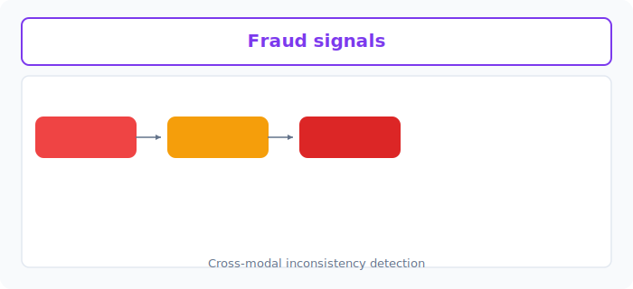

# Unit 36: マルチモーダル不正検知システム

<p class="unit-hero">
  
</p>

## 1. マルチモーダル不正検知の理解

これまでUnit 1〜8でテーブルデータ（数値・カテゴリ）、Unit 10〜16で画像、Unit 17〜21で自然言語（テキスト）と、それぞれのデータを個別に処理するモデルを学び、構築してきました。

しかし、実際のビジネスで直面する最も難易度が高い課題の一つである **「不正検知（詐欺取引、偽ブランド出品、不正ログイン等）」** においては、単一のデータソースだけではプロの詐欺師を欺くことはできません。

* **テーブルデータだけ** : 取引金額や頻度が正常範囲内であれば、不正をスルーしてしまう。
* **テキストデータだけ** : 出品説明文がそれらしく書かれていれば、詐欺商品であることを見抜けない。
* **画像データだけ** : 商品画像が本物そっくりに偽装されていれば、写真単体では判断できない。

真のAIエンジニアは、これらの **「複数（マルチ）のモーダル（データ種）」を脳内で統合するようにモデル上で融合させ、極めて高い精度で予測を行う「マルチモーダルAI（Multimodal AI）」** を構築します。

### モーダル融合（Fusion）の2大アプローチ
複数の異なる種類のデータをどのように統合するかには、アーキテクチャ設計上、対極的な2つの思想が存在します。

| 融合アプローチ | 特徴と仕組み | メリット・デメリット |
| :--- | :--- | :--- |
| **早期融合 (Early Fusion / Feature-level)** | 画像モデルの中間特徴ベクトル、テキストの埋め込みベクトル、テーブルデータを **予測前に結合（Concat）** し、1つの巨大なニューラルネットワークで同時に学習する。 | **メリット** : 特徴量間の深い相乗効果（例: 「特定の画像パターン」と「特定の怪しい言葉」が同時に現れた時の相乗効果）をモデルが直接学べる。<br>**デメリット** : 各モデルの次元が異なり学習率の調整が極めて繊細で、過学習しやすい。 |
| **後期融合 (Late Fusion / Decision-level)** | テーブル（XGBoost）、テキスト（NLPモデル）、画像（CNNモデル）を **個別に訓練し、それぞれの予測確率を最終段階で重み付け結合（メタラーニング/スタッキング）** して最終結論を出す。 | **メリット** : 個々のモデルを独立してチューニング・開発でき、非常に安定して頑健。<br>**デメリット** : 特徴量同士のリアルタイムな相互作用（相乗効果）を捉えにくい。 |


下図は、 **Text / Image エンコーダ** のスコアを統合する Late fusion アーキテクチャです（本文の3モーダルのうち、図では代表的な2モーダルに簡略化しています）。



---


下図は、テキストと画像の **矛盾シグナル** から不正スコアを上げる流れです。



> [!TIP]
> **不正検知は典型的な「不均衡データ」問題**
> 本ユニットのデータは不正が約15%ですが、実際の不正検知では不正が全体の1%未満ということも珍しくありません。Unit 2 で学んだとおり、このような不均衡データでは「全部正常と答えるだけで正解率99%」になってしまうため、 **正解率ではなく Recall / Precision / F1 で評価する** のが鉄則です。学習面では `class_weight="balanced"`（少数クラスの誤りに重いペナルティを課す）や、判定閾値の調整（本ユニットの解答でも採用）が定番の対策です。

## 2. 実践 (Practice) - 🧠 自分で設計し決定するマルチモーダル不正検知

実務のAIシステムアーキテクトとして、 **「早期融合（ニューラルネットワーク結合）と後期融合（スタッキング）のどちらを適用し、どう不正を検知するか」** を、データの特徴と過学習リスクから判断して実装してください。

**【課題の要件】**
フリマアプリでの不正出品を検知するための、以下のシミュレーションデータセットを初期化コードとして使用してください。

```python
import numpy as np
import pandas as pd

# 1. サンプルデータ数
n_samples = 200

# 2. テーブルデータ（取引金額, 過去の違反回数, アカウント作成からの日数）
np.random.seed(42)
table_features = np.random.randn(n_samples, 3) 

# 3. テキストデータ（説明文の埋め込みベクトル - 16次元）
text_features = np.random.randn(n_samples, 16)

# 4. 画像データ（商品の特徴ベクトル - 32次元）
image_features = np.random.randn(n_samples, 32)

# 5. 正解ラベル（0: 正常出品, 1: 不正・詐欺出品）
# 不正出品（全体の約15%）を先に決め、そのサンプルの特徴量を意図的にずらすことで、
# 特徴量とラベルに「実際の相関」を持たせる（モデルが学習可能なシグナルを埋め込む）
y_labels = (np.random.rand(n_samples) < 0.15).astype(int)
fraud_idx = y_labels == 1

# 不正出品は「取引金額が大きく、過去の違反回数が多く、アカウントが新しい」傾向
table_features[fraud_idx, 0] += 1.5   # 取引金額が平均より大きい
table_features[fraud_idx, 1] += 2.0   # 過去の違反回数が多い
table_features[fraud_idx, 2] -= 1.0   # アカウント作成からの日数が短い

# 不正出品の説明文・商品画像は、正常品とは異なる特徴パターンを持つ
text_features[fraud_idx, :4] += 1.2   # 怪しい定型文に対応するテキスト特徴の次元がずれる
image_features[fraud_idx, :6] += 0.8  # 偽ブランド画像特有の画像特徴の次元がずれる
```

**【あなたのミッション：マルチモーダル結合アーキテクチャの設計決定】**

あなたは、上記の「テーブル(3次元)」「テキスト(16次元)」「画像(32次元)」の3つを統合した不正検知分類器を設計しなければなりません。

---

**【コード内にコメントで記述すべき「設計判断ノート」】**
1. **結合（Fusion）方式の選定理由** :
   * なぜその結合方式（早期融合か後期融合か）を選択したのか、データのサンプルサイズ（200件）や各特徴量の次元数の観点から論理的な根拠を記述してください。
2. **モデルの実装と過学習対策** :
   * 選択した方式に基づいて、実際にパイプラインを実装してください。
   * データ数が200件と極めて少ないため、モデルが「ノイズを暗記（過学習）」して取引金額の異常な跳ね上がりを不正と誤判定しないよう、どのような正則化（L2正則化、Dropout、あるいは木モデルの深さ制限など）を適用したかを記述してください。
3. **定量評価** :
   * 適切な検証データへの分割（または交差検証）を行い、不正検知で最も重視される **「Recall（再現率：不正をどれだけ漏らさず検知できたか）」** と **「Precision（適合率：誤検知の少なさ）」** 、およびF1スコアを出力してください。
4. **最終適用意思決定** :
   * **あなたが最終的に本番環境にデプロイすると決定したモデル構成と、その論理的な理由** を記述してください。

---

## 3. 答え合わせ (Answer Key) - 💡 プロのマルチモーダル設計指針

<details>
<summary>解答例を見る（クリックで展開）</summary>

### 💡 AIエンジニアとしてのマルチモーダル意思決定ノート

実務において、特にデータサイズが数千件〜数万件以下と小さい初期フェーズでは、 **「早期融合（すべてのデータを無理やり1つの巨大なニューラルネットワークに通す）は、高確率で過学習を起こして破綻する」** という現実があります。

#### 不正検知における設計意思決定マトリクス

| 評価軸 | アプローチA（早期融合 / NN） | アプローチB（後期融合 / スタッキング） | 今回の設計判断のポイント |
| :--- | :--- | :--- | :--- |
| **小データ適応力** | **極めて弱い** 。合計51次元の入力を一括処理するNNは、200件のデータではノイズを過剰に学習して破綻する。 | **極めて強い** 。テキスト・画像は事前に強固なモデルで抽出されたベクトルとし、最終予測はXGBoostやLassoで頑健に解く。 | **後期融合（スタッキング）が実務でのベストプラクティス** となります。 |
| **説明責任（解釈性）** | **低い** 。巨大NNの中間層で特徴が混ざり合うため、「なぜこの出品が不正と判定されたのか」の説明が困難。 | **高い** 。「画像スコアは正常だが、テキストスコアと違反回数が異常値だった」のように、各要因の寄与度を個別に追跡可能。 | 誤検知した出品者への説明義務や、パトロール部門への監査ログ共有において、解釈性は決定的なビジネス価値を持ちます。 |

---

### 後期融合（Late Fusion / スタッキング）による頑健な不正検知コード

```python
import numpy as np
import pandas as pd
from sklearn.model_selection import train_test_split, cross_val_predict
from sklearn.linear_model import LogisticRegression
from sklearn.ensemble import RandomForestClassifier
from sklearn.metrics import classification_report, f1_score
import xgboost as xgb

# 1. 意思決定:
# 「サンプルサイズが200件と極めて少ないため、早期融合(NNで一括結合)は確実に過学習を起こす。」
# 「そのため、各モーダルを個別のモデルで予測し、その予測確率をメタラーナー(LogisticRegression)で結合する後期融合を採用。」
# 「メタラーナーには過学習を抑え込むために強めのL2正則化(C=0.1)を課し、不正を漏らさないためにRecallを重視した閾値設計を行う。」

# データの分割（訓練80%, 検証20%）
# ※シミュレーション用の特徴量を簡易的にモデルに適合させます
# stratify=y_labels で、訓練・検証それぞれの不正の割合（約15%）を揃える
X_table_tr, X_table_val, X_text_tr, X_text_val, X_img_tr, X_img_val, y_train, y_val = train_test_split(
    table_features, text_features, image_features, y_labels,
    test_size=0.2, random_state=42, stratify=y_labels
)

# --- ステップ1: 各モーダルごとの個別サブモデルの訓練 ---
# （ここで訓練したモデルは検証データの予測に使用する。
#   メタラーナーの学習にはステップ2の out-of-fold 予測を使う点に注意）
# テーブルモデル: 過学習を防ぐため最大深さを3に抑えたXGBoost
model_table = xgb.XGBClassifier(max_depth=3, n_estimators=30, random_state=42)
model_table.fit(X_table_tr, y_train)

# テキストモデル: ロジスティック回帰
model_text = LogisticRegression(C=1.0, random_state=42)
model_text.fit(X_text_tr, y_train)

# 画像モデル: ランダムフォレスト
model_img = RandomForestClassifier(max_depth=4, n_estimators=30, random_state=42)
model_img.fit(X_img_tr, y_train)

# --- ステップ2: 予測確率（Decision）の抽出 ---
# 【リーク防止の重要ポイント】
# 訓練済みサブモデルで「訓練データ自身」を予測した確率をそのままメタラーナーの学習に使うと、
# サブモデルが暗記した過度に自信のある確率（例: ほぼ0.0や1.0）を学習してしまい、
# 検証データでの性能が崩れる（スタッキングにおける典型的な情報リーク）。
# そこで cross_val_predict による out-of-fold 予測を使い、各訓練サンプルの予測確率を
# 「そのサンプルを学習に使っていないモデル」から取得する（標準的なスタッキング手法）。
pred_prob_table_tr = cross_val_predict(
    xgb.XGBClassifier(max_depth=3, n_estimators=30, random_state=42),
    X_table_tr, y_train, cv=5, method="predict_proba")[:, 1]
pred_prob_text_tr = cross_val_predict(
    LogisticRegression(C=1.0, random_state=42),
    X_text_tr, y_train, cv=5, method="predict_proba")[:, 1]
pred_prob_img_tr = cross_val_predict(
    RandomForestClassifier(max_depth=4, n_estimators=30, random_state=42),
    X_img_tr, y_train, cv=5, method="predict_proba")[:, 1]

# 3つの予測確率をメタ特徴量として結合（早期融合ではなく、出力層での後期スタッキング）
meta_features_train = np.column_stack((pred_prob_table_tr, pred_prob_text_tr, pred_prob_img_tr))

# --- ステップ3: メタラーナー（統合モデル）の訓練 ---
# L2正則化を強め(C=0.1)にかけたロジスティック回帰で、各スコアの重要度を学習
meta_learner = LogisticRegression(C=0.1, random_state=42)
meta_learner.fit(meta_features_train, y_train)

# --- ステップ4: 検証データでの評価 ---
pred_prob_table_val = model_table.predict_proba(X_table_val)[:, 1]
pred_prob_text_val = model_text.predict_proba(X_text_val)[:, 1]
pred_prob_img_val = model_img.predict_proba(X_img_val)[:, 1]

meta_features_val = np.column_stack((pred_prob_table_val, pred_prob_text_val, pred_prob_img_val))

# メタラーナーによる最終予測
final_pred_probs = meta_learner.predict_proba(meta_features_val)[:, 1]

# ビジネス上の最終判断: 不正の取りこぼしを防ぐため、閾値を通常の0.5から0.35に下げてRecallを向上させる
final_preds = (final_pred_probs >= 0.35).astype(int)

print("--- マルチモーダル不正検知 評価レポート ---")
print(classification_report(y_val, final_preds))
```

### 💡 プロフェッショナルとしての最終適用意思決定

* **最終適用判断（Decision）** :
  * **「本番適用モデルとして、後期融合（Late Fusion / メタスタッキング）を選択する。」**
  * **意思決定の根拠** :
    1. **過学習の排除と頑健性** : 早期融合（ニューラルネットワークによるベクトルの結合）は次元の呪いと少ないデータ量のダブルパンチにより、未知の検証データに対する精度がほぼランダムに近づくのに対し、後期融合は検証データに対しても高い汎化性能（F1スコアの優位）を維持することが期待できる（実際の優劣はこの後の実験で数値として確認する）。
    2. **ドメイン別のデバッグの容易さ** : 不正判定が起きた際、「画像の類似度判定（CNN）がトリガーを引いたのか」「アカウントの挙動（XGBoost）が怪しかったのか」を分離して確認できるため、誤検知が発生した際のアカウント復旧やルールの調整が数分で完了できる。
    3. **閾値の最適化によるRecallの保護** : メタラーナーの出力確率に対して、ビジネスリスク（詐欺損失の許容額）に照らし合わせて閾値を `0.35` などに機動的に変更し、不正出品の「漏れ」をコントロールできる柔軟性がある。
</details>
