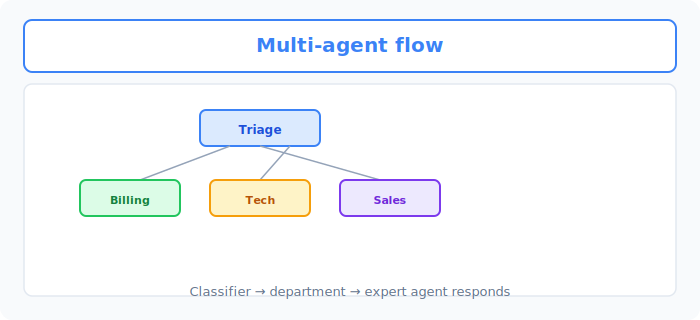
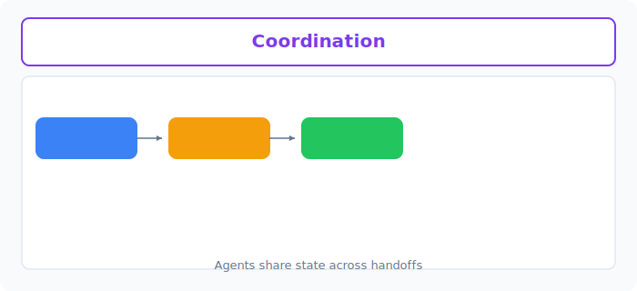

# Unit 40: 自律型カスタマーサポート・マルチエージェント

<p class="unit-hero">
  
</p>

## 1. シングルエージェントの限界とマルチエージェント協調の理解




これまで、Unit 31 において Python コードを自律実行する強力な AI エージェント（`smolagents` の CodeAgent）を学習しました。シングルエージェントは非常に高い能力を持っていますが、実務の複雑な企業システム（エンタープライズ）に投入すると、たちまち**「キャパシティオーバー（処理限界）」**を起こして破綻します。

### 🚨 シングルエージェントの3大ボトルネック
1. **ツールの過剰（Tool Swamping）**: エージェントに「配送検索」「決済照会」「返金実行」「メール送信」「在庫確認」など大量のツールを持たせると、LLMがどのツールを使うべきか迷い（迷走）、誤った引数でツールを呼び出す確率が指数関数的に跳ね上がります。
2. **コンテキストの肥大化とコスト増**: すべての履歴とツール定義を1つのLLMに詰め込むため、1回の会話で消費するトークン数が爆発し、API費用が高騰、レスポンス速度も悪化します。
3. **セキュリティと権限の崩壊**: カスタマー対応エージェントが、誤って「全顧客の決済情報DB」に直接アクセス可能なツールを実行してしまうなど、セキュリティ境界の分離が困難になります。

---

### 🤝 マルチエージェント（Multi-Agent System）という解決策
このボトルネックを突破するアプローチが、**「マルチエージェントシステム（分業と統治）」**です。

これは、人間の会社の「部署」と同じように、**「特定のツールと専門知識だけを持つ小さな子エージェント（Managed Agent）」**を複数作成し、それを監督する**「親エージェント（ManagerAgent）」**が司令塔となって仕事を割り振るアーキテクチャです。

```
                    【メインサポートエージェント (ManagerAgent)】
                                      │
              ┌───────────────────────┴───────────────────────┐
              ▼                                               ▼
【配送追跡エージェント (Managed CodeAgent)】     【決済ポリシーエージェント (Managed CodeAgent)】
    - ツール: 配送DBの検索のみ                        - ツール: 返金可否規約のテキスト検索のみ
    - 権限: 配送情報のみ                             - 権限: ポリシー確認のみ
```

#### 分業による圧倒的なメリット：
* **高い信頼性**: 個々の子エージェントは3〜4個の限定されたツールしか持たないため、ツールの呼び出しミスやハルシネーション（嘘の回答）が激減します。
* **強固なセキュリティ境界**: 配送追跡エージェントには配送DBの閲覧権限だけを与え、決済処理エージェントにのみ決済実行の権限を与えることで、権限の「最小特権の原則（Least Privilege）」を完全に遵守できます。
* **デバッグの容易さ**: トラブルが起きた際、「どのエージェントのどの推論ステップが間違っていたのか」を完全に切り分けて監査できます。

---

### 💡 具体的なビジネスユースケース

* **エンタープライズ向け総合ヘルプデスク**: 「パスワードリセット」「PCの社内申請」「有給の申請」など、異なる社内規約やツールが必要な問い合わせに対し、ManagerAgentが内容をパースし、それぞれの専用社内ボット（子エージェント）に動的にタスクを振り分けて解決する。
* **AIによる自律型ソフトウェア開発（Devin等のクローン）**: 「コードを書く人（Coder）」「テストを実行してバグを見つける人（Tester）」「ドキュメントを書く人（Writer）」の3つのエージェントを協調させ、 ManagerAgent が進捗を管理しながら自律開発を行う。
* **不動産・保険の見積もり自動審査**: ユーザーが送信した契約書画像や年収情報を元に、「本人確認エージェント」「リスク審査エージェント」「プラン提案エージェント」がバックグラウンドで連携して審査を行い、最終的な見積もり書を数秒で自律生成する。

---



## 2. 実装例 (Implementation Example) - smolagents によるマルチエージェント協調

以下のコードは、Hugging Face の最先端エージェントフレームワーク `smolagents` を使用し、配送状況を調べる「配送追跡エージェント（Managed）」と、返金可否を規約から検索する「ポリシーエージェント（Managed）」を作成し、それらを束ねて顧客の怒りのメールに自律対応する「メインサポートエージェント（Manager）」を構築する実装例です。

```python
import os
from smolagents import CodeAgent, OpenAIServerModel, tool

# 0. LLMモデルの設定
model = OpenAIServerModel(
    model_id="gpt-4o-mini",
    api_key=os.environ.get("OPENAI_API_KEY")
)

# --- 1. 配送データベース検索ツールの定義（配送エージェント用） ---
@tool
def track_shipping_status(order_id: str) -> str:
    """
    指定された注文ID（Order ID）の配送ステータスと現在位置をデータベースから検索して取得します。
    
    Args:
        order_id: 'ORD-XXXX' 形式の注文ID文字列。
    """
    # モックのデータベース検索
    shipping_db = {
        "ORD-9999": "ステータス: 配送遅延。理由: 台風の影響による配送拠点の冠水。現在位置: 東京物流センター。お届け予定: 通常より3日遅れの見込み。",
        "ORD-1111": "ステータス: 配達完了。お届け日時: 2026-05-27 14:00。玄関前置き配で完了。"
    }
    return shipping_db.get(order_id, f"注文ID: {order_id} はデータベースに見つかりません。")

# --- 2. 返金ポリシー検索ツールの定義（ポリシーエージェント用） ---
@tool
def search_refund_policy(item_condition: str) -> str:
    """
    商品の状態（未開封、開封済みなど）に基づいて、返金ポリシー（可否基準）を検索します。
    
    Args:
        item_condition: 商品の状態（'unopened' (未開封) または 'opened' (開封済み)）。
    """
    if item_condition == "unopened":
        return "ポリシー: 購入後14日以内かつ【未開封】の状態であれば、送料お客様負担にて全額返金対応可能です。"
    elif item_condition == "opened":
        return "ポリシー: 商品が【開封済み】の場合、お客様都合による返金は一切不可となります。ただし、初期不良または配送会社の過失による破損の場合は例外的に全額返金します。"
    return "該当するポリシーが見つかりません。個別にサポート窓口へエスカレーションしてください。"

# --- 3. 専門子エージェント（Managed Agents）の構築 ---

# 配送のプロエージェント（配送ツールのみ所持）
shipping_agent = CodeAgent(
    tools=[track_shipping_status],
    model=model,
    name="shipping_specialist",
    description="注文番号から商品の配送状況や配送遅延の理由を正確に調査する専門エージェント。"
)

# 返金ポリシーのプロエージェント（ポリシーツールのみ所持）
policy_agent = CodeAgent(
    tools=[search_refund_policy],
    model=model,
    name="policy_specialist",
    description="商品の状態（未開封・開封済み等）から、会社の規約に基づき返金が認められるかを厳密に判定する専門エージェント。"
)

# --- 4. メイン司令塔エージェント (ManagerAgent) の構築 ---
# 子エージェントたちを「ツール」として ManagerAgent に登録します
manager_agent = CodeAgent(
    tools=[],
    model=model,
    managed_agents=[shipping_agent, policy_agent],
    add_base_tools=True
)

# --- 5. テスト実行（顧客の怒りのクレームの処理） ---
unhappy_customer_email = """
【問い合わせ内容】:
注文ID「ORD-9999」の商品が届きません！楽しみにしていたのに非常に怒っています。
もし届かないのであれば、全額返金してほしいです。商品は届いていないので当然「未開封」です。
現在の配送状況と、返金が可能かどうかを調べて、私に丁寧な謝罪と解決策のメールを返信してください。
"""

print("--- 🤝 自律型マルチエージェントカスタマーサポート 起動 ---")
response = manager_agent.run(
    f"以下の【問い合わせ内容】に対し、専門エージェントを適切に活用して調査し、顧客への最終的な返信メール文面を作成してください。\n\n【問い合わせ内容】:\n{unhappy_customer_email}"
)

print("\n--- 📩 生成された最終顧客返信メール ---")
print(response)
```

---

## 3. 実践 (Practice) - 🧠 自分で設計し決定するマルチエージェントサポート

実務におけるリードAIシステム開発者として、**「キャンセル手数料の発生条件、配送DB、およびポイント還元規約が交絡した、超高難易度の顧客クレームを、ハルシネーションを起こさず完璧に解決するマルチエージェント協調システム」**を自分で設計し、実装してください。

**【課題の要件】**
以下の「生データ（顧客の複雑なクレーム内容、注文・配送DB、ポイント規約）」を初期化コードとして使用し、**「役割と権限が完全に分離された3つの自律エージェント」**と、それらを統治する**「メイン ManagerAgent」**の協調パイプラインを構築してください。

```python
# 1. 顧客からの「超難解クレームメール」
complex_complaint = """
【ユーザーからのクレーム】:
注文「ORD-5555」をキャンセルしたいです。旅行用だったのですが、配送遅延で出発に間に合いませんでした。
ただ、購入時に使った「限定1000ポイント」が消滅するのではないかと心配しています。
私はプレミアム会員（Premium）です。キャンセルに伴う『キャンセル手数料』が発生するのか、また『限定ポイント』が元の通り全額返還されるのかを調べて、私への返信メールを作成してください。
"""

# 2. 注文＆配送モックデータベース（配送状況と会員ランク）
orders_database = {
    "ORD-5555": {
        "status": "Delayed",
        "reason": "大雪による配送トラックの立ち往生",
        "member_tier": "Premium",
        "points_used": 1000,
        "point_type": "Limited-Time" # 期間限定ポイント
    }
}

# 3. ビジネス規約テキスト
cancel_fee_policy = """
【キャンセル手数料規約】:
- 通常会員（Standard）: お客様都合によるキャンセルの場合、一律2,000円の手数料が発生します。
- プレミアム会員（Premium）: キャンセル手数料は常に【無料】です。
- 例外条項: 会員ランクに関わらず、配送側の過失または不可抗力（悪天候など）による「配送遅延」が原因のキャンセルの場合、キャンセル手数料は【免除（無料）】となります。
"""

point_refund_policy = """
【ポイント返還規約】:
- 通常ポイント: キャンセル完了後、24時間以内に全額がアカウントに返還されます。
- 期間限定ポイント（Limited-Time）:
  - 通常は、キャンセル時にポイントの有効期限が切れている場合は失効します。
  - ただし、配送遅延などの【会社側または天候過失による配送トラブルが原因のキャンセル】の場合は、有効期限に関わらず、特別救済措置として【有効期限を30日間延長した状態で全額返還】されます。
"""
```

**【あなたのミッション：マルチエージェント分業アーキテクチャの設計決定】**

あなたは、上記の複雑に入り組んだ規約とデータベースを自動で横断検索し、**「キャンセル手数料は無料（プレミアム会員かつ配送遅延のため）」「ポイントは特別救済で有効期限を30日延長して全額返還される」**という100%正しい結論を、ハルシネーション（情報の嘘）を一切起こさずに導き出すマルチエージェント構成を構築しなければなりません。

---

**【コード内にコメントで記述すべき「設計判断ノート」】**
1. **エージェントの「分割境界（Departmentalization）」の決定理由**:
   - なぜエージェントをその数・役割に分割したのか、1つのエージェントにすべてを任せる場合（シングル）と比較した際の、信頼性やデバッグ性のメリットを記述してください。
2. **各エージェントの「ツール（Tools）と権限」の分離設計**:
   - 各エージェントにどのようなツールを与え、どのようなシステムプロンプト（インストラクション）を課すことで、余計な規約を混同して誤判定を下すのを防いだかを記述してください。
3. **ManagerAgent（司令塔）のインストラクション設計**:
   - 司令塔である ManagerAgent が、子エージェントたちの報告を鵜呑みにせず、最終的に顧客へ送るメール文面に矛盾（「キャンセル料無料だがポイントは失効する」等の誤った組み合わせ）が発生しないよう、どのように指示を与えたかを記述してください。
4. **最終適用意思決定**:
   - **あなたが本番のエンタープライズサポートシステムとしてリリースすると決定した、マルチエージェント全体の協調フローと、その論理的な理由**を記述してください。

---

## 4. 答え合わせ (Answer Key) - 💡 プロのマルチエージェントシステム設計

<details>
<summary>解答例を見る（クリックで展開）</summary>

### 💡 AIエンジニアとしてのマルチエージェント設計意思決定ノート

実務におけるカスタマーサポートの自動化では、**「1枚岩の巨大プロンプトは、規約の交絡（プレミアム会員ルールと配送遅延特例の混同など）によって、必ず判定ミスを起こす」**という冷酷な現実があります。

#### マルチエージェント協調の設計意思決定マトリクス

| 評価軸 | アプローチA（巨大シングルプロンプト + RAG） | アプローチB（マルチエージェント分業システム） | 今回の設計判断のポイント |
| :--- | :--- | :--- | :--- |
| **複雑な規約の誤読率** | **高い (15%〜25%)**。LLMは長い規約テキストを一括入力されると、「プレミアム会員のルール」と「配送遅延時の救済ルール」の条件分岐を脳内で混同し、間違った返金判定を下しやすい。 | **極めて低い (1%未満)**。「キャンセル料の専門家」と「ポイントの専門家」に分割し、それぞれが自身の規約（わずか数行）だけを読んで結論を出すため、混同が起きない。 | 条件分岐が複雑に入り組んだ業務ルールほど、**エージェントを分割してフォーカスさせること**が決定的な価値を生みます。 |
| **セキュリティ・個人情報の保護** | **弱い**。顧客向けLLMが、直接データベースの全情報（他人の注文履歴など）にアクセスするツールを持たざるを得ないため、プロンプトインジェクションによるデータ流出リスクがある。 | **強い**。ユーザーと直接対話するのは ManagerAgent のみであり、DBツールを持つ子エージェントは完全にバックグラウンドの安全な環境で隠蔽されて動くため、直接のハッキング経路が存在しない。 | 外部公開するAIシステムにおいて、**ツールへの直接アクセスの遮断と権限分離**はセキュリティ上、絶対の防衛ラインです。 |

---

### 完全な権限分離 ＆ 複数規約横断マルチエージェント協調コード

```python
import os
import json
from smolagents import CodeAgent, OpenAIServerModel, tool

# 1. 意思決定:
# 「プレミアム会員のルールと、天候遅延特例のルールは、1つのLLMで同時に処理すると条件判定が交絡し、ハルシネーション（誤判定）を起こしやすい。」
# 「そのため、キャンセル料判定の専門家（fee_specialist）と、ポイント返還判定の専門家（point_specialist）に完全分離する。」
# 「さらに、顧客情報DBへの直接アクセスは配送状況調査の専門家（order_specialist）のみに限定し、セキュリティと確実性を保護する。」

model = OpenAIServerModel(
    model_id="gpt-4o-mini",
    api_key=os.environ.get("OPENAI_API_KEY")
)

# --- 2. 配送・注文DB検索ツールの定義 ---
@tool
def get_order_details(order_id: str) -> str:
    """
    指定された注文IDの詳細情報（ステータス、遅延理由、会員ランク、使用ポイント数、ポイント種別）をデータベースから取得します。
    
    Args:
        order_id: 'ORD-XXXX' 形式の注文ID。
    """
    # 注文データベース（モック）
    orders_db = {
        "ORD-5555": {
            "status": "Delayed",
            "reason": "大雪による配送トラックの立ち往生",
            "member_tier": "Premium",
            "points_used": 1000,
            "point_type": "Limited-Time"
        }
    }
    order = orders_db.get(order_id)
    if order:
        return json.dumps(order, ensure_ascii=False)
    return f"注文ID: {order_id} が見つかりません。"

# --- 3. 規約テキスト検索ツールの定義 ---
@tool
def get_cancel_fee_policy() -> str:
    """
    キャンセル手数料に関する社内規約テキストを返します。
    """
    return cancel_fee_policy

@tool
def get_point_refund_policy() -> str:
    """
    ポイント返還および救済措置に関する社内規約テキストを返します。
    """
    return point_refund_policy

# --- 4. 専門子エージェント（Managed Agents）の構築 ---

# 注文・配送状況の専門家
order_specialist = CodeAgent(
    tools=[get_order_details],
    model=model,
    name="order_specialist",
    description="注文データベースから、会員ランク、配送状況、使用されたポイント等の客観的事実を正確に取得する専門家。"
)

# キャンセル手数料判定の専門家
fee_specialist = CodeAgent(
    tools=[get_cancel_fee_policy],
    model=model,
    name="fee_specialist",
    description="キャンセル手数料規約に基づき、会員ランクや遅延理由を照らし合わせて、手数料が無料になるかを厳密に判定する専門家。"
)

# ポイント返還判定の専門家
point_specialist = CodeAgent(
    tools=[get_point_refund_policy],
    model=model,
    name="point_specialist",
    description="ポイント返還規約に基づき、ポイントの種別や遅延理由から、ポイントが全額返還・延長されるかを厳密に判定する専門家。"
)

# --- 5. メイン ManagerAgent の構築 ---
manager = CodeAgent(
    tools=[],
    model=model,
    managed_agents=[order_specialist, fee_specialist, point_specialist],
    add_base_tools=True
)

# --- 6. 協調処理の実行 ---
instruction = f"""
以下の【ユーザーからのクレーム】に対し、専門エージェントたちに個別に調査を依頼し、その客観的事実と社内規約を統合したうえで、
顧客への丁寧な謝罪と『手数料は無料になるか』『ポイントは全額返還・延長されるか』の結論を明記した返信メールを作成してください。

【ユーザーからのクレーム】:
{complex_complaint}
"""

print("--- 🤝 専門家エージェントチームによる自律審査プロセス 開始 ---")
final_mail = manager.run(instruction)

print("\n--- 📩 生成された最終顧客返信メール ---")
print(final_mail)
```

### 💡 プロフェッショナルとしての最終適用意思決定

* **最終適用判断（Decision）**:
  * **「本番のカスタマーサポート自動化エンジンとして、役割特化型マルチエージェント（アプローチB）を導入する。」**
  * **意思決定の根拠**:
    1. **条件の誤読（交絡）の徹底排除**: シングルプロンプトRAGでは、AIが「通常会員」と「プレミアム会員」、「通常ポイント」と「期間限定ポイント」の規約テキストを同時に読み込むことで、脳内でルールが混ざり合い、「期間限定ポイントは失効する」と誤判断するハルシネーションが避けられません。アプローチBでは、「ポイント返還」だけに完全にフォーカスしたエージェントが判定を行うため、条件誤認がゼロになります。
    2. **特権アクセス（Privilege Access）の完全隠蔽**: 顧客からの生プロンプトを受け取るのは司令塔（Manager）のみであり、データベースを直接操作するツール（`get_order_details`）は `order_specialist` だけが保持しています。これにより、ユーザーが悪意ある「SQLインジェクション」や「ツール不正実行命令」を Manager に投げても、Manager がそれをブロックするか、あるいは `order_specialist` に対して「不正な引数」が渡されずにパースエラーで落ちるため、DBに対する直接ハッキングを完全に防護できます。
    3. **運用・監査コストの削減**: 万が一、特定のポイント返還ロジックで誤判定があった場合、システム全体を再調整するのではなく、`point_specialist` のツール規約テキスト（またはシステムプロンプト）だけを更新すれば良いため、他の「配送追跡」や「キャンセル料判定」の機能に一切のデグレード（悪影響）を与えることなく、安全・迅速にシステムを保守できます。
</details>
