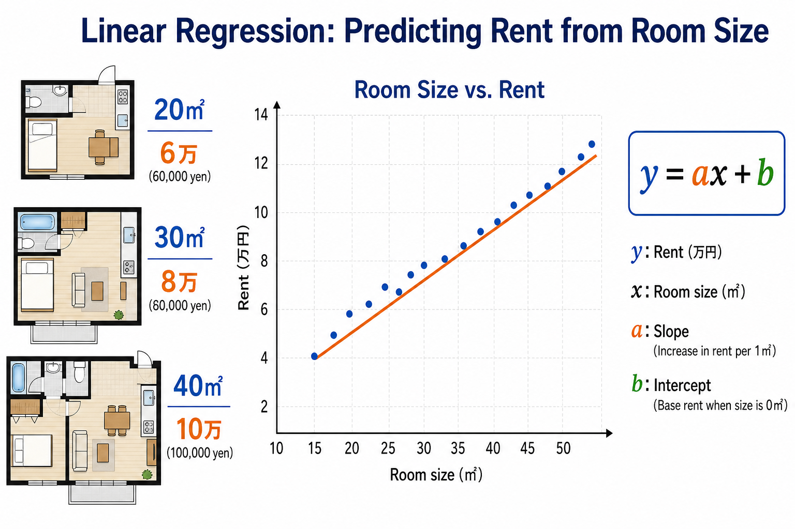
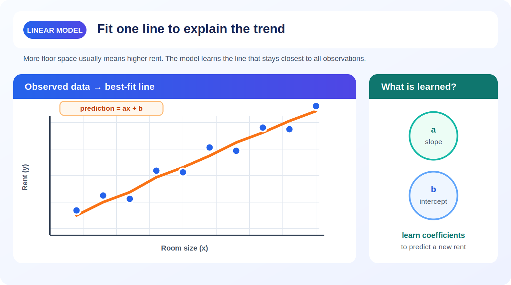
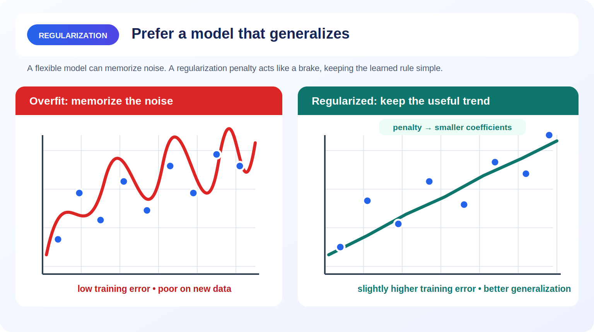
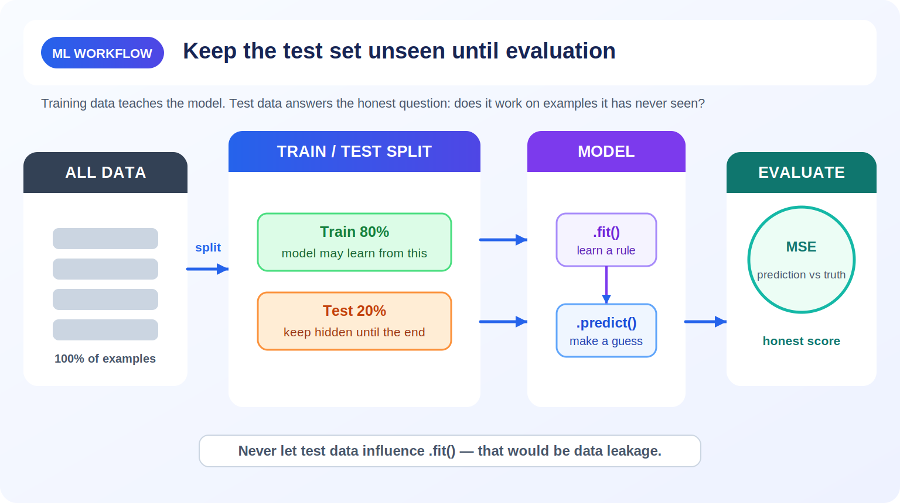

# Unit 1: 線形回帰と正則化回帰

<p class="unit-hero">
  
</p>

## 1. 線形回帰と正則化の理解

### 線形回帰とは？ 〜「家賃の予測」で考える〜

線形回帰を日常に例えるなら、 **「過去のデータから、1つの真っ直ぐな定規を使って未来を予測する」** ようなものです。

例えば、「部屋の広さ（平方メートル）」から「家賃（万円）」を予測したいとします。
データをグラフにプロットしてみると、だいたい広くなればなるほど家賃が高くなる傾向が見えます。このデータの中央を貫くように「ピッタリ合う1本の直線を引く」のが線形回帰です。

下図は、部屋の広さと家賃の散布図に、データの中央を貫くように最適な回帰直線を当てはめたイメージです。



| 部屋の広さ（原因：特徴量） | 家賃（結果：目的変数） |
| :------------------------- | :--------------------- |
| 20㎡                       | 6万円                  |
| 30㎡                       | 8万円                  |
| 40㎡                       | 10万円                 |

この直線を数式で表すと：
**家賃 = (係数 × 部屋の広さ) + 基本料金（切片）**
となります。アルゴリズムの仕事は、過去のデータに最もよく当てはまる「係数」と「基本料金」を見つけ出すことです。

### 正則化（Regularization）とは？ 〜「こだわりすぎ」を防ぐブレーキ〜

しかし、家賃は広さだけでなく「駅からの距離」「築年数」「近くにコンビニがあるか」など、たくさんの要因で決まります。
データが複雑になると、機械学習モデルは「過去のデータにピッタリ合わせようと頑張りすぎる」ことがあります。これを **過学習（オーバーフィッティング）** と呼びます。

例えるなら、 **「過去問を丸暗記しすぎて、本番の応用問題が全く解けない受験生」** のような状態です。

下図は、過去のデータに合わせすぎて波打ってしまった過学習の曲線と、正則化によってシンプルに保たれた直線を比較したものです。



これを防ぐための「ブレーキ」が **正則化** です。正則化には主に2つの種類があります：

1. **Ridge（リッジ）回帰** ：全体的に係数を小さく抑え、「極端な思い込み」を防ぐ。
2. **Lasso（ラッソ）回帰** ：重要でない要因の係数を「完全にゼロ」にして無視する。断捨離が得意。

なお、Lasso 回帰は章末の「3. 実践 (Practice)」で実際に手を動かして試します。

### 💡 具体的なビジネスユースケース

- **不動産の価格査定AI** ：物件の広さ、築年数、駅からの距離などの特徴量から、適正な家賃や売却価格を予測する。
- **小売店の売上予測** ：過去の売上実績、気温、休日の有無などのデータから、翌日の店舗ごとの売上高を予測し、発注量を最適化する。
- **広告費のROI分析（マーケティング・ミックス・モデリング）** ：テレビCMやWeb広告などの各媒体への投資額が、最終的な売上にどれだけ貢献しているかを算出し、予算配分を最適化する。

---

## 2. 実装例 (Implementation Example)

ここでは、Pythonと機械学習ライブラリ`scikit-learn`を使って、住宅価格を予測する線形回帰と Ridge 回帰を実装してみましょう。

下図は、データを学習用とテスト用に分割してから、学習・予測・評価へと進む機械学習の基本ワークフローです。



まずは必要なライブラリを読み込み、データを準備します。ここでは Ridge 回帰の効果を観察しやすくするため、30件の物件に対して、同じ「本当の広さ」をもとに作られた10個のよく似た特徴量を用意します。このように特徴量同士が強く相関する状態を **多重共線性** と呼び、通常の線形回帰では係数が不安定になりやすくなります。

```python
# 必要なツールのインポート
import numpy as np
from sklearn.model_selection import train_test_split
from sklearn.linear_model import LinearRegression, Ridge
from sklearn.metrics import mean_squared_error

# 1. データの準備（毎回同じ結果になるよう乱数を固定）
rng = np.random.default_rng(42)

# 30件の物件について、本当の広さを20〜80㎡の範囲で作る
true_size = rng.uniform(20, 80, size=(30, 1))

# X: 本当の広さに小さな測定誤差を加えた、よく似た10個の特徴量
# 10列が同じ情報を多く含むため、特徴量同士が強く相関する
X = true_size + rng.normal(0, 0.5, size=(30, 10))

# y: 家賃（万円）。本当の広さ × 0.2 に、現実のばらつきを加える
y = true_size.ravel() * 0.2 + rng.normal(0, 3, size=30)

# 2. 全データの70%を学習用、30%をテスト用に分ける
X_train, X_test, y_train, y_test = train_test_split(
    X, y, test_size=0.3, random_state=42
)
```

**【コードの解説】**
これは Ridge 回帰の「ブレーキ」が役立つ場面を再現するための模擬データです。物件数は30件と少ない一方で、似た特徴量が10個あります。さらに家賃にはノイズも含まれるため、通常の線形回帰は学習データの偶然のばらつきまで拾いやすくなります。`train_test_split` を使い、学習に使わないテストデータで予測性能を比べます。

次に、実際にモデルに学習させて予測を行います。

```python
# 3. モデルの準備と学習
# 普通の線形回帰モデルを作成
model_lr = LinearRegression()

# 学習データ（X_train, y_train）を使って、最適な直線を引く（学習）
model_lr.fit(X_train, y_train)

# 4. テストデータで予測
y_pred_lr = model_lr.predict(X_test)

# 5. 答え合わせ（精度評価）
mse_lr = mean_squared_error(y_test, y_pred_lr)
```

**【コードの解説】**
`LinearRegression()` でモデルを作成し、`.fit()` で学習します。その後、`.predict()` を使って未知のテストデータの家賃を予測し、MSE を計算します。

同様に、正則化（Ridge）を使ったバージョンも書いてみましょう。

```python
# 6. 正則化モデル (Ridge) の準備と学習
# alpha はブレーキの強さです。大きいほどブレーキが強くかかります
model_ridge = Ridge(alpha=100.0)
model_ridge.fit(X_train, y_train)

# テストデータで予測
y_pred_ridge = model_ridge.predict(X_test)

# 答え合わせ（精度評価）
mse_ridge = mean_squared_error(y_test, y_pred_ridge)
improvement_rate = (mse_lr - mse_ridge) / mse_lr * 100

print(f"通常の線形回帰のMSE: {mse_lr:.2f}")
print(f"Ridge回帰のMSE: {mse_ridge:.2f}")
print(f"MSEの改善率: {improvement_rate:.1f}%")
```

固定した条件で実行すると、通常の線形回帰の MSE は `20.34`、Ridge 回帰は `10.52` となり、Ridge 回帰の MSE は `48.3%` 小さくなります。この例では、互いによく似た10個の特徴量に対して係数が極端にならないよう Ridge の「ブレーキ」が働き、未知のテストデータへの予測が改善しました。

### MSE の値はどう読む？

MSE（Mean Squared Error、平均二乗誤差）は、各データについて **「予測値 − 正解値」を二乗し、その平均を取った値** です。

- MSE は必ず `0` 以上になります。`0` なら、すべての予測が正解と完全に一致しています。
- 同じ目的変数・単位・テストデータで比べる場合は、MSE が小さいモデルほど予測誤差が小さいと判断できます。ここでは `10.52 < 20.34` なので Ridge 回帰の方が良い結果です。
- 固定された上限はありません。予測が大きく外れるほど値は大きくなり、差を二乗するため外れ値の影響も強く受けます。
- 今回の目的変数は家賃の「万円」ですが、MSE の単位は二乗された「万円²」です。そのため、MSE `20.34` は「平均で20.34万円ずれた」という意味ではありません。元の万円単位で感覚をつかむには、MSE の平方根である RMSE を使うと、通常の線形回帰は約 `4.51` 万円、Ridge 回帰は約 `3.24` 万円です。
- 目的変数の単位や値の大きさ、テストデータの分け方が違う MSE 同士は、数値だけで単純比較できません。

なお、Ridge 回帰が常に通常の線形回帰より良くなるわけではありません。効果はデータの性質と `alpha` によって変わります。この例は、少ないデータに強く相関する特徴量とノイズがある、Ridge 回帰が役立ちやすい条件を意図的に再現しています。

---

## 3. 実践 (Practice)

さて、次はあなたの番です！以下の要件に従って、自分自身でモデルを構築してみましょう。

**【課題の要件】**
別のデータセット「糖尿病の進行度予測（Diabetes dataset）」を使います。これは、年齢やBMI、血圧などの複数の数値（特徴量）から、1年後の糖尿病の進行度（目的変数）を予測するタスクです。

1. `sklearn.datasets` から `load_diabetes` を使ってデータを読み込んでください。
2. データを学習用（80%）とテスト用（20%）に分割してください。
3. 今回は **Lasso回帰（Lasso）** モデルを作成して学習させてください。（`alpha=0.1` とします）
4. テストデータに対して予測を行い、MSE（平均二乗誤差）を表示してください。

**【ヒント】**

- `from sklearn.linear_model import Lasso` を追加でインポートする必要があります。
- データの読み込み方は `from sklearn.datasets import load_diabetes` とし、`data = load_diabetes()` の後に `X = data.data`、`y = data.target` とします。

---

## 4. 答え合わせ (Answer Key)

自分でコードを書いてから、以下の答えを開いて確認してみましょう。

<details>
<summary>解答例を見る（クリックで展開）</summary>

```python
import numpy as np
from sklearn.datasets import load_diabetes
from sklearn.model_selection import train_test_split
from sklearn.linear_model import Lasso
from sklearn.metrics import mean_squared_error

# 1. データの読み込み
diabetes = load_diabetes()
X = diabetes.data
y = diabetes.target

# 2. データの分割
X_train, X_test, y_train, y_test = train_test_split(X, y, test_size=0.2, random_state=42)

# 3. Lasso回帰モデルの作成と学習
# alpha=0.1 を指定して、Lasso回帰モデルを作ります
model_lasso = Lasso(alpha=0.1)
model_lasso.fit(X_train, y_train)

# 4. 予測と評価
y_pred = model_lasso.predict(X_test)
mse = mean_squared_error(y_test, y_pred)

print(f"Lasso回帰のMSE: {mse:.2f}")

# (おまけ) Lasso回帰の特徴である「使われなかった特徴量」を確認してみましょう
print(f"ゼロになった係数の数: {np.sum(model_lasso.coef_ == 0)} 個")
```

**【解答コードの解説】**
Lasso回帰の最大の特徴は、 **「結果に関係ない特徴量の係数をキッチリ 0 にしてくれる」** ことです。これによって、どのデータが本当に予測に重要なのかが人間にも分かりやすくなる（解釈性が上がる）というメリットがあります！
</details>
