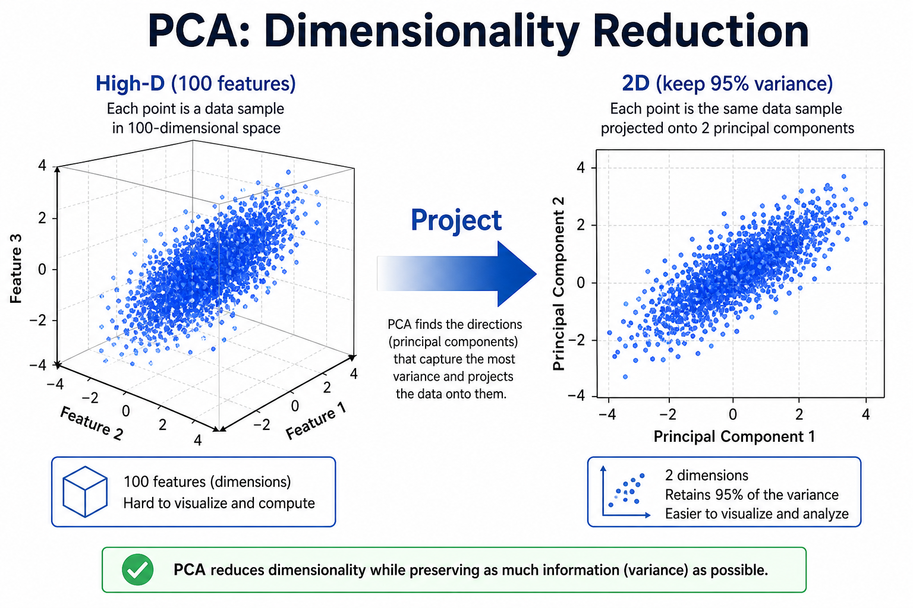
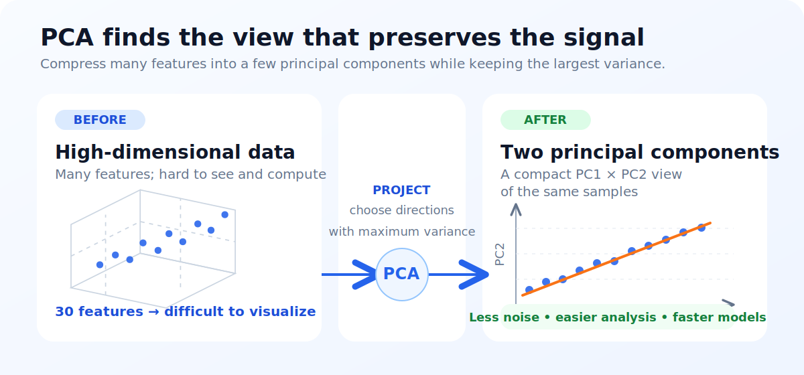
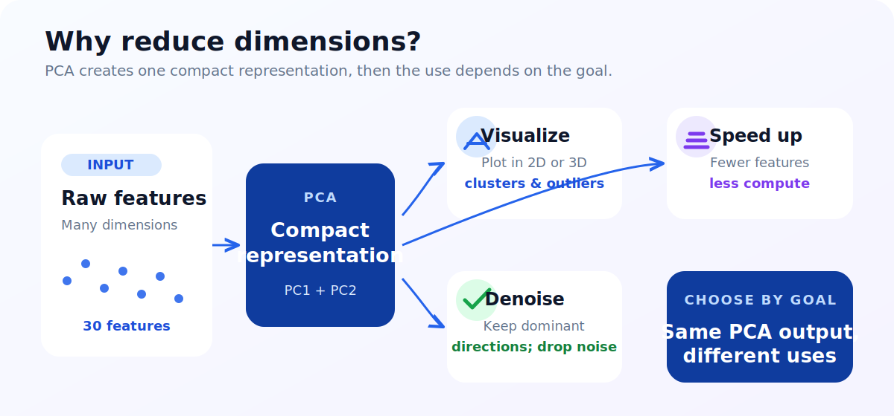

# Unit 7: 次元削減と主成分分析

<p class="unit-hero">
  
</p>

## 1. 次元削減とPCAの理解

データ分析の世界では、「データ（特徴量）は多ければ多いほど良い」と思われがちですが、実はそうではありません。
特徴量が多すぎると、計算に時間がかかったり、ノイズが増えて精度が落ちたり、人間がグラフにして見ることができなくなったりします。これを **「次元の呪い」** と呼びます。
さらに本質的な問題として、次元が高くなるとデータ点同士の距離がどれも似たような値になってしまい、「近い・遠い」の区別がつきにくくなります。そのため、距離の近さを手がかりにする K-NN のような手法が高次元ではうまく機能しなくなるのです。

そこで登場するのが、データの重要な部分だけを残してスッキリまとめる **「次元削減（Dimensionality Reduction）」** という技術です。その中でも最も代表的なアルゴリズムが **PCA（主成分分析：Principal Component Analysis）** です。

### 次元削減とは？ 〜「本の要約」や「写真撮影」〜

次元削減を日常に例えるなら、 **「100ページの本を、内容（ストーリー）を損なうことなく5ページのあらすじに要約する」** ようなものです。文字数（次元）は減りましたが、一番大切な情報（本質）は残っています。

もっと視覚的に例えるなら、 **「3D（立体）の物体を、カメラで撮影して2D（平面）の写真にする」** ことと同じです。
例えば「ティーカップ」の写真を撮る時、上から撮るとただの丸い円に見えてしまい、持ち手があるのかどうかも分かりません（情報が失われた状態）。しかし、少し斜め横から撮影すれば、カップの形も持ち手も1枚の平面（2D）でバッチリ伝わります。

PCAがやっているのは、まさにこの **「一番データの特徴が伝わるベストアングルを探して、そこにデータを投影する（影を落とす）」** という作業です。

### PCA（主成分分析）の仕組み 〜「バラツキ」が一番大きい角度を探せ！〜

PCAは、どうやってその「ベストアングル」を見つけているのでしょうか？
それは **「データが一番広く散らばっている方向（分散が最大になる方向）」** を探すという数学的なアプローチです。

1. **第1主成分（PC1）** ：データが最も広く散らばっている方向の直線を引きます。ここが一番情報量が詰まっている「ベストアングル」です。
2. **第2主成分（PC2）** ：第1主成分に対して直角（90度）に交わる方向の中で、次にデータが散らばっている直線を引きます。

| 次元削減のメリット | 具体例                                                                                                                     |
| :----------------- | :------------------------------------------------------------------------------------------------------------------------- |
| **可視化できる**   | 30個の特徴量があるデータは人間にはグラフ化できませんが、PCAで「2つ」に圧縮すれば、二次元のグラフに描いて目で確認できます。 |
| **計算が速くなる** | 無駄な情報（ノイズ）が消え、データ量が減るため、AIの学習スピードが劇的に上がります。                                       |

下図は、3次元の点群を **主成分方向** に射影して2次元に圧縮する PCA のイメージです。



### 💡 具体的なビジネスユースケース

- **顧客アンケートの要因分析** ：数十項目にわたる顧客満足度アンケートの結果をPCAで数個の「主成分（例：接客態度、商品の質など）」に要約し、顧客満足度を決定づける本質的な要因を抽出する。
- **製造業のセンサーデータの圧縮** ：工場に設置された何百ものセンサーから送られてくる膨大なデータを、重要な情報を残したまま次元削減することで、システムの通信量や保存コストを劇的に削減する。
- **ゲノムデータの可視化** ：何万という遺伝子の発現量データをPCAで2次元や3次元に圧縮し、健康な人と病気の人の遺伝子パターンの違いをグラフ上で直感的に比較・分析できるようにする。

下図は、次元削減の主な活用場面（可視化・高速化・ノイズ除去）をまとめたものです。



---

## 2. 実装例 (Implementation Example)

今回は「乳がんの診断データ」を使います。このデータには「腫瘍の大きさ」「滑らかさ」「凹凸」など **30個（30次元）** もの特徴量が含まれています。当然グラフには描けません。
そこで、PCAを使ってこれを **2個（2次元）** にまで圧縮し、平面グラフに描画してみましょう！

```python
# 必要なツールのインポート
import matplotlib.pyplot as plt
from sklearn.datasets import load_breast_cancer
from sklearn.preprocessing import StandardScaler
from sklearn.decomposition import PCA

# 1. データの準備
cancer = load_breast_cancer()
X = cancer.data
y = cancer.target

# 2. データの標準化（PCAの超重要ステップ！）
# PCAは「数字のスケール(単位)」に非常に敏感です。必ず StandardScaler で数値を整えます。
scaler = StandardScaler()
X_scaled = scaler.fit_transform(X)
```

**【コードの解説】**
PCAを使う前の **絶対の掟** として、 **「データのスケールを揃える（標準化する）」** 必要があります。例えば「身長（170cm）」と「視力（1.2）」では数字の大きさが違いすぎるため、そのままPCAにかけると数字が大きい「身長」ばかりが重視されてしまいます。`StandardScaler` はすべてのデータを「平均0、バラツキ1」の同じ土俵に揃えてくれるツールです。

```python
# 3. PCAモデルの作成と実行
# n_components=2：30次元のデータを「2次元」に圧縮するように指示します
pca = PCA(n_components=2)

# 圧縮を実行！ (fit でベストアングルを探し、transform で実際にデータを圧縮します)
X_pca = pca.fit_transform(X_scaled)

print(f"圧縮前のデータサイズ: {X.shape}")      # (569, 30) -> 30次元
print(f"圧縮後のデータサイズ: {X_pca.shape}")  # (569, 2)  -> 2次元に減った！
```

**【コードの解説】**
`PCA(n_components=2)` でモデルを作り、`.fit_transform()` を実行するだけで、一瞬で30個あった特徴量がたった2個（PC1とPC2）に要約されました。

```python
# 4. 圧縮したデータをグラフに描画
# X_pca[:, 0] が第1主成分(PC1)、X_pca[:, 1] が第2主成分(PC2)です
plt.figure(figsize=(8, 6))

# y=0(悪性)と y=1(良性)で色を分けてプロットします
plt.scatter(X_pca[:, 0], X_pca[:, 1], c=y, cmap='bwr', alpha=0.7)

plt.xlabel('First Principal Component (PC1)')
plt.ylabel('Second Principal Component (PC2)')
plt.title('PCA of Breast Cancer Dataset')
plt.show()
```

**【コードの解説】**
たった2次元に圧縮したにも関わらず、グラフを描いてみると「赤（悪性）のグループ」と「青（良性）のグループ」が、ある程度綺麗に左右に分かれていることが確認できるはずです！これがPCAによる「要約パワー」です。

---

## 3. 実践 (Practice)

さて、今度は別のデータセットを使ってあなた自身で次元削減を行ってみましょう。

**【課題の要件】**
アヤメ（Iris）のデータセットを使います。このデータは「がくの長さ」など **4つの特徴量（4次元）** を持っています。これをPCAで **2次元** に圧縮してください。

1. `sklearn.datasets` から `load_iris` を読み込んでください。
2. `StandardScaler` を使ってデータ（`X`）を標準化してください。
3. `PCA` を使って、データを **2次元** （`n_components=2`）に圧縮してください。
4. 圧縮されたデータのサイズ（形）を `print(X_pca.shape)` で確認してください。（本来ならここでグラフを描画しますが、今回はデータサイズの確認だけでOKです）

**【ヒント】**

- PCAを実行する前には、 **必ず** `StandardScaler().fit_transform()` を行うことを忘れないでください！

---

## 4. 答え合わせ (Answer Key)

自分でコードを書いてから、以下の答えを開いて確認してみましょう。

<details>
<summary>解答例を見る（クリックで展開）</summary>

```python
from sklearn.datasets import load_iris
from sklearn.preprocessing import StandardScaler
from sklearn.decomposition import PCA

# 1. データの読み込み
iris = load_iris()
X = iris.data

# 2. データの標準化（PCAの前の必須作業！）
scaler = StandardScaler()
X_scaled = scaler.fit_transform(X)

# 3. PCAによる次元削減
# 4次元から2次元に圧縮します
pca = PCA(n_components=2)
X_pca = pca.fit_transform(X_scaled)

# 4. 結果の確認
print("オリジナルのデータサイズ:", X.shape)     # (150, 4)
print("PCA圧縮後のデータサイズ:", X_pca.shape) # (150, 2)

# (おまけ) 圧縮しても、どれくらい元の情報が残っているか（寄与率）を確認できます
# 2次元に圧縮しても、元データの約95%の情報が保持されていることが分かります！
print(f"情報保持率（分散説明率）: {sum(pca.explained_variance_ratio_):.2%}")
```

**【解答コードの解説】**
PCAは「魔法の圧縮ツール」です。おまけのコードで計算したように、4つの特徴量をたった2つに減らしても、「元のデータの95%以上の本質的な情報」が失われずに残っています。
これにより、データを見やすくしたり、次にAI（ロジスティック回帰など）に学習させる時のスピードを上げたりすることができます。
</details>
