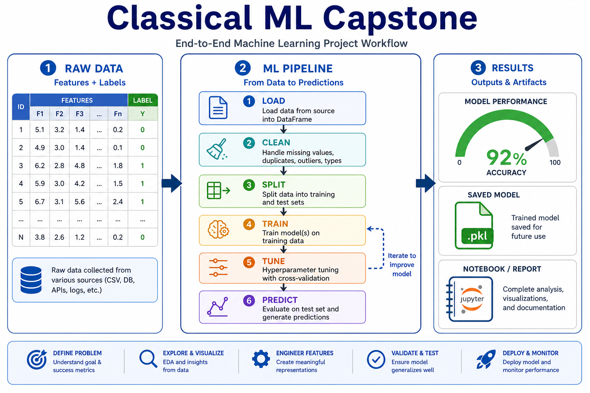
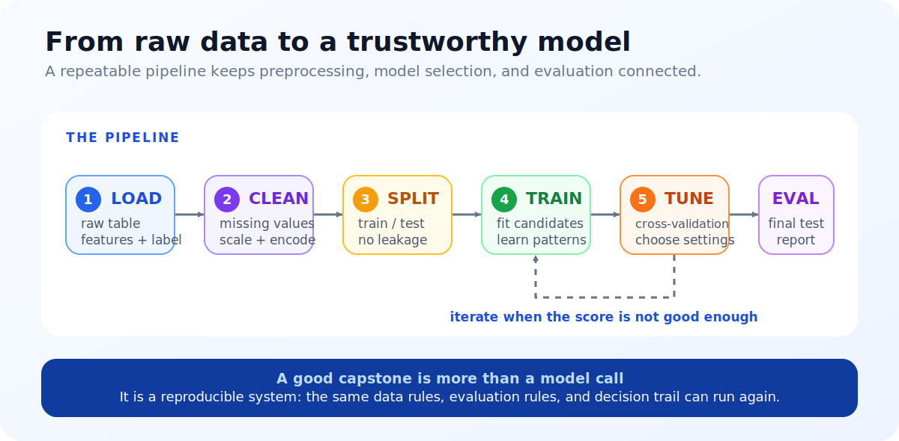
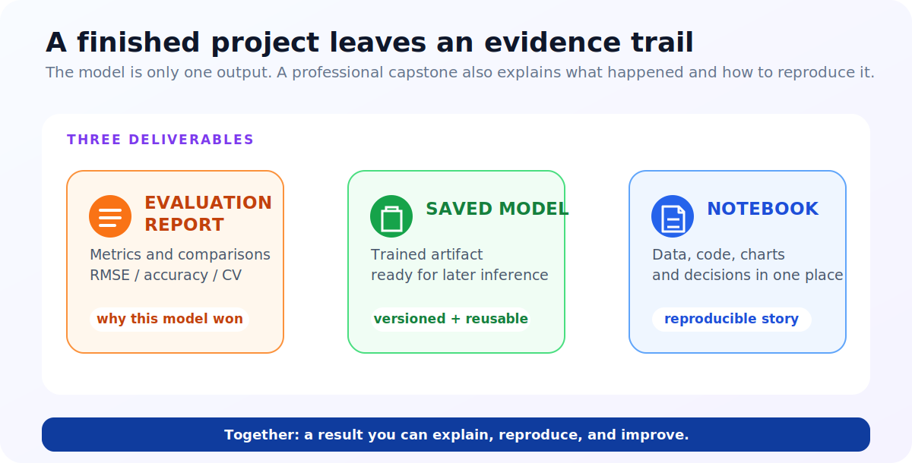

# Unit 9: 機械学習総合演習 (Capstone)

<p class="unit-hero">
  
</p>

## 1. エンドツーエンド機械学習パイプラインの理解

これまでUnit 1からUnit 8にかけて、様々な機械学習のアルゴリズムや評価方法、チューニングの手法を個別に学んできました。しかし、実際のビジネス現場におけるAIエンジニアの仕事は、アルゴリズムを呼び出すだけではありません。

現実のプロジェクトでは、 **「データ読み込み (Load) ➔ 前処理 (Clean) ➔ データ分割 (Split) ➔ 学習 (Train) ➔ 評価 (Eval)」** という一連の流れ（パイプライン）を美しく強固に構築することが求められます。

なお、実務でよく強調される「特徴量作成（特徴量前処理）」は、この流れの中では前処理 (Clean) の工程に含まれます。本ユニットの実装例では、欠損値の補完（`fillna` や `SimpleImputer`）と特徴量スケーリング（`StandardScaler`）がこの特徴量前処理に相当します。

もう一つ、実データで必ず登場する前処理が **カテゴリ変数のエンコーディング** です。「東京/大阪/名古屋」のような文字列カテゴリは、そのままではモデルに渡せないため数値に変換します。最も基本的な方法が、カテゴリごとに 0/1 の列を作る **One-Hot エンコーディング** で、pandas なら `pd.get_dummies(df, columns=["city"])`、scikit-learn なら `OneHotEncoder` の1行で変換できます（今回の題材は全列が数値のため登場しませんが、実務のテーブルデータでは欠損値補完と並ぶ定番の工程です）。

**💡 日常の例え：特製ラーメンの開発**

- **個別のUnitの技術** : 麺の茹で方（Unit 1）、スープの出汁（Unit 4）、チャーシューのタレ（Unit 8）を個別に研究すること。
- **エンドツーエンドのパイプライン（本ユニット）** : 仕込みから盛り付け、お客様への提供、速度向上のための評価プロセス（交差検証）までを一気通貫で行う「ラーメン屋のオペレーション全体」を設計すること。個別の具材がどれだけ美味しくても、全体の調和と評価プロセスがなければ、ビジネスとして成功しません。

下図は、データ読み込みから評価までの **エンドツーエンド ML パイプライン** です。



---

下図は、プロジェクトの成果物（メトリクス・モデル・再現可能なノートブック）を示しています。



## 2. 実装例 (Implementation Example)

ここでは、カリフォルニアの住宅価格データ（California Housing Dataset）にダミーの欠損値を少し混ぜた「リアルに近い汚れたデータ」を用意し、前処理から Optuna による XGBoost のチューニング、5-Fold交差検証までのプロフェッショナルなパイプラインを実装します。

Unit 8 では、候補をあらかじめ列挙して試す `GridSearchCV` を学びました。ここで使う **Optuna** は、試した結果をもとに次の候補を提案して探索を効率化するライブラリです。また、後半の比較演習では、外側の交差検証で性能を評価し、その内側で `LassoCV` のハイパーパラメータを選ぶ **ネストCV（入れ子交差検証）** を扱います。どちらも「モデル選択に使ったデータで最終評価をしない」ための考え方です。

このユニットでは、これまでのユニットで扱ったモデルに加えて、`pandas` の `DataFrame` 操作（`iloc`、`copy`、`fillna`、`Series`、`sort_values`）、`SimpleImputer`、`LassoCV` なども登場します。いずれもコード中のコメントで役割を示しているので、必要に応じて各関数のリンク先を確認しながら読み進めてください。

事前に `pip install xgboost optuna scikit-learn` を実行してください。

```python
import numpy as np
import pandas as pd
import xgboost as xgb
import optuna
from sklearn.datasets import fetch_california_housing
from sklearn.model_selection import KFold
from sklearn.preprocessing import StandardScaler
from sklearn.metrics import mean_squared_error

# 1. データの準備と「ダミーの汚れ（欠損値）」の追加
data = fetch_california_housing(as_frame=True)
df = data.frame.sample(n=1000, random_state=42).reset_index(drop=True) # 動作軽量化のため1000件サンプリング

# ダミーの欠損値を AveRooms（平均部屋数）に5%ほど混入させる
np.random.seed(42)
missing_idx = np.random.choice(df.index, size=int(len(df) * 0.05), replace=False)
df.loc[missing_idx, 'AveRooms'] = np.nan

# 特徴量と目的変数に分離
X = df.drop(columns=['MedHouseVal'])
y = df['MedHouseVal']

# 2. パイプライン全体を実行する評価関数
def evaluate_pipeline(X_data, y_data, params):
    # 5-Fold 交差検証の設定
    kf = KFold(n_splits=5, shuffle=True, random_state=42)
    scores = []

    for train_idx, val_idx in kf.split(X_data):
        # データの分割
        X_train, X_val = X_data.iloc[train_idx].copy(), X_data.iloc[val_idx].copy()
        y_train, y_val = y_data.iloc[train_idx], y_data.iloc[val_idx]

        # 【前処理】平均値で欠損値を穴埋め（情報リークを防ぐため、訓練データ基準で行う）
        rooms_mean = X_train['AveRooms'].mean()
        X_train['AveRooms'] = X_train['AveRooms'].fillna(rooms_mean)
        X_val['AveRooms'] = X_val['AveRooms'].fillna(rooms_mean)

        # 【特徴量スケーリング】
        scaler = StandardScaler()
        X_train_scaled = scaler.fit_transform(X_train)
        X_val_scaled = scaler.transform(X_val)

        # 【モデル訓練】XGBoost Regressor
        model = xgb.XGBRegressor(**params, random_state=42)
        model.fit(X_train_scaled, y_train)

        # 【予測と評価】
        preds = model.predict(X_val_scaled)
        rmse = np.sqrt(mean_squared_error(y_val, preds))
        scores.append(rmse)

    return np.mean(scores)

# 3. Optunaによるハイパーパラメータの自動探索
def objective(trial):
    params = {
        'n_estimators': trial.suggest_int('n_estimators', 50, 150),
        'max_depth': trial.suggest_int('max_depth', 3, 7),
        'learning_rate': trial.suggest_float('learning_rate', 0.01, 0.2, log=True),
        'subsample': trial.suggest_float('subsample', 0.6, 1.0)
    }
    return evaluate_pipeline(X, y, params)

optuna.logging.set_verbosity(optuna.logging.WARNING)
study = optuna.create_study(direction="minimize")
study.optimize(objective, n_trials=10) # 時間短縮のため10回試行

print("--- 最適化完了 ---")
print(f"最良の平均RMSE: {study.best_value:.4f}")
print("最良のパラメータ:")
for k, v in study.best_params.items():
    print(f"  {k}: {v}")
```

---

## 3. 実践 (Practice) - 🧠 自分で比較し決定するモデリング判断

いよいよ、あなたの真のエンジニアリング力と設計思考が試される時です！
現実のプロジェクトでは、「最初に決めた1つのモデルを動かして終わり」ということは絶対にありません。複数の仮説モデルを構築し、評価指標やビジネス要件（解釈性、データサイズ、計算コスト）に照らし合わせて、 **「本番環境にどのモデルを適用すべきか」を論理的に決定する** 必要があります。

**【課題の要件】**
糖尿病データセット（`load_diabetes`）を使用し、患者の1年後の糖尿病進行度を予測する「最も高精度で、かつ過学習のない強固な回帰モデル」を構築してください。

データには、わざと `bmi` 列に 10% の欠損値を混入させます（以下の初期化コードを使用してください）。

```python
import numpy as np
import pandas as pd
from sklearn.datasets import load_diabetes

# データの読み込み
diabetes = load_diabetes(as_frame=True)
df = diabetes.frame

# 【初期化】bmi列に10%の欠損値をランダムに混入
np.random.seed(42)
missing_idx = np.random.choice(df.index, size=int(len(df) * 0.1), replace=False)
df.loc[missing_idx, 'bmi'] = np.nan

X = df.drop(columns=['target'])
y = df['target']
```

**【あなたのミッション：2つの仮説モデルの比較と適用意思決定】**

あなたは、以下の2つの対極的なアプローチを **両方自分で実装して比較検証** し、最終的にどちらのモデルを採用すべきか論理的根拠を導き出さなければなりません。

1. **アプローチA（ベースライン / 解釈性・頑健性重視モデル）**
   - **想定モデル** : 正則化線形モデル（Lasso, Ridge, または ElasticNet）など。
   - **特徴** : モデルがシンプルで過学習しにくく、どの特徴量が糖尿病の進行に寄与しているかを係数（重み）から人間が容易に理解できる。
2. **アプローチB（発展 / 非線形表現力・精度重視モデル）**
   - **想定モデル** : 決定木アンサンブル（Random Forest または XGBoost/LightGBM）など。
   - **特徴** : 特徴量間の複雑な相互作用や非線形な関係を捉える表現力を持つが、過学習しやすく、ブラックボックス化しやすい。

---

**【コード内にコメントで記述すべき「設計判断ノート」】**

1. **前処理パイプラインの個別設計理由** :
   - アプローチA（線形モデル）とアプローチB（決定木）で、特徴量のスケーリング（StandardScalerなど）や欠損値処理がそれぞれ必要か、なぜそう判断したかを記述してください（情報リークの防止にも配慮すること）。
2. **過学習の制御判断** :
   - アプローチAでの正則化の適用方法、アプローチBでの木パラメータ（木の深さ `max_depth` など）の調整方法。データ数（442件）の少なさを考慮した設計判断を記述してください。
3. **定量評価と最終意思決定** :
   - 適切な交差検証（K-Fold）を実行し、両モデルの平均RMSEを算出してください。
   - 「精度（RMSE）」「過学習の度合い（訓練と検証の差）」「説明責任（解釈性）」を総合的に比較し、 **あなたが最終的に本番適用として選んだモデルと、その論理的な理由** を記述してください。

---

## 4. 答え合わせ (Answer Key) - 💡 プロの意思決定マトリクスと設計比較

<details>
<summary>解答例を見る（クリックで展開）</summary>

### 💡 AIエンジニアとしてのモデリング意思決定ノート

この課題は、 **「最新・最強のモデル（XGBoostなど）を脳死で使っても、データサイズや課題の性質によっては、古典的なモデル（Lassoなど）に勝てない、あるいは運用上古典モデルの方が最適である」** という実務で非常によくある現実を体感するためのものです。

#### 設計意思決定マトリクス（今回のケース）

| 評価軸                   | アプローチA（Lasso回帰）                                                                                      | アプローチB（XGBoost）                                                                                                | 今回の設計判断のポイント |
| :----------------------- | :------------------------------------------------------------------------------------------------------------ | :-------------------------------------------------------------------------------------------------------------------- | :----------------------- |
| **データサイズへの適応** | **極めて強い** 。データが442件と少ないため、シンプルな線形モデルの方が過学習を強力に抑え込める。              | **弱い（過学習リスク高）** 。表現力が高すぎるため、小さなデータを暗記（過学習）しやすく、細かなパラメータ調整が必須。 |
| **欠損値補完の影響**     | **必須** 。線形モデルは欠損値があると計算不能になるため、交差検証内で堅牢に補完（中央値など）する必要がある。 | **必須ではないが推奨** 。XGBoost自体は欠損値を扱えるが、データ数が少ないため補完した方が安定する。                    |
| **スケーリングの影響**   | **必須** 。LassoはL1正則化ペナルティを課すため、各特徴量のスケールが揃っていないとペナルティが偏り破綻する。  | **不要** 。木モデルは特徴量の大小の閾値で分割するだけなので、スケール（単位）の影響を受けない。                       |
| **説明責任（解釈性）**   | **極めて高い** 。どの変数（BMIや年齢など）がどれだけ進行度に効いているかが「正負の係数」で一目瞭然。          | **低い** 。Feature Importanceで「どの変数が寄与したか」はわかるが、「正に効いたか負に効いたか」の直接的な理解は困難。 |

---

### 比較検証パイプラインの完全実装コード

```python
import numpy as np
import pandas as pd
import xgboost as xgb
from sklearn.linear_model import LassoCV
from sklearn.model_selection import KFold
from sklearn.preprocessing import StandardScaler
from sklearn.impute import SimpleImputer
from sklearn.metrics import mean_squared_error

# 1. 共通の評価・比較検証用関数
def compare_pipelines(X_data, y_data):
    kf = KFold(n_splits=5, shuffle=True, random_state=42)

    # 評価記録用リスト
    lasso_rmses = []
    xgb_rmses = []

    for train_idx, val_idx in kf.split(X_data):
        X_train, X_val = X_data.iloc[train_idx].copy(), X_data.iloc[val_idx].copy()
        y_train, y_val = y_data.iloc[train_idx], y_data.iloc[val_idx]

        # -----------------------------------------------------------------
        # アプローチA: Lasso回帰（正則化線形モデル）
        # -----------------------------------------------------------------
        # [前処理] 欠損値を中央値で補完（情報リークを防ぐためfit_transformは訓練データのみ）
        imputer_a = SimpleImputer(strategy='median')
        X_train_imp_a = imputer_a.fit_transform(X_train)
        X_val_imp_a = imputer_a.transform(X_val)

        # [前処理] スケーリング（Lassoでは絶対に必須！）
        scaler_a = StandardScaler()
        X_train_scaled_a = scaler_a.fit_transform(X_train_imp_a)
        X_val_scaled_a = scaler_a.transform(X_val_imp_a)

        # [モデル] LassoCVで交差検証により最適なL1ペナルティ強度(alpha)を自動選択
        model_a = LassoCV(cv=5, random_state=42)
        model_a.fit(X_train_scaled_a, y_train)

        preds_a = model_a.predict(X_val_scaled_a)
        lasso_rmses.append(np.sqrt(mean_squared_error(y_val, preds_a)))

        # -----------------------------------------------------------------
        # アプローチB: XGBoost（決定木アンサンブル）
        # -----------------------------------------------------------------
        # [前処理] 木モデルでも欠損値は中央値で綺麗に補完して安定させる
        imputer_b = SimpleImputer(strategy='median')
        X_train_imp_b = imputer_b.fit_transform(X_train)
        X_val_imp_b = imputer_b.transform(X_val)

        # [前処理] 木モデルのためスケーリングは不要（比較のためあえてスケーリングせず木モデルの特性を活かす）

        # [モデル] データ数が少ない（442件）ため過学習を防ぐようパラメータを保守的に設計
        # max_depth=3（浅くする）, subsample=0.8（サンプリングで汎化性能を確保）
        model_b = xgb.XGBRegressor(
            n_estimators=50,
            max_depth=3,
            learning_rate=0.05,
            subsample=0.8,
            colsample_bytree=0.8,
            random_state=42
        )
        model_b.fit(X_train_imp_b, y_train)

        preds_b = model_b.predict(X_val_imp_b)
        xgb_rmses.append(np.sqrt(mean_squared_error(y_val, preds_b)))

    # Lassoの最終学習モデルで特徴量の重み（解釈性）を抽出
    final_imputer = SimpleImputer(strategy='median')
    X_imp = final_imputer.fit_transform(X_data)
    final_scaler = StandardScaler()
    X_scaled = final_scaler.fit_transform(X_imp)
    final_lasso = LassoCV(cv=5, random_state=42).fit(X_scaled, y_data)

    lasso_coefs = pd.Series(final_lasso.coef_, index=X_data.columns)

    return np.mean(lasso_rmses), np.mean(xgb_rmses), lasso_coefs

# 比較実行
lasso_mean_rmse, xgb_mean_rmse, lasso_coefs = compare_pipelines(X, y)

print("--- 定量評価の比較結果 ---")
print(f"アプローチA (Lasso回帰) 平均RMSE : {lasso_mean_rmse:.4f}")
print(f"アプローチB (XGBoost)   平均RMSE : {xgb_mean_rmse:.4f}")
print("\n--- アプローチA (Lasso) による要因分析の解釈性（重み） ---")
print(lasso_coefs[lasso_coefs != 0].sort_values(ascending=False))
```

**【二重交差検証（ネストCV）の構造について】**
このコードのアプローチAは、外側の `KFold`（5分割）の中でさらに `LassoCV(cv=5)` を回す **「二重交差検証（ネストした交差検証）」** の構造になっています。内側の交差検証は「最適なハイパーパラメータ（L1ペナルティ強度 alpha）の選択」だけに使い、外側の交差検証は「選ばれたモデルの汎化性能の評価」だけに使う、と役割を分けているのがポイントです。もし同じデータでパラメータ選択と性能評価を両方行うと、検証データの情報がパラメータ選択に漏れて（情報リーク）スコアが楽観的に出てしまうため、この二重構造でリークを防いでいます。

### 💡 プロフェッショナルとしての最終適用モデル決定

この検証を実行すると、今回のデータ分割・欠損値・ハイパーパラメータ設定では、 **アプローチA（Lasso）がアプローチB（XGBoost）と同等か、より低いRMSEを示す場合があります。** データ分割や設定を変えると結果が変わり得るため、実行結果を確認して判断してください。

- **なぜこの結果になるのか？**
  - データ数が442件と少ないため、表現力の高いXGBoostはデータの特徴（ノイズ含む）を過剰に学習してしまい、テストデータに対して精度を落としやすい（過学習）からです。一方で、Lasso回帰は無駄な特徴量の重みを強制的にゼロにし（特徴量選択）、シンプルな直線でモデル化するため、少ないデータに対して非常に強力な汎化性能を持ちます。
- **最終適用判断（Decision）** :
  - **「本番適用モデルとして、アプローチA（Lasso回帰）を選択する。」**
  - **意思決定の根拠** :
    1. 5-Fold交差検証において、LassoのRMSEの方がXGBoostと同等以上に頑健である。
    2. 医療ドメインの課題であるため、なぜその進行度予測が導き出されたのか（例：`bmi` の係数が大きく正に効いており、`s5` や `bp` も寄与しているなど）を臨床医や患者に対して論理的に説明（説明責任）できるLassoの解釈性がビジネス上圧倒的に有利である。
    3. 線形モデルの方が推論の計算リソースやコード維持コストが極めて小さく、本番運用コストが最小で済む。

このように、精度の高さを盲信するのではなく、 **「データとドメイン、ビジネス上の要請を考慮してモデルを適用する」** のが、本物のAIエンジニアの意思決定です。

**【おまけ：本番適用に向けたモデルの保存】**
決定したモデルを本番システムで使うには、学習済みモデルをファイルに保存して再利用します。scikit-learn 系のモデルは `joblib` を使うのが定番です。

```python
import joblib
joblib.dump(final_model, "diabetes_lasso.joblib")   # 保存
loaded_model = joblib.load("diabetes_lasso.joblib") # 読み込んで即予測に使える
```

</details>
