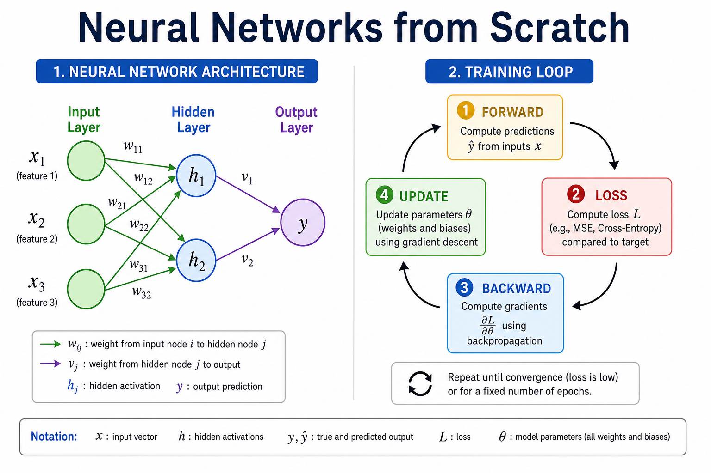
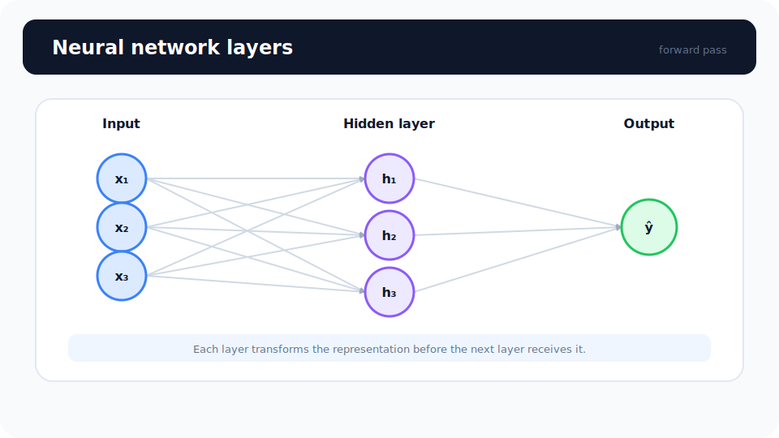
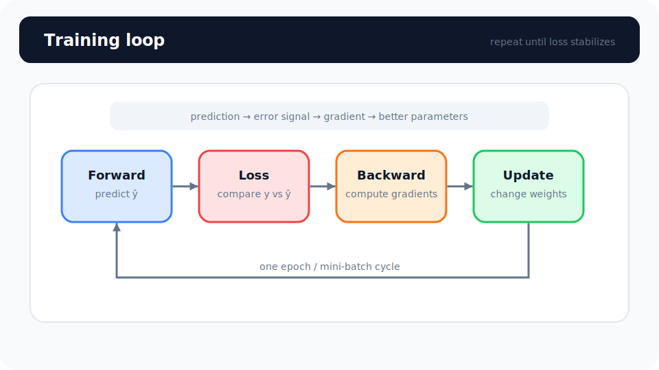

# Unit 10: ゼロから作るニューラルネットワーク

<p class="unit-hero">
  
</p>

> [!TIP]
> **Google Colab で学習を進める方へ**
> ディープラーニング編（Unit 10〜16）では、計算を高速化するために **GPU の有効化** をおすすめします。設定手順は [Appendix (学習環境とキーの準備)](../appendix/index.md) の「Google Colaboratory での学習の進め方」のセクションを最初にご覧ください。
> なお、本 Unit は NumPy による小規模な実装のため CPU で十分動作します（GPU は PyTorch を使う Unit 11 以降で活躍します）。

## 1. ニューラルネットワークの理解

ニューラルネットワークを理解するために、 **「会社での稟議（りんぎ）の決裁プロセス」** に例えてみましょう。

社長（最終的な答え）が「このプロジェクトにGOを出すか？」を決めるために、平社員、係長、部長といった複数の階層（層）を通って情報が伝わります。

1. **入力層（平社員）** : 外部からデータ（プロジェクトの資料）を受け取ります。
2. **隠れ層（係長・部長）** : データを色々な角度から評価し、「これは重要そうだな（重み：ウェイト）」、「いや、うちの部署には関係ない（バイアス）」と判断して、情報を次の階層へ伝えます。この階層がたくさんある（深い）ものを **ディープラーニング** と呼びます。
3. **出力層（社長）** : 最終的に「承認」か「却下」か（犬か猫か、など）の決断を下します。

下図は、この3層構造をノードと接続の構造レベルで表したものです。 **入力層** の `x1, x2, x3` が特徴量、 **隠れ層** の `h1, h2` が中間の変換、 **出力層** の `y` が最終予測に対応します。ノード間の線は重み（ウェイト）による情報の伝達を表します。



| ネットワークの用語          | 会社での例え     | 役割                                             |
| --------------------------- | ---------------- | ------------------------------------------------ |
| **ノード（ニューロン）**    | 社員一人ひとり   | 情報を受け取り、判断して次に渡す                 |
| **重み (Weight)**           | 意見の重要度     | どの情報（誰の意見）を重視するか                 |
| **バイアス (Bias)**         | 部署の基本方針   | そもそも賛成しやすいか、反対しやすいかという偏り |
| **活性化関数 (Activation)** | はんこを押す基準 | 情報が一定の基準を超えたら次に伝えるフィルター   |

このUnitでは、フレームワークに頼らず、この「情報の伝達（順伝播）」と「間違いの修正（誤差逆伝播）」をPythonの計算（NumPy）だけで表現してみましょう！

下図は学習時の **訓練ループ** です。Forward（順伝播）で予測し、Loss（損失）で誤差を計算し、Backward（逆伝播）で重みを修正し、Update（更新）でパラメータを書き換えます。下の **repeat** 矢印のように、この4ステップを収束するまで繰り返すことで、ネットワークが学習します。



### 💡 具体的なビジネスユースケース

- **顧客の離反予測** : ユーザーの行動履歴や契約状況を入力として、解約する確率を予測し、引き留め施策の対象者を抽出する。
- **異常検知システム** : センサーから得られる複数の温度や振動データを入力し、正常時とは異なるパターンの「異常（故障の予兆）」を検知する。
- **融資の審査AI** : 顧客の年収、借入残高、勤続年数などのデータをもとに、ローンの審査基準を満たすかどうか（返済能力があるか）を自動判定する。

---

## 2. 実装例 (Implementation Example)

ここでは、最もシンプルな「1つの隠れ層を持つニューラルネットワーク」を、ゼロから実装してみます。XOR（排他的論理和）という少し複雑なパターンのデータを学習させてみましょう。

まずは必要なライブラリの読み込みと、データの準備です。

```python
import numpy as np

# 入力データ (4つのパターン)
X = np.array([
    [0, 0],
    [0, 1],
    [1, 0],
    [1, 1]
])

# 正解ラベル (XORパターンの答え)
y = np.array([
    [0],
    [1],
    [1],
    [0]
])
```

上記のコードは、2つの入力（例えば「雨が降っているか」「傘を持っているか」のような2択）に対して、答え（0か1か）を持った簡単なデータセットを用意しています。

次に、ネットワークの初期設定を行います。重みとバイアスをランダムに準備します。

```python
# 乱数のシードを固定（毎回同じ結果にするため）
np.random.seed(42)

# ネットワークの形を決める
input_size = 2   # 入力層の人数（2人）
hidden_size = 3  # 隠れ層の人数（3人）
output_size = 1  # 出力層の人数（社長1人）

# 重み（W）とバイアス（b）の初期化
# 係長への重みと基本方針
W1 = np.random.randn(input_size, hidden_size)
b1 = np.zeros((1, hidden_size))

# 社長への重みと基本方針
W2 = np.random.randn(hidden_size, output_size)
b2 = np.zeros((1, output_size))
```

ここでは、入力層（2個）→隠れ層（3個）→出力層（1個）という構造を作っています。`np.random.randn`は「最初は適当に決める」という作業をしています。学習を通じてこの適当な値を正しく直していくのがAIの学習です。

いよいよ学習のメインループです。

```python
# シグモイド関数（活性化関数：0〜1の間に数値を押し込めるフィルター）
def sigmoid(x):
    return 1 / (1 + np.exp(-x))

# シグモイド関数の微分（間違いを修正するときに使います）
# 注意: この関数の引数 x には「シグモイドの出力値（sigmoid(z) の結果）」を渡す前提の実装です。
# シグモイドの微分は sigmoid(z) * (1 - sigmoid(z)) なので、出力値を渡せば x * (1 - x) で計算できます。
def sigmoid_derivative(x):
    return x * (1 - x)

# 学習率（1回の反省でどれくらい思い切り直すか）
learning_rate = 0.5
epochs = 5000 # 学習を繰り返す回数

for epoch in range(epochs):
    # -------------------------
    # 1. 順伝播 (Forward Propagation) - 稟議を上に回す
    # -------------------------
    # 隠れ層の計算
    z1 = np.dot(X, W1) + b1       # 入力 × 重み + バイアス
    a1 = sigmoid(z1)              # フィルターを通す

    # 出力層の計算
    z2 = np.dot(a1, W2) + b2      # 隠れ層の出力 × 重み + バイアス
    output = sigmoid(z2)          # 社長の最終判断 (0〜1の確率)

    # -------------------------
    # 2. 誤差の計算 - 社長の判断と正解のズレを確認
    # -------------------------
    error = output - y

    # -------------------------
    # 3. 誤差逆伝播 (Backpropagation) - 間違いの原因を探って下に伝える
    # -------------------------
    # 出力層の反省点
    d_output = error * sigmoid_derivative(output)

    # 隠れ層の反省点
    error_hidden_layer = d_output.dot(W2.T)
    d_hidden_layer = error_hidden_layer * sigmoid_derivative(a1)

    # -------------------------
    # 4. 重みとバイアスの更新 - 反省を活かしてルールを修正する
    # -------------------------
    W2 -= a1.T.dot(d_output) * learning_rate
    b2 -= np.sum(d_output, axis=0, keepdims=True) * learning_rate
    W1 -= X.T.dot(d_hidden_layer) * learning_rate
    b1 -= np.sum(d_hidden_layer, axis=0, keepdims=True) * learning_rate

print("学習後のAIの予測結果:")
print(np.round(output, 3))
```

**解説:**
ループの中で、大きく分けて以下の4ステップを繰り返しています。

1. **順伝播** : 入力データから、現在の重みを使って予測値を出します（稟議が上がっていく）。
2. **誤差の計算** : 予測値と正解がどれくらいズレているか（間違えたか）を計算します。
3. **誤差逆伝播（バックプロパゲーション）** : 出口（出力層）から入り口（隠れ層）に向かって、「誰のせいで間違えたのか（誰の重みを直せばいいか）」を計算して遡ります。
4. **更新** : 計算した「直すべき量」をもとに、重み（W）とバイアス（b）を微調整します。

なお、このネットワークが最小化しようとしている「ズレの指標（損失関数）」は、 **誤差の二乗和** （データ数で平均すれば **平均二乗誤差：MSE**）です。コードでは `error = output - y` を損失の微分方向として使い、重みを `-=` で更新しています。つまり、予測と正解の差を二乗した合計が小さくなる方向へ、勾配降下法でパラメータを動かしています。次の Unit 11 以降では、この損失関数を PyTorch の `nn.MSELoss` などとして明示的に指定するようになります。

これを5000回（エポック）繰り返すことで、AIは徐々に正解を導き出せる賢いネットワークへと成長します。

## 3. 実践 (Practice)

さあ、あなたの番です！まずは簡単な「OR回路（どちらかが1なら正解は1）」で学習ループを再実装し、その後に発展課題としてXORへ戻ってください。ORは線形分離可能なので、実装ミスを切り分ける段階に向いています。XORでは、隠れ層と非線形活性化がない場合に学習できないことを確認し、今回のUnitの中心概念を再確認します。

**要件定義:**

- 入力データ `X` と正解ラベル `y` を以下のように設定してください。
  - `X = np.array([[0, 0], [0, 1], [1, 0], [1, 1]])`
  - `y = np.array([[0], [1], [1], [1]])`
- 入力層は2、隠れ層は2、出力層は1のネットワークを構築してください。
- 活性化関数にはシグモイド関数を使用します。
- エポック数は3000回とし、学習後に予測値を出力して正解（0, 1, 1, 1 に近い値）になっているか確認してください。

**ヒント:**
ベースの実装例のコードをコピーして、データセットと隠れ層のサイズ（`hidden_size`）を変更するだけで動作するはずです！

## 4. 答え合わせ (Answer Key)

<details>
<summary>解答例を見る（クリックで展開）</summary>

```python
import numpy as np

# データの準備 (OR回路)
X = np.array([
    [0, 0],
    [0, 1],
    [1, 0],
    [1, 1]
])
y = np.array([
    [0],
    [1],
    [1],
    [1]
])

# 活性化関数とその微分
def sigmoid(x):
    return 1 / (1 + np.exp(-x))

def sigmoid_derivative(x):
    return x * (1 - x)

# ネットワークの構築
np.random.seed(42)
input_size = 2
hidden_size = 2  # 隠れ層を2人に変更
output_size = 1

W1 = np.random.randn(input_size, hidden_size)
b1 = np.zeros((1, hidden_size))
W2 = np.random.randn(hidden_size, output_size)
b2 = np.zeros((1, output_size))

# 学習ループ
learning_rate = 0.5
epochs = 3000

for epoch in range(epochs):
    # 1. 順伝播
    z1 = np.dot(X, W1) + b1
    a1 = sigmoid(z1)
    z2 = np.dot(a1, W2) + b2
    output = sigmoid(z2)

    # 2. 誤差計算
    error = output - y

    # 3. 誤差逆伝播
    d_output = error * sigmoid_derivative(output)
    error_hidden_layer = d_output.dot(W2.T)
    d_hidden_layer = error_hidden_layer * sigmoid_derivative(a1)

    # 4. 更新
    W2 -= a1.T.dot(d_output) * learning_rate
    b2 -= np.sum(d_output, axis=0, keepdims=True) * learning_rate
    W1 -= X.T.dot(d_hidden_layer) * learning_rate
    b1 -= np.sum(d_hidden_layer, axis=0, keepdims=True) * learning_rate

print("学習後のAIの予測結果 (0, 1, 1, 1 に近ければ成功):")
print(np.round(output, 3))
```

### 解説

実行してみると、XOR のときよりも少ないエポック数（3000回）や小さい隠れ層（2人）でも、あっさり正解にたどり着けることに気づいたでしょうか。これは偶然ではなく、 **OR 問題が「線形分離可能」な問題だから** です。OR は「入力のどちらかが 1 なら正解は 1」というルールなので、グラフ上に4つの点を描くと、1本の直線で「答えが 0 のグループ」と「答えが 1 のグループ」をスパッと分けられます。このような問題は、実は隠れ層のない単層のネットワーク（パーセプトロン）でも解けてしまいます。一方、XOR は「同じなら 0、違うなら 1」という関係のため、どんな直線を引いても2つのグループを分けられず、隠れ層による非線形な変換が必須になります。つまり、隠れ層の本当の価値は「直線では分けられない複雑なパターンを学習できること」にあり、OR のような簡単な問題ではその力を持て余している、というわけです。

</details>
