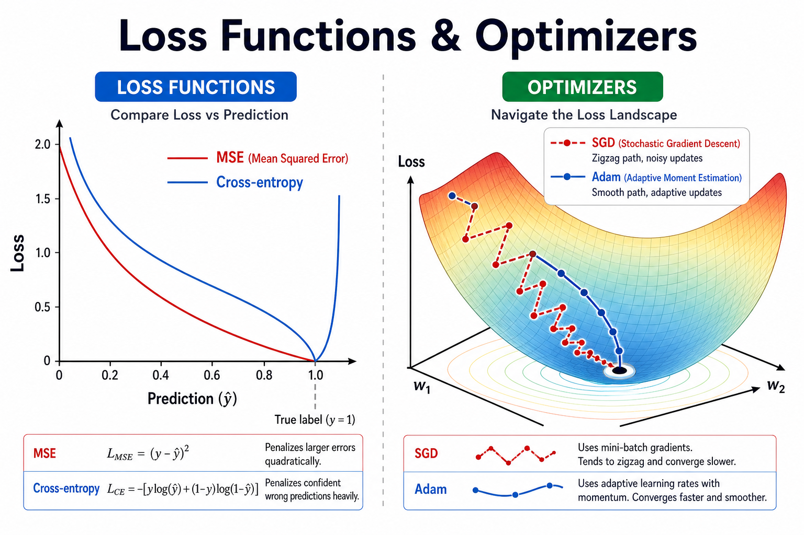
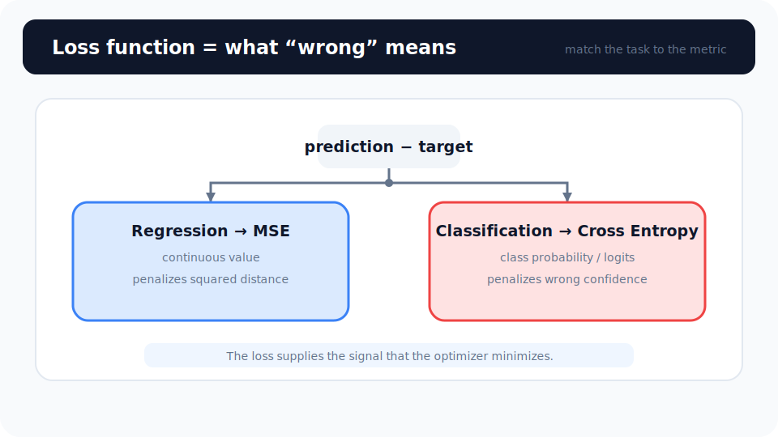
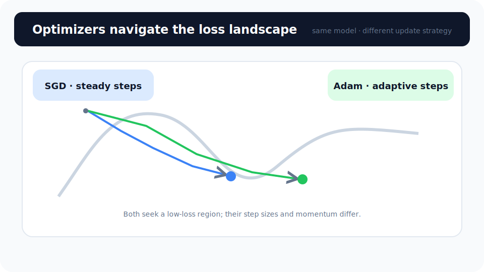

# Unit 12: 最適化手法と損失関数

<p class="unit-hero">
  
</p>

> [!TIP]
> **Google Colab で学習を進める方へ**
> ディープラーニング編（Unit 10〜16）では、計算を高速化するために **GPU の有効化** をおすすめします。設定手順は [Appendix (学習環境とキーの準備)](../appendix/index.md) の「Google Colaboratory での学習の進め方」のセクションを最初にご覧ください。

## 1. Optimizers & Loss Functions の理解

AIの学習において、「損失関数（Loss Function）」と「最適化手法（Optimizer）」は車の「ナビ」と「エンジン」のような関係です。この2つがうまく連携することで、AIはゴール（正解）にたどり着くことができます。

**損失関数（Loss Function）＝ カーナビの「目的地までの残り距離」**
現在のAIの予測が、実際の正解から「どれくらいズレているか」を計算する数式です。このズレ（Loss）が0になることを目指します。

- **MSE (平均二乗誤差)** : 数値を予測するとき（例：明日の気温）に使います。
- **Cross Entropy (交差エントロピー)** : 分類をするとき（例：犬か猫か）に使います。

**最適化手法（Optimizer）＝ 目的地にたどり着くための「乗り物（戦略）」**
Lossを減らすために、ネットワークの重み（W）をどのように直していくかを決める戦略です。山頂から、目隠しをして谷底（Loss=0）を目指して下山するイメージを持ってみましょう。

| Optimizerの種類            | 下山の例え（特徴）           | メリット・デメリット                                                   |
| -------------------------- | ---------------------------- | ---------------------------------------------------------------------- |
| **SGD (確率的勾配降下法)** | 杖をついて一歩ずつ慎重に下る | 確実だが、時間がかかり、途中のくぼみ（局所最適解）にハマりやすい。     |
| **Momentum (モメンタム)**  | 坂道にボールを転がす         | 勢いがつくのでくぼみを抜け出しやすいが、行き過ぎることもある。         |
| **Adam (アダム)**          | GPS搭載のスマート自動運転車  | 現在のAI開発で **一番人気** 。賢くスピード調整して最速で谷底へ向かう！ |

なお、表で紹介した Momentum は独立したクラスではなく、SGD の引数として指定して使えます。

```python
optimizer_momentum = optim.SGD(model.parameters(), lr=0.01, momentum=0.9)
```

このUnitでは、これらの「乗り物」を乗り換えることで、学習のスピードがどう変わるのかを実際にコードで確認してみましょう！

下図は、回帰向け **MSE** と分類向け **Cross-entropy** の損失曲線の違いです。



### 💡 具体的なビジネスユースケース

- **レコメンドエンジンの最適化** : ユーザーが商品をクリックしたか（Cross Entropy Loss）や、商品の評価スコアのズレ（MSE）を最小化するようAdamなどのOptimizerで高速に学習させ、売上を最大化する。
- **広告のクリック率（CTR）予測** : 表示された広告がクリックされる確率を予測するモデルにおいて、日々大量に発生するログデータに合わせて最適なOptimizerを選択し、予測精度を迅速に改善する。
- **ダイナミックプライシング** : 航空券やホテルの宿泊費などをリアルタイムで変動させる際、収益と需要のズレ（Loss）をリアルタイムで修正・最適化しながら価格を算出する。

下図は、固定ステップの **SGD** と適応的な **Adam** の更新の違いです。



## 2. 実装例 (Implementation Example)

ここでは、全く同じネットワークとデータを使って、「SGD（徒歩）」と「Adam（スマート車）」でどれくらい学習スピードに差が出るかを比較するコードを書きます。

まずは準備です。今回は少し複雑な関数（サイン波）を学習させてみます。

```python
import torch
import torch.nn as nn
import torch.optim as optim

# 1. データの準備 (サイン波の近似)
torch.manual_seed(42)
X = torch.linspace(-5, 5, 100).view(-1, 1) # -5から5までの数値を100個
y = torch.sin(X) + torch.randn(X.size()) * 0.1 # 正解はサイン波（少しノイズを混ぜる）

# 2. ネットワークの設計図 (共通で使う)
class SimpleNet(nn.Module):
    def __init__(self):
        super(SimpleNet, self).__init__()
        self.net = nn.Sequential(
            nn.Linear(1, 16),
            nn.ReLU(),
            nn.Linear(16, 16),
            nn.ReLU(),
            nn.Linear(16, 1)
        )
    def forward(self, x):
        return self.net(x)
```

`nn.Sequential` は、層を順番に繋げるのを簡単に書けるPyTorchの便利機能です。

次に、2つのモデルを用意して、それぞれに別の「乗り物（Optimizer）」を割り当てます。

```python
import copy

# SGD用のモデルを用意
model_sgd = SimpleNet()

# Adam用のモデルは model_sgd の完全コピーとして作成
# （公平な比較のため、2つのモデルの初期重みを完全に揃えます）
model_adam = copy.deepcopy(model_sgd)

# 損失関数（ナビ）は共通でMSE（数値予測のため）
criterion = nn.MSELoss()

# Optimizer（乗り物）の設定
# SGDは一歩の幅（学習率 lr）を0.01に設定
optimizer_sgd = optim.SGD(model_sgd.parameters(), lr=0.01)

# Adamは賢いので同じ学習率でもスピード感が違います
optimizer_adam = optim.Adam(model_adam.parameters(), lr=0.01)
```

いよいよ、2つの車を同時に走らせて（学習させて）比較してみましょう。

```python
epochs = 300

print("--- 学習スタート ---")
for epoch in range(epochs):
    # --- SGDの学習 ---
    pred_sgd = model_sgd(X)
    loss_sgd = criterion(pred_sgd, y)
    optimizer_sgd.zero_grad()
    loss_sgd.backward()
    optimizer_sgd.step()

    # --- Adamの学習 ---
    pred_adam = model_adam(X)
    loss_adam = criterion(pred_adam, y)
    optimizer_adam.zero_grad()
    loss_adam.backward()
    optimizer_adam.step()

    # 50回ごとに結果を報告
    if (epoch + 1) % 50 == 0:
        print(f"Epoch {epoch+1:3d} | SGD Loss: {loss_sgd.item():.4f} | Adam Loss: {loss_adam.item():.4f}")
```

**解説:**
出力結果を見ると、最初の数エポックで「Adam」のLoss（ズレ）が「SGD」よりも圧倒的なスピードで小さくなっていくことがわかるはずです。
Adamは「ここは急な坂だから大きく進もう」「ここは平坦だから少しずつ進もう」という調整を自動で行ってくれるため、特に複雑なデータにおいて非常に強力です。そのため、 **「迷ったらとりあえずAdamを使え」** というのが現在のディープラーニングの鉄則になっています。

## 3. 実践 (Practice)

今度は分類問題（Classification）でLossとOptimizerを設定してみましょう。

**要件定義:**

- アヤメの花の分類などでよく使う「3種類のクラス分類」を想定したダミーデータを用意します。（コード提供済み）
- 分類問題なので、損失関数には `nn.CrossEntropyLoss()` を使用してください。
- Optimizerには `optim.Adam` を使用し、学習率（`lr`）を `0.05` に設定してください。
- エポック数を 100 にして学習ループを完成させ、Lossが下がっていくことを確認してください。

**ヒント:**
`nn.CrossEntropyLoss` を使う場合、正解データ `y` の型は `torch.long`（整数）である必要があります。また、ネットワークの最終出力にSoftmaxなどをかける必要はありません（Loss関数の中で自動的に計算してくれます！）。

```python
# データの準備（ヒント）
# 4つのデータ、それぞれ3つの特徴量
X_class = torch.randn(4, 3)
# 正解クラスは 0, 1, 2 のどれか
y_class = torch.tensor([0, 2, 1, 0], dtype=torch.long)
```

## 4. 答え合わせ (Answer Key)

<details>
<summary>解答例を見る（クリックで展開）</summary>

```python
import torch
import torch.nn as nn
import torch.optim as optim

# 1. データの準備
torch.manual_seed(42)
X_class = torch.randn(4, 3) # 4つのデータ、3つの入力特徴
y_class = torch.tensor([0, 2, 1, 0], dtype=torch.long) # 正解は3クラス (0, 1, 2)

# 2. ネットワークの定義
class ClassificationNet(nn.Module):
    def __init__(self):
        super(ClassificationNet, self).__init__()
        # 3入力 -> 5隠れ層 -> 3出力（各クラスの logits（Softmax 適用前のスコア）を出すため）
        self.net = nn.Sequential(
            nn.Linear(3, 5),
            nn.ReLU(),
            nn.Linear(5, 3)
        )
    def forward(self, x):
        return self.net(x)

model = ClassificationNet()

# 3. 損失関数とOptimizerの設定
# 分類問題なのでCrossEntropyLossを使用
criterion = nn.CrossEntropyLoss()
# OptimizerはAdamを使用（分類例で扱いやすい標準的な学習率）
optimizer = optim.Adam(model.parameters(), lr=0.01)

# 4. 学習ループ
epochs = 100

print("--- 分類タスク 学習スタート ---")
for epoch in range(epochs):
    # ① 予測
    predictions = model(X_class)

    # ② 誤差計算
    loss = criterion(predictions, y_class)

    # ③〜⑤ 更新
    optimizer.zero_grad()
    loss.backward()
    optimizer.step()

    if (epoch + 1) % 20 == 0:
        print(f"Epoch {epoch+1:3d} | Loss: {loss.item():.4f}")

# 学習後の予測（スコアが一番高いインデックスがAIの予測したクラス）
final_preds = model(X_class).argmax(dim=1)
print(f"正解ラベル: {y_class.tolist()}")
print(f"AIの予測:   {final_preds.tolist()}")
```

### 解説

このコードのポイントは、 **ネットワークの最終出力に Softmax を付けていない** ことです。モデルの出力層（`nn.Linear(5, 3)`）が返すのは、各クラスに対する「logits（Softmax 適用前の生のスコア）」であり、確率にはなっていません。それでも問題ないのは、`nn.CrossEntropyLoss` が内部で Softmax（正確には LogSoftmax）を適用してから誤差を計算してくれるからです。もしモデル側でも Softmax をかけてしまうと、Softmax が二重に適用されて学習がうまく進まなくなるため、「CrossEntropyLoss を使うときはモデル出力は logits のままにする」というのが PyTorch のお作法です。また、予測時に `argmax(dim=1)` で「スコアが最大のクラス」を選んでいますが、Softmax は大小関係を変えない変換なので、logits のまま argmax しても結果は確率で選んだ場合と同じになります。

</details>
