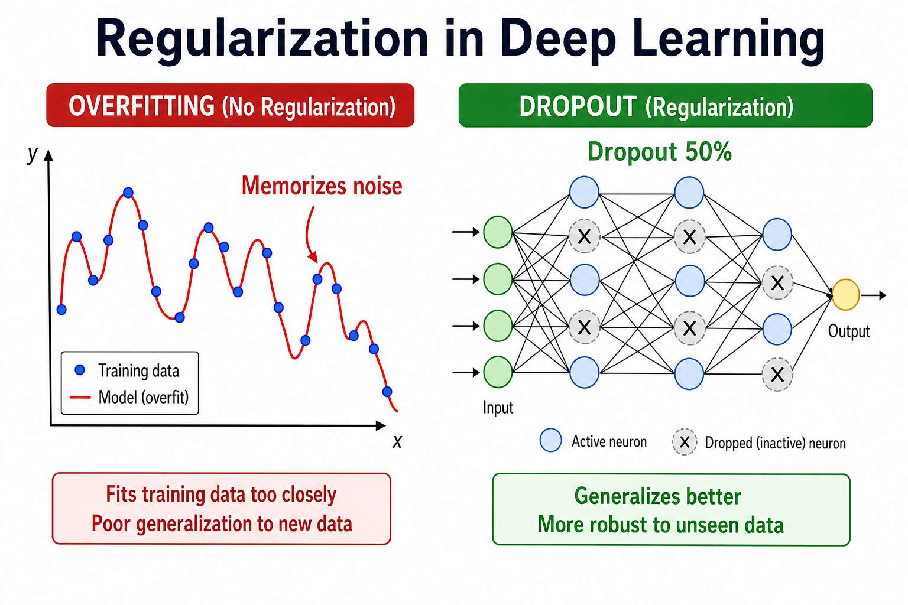
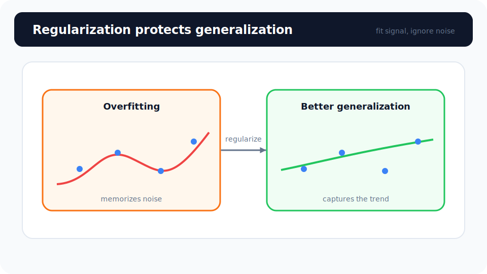
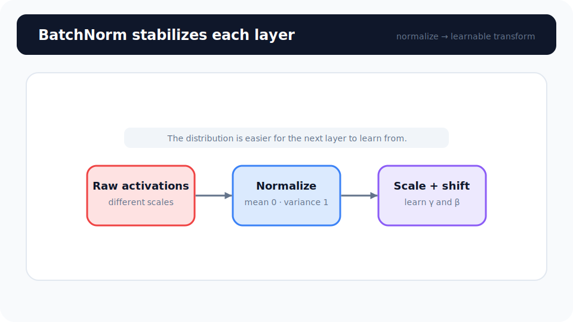

# Unit 13: ディープラーニングにおける過学習防止策

<p class="unit-hero">
  
</p>

> [!TIP]
> **Google Colab で学習を進める方へ**
> ディープラーニング編（Unit 10〜16）では、計算を高速化するために **GPU の有効化** をおすすめします。設定手順は [Appendix (学習環境とキーの準備)](../appendix/index.md) の「Google Colaboratory での学習の進め方」のセクションを最初にご覧ください。

## 1. Regularization in DL の理解

ディープラーニングの世界には、「過学習（Overfitting）」という恐ろしい罠が潜んでいます。

**過学習とは？ ＝「過去問の丸暗記」**
試験勉強で、過去問の答えを「A, C, B, A…」と順番まで丸暗記して100点を取れるようになったとします。しかし、本番のテストで少し違う問題が出ると、全く解けずに0点になってしまいます。
AIも同じで、訓練データに合わせすぎた結果、未知のデータに対応できなくなる現象を「過学習」と呼びます。

これを防ぐためのテクニックが **「正則化（Regularization）」** です。正則化は、AIに「ズルをさせずに、本質を理解させるためのスパルタ教育」のようなものです。

代表的な4つのテクニックを紹介します。

| テクニック名                           | 例え話                                   | 仕組み                                                                                                                                                 |
| -------------------------------------- | ---------------------------------------- | ------------------------------------------------------------------------------------------------------------------------------------------------------ |
| **Dropout (ドロップアウト)**           | 勉強会のメンバーをランダムに休ませる     | 学習のたびに、ネットワークの一部（ニューロン）をランダムに活動停止させます。一部の「優秀な細胞」に頼り切るのを防ぎ、全員がしっかり働くようになります。 |
| **Weight Decay (重み減衰 / L2正則化)** | 発言力が強すぎる社員にペナルティを与える | 一部の重み（Weight）が極端に大きくなるのを防ぎ、ネットワーク全体のバランスを保ちます。Optimizerの設定で簡単に使えます。                                |
| **Early Stopping (早期終了)**          | 徹夜勉強を禁止する                       | 学習を進めていって、本番用テスト（検証データ）の成績が下がり始めたら、過学習が始まった合図です。そこで学習をストップさせます。                         |
| **BatchNorm (バッチ正規化)**           | 授業ごとにテストの平均点を揃える         | 各層の出力値を正規化（平均0・分散1に揃える）して、学習を安定・高速化します。副次的に正則化効果もあり、Dropoutと併用されることも多いです。              |

> [!NOTE]
> **📌 BatchNormの補足説明**
>
> **BatchNorm（Batch Normalization）** は、ネットワークの各層の出力を正規化して学習を安定・高速化する手法です。
> 授業のたびにテストの採点基準（平均と分散）を統一するようなもので、層が深くなっても学習が暴走しにくくなります。
>
> - **正則化効果もある** : ミニバッチ単位で統計量を計算するため、ノイズが入り軽い正則化として働きます。Dropoutと併用も可能です。
> - **PyTorchでの使い方** : 画像（CNN）では `nn.BatchNorm2d(channels)`、全結合層では `nn.BatchNorm1d(features)` を使います。
> - **このUnitでの扱い** : ここではDropoutとWeight Decayの実装に集中します。BatchNormは [Unit 16（Capstone）](../unit16_deep_learning_capstone/index.md) で実際にCNNに組み込んで使いますので、お楽しみに！

このUnitでは、PyTorchを使って「Dropout」「Weight Decay」「Early Stopping」をネットワークに組み込む方法を学びましょう！

下図は、左の **過学習（ノイズへの追従）** と、右の **Dropout** による正則化を比較しています。



### 💡 具体的なビジネスユースケース

- **医療画像診断サポート** : 「特定の病院の装置だけで撮った画像」に過学習するのを防ぎ、どんな病院のレントゲン写真でも安定して異常を検知できる汎用的なモデルを作る。
- **クレジットカードの不正利用検知** : 過去の限られた不正パターン（過去問）を丸暗記させず、Dropoutなどで正則化することで、未知の新しい手口の詐欺にも柔軟に対応できるAIを構築する。
- **株価や為替の予測** : 金融の時系列データはノイズ（一時的な変動）が非常に多いため、Weight Decayなどを用いてノイズに過剰反応しない（過学習しない）堅牢な予測モデルを作成する。

下図は、 **BatchNorm** による正規化→スケール→シフトの流れです。



## 2. 実装例 (Implementation Example)

ここでは、過学習しやすい「複雑すぎるネットワーク」に対して、DropoutとWeight Decayを適用して、スパルタ教育を施す実装を行います。

まずは、PyTorchの準備です。

```python
import torch
import torch.nn as nn
import copy
import torch.optim as optim

# ダミーデータ（今回は構造を見るだけなので適当なデータ）
X = torch.randn(10, 5) # 10件のデータ、5つの特徴量
y = torch.randn(10, 1)
```

次に、Dropoutを組み込んだネットワークを設計します。

```python
class RegularizedNet(nn.Module):
    def __init__(self):
        super(RegularizedNet, self).__init__()
        self.fc1 = nn.Linear(5, 50)
        # ここがDropout！ 引数の 0.5 は「毎回50%のニューロンをランダムにお休みさせる」という意味です
        self.dropout = nn.Dropout(p=0.5)
        self.fc2 = nn.Linear(50, 1)

    def forward(self, x):
        x = self.fc1(x)
        x = torch.relu(x)

        # 隠れ層の後にDropoutを通します
        x = self.dropout(x)

        x = self.fc2(x)
        return x

model = RegularizedNet()
```

`nn.Dropout(p=0.5)` を入れるだけで、PyTorchが自動的に「毎回の学習で違う50%の細胞」をオフにしてくれます。

続いて、Weight Decay（重み減衰）の設定です。これはネットワークの中ではなく、Optimizerの中で設定します。

```python
criterion = nn.MSELoss()

# weight_decay=1e-4 (0.0001) を追加するだけで、L2正則化が適用されます！
optimizer = optim.Adam(model.parameters(), lr=0.01, weight_decay=1e-4)
```

最後に学習ループですが、Dropoutを使う場合には **超重要なルール** があります。

```python
# 【超重要】学習モードに切り替える（DropoutがONになる）
model.train()

for epoch in range(100):
    optimizer.zero_grad()
    predictions = model(X)
    loss = criterion(predictions, y)
    loss.backward()
    optimizer.step()

# 【超重要】評価（本番）モードに切り替える（DropoutがOFFになる）
model.eval()

with torch.no_grad(): # 評価時は勾配計算（反省）をストップしてメモリを節約
    test_predictions = model(X)
    print("本番モードでの予測完了！")
```

**解説:**
Dropoutは「訓練中のスパルタ教育」なので、 **本番のテストの時にお休みされては困ります。**
そのため、PyTorchでは：

- 学習中は `model.train()` を呼び出してDropoutを有効にする。
- 予測（テスト）時は `model.eval()` を呼び出して、全員出社させてフルパワーで予測する。
  という切り替えが絶対に必要になります。これを忘れると、本番でも50%の力が発揮できず、精度がガタ落ちするので注意しましょう！

最後に、3つ目のテクニック **Early Stopping（早期終了）** の最小実装も見ておきましょう。検証データの Loss（val loss）を毎エポック監視し、「patience 回連続で改善しなかったら学習を打ち切る」というシンプルなループです。

```python
# このコードブロックだけを試す場合も必要
import copy

# ダミーの検証データ
X_val, y_val = torch.randn(10, 5), torch.randn(10, 1)

best_val_loss = float('inf')  # これまでの最高記録（小さいほど良い）
best_state = copy.deepcopy(model.state_dict())
patience = 5                  # 何回連続で改善しなかったら諦めるか
counter = 0                   # 改善しなかった回数のカウンター

for epoch in range(1000):
    model.train()
    optimizer.zero_grad()
    loss = criterion(model(X), y)
    loss.backward()
    optimizer.step()

    # 検証データでの成績（val loss）をチェック
    model.eval()
    with torch.no_grad():
        val_loss = criterion(model(X_val), y_val).item()

    if val_loss < best_val_loss:
        best_val_loss = val_loss  # 記録更新！
        best_state = copy.deepcopy(model.state_dict())
        counter = 0
    else:
        counter += 1
        if counter >= patience:  # patience回改善なし → 過学習の合図
            print(f"Epoch {epoch+1} で早期終了（val loss が {patience} 回改善せず）")
            break

# 最後のエポックではなく、検証損失が最も小さかった状態を採用する
model.load_state_dict(best_state)
```

「徹夜勉強（学習のしすぎ）」が始まる前に切り上げる、というのをコードで表現しただけなので、仕組みはとてもシンプルですね。

## 3. 実践 (Practice)

DropoutとWeight Decayの書き方に慣れましょう。

**要件定義:**

- 入力層(10) → 隠れ層1(64) → 隠れ層2(32) → 出力層(1) のネットワーク `MyRobustNet` を作ってください。
- 隠れ層1と隠れ層2のそれぞれの後に、 **確率 0.3 のDropout** を入れてください。（活性化関数 ReLU の直後にそれぞれ入れます）
- Optimizerには `Adam` を使用し、学習率を `0.005`、 **Weight Decay を 0.001** に設定してください。
- `model.train()` と `model.eval()` の切り替えを意識して、10エポックだけ学習ループを回し、最後に評価モードでダミーデータの予測を行ってください。

**ヒント:**

- `nn.Dropout(p=0.3)` は `__init__` で1つ定義しておけば、`forward` の中で何度も使い回すことができます。

## 4. 答え合わせ (Answer Key)

<details>
<summary>解答例を見る（クリックで展開）</summary>

```python
import torch
import torch.nn as nn
import torch.optim as optim

# 1. データ準備
torch.manual_seed(42)
X_train = torch.randn(20, 10)
y_train = torch.randn(20, 1)
X_val = torch.randn(10, 10)
y_val = torch.randn(10, 1)

# 2. ネットワーク定義
class MyRobustNet(nn.Module):
    def __init__(self):
        super(MyRobustNet, self).__init__()
        self.fc1 = nn.Linear(10, 64)
        self.fc2 = nn.Linear(64, 32)
        self.fc3 = nn.Linear(32, 1)

        # Dropoutの定義 (p=0.3)
        self.dropout = nn.Dropout(p=0.3)
        self.relu = nn.ReLU()

    def forward(self, x):
        # 1層目
        x = self.fc1(x)
        x = self.relu(x)
        x = self.dropout(x) # スパルタ教育

        # 2層目
        x = self.fc2(x)
        x = self.relu(x)
        x = self.dropout(x) # スパルタ教育

        # 出力層
        x = self.fc3(x)
        return x

model = MyRobustNet()

# 3. 損失関数とOptimizer
criterion = nn.MSELoss()
# weight_decayでL2正則化を適用
optimizer = optim.Adam(model.parameters(), lr=0.005, weight_decay=0.001)

# 4. 学習ループ
epochs = 10

print("--- 学習（訓練モード） ---")
model.train() # 【重要】DropoutをON

for epoch in range(epochs):
    optimizer.zero_grad()
    predictions = model(X_train)
    loss = criterion(predictions, y_train)
    loss.backward()
    optimizer.step()
    print(f"Epoch {epoch+1:2d} | Loss: {loss.item():.4f}")

# 5. 評価
print("\n--- 評価（本番モード） ---")
model.eval() # 【重要】DropoutをOFF（全員出社）

# 本番の予測では no_grad を使うのがベストプラクティス
with torch.no_grad():
    final_pred = model(X_val)
    print("検証データへの予測が完了しました（最初の3件の予測値）:")
    print(final_pred[:3].flatten().numpy())
```

### 解説

Dropout が「ニューロンをランダムに休ませる」目に見えるスパルタ教育だったのに対し、`weight_decay` で適用される **Weight Decay（L2 ペナルティ）** は少し地味な働き者です。Weight Decay は「重みの2乗の合計」をペナルティとして Loss に加算することで、一部の重みだけが極端に大きくなるのを防ぎ、 **重み全体を小さく保つことでモデルが複雑になりすぎる（訓練データのノイズにまで過剰にフィットする）のを防ぎます** 。重みが小さいモデルは予測の曲線がなだらかになるため、未知のデータに対しても安定した予測ができるようになる、というわけです。

</details>
