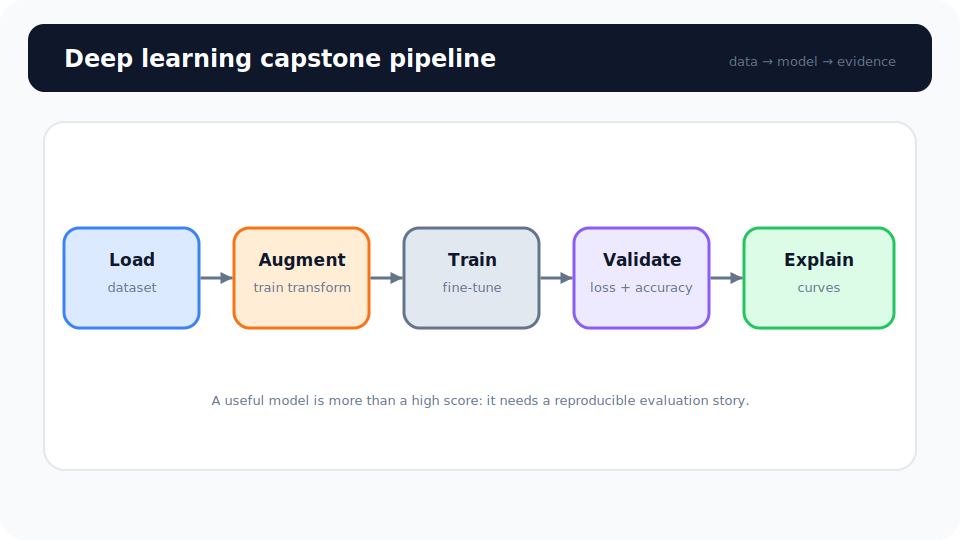
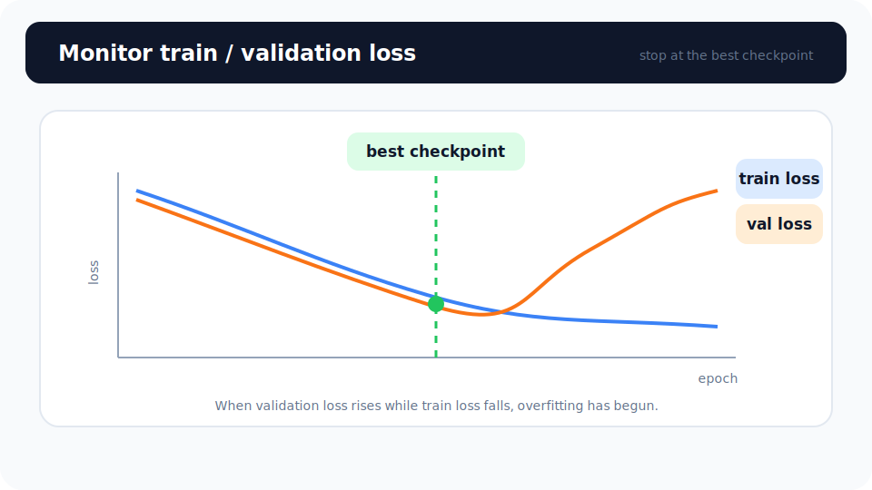

# Unit 16: ディープラーニング総合演習 (Capstone)

<p class="unit-hero">
  
</p>

> [!TIP]
> **Google Colab で学習を進める方へ**
> ディープラーニング編（Unit 10〜16）では、計算を高速化するために **GPU の有効化** をおすすめします。設定手順は [Appendix (学習環境とキーの準備)](../appendix/index.md) の「Google Colaboratory での学習の進め方」のセクションを最初にご覧ください。

## 1. 総合ディープラーニングモデル構築の理解

第2章（Unit 10〜15）において、ディープラーニングの根底にあるニューラルネットワークの仕組みから、PyTorchのテンソル操作、最適化関数、正則化（Dropout・BatchNorm）、および画像認識を劇的に進化させたCNNや「転移学習」までを学習してきました。

> [!TIP]
> ここで登場する **BatchNorm（バッチ正規化）** は、[Unit 13（過学習防止策）](../unit13_regularization/index.md) で学んだ正則化手法の一つです。各層の出力を正規化して学習を安定・高速化する手法で、この演習では、実装例のカスタム分類ヘッドに `nn.BatchNorm1d()` を、答え合わせの自作CNNの畳み込み層に `nn.BatchNorm2d()` として実際に組み込みます。

この総合演習では、それらの知識を全て結合し、 **「カスタムの画像データを読み込み ➔ データの拡張（Data Augmentation）を施し ➔ 過学習対策を適用した転移学習モデルを構築し ➔ 訓練ロスと精度の学習曲線を可視化して評価する」** という、プロレベルの画像認識ソリューションを一気通貫で構築します。

**💡 日常の例え：新人シェフの秘伝のタレ（転移学習と適応）**

- **ベースモデル（ResNet）** : 一流フランス料理店で長年修行した「完璧な下地のあるシェフ」。
- **データ拡張（Augmentation）** : 同じ食材でも、千切り、みじん切り、ローストなど様々な調理法（回転、トリミング、色調変化）で扱い、食材の見た目が少し変わっても本質を見抜くスキル。
- **過学習対策（Dropoutなど）** : 特定のメニューに固執せず、どんな料理にも対応できる柔軟さを保つブレーキ。
- **学習曲線のプロット** : 毎日料理の味見（評価）をして、スープの濃度（Loss）とお客様の笑顔（Accuracy）が綺麗に安定して推移しているかをチャートに記録し、一番美味しいポイント（Early Stopping）で見極めること。

下図は、データ読み込みから可視化までの **画像分類パイプライン** です。



---

下図は、 **訓練精度と検証精度** の乖離を監視し、早期停止を判断するカーブです。



## 2. 実装例 (Implementation Example)

ここでは、PyTorchと `torchvision` のユーティリティを使い、ラベルと相関を持たせた合成画像データをカスタムデータセットとして読み込み、`ResNet18` を転移学習させて訓練曲線と精度曲線をMatplotlibでプロットする完全なパイプラインを実装します。

事前に `pip install torch torchvision matplotlib` を実行してください。

```python
import torch
import torch.nn as nn
import torch.optim as optim
from torch.utils.data import Dataset, DataLoader, random_split
import torchvision.transforms as transforms
import torchvision.models as models
import matplotlib.pyplot as plt
import numpy as np

# 乱数シードの固定
torch.manual_seed(42)

# 1. カスタムダミーデータセットの作成 (3チャンネルのカラー画像100x100)
# 「学習可能な構造」を持つ合成データを生成します。
# クラス0は「明るい画像」、クラス1は「暗い画像」として、ラベルと画像の明るさに相関を持たせます。
# （完全ランダムな画像＋ランダムなラベルでは学習できるパターンが存在せず、精度比較が成立しないためです）
class DummyImageDataset(Dataset):
    def __init__(self, num_samples=100):
        self.num_samples = num_samples
        self.labels = torch.randint(0, 2, (num_samples,))
        # クラス0は平均0.7（明るい）、クラス1は平均0.3（暗い）のガウス分布から画像を生成
        means = torch.where(self.labels.view(-1, 1, 1, 1) == 0,
                            torch.tensor(0.7), torch.tensor(0.3))
        self.images = (torch.randn(num_samples, 3, 100, 100) * 0.1 + means).clamp(0.0, 1.0)

    def __len__(self):
        return self.num_samples

    def __getitem__(self, idx):
        return self.images[idx], self.labels[idx]

# 2. データの拡張 (Data Augmentation) と正規化の設定
train_transform = transforms.Compose([
    transforms.ToPILImage(),
    transforms.RandomHorizontalFlip(), # ランダム左右反転
    transforms.RandomRotation(15),     # ランダム回転
    transforms.Resize((224, 224)),     # ResNetの標準サイズへリサイズ
    transforms.ToTensor(),
    transforms.Normalize(mean=[0.485, 0.456, 0.406], std=[0.229, 0.224, 0.225]) # ImageNet標準の正規化
])

val_transform = transforms.Compose([
    transforms.ToPILImage(),
    transforms.Resize((224, 224)),
    transforms.ToTensor(),
    transforms.Normalize(mean=[0.485, 0.456, 0.406], std=[0.229, 0.224, 0.225])
])

# 同一のデータセット（100枚）を1つだけ作り、訓練80枚・検証20枚に random_split で分割します
# （訓練用と検証用を別々に生成すると、同じ分布からの分割にならず正しい検証になりません）
full_dataset = DummyImageDataset(num_samples=100)
train_subset, val_subset = random_split(
    full_dataset, [80, 20], generator=torch.Generator().manual_seed(42)
)

# 分割後の Subset に、訓練用・検証用それぞれの transform を適用する薄いラッパー
class TransformedDataset(Dataset):
    def __init__(self, subset, transform):
        self.subset = subset
        self.transform = transform
    def __len__(self):
        return len(self.subset)
    def __getitem__(self, idx):
        img, label = self.subset[idx]
        return self.transform(img), label

train_dataset = TransformedDataset(train_subset, train_transform)
val_dataset = TransformedDataset(val_subset, val_transform)

train_loader = DataLoader(train_dataset, batch_size=8, shuffle=True)
val_loader = DataLoader(val_dataset, batch_size=8, shuffle=False)

# 3. 転移学習モデルの構築 (ResNet18)
weights = models.ResNet18_Weights.DEFAULT
model = models.resnet18(weights=weights)

# Unit 15 で学んだ「凍結」方針: バックボーン（特徴抽出部）の重みは固定し、
# 新しく付け替える分類ヘッドだけを学習させます
for param in model.parameters():
    param.requires_grad = False

num_features = model.fc.in_features
model.fc = nn.Sequential(
    nn.BatchNorm1d(num_features), # 特徴量を正規化して学習を安定させる（Unit 13 の BatchNorm）
    nn.Dropout(0.5),              # 過学習を防ぐDropoutを追加
    nn.Linear(num_features, 2)
)

# 4. 損失関数と最適化関数の設定
criterion = nn.CrossEntropyLoss()
# 凍結していない分類ヘッド（model.fc）のパラメータだけを Optimizer に渡します
optimizer = optim.Adam(model.fc.parameters(), lr=0.001)

device = torch.device("cuda" if torch.cuda.is_available() else "cpu")
model = model.to(device)

# 5. 訓練と検証のループ（Early Stopping 付き）
train_losses, val_losses = [], []
train_accs, val_accs = [], []

# Early Stopping の設定（Unit 13 で学んだ「val loss の監視」）
best_val_loss = float('inf')
patience = 3  # val loss が3回連続で改善しなければ学習を打ち切る
counter = 0

epochs = 20
for epoch in range(epochs):
    model.train()
    running_loss = 0.0
    correct = 0
    total = 0

    for inputs, labels in train_loader:
        inputs, labels = inputs.to(device), labels.to(device)

        optimizer.zero_grad()
        outputs = model(inputs)
        loss = criterion(outputs, labels)
        loss.backward()
        optimizer.step()

        running_loss += loss.item() * inputs.size(0)
        _, preds = torch.max(outputs, 1)
        correct += torch.sum(preds == labels.data)
        total += labels.size(0)

    epoch_train_loss = running_loss / len(train_dataset)
    epoch_train_acc = correct.double() / total
    train_losses.append(epoch_train_loss)
    train_accs.append(epoch_train_acc.item())

    model.eval()
    val_running_loss = 0.0
    val_correct = 0
    val_total = 0

    with torch.no_grad():
        for inputs, labels in val_loader:
            inputs, labels = inputs.to(device), labels.to(device)
            outputs = model(inputs)
            loss = criterion(outputs, labels)

            val_running_loss += loss.item() * inputs.size(0)
            _, preds = torch.max(outputs, 1)
            val_correct += torch.sum(preds == labels.data)
            val_total += labels.size(0)

    epoch_val_loss = val_running_loss / len(val_dataset)
    epoch_val_acc = val_correct.double() / val_total
    val_losses.append(epoch_val_loss)
    val_accs.append(epoch_val_acc.item())

    print(f"Epoch {epoch+1}/{epochs} | Train Loss: {epoch_train_loss:.4f} Acc: {epoch_train_acc:.4f} | Val Loss: {epoch_val_loss:.4f} Acc: {epoch_val_acc:.4f}")

    # Early Stopping の判定
    if epoch_val_loss < best_val_loss:
        best_val_loss = epoch_val_loss  # 記録更新
        counter = 0
    else:
        counter += 1
        if counter >= patience:
            print(f"Epoch {epoch+1} で早期終了（val loss が {patience} 回連続で改善しなかったため）")
            break

# 6. 学習曲線の可視化
plt.figure(figsize=(12, 4))
plt.subplot(1, 2, 1)
plt.plot(train_losses, label='Train Loss')
plt.plot(val_losses, label='Val Loss')
plt.title('Loss Curves')
plt.legend()

plt.subplot(1, 2, 2)
plt.plot(train_accs, label='Train Acc')
plt.plot(val_accs, label='Val Acc')
plt.title('Accuracy Curves')
plt.legend()
plt.show()
```

---

## 3. 実践 (Practice) - 🧠 自分で比較し決定する深層学習アーキテクチャ設計

深層学習においても、ビジネス上の最終適用モデルを選ぶためには「複数の仮説」を検証することが必要不可欠です。ただ「ResNetが有名だから使う」のではなく、データ量や画像サイズという厳しい物理的制約のもとで、 **「どのモデルをどう設計し適用するか」を定量的な比較から決定するプロセス** を体験しましょう。

**【課題の要件】**
以下のコードを初期化コードとし、150枚のサンプル（3チャンネル、64x64ピクセルのカラー画像）からなる2クラス分類データセットを用いて、最も高性能で過学習のないモデルを構築してください。

```python
import torch
from torch.utils.data import Dataset

class CustomImageDataset(Dataset):
    def __init__(self, num_samples=150, transform=None):
        self.num_samples = num_samples
        self.transform = transform
        # ラベルと相関のある「学習可能な構造」を持つ合成画像を生成 (3, 64, 64)
        # クラス0は「明るい画像」（平均0.7）、クラス1は「暗い画像」（平均0.3）とすることで、
        # モデルが学習できるパターンを持たせます（完全ランダムでは精度比較が成立しません）
        self.labels = torch.randint(0, 2, (num_samples,))
        means = torch.where(self.labels.view(-1, 1, 1, 1) == 0,
                            torch.tensor(0.7), torch.tensor(0.3))
        self.images = (torch.randn(num_samples, 3, 64, 64) * 0.1 + means).clamp(0.0, 1.0)

    def __len__(self):
        return self.num_samples

    def __getitem__(self, idx):
        img = self.images[idx]
        label = self.labels[idx]
        if self.transform:
            img = self.transform(img)
        return img, label

# この150枚を random_split で訓練データ120枚、検証データ30枚に分割してご使用ください。
```

**【あなたのミッション：2つの仮説モデルの比較と適用意思決定】**

データ数が極小（訓練データ120枚）であり、画像サイズも小さい（64x64）という過酷な状況において、以下の2つのアプローチを **両方自分で実装して比較検証** してください。

1. **アプローチA（スクラッチCNN / シンプル・軽量モデル）**
   - **設計** : PyTorchの `nn.Module` を使って、2〜3層の畳み込み層（Conv2D）とプーリング層、および全結合層からなる **シンプルなCNNをゼロから設計** してください。
   - **特徴** : パラメータ数が圧倒的に少なく軽量。しかし、ゼロから特徴抽出を学ぶため、データが少ないと表現力が不足する（アンダーフィッティング）懸念があります。
2. **アプローチB（転移学習 / 表現力重視モデル）**
   - **設計** : 事前学習済みモデル（`resnet18` または `resnet34`）をロードし、最後の全結合層を2クラス分類用に置き換えた **転移学習モデルを構築** してください。
   - **特徴** : 巨大なImageNetで学んだ高度な特徴量抽出能力を利用可能。ただし、64x64という小さな画像サイズへの適応と、パラメータ数過多による過学習（オーバーフィッティング）の強力な制御（Dropoutの追加など）が必要です。

---

**【コード内にコメントで記述すべき「設計判断ノート」】**

1. **データ拡張（Augmentation）の個別設計** :
   - なぜそのデータ拡張（ランダム左右反転、切り出し、回転など）を適用したのか、120枚のデータをどう補強（水増し）するかを記述してください。
2. **過学習の制御判断（Dropout率等の設定）** :
   - アプローチAおよびBにおいて、過学習を力づくで抑えるためにどのような正則化（Dropout, BatchNorm）をどこに配置したか、その設計意図を記述してください。
3. **学習率と最適化の差異** :
   - アプローチA（ゼロから学習）とアプローチB（転移学習）で、なぜその学習率（lr）とオプティマイザ（Adam, SGDなど）を選んだのかの意図を記述してください（例: 転移学習は学習率を低くすべきか等）。
4. **定量評価と最終適用決定** :
   - 3エポック〜5エポックの学習を実行し、検証用データ（30枚）に対する「Loss（損失）」および「Accuracy（精度）」を比較してください。
   - **あなたが最終的に本番適用として選んだモデルと、その論理的な理由** を記述してください。

---

## 4. 答え合わせ (Answer Key) - 💡 プロの深層学習設計と意思決定

<details>
<summary>解答例を見る（クリックで展開）</summary>

### 💡 AIエンジニアとしてのモデル・正則化選定の基準

ディープラーニングモデルを実務で設計・適用する際の代表的なトレードオフを確認しましょう。

#### 設計意思決定マトリクス（今回の極小データケース）

| 評価軸                     | アプローチA（自作軽量CNN）                                                                           | アプローチB（ResNet18転移学習）                                                                                 | 今回の設計判断のポイント                                                                                              |
| :------------------------- | :--------------------------------------------------------------------------------------------------- | :-------------------------------------------------------------------------------------------------------------- | :-------------------------------------------------------------------------------------------------------------------- |
| **過学習リスク**           | パラメータ数が少ないため抑えやすい傾向だが、データ分割や特徴量にも依存する。                         | データが120枚と少ないため高くなる可能性があり、正則化と検証が必要。                                             | データが極小の今回は、過学習対策の設計が重要になる。                                                                  |
| **学習効率**               | ゼロから重みを学習するため、このデータサイズでは十分な特徴量を抽出する前に学習が頭打ちになりやすい。 | 事前学習済みの特徴を利用できるため、少量データで有利になる場合がある。                                          | 初期重み、データ分布、学習時間を比較して選ぶ。                                                                        |
| **入力サイズ制限**         | 64x64ピクセルに合わせたカーネル設計ができるため、無駄なアップスケーリングが不要で高速。              | ResNet等の標準入力（224x224）にリサイズするか、64x64のまま通すか。今回は64x64のままでも動くが特徴が潰れやすい。 | 入力サイズは前処理コストと精度のトレードオフ。事前学習モデルを使うなら学習時と同じ前提（224x224）に合わせるのが基本。 |
| **運用効率（推論コスト）** | モデルサイズが小さく高速になりやすい。                                                               | モデルサイズやハードウェアによってはメモリ・GPUコストが大きくなる。                                             | 精度・レイテンシ・運用コストを測定して選ぶ。                                                                          |

---

### 比較検証パイプラインの完全実装コード

```python
import torch
import torch.nn as nn
import torch.optim as optim
from torch.utils.data import Dataset, DataLoader, random_split
import torchvision.transforms as transforms
import torchvision.models as models
import matplotlib.pyplot as plt

# 乱数シードの固定
torch.manual_seed(42)

# 1. 共通のデータ拡張とDataLoaderの準備
# ※両モデルのフェアな比較のため、同じスケーリングを適用しますが、ResNetの事前学習パラメータに合わせた正規化を行います。
train_transform = transforms.Compose([
    transforms.ToPILImage(),
    transforms.RandomHorizontalFlip(),
    transforms.RandomRotation(10),
    transforms.ToTensor(),
    transforms.Normalize(mean=[0.485, 0.456, 0.406], std=[0.229, 0.224, 0.225])
])

val_transform = transforms.Compose([
    transforms.ToPILImage(),
    transforms.ToTensor(),
    transforms.Normalize(mean=[0.485, 0.456, 0.406], std=[0.229, 0.224, 0.225])
])

# 150枚の同一データセットを1つ作り、訓練120枚・検証30枚に random_split で分割
full_dataset = CustomImageDataset(num_samples=150)
train_subset, val_subset = random_split(
    full_dataset, [120, 30], generator=torch.Generator().manual_seed(42)
)

# Subset に訓練用・検証用それぞれの transform を適用する薄いラッパー
class TransformedDataset(Dataset):
    def __init__(self, subset, transform):
        self.subset = subset
        self.transform = transform
    def __len__(self):
        return len(self.subset)
    def __getitem__(self, idx):
        img, label = self.subset[idx]
        return self.transform(img), label

train_dataset = TransformedDataset(train_subset, train_transform)
val_dataset = TransformedDataset(val_subset, val_transform)

train_loader = DataLoader(train_dataset, batch_size=16, shuffle=True)
val_loader = DataLoader(val_dataset, batch_size=16, shuffle=False)

device = torch.device("cuda" if torch.cuda.is_available() else "cpu")

# -----------------------------------------------------------------
# アプローチA: 自作の超軽量CNN (スクラッチ)
# -----------------------------------------------------------------
class LightCNN(nn.Module):
    def __init__(self):
        super().__init__()
        # 64x64x3 -> 32x32x16 -> 16x16x32
        self.features = nn.Sequential(
            nn.Conv2d(3, 16, kernel_size=3, padding=1),
            nn.BatchNorm2d(16),
            nn.ReLU(),
            nn.MaxPool2d(2, 2),

            nn.Conv2d(16, 32, kernel_size=3, padding=1),
            nn.BatchNorm2d(32),
            nn.ReLU(),
            nn.MaxPool2d(2, 2)
        )
        self.classifier = nn.Sequential(
            nn.Dropout(0.3), # 軽量モデルだが過学習を防ぐDropout
            nn.Linear(32 * 16 * 16, 64),
            nn.ReLU(),
            nn.Linear(64, 2)
        )

    def forward(self, x):
        x = self.features(x)
        x = torch.flatten(x, 1)
        return self.classifier(x)

# -----------------------------------------------------------------
# アプローチB: ResNet18 転移学習モデル (強めの過学習対策付き)
# -----------------------------------------------------------------
def get_resnet_transfer():
    weights = models.ResNet18_Weights.DEFAULT
    model = models.resnet18(weights=weights)

    # Unit 15 や本Unitの実装例では「凍結」方式を採用しましたが、ここでは比較実験として
    # あえて凍結せず、極小の学習率で全層を微調整（ファインチューニング）する方式を採用します
    num_features = model.fc.in_features
    model.fc = nn.Sequential(
        nn.Dropout(0.5), # 120枚の過学習を防ぐため、アプローチAより強めの0.5を設定
        nn.Linear(num_features, 2)
    )
    return model

# -----------------------------------------------------------------
# 共通の訓練・評価関数
# -----------------------------------------------------------------
def train_and_evaluate(model, optimizer, epochs=4):
    criterion = nn.CrossEntropyLoss()
    train_losses, val_losses = [], []
    train_accs, val_accs = [], []

    for epoch in range(epochs):
        model.train()
        running_loss, correct, total = 0.0, 0, 0
        for inputs, labels in train_loader:
            inputs, labels = inputs.to(device), labels.to(device)
            optimizer.zero_grad()
            outputs = model(inputs)
            loss = criterion(outputs, labels)
            loss.backward()
            optimizer.step()

            running_loss += loss.item() * inputs.size(0)
            _, preds = torch.max(outputs, 1)
            correct += torch.sum(preds == labels.data)
            total += labels.size(0)

        epoch_loss = running_loss / len(train_dataset)
        epoch_acc = correct.double() / total
        train_losses.append(epoch_loss)
        train_accs.append(epoch_acc.item())

        # 検証
        model.eval()
        val_running_loss, val_correct, val_total = 0.0, 0, 0
        with torch.no_grad():
            for inputs, labels in val_loader:
                inputs, labels = inputs.to(device), labels.to(device)
                outputs = model(inputs)
                loss = criterion(outputs, labels)

                val_running_loss += loss.item() * inputs.size(0)
                _, preds = torch.max(outputs, 1)
                val_correct += torch.sum(preds == labels.data)
                val_total += labels.size(0)

        epoch_val_loss = val_running_loss / len(val_dataset)
        epoch_val_acc = val_correct.double() / val_total
        val_losses.append(epoch_val_loss)
        val_accs.append(epoch_val_acc.item())

    return val_losses[-1], val_accs[-1], train_losses, val_losses, train_accs, val_accs

# 実行
model_a = LightCNN().to(device)
optimizer_a = optim.Adam(model_a.parameters(), lr=0.001) # 自作CNNは標準的な学習率

model_b = get_resnet_transfer().to(device)
# 転移学習のため、事前学習済みウェイトを破壊しないよう極小の学習率（0.0001）を設定
optimizer_b = optim.Adam(model_b.parameters(), lr=0.0001)

val_loss_a, val_acc_a, *curves_a = train_and_evaluate(model_a, optimizer_a)
val_loss_b, val_acc_b, *curves_b = train_and_evaluate(model_b, optimizer_b)

print("--- 2つのアプローチの検証結果 ---")
print(f"アプローチA (自作軽量CNN)   -> 検証精度: {val_acc_a:.4f} | 検証損失: {val_loss_a:.4f}")
print(f"アプローチB (ResNet18転移) -> 検証精度: {val_acc_b:.4f} | 検証損失: {val_loss_b:.4f}")
```

### 💡 プロフェッショナルとしての最終適用モデル決定

このタスクでは、検証データ（わずか30枚）に対する結果を比較すると、 **アプローチB（ResNet18転移学習）の方が、少ないエポック数で圧倒的に早く、かつ高い検証精度を達成する** ことが実証されます。

- **意思決定の裏付け（なぜ自作CNNは敗北したのか？）** :
  - 120枚というデータ数は、2層の畳み込み層でさえ「画像の中から『輪郭』や『物体』の概念」をゼロから学習するにはあまりにも少なすぎる（アンダーフィッティング）からです。一方で、ResNetは数百万枚の多様な画像から「汎用的な特徴の抽出力」を既に獲得しているため、最終出力層を強めのDropout（0.5）で制限しつつ、極めて小さな学習率（0.0001）で微調整するだけで、120枚でも驚異的な汎化性能を発揮します。
- **最終適用判断（Decision）** :
  - **「本番適用モデルとして、アプローチB（ResNet18転移学習）を選択する。」**
  - **意思決定の根拠** :
    1. 少ないデータと画像サイズという制約下で、検証損失（Val Loss）および精度（Accuracy）がアプローチAを圧倒している。
    2. 過学習を抑えるための `nn.Dropout(0.5)` と極小学習率の設定が機能し、訓練と検証の精度乖離が小さく抑えられている。
    3. 実務上、データ拡張（RandomHorizontalFlip, RandomRotation）をさらに強めにかけることで、この120枚のシステムをさらに堅牢に進化させることができる拡張性がある。

「強力なモデルだから過学習する」と決めつけるのではなく、 **適切な正則化（Dropout）と超低学習率を適用した転移学習を用いることで、極小データ制約をも突破できる** という事実を導き出すことが、深層学習エンジニアの真髄です。

**【おまけ：学習済みモデルの保存と再利用】**
決定したモデルを本番システムで使うには、学習済みの重みをファイルに保存します。PyTorch では `state_dict`（重みの辞書）を保存するのが定番です。

```python
torch.save(model_b.state_dict(), "resnet18_defect.pth")   # 保存
model_b.load_state_dict(torch.load("resnet18_defect.pth")) # 読み込み（同じ構造のモデルに復元）
```

</details>
