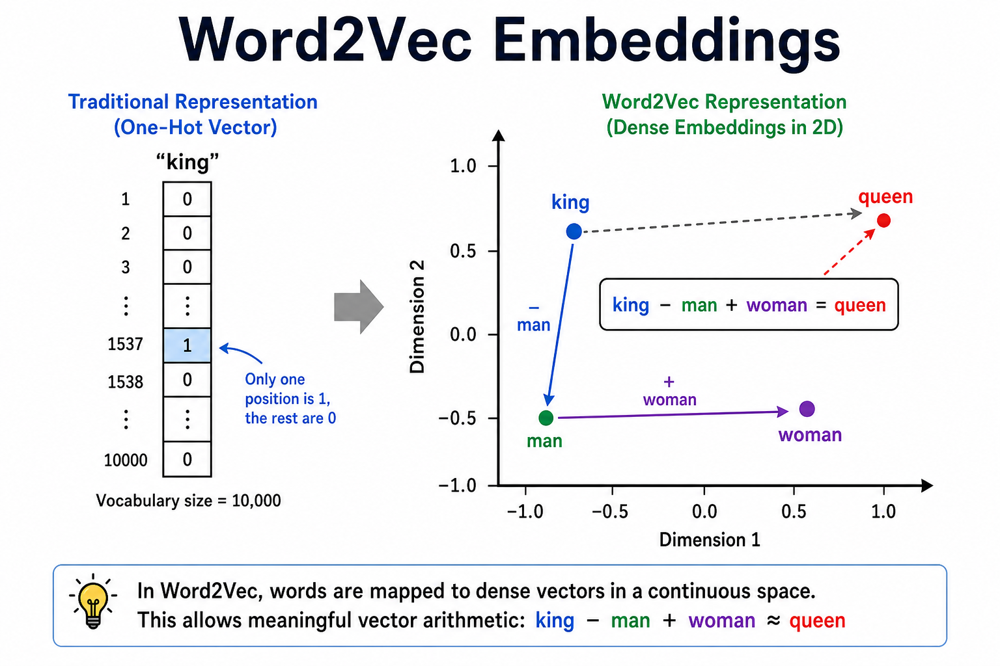
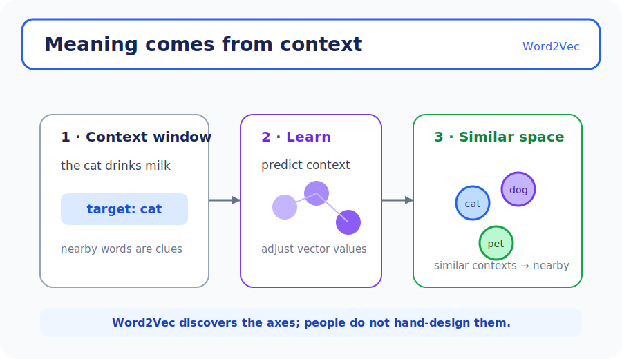
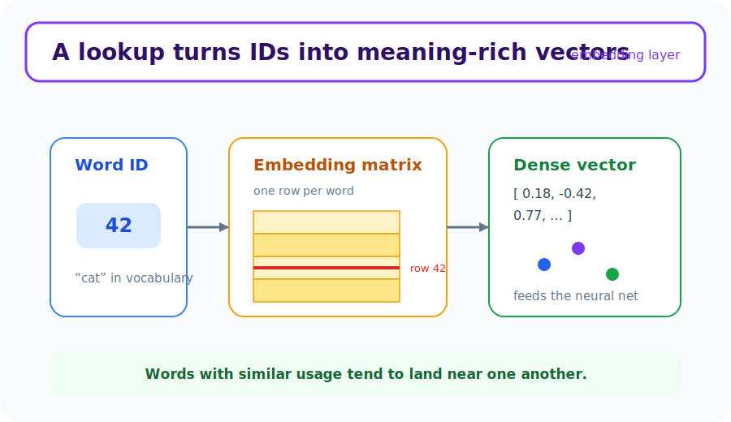

# Unit 18: 単語の分散表現 (Word2Vec)

<p class="unit-hero">
  
</p>

## 1. Word Embeddings（単語の分散表現） の理解

Unit 17で学んだTF-IDFは強力ですが、1つ大きな弱点がありました。それは「単語の『意味』を理解していない」ということです。
たとえば「犬」と「子犬」は似た意味ですが、TF-IDFにとっては全く別の単語として扱われます。

そこで登場したのが、 **Word Embeddings（単語の分散表現）** です。これは、単語を「空間上の座標（ベクトル）」に変換する技術です。

### 📌 日常的な例え：単語の「性格診断テスト」

人を分類する時、「外交的か/内向的か」「論理的か/感情的か」という複数のパラメータで点数をつける性格診断（MBTIなど）がありますよね。
Word Embeddingsは、まさに **単語に対する性格診断** です。

例えば、「王様(King)」「女王(Queen)」「リンゴ(Apple)」を2つの軸（パラメータ）で評価してみましょう。

| 単語           | 王族度 (0〜1) | 食べ物度 (0〜1) |
| :------------- | :-----------: | :-------------: |
| 王様 (King)    |     0.99      |      0.01       |
| 女王 (Queen)   |     0.98      |      0.02       |
| リンゴ (Apple) |     0.00      |      0.95       |

このように点数（ベクトル）をつけると、以下のすごいことができるようになります。

1. **似た単語が近くに集まる** ：「王様」と「女王」は数値が似ているので、グラフ上の近い場所に配置されます。
2. **単語の足し算・引き算ができる** ： 有名な例として、`王様 − 男 + 女 ≈ 女王` のような近似計算が成り立つことがあります。実際のベクトルが厳密に一致するわけではありません。

### 📌 Word2Vecとは？

Word Embeddingsを作るための代表的なアルゴリズムが **Word2Vec** です。
Word2Vecは、 **「同じような文脈で使われる言葉は、似た意味を持つ」** という仮説に基づいています。
（例：「私はパンを食べる」「私はご飯を食べる」 → パンとご飯は同じような文脈で使われるから、似た意味の言葉だ！）

下図は、 **one-hot（疎）** から **密な埋め込み空間** への変換です。



### 📌 Word2Vecの2つの学習方式

Word2Vecには、実は **2つの学習のやり方** があります。性格診断に例えるなら、「診断のアプローチが2種類ある」ようなものです。

**① CBOW（Continuous Bag of Words）— 周りから本人を当てる方式**
周囲の単語（文脈）をヒントにして、 **真ん中に来る単語を予測** します。
例：「私は ＿＿＿ を飲む」→ 周りの「私」「は」「を」「飲む」から、真ん中は「 **コーヒー** 」だ！と当てるイメージです。

**② Skip-gram — 本人から周りを当てる方式**
逆に、中心の単語1つだけをヒントにして、 **周囲にどんな単語が来るかを予測** します。
例：「 **コーヒー** 」→ 近くに「私」「飲む」「カフェ」が来そうだ！と当てるイメージです。

| 比較項目       | CBOW                       | Skip-gram                  |
| :------------- | :------------------------- | :------------------------- |
| 予測の方向     | 周囲 → 中心語              | 中心語 → 周囲              |
| 得意な場面     | 大量データ・高頻出語の学習 | 少量データ・低頻出語の学習 |
| 学習速度       | 速い                       | 遅め（その分丁寧に学習）   |
| gensimでの指定 | `sg=0`（デフォルト）       | `sg=1`                     |

gensimでは、`Word2Vec(sentences, sg=0)` でCBOW、`Word2Vec(sentences, sg=1)` でSkip-gramに切り替えられます。今回のUnit実装例ではデフォルト（CBOW）を使っています。

> 💡 **重要なポイント** : 先ほどの性格診断の例で「王族度」「食べ物度」という軸を紹介しましたが、実際のWord2Vecでは **人間が軸を設計するのではなく、AIが大量の文章を読んで自動的に最適な軸（パラメータ）を発見** します。何百次元もの「名前のない軸」が生まれますが、その結果として「意味の近い単語は近くに集まる」という魔法のような空間ができあがるのです。

### 💡 具体的なビジネスユースケース

- **ECサイトでの関連商品レコメンド** : ユーザーの閲覧履歴に並ぶ商品の列を「文」、個々の商品を「単語」とみなしてWord2Vecを適用する手法で、 **Item2Vec** として知られる応用です。「この商品を閲覧した人は、こういう商品も一緒に見やすい」という商品の類似性を計算して推薦するシステムに使われます。
- **表記ゆれを吸収する高度な検索エンジン** : 「スマホ」「スマートフォン」「iPhone」など、異なる単語でも空間上で近い位置にあるため、検索システムが意味を理解してユーザーが求める結果を返す機能。
- **チャットボットでの意図理解（類義語対応）** : ユーザーからの質問が事前に想定したキーワードと完全に一致しなくても、Word Embeddingsによる意味の近さから「ユーザーが何を聞きたいか」を推測し、適切な回答を返すシステム。

下図は、語彙をベクトルに変換して **ニューラルネットに入力** する埋め込み層です。



## 2. 実装例 (Implementation Example)

ここでは、Pythonの `gensim` というライブラリを使って、簡単な文章からWord2Vecのモデルを学習させ、単語の類似度を計算してみましょう。

### コードの解説

1. **文章の準備** : 単語のリスト（文）を複数用意します。
2. **モデルの学習** : `Word2Vec` に文章を読み込ませて、各単語の「座標（ベクトル）」を計算させます。
3. **類似単語の検索** : 「king」という単語を入力し、空間上で一番近くにある単語（意味が似ている単語）を探します。

> **Colab セットアップ:** この Unit で使用する `gensim` を追加します。
>
> ```python
> %pip install gensim
> ```

```python
# gensim ライブラリを使用します
from gensim.models import Word2Vec

# 1. 文章データの準備
# 英語の短い文を単語ごとに区切ったリストを用意します
sentences = [
    ["the", "king", "is", "a", "strong", "man"],
    ["the", "queen", "is", "a", "wise", "woman"],
    ["a", "boy", "is", "a", "young", "man"],
    ["a", "girl", "is", "a", "young", "woman"],
    ["apple", "is", "a", "delicious", "fruit"],
    ["banana", "is", "a", "sweet", "fruit"]
]

# 2. Word2Vecモデルの学習
# vector_size: 単語をいくつのパラメータ（次元）で表すか
# min_count: 何回以上出現した単語を学習対象にするか（今回は1回でも出れば学習）
# window: 前後の単語をいくつまで見て文脈を判断するか
print("モデルの学習を開始します...")
model = Word2Vec(sentences, vector_size=10, min_count=1, window=2)
print("学習が完了しました！\n")

# 3. 類似単語の検索
# "king" に最も意味が近い単語トップ3を取得します
print("--- 'king' に似ている単語 ---")
similar_words = model.wv.most_similar("king", topn=3)
for word, score in similar_words:
    print(f"単語: {word}, 類似度スコア: {score:.3f}")

# 4. 単語のベクトル（座標）を見てみる
print("\n--- 'king' のベクトル表現（10次元の数値） ---")
print(model.wv["king"])
```

### コード実行後の理解ポイント

- `model.wv.most_similar("king")` を実行すると、文脈が似ている単語が類似度スコア付きで出力されます。極小コーパスでは、どの単語が上位になるかを固定的に予測しないでください。
- `model.wv["king"]` を出力すると、単語が「10個の数字の配列（ベクトル）」に変換されていることが確認できます。これが「性格診断の結果」にあたる部分です。

> 💡 **注記** : 今回のような6文程度の極小コーパスでは、学習結果が不安定なため `most_similar` の出力は実行するたびに変わりえます。実務では数万文以上の大規模なコーパスで学習させることで、安定した意味のあるベクトルが得られます。

## 3. 実践 (Practice)

今度はもう少し単語数を増やして、ペットに関する文章群からWord2Vecを学習させてみましょう。

**【課題の要件】**

1. 以下の `pet_sentences` データセットを使用してください。
2. `Word2Vec` モデルを学習させてください（パラメータは `vector_size=5, min_count=1, window=2` とします）。
3. `"dog"` と一番意味が似ている（類似度が高い）単語を1つ見つけて、出力してください。
4. `"cat"` と `"dog"` の類似度（どれくらい似ているか）を計算して出力してください。

**【データセット】**

```python
pet_sentences = [
    ["i", "love", "my", "cute", "dog"],
    ["my", "dog", "barks", "loudly", "at", "strangers"],
    ["i", "love", "my", "cute", "cat"],
    ["my", "cat", "meows", "softly", "at", "night"],
    ["the", "dog", "chases", "the", "ball"],
    ["the", "cat", "chases", "the", "mouse"]
]
```

**【ヒント】**

- 2つの単語間の類似度を計算するには、`model.wv.similarity("word1", "word2")` を使います。

## 4. 答え合わせ (Answer Key)

<details>
<summary>解答例を見る（クリックで展開）</summary>

```python
from gensim.models import Word2Vec

# データの準備
pet_sentences = [
    ["i", "love", "my", "cute", "dog"],
    ["my", "dog", "barks", "loudly", "at", "strangers"],
    ["i", "love", "my", "cute", "cat"],
    ["my", "cat", "meows", "softly", "at", "night"],
    ["the", "dog", "chases", "the", "ball"],
    ["the", "cat", "chases", "the", "mouse"]
]

# モデルの学習
model = Word2Vec(pet_sentences, vector_size=5, min_count=1, window=2)

# "dog" と最も似ている単語を取得 (topn=1 で1つだけ取得)
most_similar_to_dog = model.wv.most_similar("dog", topn=1)
print(f"'dog' に一番似ている単語: {most_similar_to_dog[0][0]} (類似度: {most_similar_to_dog[0][1]:.3f})")

# "cat" と "dog" の類似度を計算
cat_dog_similarity = model.wv.similarity("cat", "dog")
print(f"'cat' と 'dog' の類似度: {cat_dog_similarity:.3f}")
```

**解答の解説：**
文章データの中で、「dog」と「cat」は "i love my cute ___" や "the ___ chases the" のように、全く同じ文脈で使われています。そのため、Word2Vecは「dogとcatは非常に似た性質を持つ言葉だ」と学習し、高い類似度スコアを出力します。

</details>
