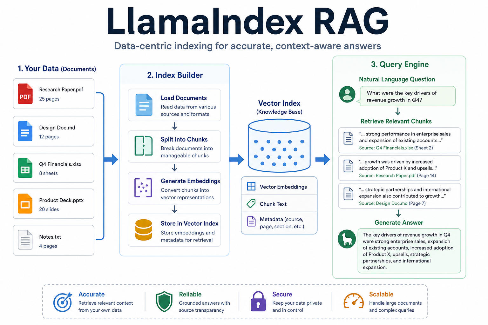
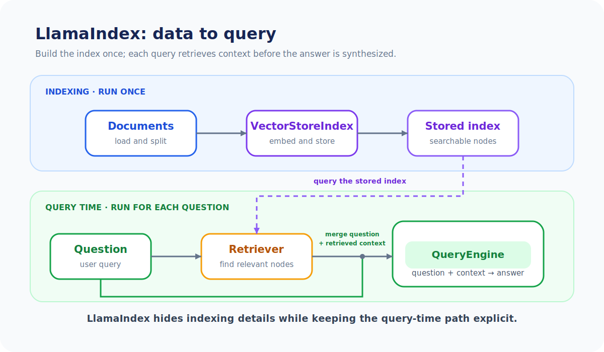
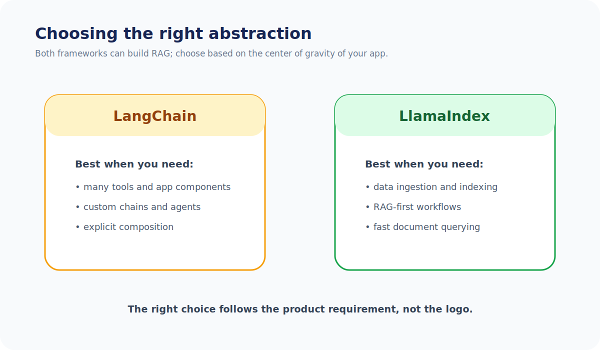

# Unit 26: LlamaIndex の基礎と検索拡張生成

<p class="unit-hero">
  
</p>

> [!IMPORTANT]
> **OpenAI API キーの準備について**
> 第4章の学習を進めるには **OpenAI の API キー** が必要です。APIキーの取得方法、料金に関する注意点、および Google Colab のシークレット機能を使った安全な環境変数設定については、[Appendix (学習環境とキーの準備)](../appendix/index.md) の「OpenAI APIキーの取得と安全な管理」のセクションを最初にご覧ください。

## 1. LlamaIndex による RAG 構築の理解

これまでUnit 24において、外部ライブラリを一切使わずに、APIとNumPyの類似度計算だけで「手組みRAG」を構築し、RAGシステムの根底にある数理的仕組みを学びました。さらにUnit 25においては、LangChainを用いたより抽象的で汎用的なRAGの構築手法を習得しました。

実務における大規模なRAGアプリケーション開発では、ドキュメントの多様なフォーマット（PDF、Word、Markdown等）のパース、ドキュメントを意味のある塊に区切るチャンキング（Chunking）、インデックスの効率的な保存と更新、そして高度なメタデータ検索など、解決すべき泥臭い課題が山積みになります。

これらを美しく解決してくれるのが、 **RAG（検索拡張生成）・データ接続に強く特化したフレームワーク `LlamaIndex`** です。

### LlamaIndex とは？ 〜RAG・データ接続に強く特化した代表的フレームワーク〜

LangChainが「何でもできる汎用的なAIアプリ開発ツール」であるのに対し、LlamaIndexは **「プライベートデータとLLMを接続する（RAG）」** ことに強く特化して設計された、広く使われる代表的なフレームワークの一つです。そのため、データ構造の管理、セマンティック検索、インデックス設計において、コードをシンプルかつ直感的に記述できます。

| LlamaIndex の中核コンセプト | 役割の例え                                                                                                                                                                                |
| :-------------------------- | :---------------------------------------------------------------------------------------------------------------------------------------------------------------------------------------- |
| **Documents / Nodes**       | 読み込まれた生データ（Document）と、それをチャンクに分解してメタデータを付与した最小単位（Node）。本のページと、インデックスカードの関係。                                                |
| **VectorStoreIndex**        | チャンク化されたデータをベクトル化し、高速検索可能なインデックスとしてメモリやデータベースに保持する管理ハブ。図書館の検索台帳。                                                          |
| **QueryEngine**             | ユーザーの質問を受け取り、インデックスから関連する Node を検索（Retrieve）し、LLMにコンテキストとして渡して最終回答を生成（Synthesize）する一連のパイプライン。案内カウンターの司書さん。 |

下図は、LlamaIndex の **Load docs → Build index → query()** というデータ中心の流れです。



---

下図は、 **LangChain** と **LlamaIndex** の RAG 設計思想の比較です。



## 2. 実装例 (Implementation Example)

ここでは、`LlamaIndex` を用いて、テキストファイルをインデックス化（`VectorStoreIndex`）し、最もシンプルなコードで RAG クエリエンジン（`QueryEngine`）を構築・実行するプロフェッショナルなパイプラインを実装します。

> **Colab セットアップ:** 実装例の LlamaIndex と、後半の LangChain 比較コードに必要な統合パッケージだけを追加し、環境変数に `OPENAI_API_KEY` を設定します。
>
> ```python
> %pip install llama-index-core llama-index-llms-openai llama-index-embeddings-openai langchain-openai
> ```

```python
import os
from llama_index.core import Document, VectorStoreIndex, Settings
from llama_index.llms.openai import OpenAI
from llama_index.embeddings.openai import OpenAIEmbedding

# 1. LLM と埋め込みモデルのグローバル設定 (Settingsの適用)
Settings.llm = OpenAI(model="gpt-4o-mini", temperature=0.1)
Settings.embed_model = OpenAIEmbedding(model="text-embedding-3-small")

# 2. サンプルデータの準備（ホテルの案内マニュアル）
hotel_manual = """
当ホテル（AIラウンジホテル）のフロントデスクは24時間体制で稼働しております。
チェックイン時間は15:00から、チェックアウト時間は10:00となっております。
ペットの同伴はすべての客室で禁止されております。
朝食は午前7:00から9:30まで、1階のレストラン「サクラ」にてバイキング形式で提供されます（大人2,000円）。
全館で無料Wi-Fi（ネットワーク名: AI_Lounge_Guest）がご利用可能です。パスワードはございません。
"""

# ドキュメントオブジェクトの作成
documents = [Document(text=hotel_manual)]

# 3. インデックスの構築
# ドキュメントの読み込み、チャンク分割、ベクトル化、インデックス保存がこの1行で自動実行されます
index = VectorStoreIndex.from_documents(documents)

# 4. クエリエンジンの作成と質問の実行
query_engine = index.as_query_engine()

print("--- LlamaIndex RAG 実行 ---")
question = "ペットを連れて行くことはできますか？また朝食の場所はどこですか？"
response = query_engine.query(question)

print(f"質問: {question}")
print(f"AIの回答:\n{response}")
```

---

## 3. 実践 (Practice) - 🧠 自分で比較し決定するRAGシステム設計

実務におけるシステムアーキテクトとして、 **「フレームワーク（LangChain / LlamaIndex）を適用すべきか、それとも手組み（Scratch）で進めるべきか」、また「どのフレームワークを選ぶべきか」** を、定量的な実装コストとビジネス上の要請から判断する力を養いましょう。

**【まずはここから：段階的な進め方】**
いきなり比較と意思決定に取り組むのは大変なので、以下の3ステップで段階的に進めましょう。

1. **ステップ1（写経）** : まずは「2. 実装例」のコードをそのまま写経して実行し、LlamaIndex が実際に動くことを確認する。
2. **ステップ2（比較）** : Unit 24（手組み）・Unit 25（LangChain）・本 Unit（LlamaIndex）のコードを見比べて、3方式の比較表を自分の言葉で作る。
3. **ステップ3（意思決定）** : 比較表をもとに、どの方式を本番採用するかの意思決定と理由をコメントに書く。

**【課題の要件】**
Unit 24 で手組みした「API+NumPyによるベクトル類似度検索RAG」、Unit 25 で構築した「LangChainによる汎用RAG」、そして今回学習した「LlamaIndexによるRAG」の3つのアプローチを脳内で対比・検証し、以下のデータセットを処理するRAGシステムを設計してください。

```python
# 1. 検索用ナレッジベース
company_policies = [
    "当社の夏季休暇は、毎年7月1日から9月30日までの期間内に、合計5日間取得することができます。",
    "リモートワークは週に最大3日まで認められており、事前の申請が必要です。コアタイムは11:00〜15:00です。",
    "経費精算は、毎月25日までにシステムから申請を行う必要があります。領収書の添付が必須です。"
]

# このポリシーテキストをナレッジソースとして扱います。
```

**【あなたのミッション：3つのRAG構築方式の比較と本番適用意思決定】**

あなたは、以下の3つのアプローチを比較・検討し、会社の「社内規定FAQシステム（RAG）」の本番導入案としてどれを適用すべきか、決定を下さなければなりません。

1. **アプローチA（手組み RAG / NumPy ＋ APIベース）**
   - **特徴** : 外部ライブラリの依存が少なく、コードがシンプル。類似度計算ロジック（コサイン類似度など）やチャンキングロジックを追跡・デバッグしやすい。
2. **アプローチB（LangChain適用 RAG）**
   - **特徴** : 豊富なエコシステム（各種Loader、Splitter、VectorStore、Retriever）を活用し、LLMアプリケーション全体の一部として非常に柔軟にパイプラインを組み立て可能。
3. **アプローチC（LlamaIndex適用 RAG）**
   - **特徴** : RAGに特化して設計されており、わずか数行でデータのインデックス化とクエリエンジンが動作。チャンキング、メタデータ、階層検索などを最も高速にチューニング・実装できる。

---

**【コード内にコメントで記述すべき「設計判断ノート」】**

1. **LlamaIndexを用いたポリシーFAQの実装** :
   - 上記の `company_policies` リストを `Document` 化し、`VectorStoreIndex` を使って、ユーザー質問 `"リモートワークのコアタイムは何時ですか？"` に対して的確に答えるRAGクエリエンジンを実装してください。
2. **実装コストと可読性の比較** :
   - アプローチA（手組み）、アプローチB（LangChain）、そしてアプローチC（LlamaIndex）の3つを比較した際、特に「インデックス（ベクトルDB）構築」と「検索・生成（Retrieval-QA）」のパイプライン記述量がどのように簡素化されたかを記述してください。
3. **将来のスケールアップと柔軟性への適応力** :
   - ドキュメントが1万件のPDFファイルに増えて本番用ベクトルDBを導入する場合、あるいはチャット履歴管理や他ツールとの連携が必要になった場合、手組み（アプローチA）、LangChain（アプローチB）、LlamaIndex（アプローチC）のどれが変更や拡張に最も強いかを記述してください。
4. **最終適用意思決定** :
   - **あなたが社内システムの本番として採用したアプローチ（手組み、LangChain、またはLlamaIndex）と、その論理的な理由** を記述してください。

---

## 4. 答え合わせ (Answer Key) - 💡 プロのRAGシステム設計指針

<details>
<summary>解答例を見る（クリックで展開）</summary>

### 💡 AIエンジニアとしてのRAGフレームワーク選定の基準

RAG開発における「手組み」「LangChain」「LlamaIndex」の3者のトレードオフを整理しましょう。

#### 設計意思決定マトリクス（実務での判断基準）

| 評価軸                     | アプローチA（手組みRAG）                                                                                | アプローチB（LangChain RAG）                                                                                                                 | アプローチC（LlamaIndex）                                                                                                      | 設計判断のポイント                                                                                                    |
| :------------------------- | :------------------------------------------------------------------------------------------------------ | :------------------------------------------------------------------------------------------------------------------------------------------- | :----------------------------------------------------------------------------------------------------------------------------- | :-------------------------------------------------------------------------------------------------------------------- |
| **開発スピードと保守性**   | **極めて低い** 。チャンキングや検索ロジックをすべて自作するため、コード量が増えバグの原因になりやすい。 | **高い** 。モジュール部品が用意されているが、RAG構成時に各パーツ（Loader, Splitter, VectorStore, Retriever）を明示的に組み立てる必要がある。 | **圧倒的に高い** 。RAGに特化しており、`VectorStoreIndex.from_documents` からクエリエンジン構築までがわずか数行で完結する。     | **スピードとRAG特化ならLlamaIndexが最速** 。汎用AIアプリケーションやエージェント全体に組み込む場合はLangChainが有利。 |
| **ベクターDB等の拡張性**   | データベースごとのクライアントAPIを個別に学習・手動接続する必要があり、移行コストが膨大。               | **非常に高い** 。ほぼ全ての主要なベクターDB（Chroma, Pinecone, PGVector等）のラッパーが標準で提供されており、差し替えが容易。                | **非常に高い** 。LangChainと同様にベクターDBプラグインが豊富に用意されており、インデックス構築時の引数指定だけで切り替え可能。 | 将来のスケールアップ（データ数や検索精度の強化）において、両フレームワークともに強力な拡張性を提供。                  |
| **カスタマイズ性と柔軟性** | 高い。類似度アルゴリズムやプロンプト結合形式を自由に変更できる一方、実装・保守の責任も増える。          | 高い。LCELや部品を組み替えられるが、抽象化の理解が必要。                                                                                     | RAG向けの機能を利用しやすいが、独自変更には内部知識が必要な場合がある。                                                        | 対象機能、必要な変更量、保守コストを比較して選ぶ。                                                                    |
| **内部ロジックの透明性**   | 自分で追跡しやすいが、依存ライブラリやモデルの挙動まで完全に透明とは限らない。                          | パイプラインは追跡しやすいが、各モジュールの内部処理は抽象化されている。                                                                     | 抽象化が厚く、挙動の調整にはドキュメント確認が必要な場合がある。                                                               | 学習では手組み（Unit 24）で流れを理解し、実装では追跡可能性と開発効率を評価する。                                     |

---

### LlamaIndexによる確実なポリシーFAQ実装コード

```python
from llama_index.core import Document, VectorStoreIndex, Settings
from llama_index.llms.openai import OpenAI
from llama_index.embeddings.openai import OpenAIEmbedding

# 1. 意思決定:
# 「社内規定FAQシステムにおいて、RAGの構築スピードとRAG特化のチューニングを最優先し、LlamaIndexを採用。」
# 「手組みRAGに比べて圧倒的に保守性が高く、LangChainに比べてもRAG構築に特化しているためコードが最もシンプルで構成が頑健である。」

Settings.llm = OpenAI(model="gpt-4o-mini", temperature=0.0) # 規定回答のためブレを排しtemp=0.0
Settings.embed_model = OpenAIEmbedding(model="text-embedding-3-small")

# 社内ポリシーデータセット
company_policies = [
    "当社の夏季休暇は、毎年7月1日から9月30日までの期間内に、合計5日間取得することができます。",
    "リモートワークは週に最大3日まで認められており、事前の申請が必要です。コアタイムは11:00〜15:00です。",
    "経費精算は、毎月25日までにシステムから申請を行う必要があります。領収書の添付が必須です。"
]

# 2. Documentオブジェクトへの変換
documents = [Document(text=policy) for policy in company_policies]

# 3. インデックス化
index = VectorStoreIndex.from_documents(documents)

# 4. クエリエンジンの構築と実行
query_engine = index.as_query_engine()

print("--- 社内規定FAQ RAGシステム ---")
question = "リモートワークのコアタイムは何時ですか？"
response = query_engine.query(question)

print(f"質問: {question}")
print(f"回答:\n{response}")
```

### 参考: アプローチA（手組みRAG）のコード骨子

Unit 24 で学んだ手組み RAG のエッセンスを抜き出すと、以下のようになります。埋め込み取得と類似度計算をすべて自分で書く必要があることが分かります。

```python
import numpy as np
from openai import OpenAI

client = OpenAI()

def embed(text: str) -> np.ndarray:
    res = client.embeddings.create(model="text-embedding-3-small", input=text)
    return np.array(res.data[0].embedding)

# 1. ナレッジベースを自分でベクトル化して保持（インデックス構築を手動実装）
policy_vectors = [embed(p) for p in company_policies]

# 2. 質問をベクトル化し、コサイン類似度を自分で計算して最も近い文書を検索
q_vec = embed("リモートワークのコアタイムは何時ですか？")
sims = [np.dot(q_vec, v) / (np.linalg.norm(q_vec) * np.linalg.norm(v)) for v in policy_vectors]
best_doc = company_policies[int(np.argmax(sims))]

# 3. 検索結果をプロンプトに自分で埋め込み、LLMに回答させる（生成も手動実装）
answer = client.chat.completions.create(model="gpt-4o-mini", messages=[
    {"role": "user", "content": f"次の規定に基づいて回答:\n{best_doc}\n\n質問: リモートワークのコアタイムは？"}
])
```

### 参考: アプローチB（LangChain RAG）のコード骨子

Unit 25 で学んだ LangChain 版のエッセンスです。部品（VectorStore、Retriever、Chain）は用意されていますが、それらを明示的に組み立てる必要があります。

```python
from langchain_openai import ChatOpenAI, OpenAIEmbeddings
from langchain_core.vectorstores import InMemoryVectorStore
from langchain_core.prompts import ChatPromptTemplate
from langchain_core.output_parsers import StrOutputParser
from langchain_core.runnables import RunnablePassthrough

# 1. ベクトルストアの構築（Embeddings と VectorStore を個別に指定して組み立てる）
vectorstore = InMemoryVectorStore.from_texts(company_policies, embedding=OpenAIEmbeddings(model="text-embedding-3-small"))
retriever = vectorstore.as_retriever()

# 2. 検索と生成のパイプラインを LCEL で明示的に接続する
prompt = ChatPromptTemplate.from_template("次の規定に基づいて回答してください:\n{context}\n\n質問: {question}")
rag_chain = (
    {"context": retriever, "question": RunnablePassthrough()}
    | prompt
    | ChatOpenAI(model="gpt-4o-mini")
    | StrOutputParser()
)
answer = rag_chain.invoke("リモートワークのコアタイムは何時ですか？")
```

このように並べて比較すると、アプローチA（手組み）はすべての工程を自作、アプローチB（LangChain）は部品の明示的な組み立てが必要なのに対し、アプローチC（LlamaIndex）は `VectorStoreIndex.from_documents` と `as_query_engine` のわずか2ステップでインデックス構築から検索・生成まで完結することが一目で分かります。

### 💡 プロフェッショナルとしての最終適用意思決定

- **最終適用判断（Decision）** :
  - **「本番環境用システムとして、アプローチC（LlamaIndex適用）を採用する。」**
  - **意思決定の根拠** :
    1. **開発効率と品質の最大化** : 手組み（アプローチA）では自作が必要なコサイン類似度やチャンキング、LangChain（アプローチB）では個別のインポートや組み立てが必要なRetrieverなどが、LlamaIndex（アプローチC）では `VectorStoreIndex.from_documents` から `as_query_engine` までの流れるような設計で完結し、コード量が最も少なく、バグの混入リスクを最小化できる。
    2. **RAG特化機能の迅速な統合** : 将来的にPDF資料の複雑な表データ抽出や、階層検索（Auto Merging Retriever等）を導入する場合、LlamaIndexであれば標準の高度なリトリーバー（Retriever）クラスを指定するだけで容易に対応可能である。
    3. **インフラ移行の拡張性** : データ量やユーザー数の増加に伴いベクトルデータベース（PineconeやChromaDBなど）へ移行する際も、手組みRAGのような全改修を必要とせず、LlamaIndex（およびLangChain）であればわずかな設定変更で切り替えが可能である。
    - _注意_: もしシステム全体が「自律的なマルチエージェント」や「複雑な対話フロー（グラフ型対話エンジン）」などを主たる要件とする場合は、LangChain（Unit 25）を基盤にRAGを組み込むアプローチが適しているが、本件のような「社内規定FAQ（RAG単体）」の要件では、LlamaIndexが最適解となる。

</details>
