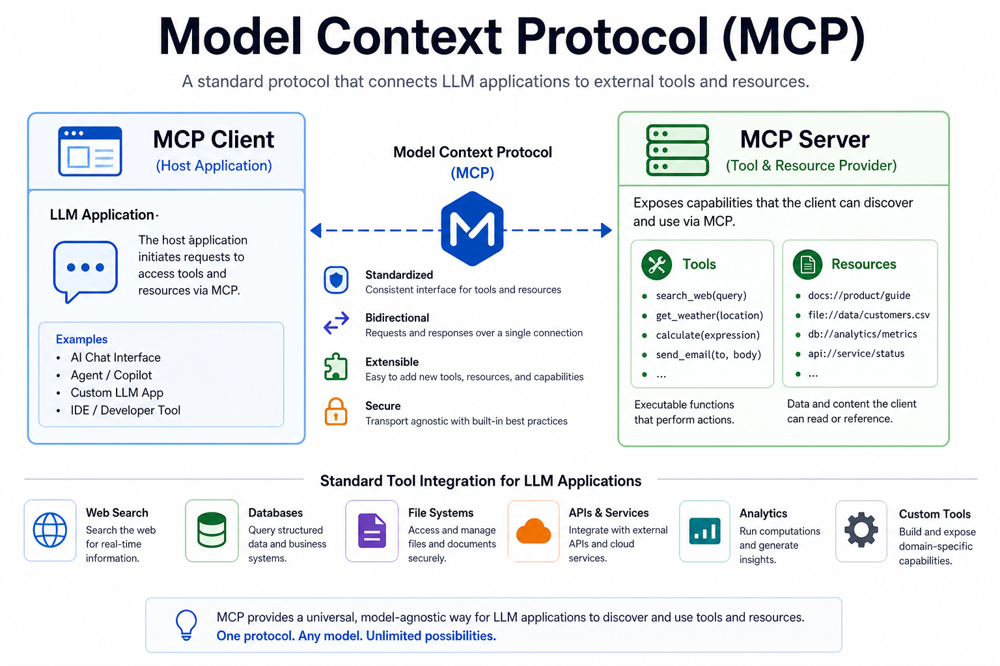
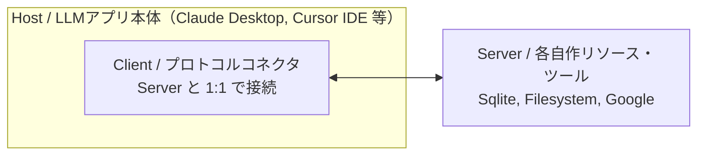
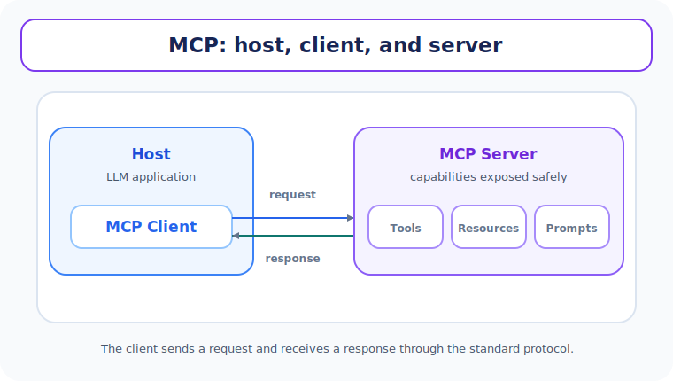
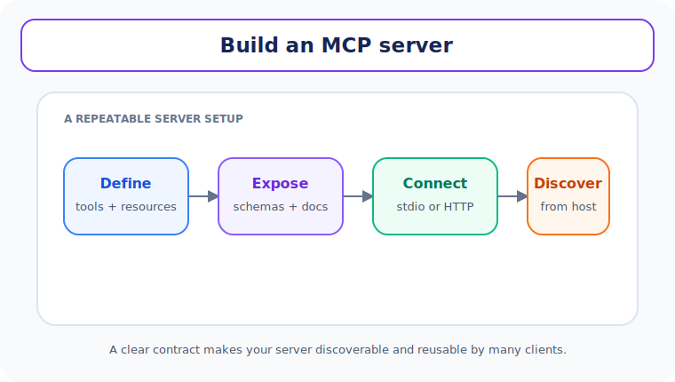

# Unit 30: Model Context Protocol (MCP) の基本原理とサーバー自作

<p class="unit-hero">
  
</p>

> [!IMPORTANT]
> **OpenAI API キーの準備について**
> 第4章の学習を進めるには **OpenAI の API キー** が必要です。APIキーの取得方法、料金に関する注意点、および Google Colab のシークレット機能を使った安全な環境変数設定については、[Appendix (学習環境とキーの準備)](../appendix/index.md) の「OpenAI APIキーの取得と安全な管理」のセクションを最初にご覧ください。

## 1. Model Context Protocol (MCP) の理解

AIエージェントの構築において、エージェントに「ファイル操作」「データベース検索」「外部API実行」などのツールを与える際、従来は各エージェントフレームワーク（LangChain、LlamaIndex 等）やベンダーのAPIごとに、独自の手法でツールのインターフェース定義や呼び出しロジックを個別実装（手組み）していました。

しかし、このアプローチは「特定のフレームワークに依存してしまう」「エージェントが増えるたびに同じツール接続ロジックを何度も書き直す必要がある」という重大なスケーラビリティの課題を抱えていました。

この問題を解決するため、Anthropic が **2024年11月25日に公開した** オープンな共通標準規格が **Model Context Protocol (MCP)** です。MCP は、LLM（AIクライアント）と外部のデータ・ツールの連携インターフェースを標準化し、一度作ったツールを任意のMCP対応クライアントで再利用しやすくする「AI界のUSB規格」です。

### 1.1 MCP の 3層アーキテクチャ

MCP は、以下の 3つのロールが協調して動作する安全かつ論理的な通信設計を採用しています。



#### テキストによるシステム構成の代替表現

1. **Host（ホスト）** : ユーザーが操作するLLMアプリケーション本体（Claude Desktop, Cursor IDE、自作のエージェントスクリプトなど）。LLMとの対話やツール実行の承認を担当し、内部に1つ以上の Client を抱えます。
2. **Client（クライアント）** : Host の内部に組み込まれた「プロトコルコネクタ」。1つの MCP サーバーと 1:1 で接続を維持し、Host の意図を JSON-RPC のメッセージに変換してサーバーとやり取りします。
3. **Server（サーバー）** : 実際のツールやデータを提供するプロセス。自律的に動き回るのではなく、Client からの要求（JSON-RPC経由）に対して、特定のデータ（Resources）やアクション（Tools）を厳密に提供します。

下図は、 **Host（LLMアプリ）の内部の MCP Client** が **MCP Server（ツール群）** と接続するアーキテクチャです。



### 1.2 MCP の 3大要素 (Resources, Prompts, Tools)

MCP サーバーは、LLMに対して以下の 3つの標準的なデータ形態を提供します。

- **Resources (リソース)** :
  - エージェントが読み取ることができる「読み取り専用の静的データ（ファイル、DBの内容、APIレスポンス）」。
  - URI形式（例: `customer://cust_001/profile`）でアドレッシングされ、エージェントは自律的にこのデータを取得して文脈理解に活用します。後述の実装例でも、この `customer://` スキームでリソースを定義します。
- **Prompts (プロンプト)** :
  - サーバー側で定義された「再利用可能なプロンプトのテンプレート」（例: `/analyze-log`）。
  - ユーザーの引数を注入して動的に生成し、LLMに最適な指示を与えます。
- **Tools (ツール)** :
  - エージェントが実行できる「書き込み・変更・不可逆的アクションを伴う動的関数（ファイルを保存する、決済を行う、コマンドを実行する）」。
  - 実行前に人間の承認（Human-in-the-loop）を挟むことが容易な設計規格になっています。

### 1.3 JSON-RPC over Standard I/O (stdio)

MCP の基本通信プロトコルは、非常に軽量な **JSON-RPC 2.0** です。
ローカル実行においては、ネットワークポートを開くリスクを排除するため、標準入力（`stdin`）と標準出力（`stdout`）を用いた **stdio プロセス間通信** を標準として採用しており、強固なローカルセキュリティを誇ります。

### 💡 具体的なビジネスユースケース

- **セキュアなデータベース監査** : SQL実行MCPサーバーをローカルのstdio環境で立ち上げ、ホスト（LLM）からの要求に対して、必要なデータのみを安全な監査フックを介して取得する。
- **Cursorなどの開発ツールとの共通接続** : 自社専用のAPIスキーマをMCPサーバー化しておくだけで、開発メンバーの Cursor IDE や Claude Desktop などの外部ツールに対して、一切の追加実装なしで社内ツール機能をプラグインとして即座に共有する。

下図は、関数を公開し **Stdio/HTTP** 経由でクライアントに発見されるサーバー構築の流れです。



---

## 2. 実装例 (Implementation Example)

ここでは、Python による非常に軽量な MCP 開発ライブラリである **`mcp` (MCP SDK Python)** を用いて、エージェントが「データベース（顧客プロフィール）を標準規格で安全に検索できる」MCP サーバーを自作します。

事前に `pip install mcp` を実行してください。

### サンプルコード実装 (mcp_server.py)

```python
import sys
from mcp.server.fastmcp import FastMCP

# 1. FastMCP サーバーの初期化 (名前を登録)
# FastMCP は Python のデコレータを用いて、非常に直感的にリソースやツールを追加できるSDKです。
mcp = FastMCP("customer-insights-server")

# 模擬的な顧客データベース
CUSTOMER_DATABASE = {
    "cust_001": {
        "name": "アリス",
        "tier": "VIP",
        "email": "alice@example.com",
        "status": "Active"
    },
    "cust_002": {
        "name": "ボブ",
        "tier": "Regular",
        "email": "bob@example.com",
        "status": "Suspended"
    }
}

# ==========================================
# 2. Resources (リソース) の定義
# ==========================================
# `@mcp.resource()` デコレータを使い、エージェントに「静的な参照用データ」を提供します。
# 顧客全体のIDリストを静的に返すリソースを定義します。
@mcp.resource("customer://list")
def get_customer_list() -> str:
    """登録されているすべての顧客IDのリストを返します。"""
    return ", ".join(CUSTOMER_DATABASE.keys())

# 動的なパスを持つリソースの定義 (URLパラメータの利用)
@mcp.resource("customer://{customer_id}/profile")
def get_customer_profile(customer_id: str) -> str:
    """指定された顧客IDのプロフィール詳細を返します。"""
    cust = CUSTOMER_DATABASE.get(customer_id.lower())
    if cust:
        return (
            f"--- 顧客プロフィール ({customer_id}) ---\n"
            f"名前: {cust['name']}\n"
            f"会員ランク: {cust['tier']}\n"
            f"ステータス: {cust['status']}"
        )
    return f"エラー: 顧客ID '{customer_id}' は存在しません。"

# ==========================================
# 3. Tools (ツール) の定義
# ==========================================
# `@mcp.tool()` デコレータを使い、エージェントに「実行可能なアクション」を提供します。
# 関数の型ヒントと docstring が、そのまま自動で LLM への機能説明（Tool Schema）になります。
@mcp.tool()
def update_member_tier(customer_id: str, new_tier: str) -> str:
    """
    指定された顧客IDの会員ランクを更新します。

    引数:
        customer_id: 対象の顧客ID (例: cust_001)
        new_tier: 新しいランク名 (例: VIP, Regular)
    """
    cust = CUSTOMER_DATABASE.get(customer_id.lower())
    if not cust:
        return f"エラー: 顧客ID '{customer_id}' は見つかりません。"

    old_tier = cust["tier"]
    cust["tier"] = new_tier
    return f"成功: 顧客 {customer_id} のランクを {old_tier} から {new_tier} に更新しました。"

# ==========================================
# 4. stdio 接続でのサーバー起動
# ==========================================
if __name__ == "__main__":
    # コマンドライン引数や環境によって起動方法を決定できます。
    # ここでは MCP Host から呼び出される標準 stdio プロセスとして起動します。
    print("🚀 MCP Customer Insights Server Starting...", file=sys.stderr)
    mcp.run(transport="stdio")
```

### 💡 補足: Host アプリ（内部の MCP Client）からの呼び出し方法

この自作サーバーは、以下の設定（Claude Desktop / Cursor 等）の `mcpServers` セクションにパスを追加するだけで、エージェント機能として即座に取り込まれます。

```json
"mcpServers": {
  "customer-insights": {
    "command": "python",
    "args": ["/absolute/path/to/mcp_server.py"]
  }
}
```

また、Claude Desktop や Cursor のような既製クライアントを使わずに、 **自分の Python スクリプトから MCP サーバーに接続してツールを呼び出す** こともできます。以下は、`mcp` パッケージの `stdio_client` と `ClientSession` を使い、上記の自作サーバーをサブプロセスとして起動して接続する最小デモコードです（`mcp_client.py` として保存し、`python mcp_client.py` で実行します）。

```python
import asyncio
from mcp import ClientSession, StdioServerParameters
from mcp.client.stdio import stdio_client

async def main():
    # 1. 接続先サーバーの起動コマンドを指定（stdioでサブプロセスとして起動される）
    server_params = StdioServerParameters(
        command="python",
        args=["mcp_server.py"],
    )

    # 2. stdio 経由でサーバーに接続し、セッションを確立
    async with stdio_client(server_params) as (read, write):
        async with ClientSession(read, write) as session:
            await session.initialize()  # ハンドシェイク（プロトコルの初期化）

            # 3. サーバーが公開しているツールの一覧を取得
            tools = await session.list_tools()
            print("利用可能なツール:", [t.name for t in tools.tools])

            # 4. ツールを名前と引数で呼び出す（JSON-RPC 通信は SDK が自動処理）
            result = await session.call_tool(
                "update_member_tier",
                {"customer_id": "cust_002", "new_tier": "VIP"},
            )
            print("実行結果:", result.content[0].text)

            # 5. Resources も URI 指定で読み取れる
            resource = await session.read_resource("customer://cust_001/profile")
            print("リソース:", resource.contents[0].text)

asyncio.run(main())
```

このように、Host 側は「サーバーの起動コマンド」さえ知っていれば、ツールの発見（`list_tools`）から実行（`call_tool`）、リソースの読み取り（`read_resource`）まで、すべて標準化された手順で行えます。これが MCP が「AI界のUSB規格」と呼ばれる理由です。

---

## 3. 実践 (Practice)

### 🧠 自分で設計し実装する: カスタマーサポート用 MCP サーバーの自作

実際のビジネスシーンにおいて、サポートエージェントは顧客からの「最近の購入履歴を見せて」や「適用可能な割引を計算して」という個別の処理を、MCPというクリーンな標準規格を通じて処理します。

**【課題の要件】**
上記の `FastMCP` フレームワークを用いて、以下の要件を満たす **「カスタマーサポート特化の自作 MCP サーバー」** （`support_mcp_server.py`）を構築してください。

1. **静的リソース (Resources) の設計** :
   - リソースパス `support://{order_id}/items` を定義してください。
   - 指定された注文ID（例: `order_101`）に対応する「購入した商品リストと支払価格」のデータを返すように実装してください。
2. **動的アクションツール (Tools) の設計** :
   - ツール関数 `calculate_loyalty_points(amount: int, tier: str)` を定義してください。
   - 顧客の支払金額（日本円）と会員ランク（VIP / Regular）を入力とし、以下のルールで付与される「ロイヤルティポイント」を算出して、エージェントへ報告するツールを実装してください。
     - **VIP ランク** : 金額の 5% のポイントを付与
     - **Regular ランク** : 金額の 1% のポイントを付与
3. **安全設計の確認** :
   - 関数の入力値（金額など）がマイナスであるなどの不正入力に対して、エラー文字列を返して防御するバリデーションをツール内に記述してください。
4. Pythonスクリプトとしてstdioで起動できる形を目指し、起動失敗・未知ツール・不正引数へのエラー処理も追加してください。

---

## 4. 答え合わせ (Answer Key)

<details>
<summary>解答例を見る（クリックで展開）</summary>

以下は、サポート用MCPサーバーを設計・実装した解答例です。実際の運用では認証、認可、入力検証、監査ログ、タイムアウトを追加します。

```python
import sys
from mcp.server.fastmcp import FastMCP

# 1. MCPサーバーのインスタンス化
mcp = FastMCP("enterprise-support-server")

# 模擬的な注文履歴データベース
ORDERS_DATABASE = {
    "order_101": {
        "items": ["スニーカー", "Tシャツ"],
        "total_jpy": 15000
    },
    "order_202": {
        "items": ["プレミアムジャケット"],
        "total_jpy": 25000
    }
}

# ==========================================
# 2. 静的リソース (Resources) の定義
# ==========================================
@mcp.resource("support://{order_id}/items")
def get_order_items(order_id: str) -> str:
    """
    指定された注文IDの注文アイテムと総額を返します。
    """
    order = ORDERS_DATABASE.get(order_id.lower())
    if order:
        items_str = ", ".join(order["items"])
        return (
            f"--- 注文履歴 ({order_id}) ---\n"
            f"購入商品: {items_str}\n"
            f"合計支払額: {order['total_jpy']} 円"
        )
    return f"エラー: 注文ID '{order_id}' の履歴は見つかりません。"

# ==========================================
# 3. 動的ツール (Tools) の定義
# ==========================================
@mcp.tool()
def calculate_loyalty_points(amount: int, tier: str) -> str:
    """
    顧客の購入金額と会員ランクから、今回の買い物で付与されるロイヤルティポイント（円換算）を算出します。

    引数:
        amount: 今回の購入金額 (日本円)
        tier: 顧客の会員ランク (VIP または Regular)
    """
    # 安全設計: 不正入力の防御
    if amount < 0:
        return "エラー: 購入金額は0以上の整数でなければなりません。"

    clean_tier = tier.strip().upper()
    if clean_tier not in ["VIP", "REGULAR"]:
        return "エラー: 会員ランクは 'VIP' または 'Regular' のいずれかを指定してください。"

    # ビジネスロジックの実行
    if clean_tier == "VIP":
        points = int(amount * 0.05)
        rate_str = "5% (VIP特典)"
    else:
        points = int(amount * 0.01)
        rate_str = "1% (一般会員特典)"

    return (
        f"--- ポイント計算結果 ---\n"
        f"購入金額: {amount} 円\n"
        f"適用レート: {rate_str}\n"
        f"付与予定ポイント: {points} pt (1pt = 1円)"
    )

# ==========================================
# 4. 起動処理
# ==========================================
if __name__ == "__main__":
    # stdio トランスポートで起動し、外部ホスト・エージェントプロセスと安全に通信
    print("🚀 Support MCP Server Starting...", file=sys.stderr)
    mcp.run(transport="stdio")
```

### 解説

この解答で最も重要な設計判断は、 **入力バリデーション（金額が負でないか、注文IDが存在するか等）をツール関数の内側に置いている** ことです。

MCP サーバーの呼び出し元は LLM です。そして LLM は、ハルシネーションで存在しない注文IDを渡してきたり、プロンプトインジェクションによって攻撃的な入力を中継してきたりする可能性がある、 **「信頼できない入力境界」** です。「呼び出し側（LLM）が正しい引数を渡してくれるはず」という前提でツールを書くと、本番で必ず事故が起きます。Web API 開発で「クライアントから来るリクエストは必ずサーバー側で検証する」のと同じ原則を、MCP サーバーにも適用するのです。

また、エラーを例外で落とすのではなく「エラー内容を説明するテキスト」として返しているのもポイントです。LLM はこのメッセージを読んで「注文IDが違うようなので確認してください」のように自然な対話でリカバリーできるためです。
</details>
