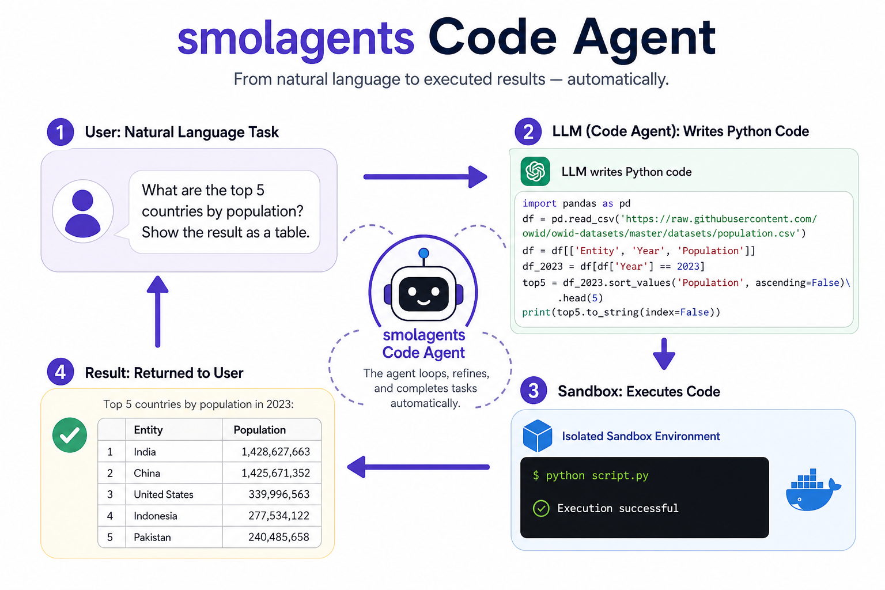
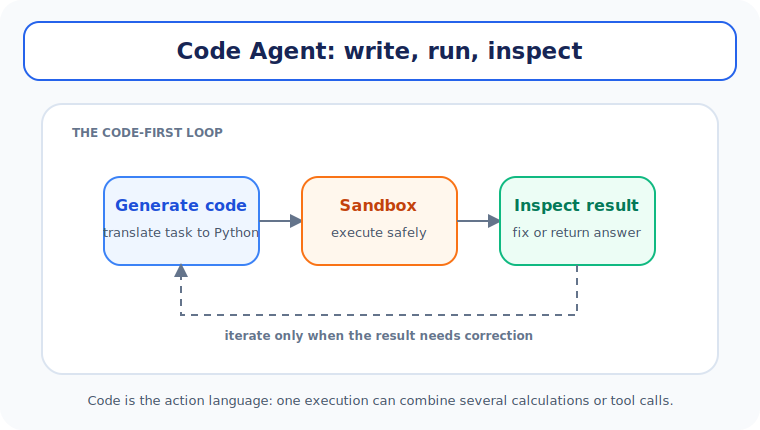
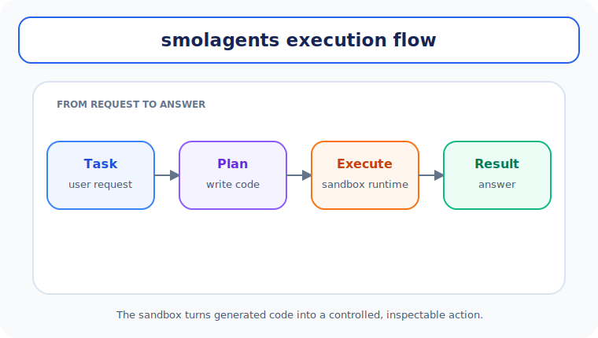

# Unit 31: smolagents と自律型 AI エージェント

<p class="unit-hero">
  
</p>

> [!IMPORTANT]
> **OpenAI API キーの準備について**
> 第4章の学習を進めるには **OpenAI の API キー** が必要です。APIキーの取得方法、料金に関する注意点、および Google Colab のシークレット機能を使った安全な環境変数設定については、[Appendix (学習環境とキーの準備)](../appendix/index.md) の「OpenAI APIキーの取得と安全な管理」のセクションを最初にご覧ください。

## 1. AIエージェントと smolagents の理解

Unit 27〜28では、プロンプトチェーンや会話履歴を扱うLLMアプリの基本を学びました。Unit 29〜30では、スクラッチReActによるエージェントの基本原理と、外部ツール接続の共通規格であるMCPを学びました。ここからは、エージェントの実装パラダイムを比較します。

しかし、AIシステムが「指示された通りのテキストを出力する」だけでなく、 **「ユーザーの複雑な目標を達成するために、自ら思考し、必要な外部ツール（検索、データベース、計算機、外部API等）をいつ、どのように使いこなすかを自律的に意思決定して実行するシステム」** を **AIエージェント (AI Agent)** と呼びます。

### 従来の ReAct パラダイムの限界

従来の AIエージェントの代表的な実装方法（ReActなど）は、以下のような「テキスト（JSON）ベースの思考ループ」でした：

1. **Thought（思考）** : 「次は検索ツールを使う必要がある。」
2. **Action（実行）** : `{"tool": "Search", "query": "今日の天気"}` という JSON を出力。
3. **Observation（観察）** : Python側でJSONをパースし、ツールを実行した結果をLLMにテキストで返す。

このアプローチは非常に強力ですが、 **「複数ステップのデータ処理や複雑な計算（例: 検索した5つの結果の平均値を求めるなど）では、ツール呼び出しの往復が増えるほど中間結果の受け渡しで誤りが蓄積しやすい」** という実務上の課題を抱えていました。

### smolagents と「Code Agent」の革命

この限界を突破するために Hugging Face がリリースした超軽量・最先端のフレームワークが **`smolagents`** です。

`smolagents` は、従来のテキストベースのTool Callingの代わりに、 **「LLMがタスクを解決するためのPythonコードを書き、それを実行して結果を得る（Code Agent）」** という設計を提供します。コード実行は強力な権限になり得るため、ライブラリの設定だけで安全が保証されると考えず、ネットワーク・ファイルシステム・秘密情報を隔離した外部サンドボックスを設計します。

| 特徴                 | 従来のエージェント (ReAct)                                               | smolagents (CodeAgent)                                                                               |
| :------------------- | :----------------------------------------------------------------------- | :--------------------------------------------------------------------------------------------------- |
| **指示方法**         | テキスト（JSONなどのスキーマ）                                           | **Python コードの生成**                                                                              |
| **複雑なデータ処理** | ツールを1回ずつ呼び出すループをLLM自身が何往復も管理する（壊れやすい）。 | 「リストをループで回して平均を計算する」Pythonコードを一発で出力し、コンテナ内で実行して一撃で解決。 |
| **成功率・推論効率** | 多段のタスクでは往復が増え、誤りが蓄積しやすい。                         | **高い** （複数ステップをプログラムとして一括実行できるため）。                                      |
| **コードの軽量さ**   | 肥大化しがち（LangChain等では設定が複雑）。                              | **極めて軽量** （わずか数行で強固なエージェントが動く）。                                            |

下図は、LLM がコードを書き、 **サンドボックスで実行** して結果を返すコードエージェントのループです。



---

下図は、上の概念を実行フェーズの視点から見直したもので、 **タスク受領 → コード生成 → サンドボックス実行 → 結果返却** という smolagents の処理循環を表しています。



## 2. 実装例 (Implementation Example)

ここでは、`smolagents` の `CodeAgent` を使い、LLMがPythonコードを書いて、与えられたツールを組み合わせて実行する最小エージェントを構築します。これは動作確認用のPoCであり、完璧な成功率や安全な隔離環境を示すものではありません。

事前に `pip install smolagents openai` を実行し、環境変数に `OPENAI_API_KEY` を設定してください。

```python
import os
from smolagents import CodeAgent, Tool, OpenAIServerModel

# 1. LLM モデルの設定 (OpenAI APIを利用)
# gpt-4o-mini はコード生成能力が非常に高いため、CodeAgentとして快適に動作します
model = OpenAIServerModel(
    model_id="gpt-4o-mini",
    api_key=os.environ.get("OPENAI_API_KEY")
)

# 2. エージェントが使える「カスタムツール」の定義
# Tool クラスの description 属性が、エージェントにとっての「ツールの説明（指示書）」になります
# （@tool デコレータを使う場合は、関数の docstring が説明として使われます）
class TemperatureConverterTool(Tool):
    name = "convert_fahrenheit_to_celsius"
    description = "華氏（Fahrenheit）の温度を、摂氏（Celsius）に変換します。"
    inputs = {
        "fahrenheit": {
            "type": "number",
            "description": "変換したい華氏の温度数値"
        }
    }
    output_type = "number"

    def forward(self, fahrenheit: float) -> float:
        return (fahrenheit - 32) * 5 / 9

# 3. カスタムツールのインスタンス化
temp_tool = TemperatureConverterTool()

# 4. CodeAgentの構築
# LLMと使えるツールのリストを渡します
agent = CodeAgent(
    tools=[temp_tool],
    model=model,
    add_base_tools=True # 計算機や時間などの基本ツールを自動で追加する
)

# 5. エージェントへの指示と実行
# エージェントは「摂氏への変換ツール」を自分で見つけて呼び出すコードを書き、その場で実行します
print("--- smolagents (CodeAgent) 起動 ---")
task = "現在の華氏100度は、摂氏で何度ですか？小数点以下2桁で教えてください。"
result = agent.run(task)

print(f"\n最終回答:\n{result}")
```

---

## 3. 実践 (Practice) - 🧠 自分で比較し決定するエージェント・パラダイム設計

AIエージェント開発において、ビジネス上の成功率（Robustness）を最大化するために、 **「従来の ReAct (Tool Calling) 方式」と「最新の Code Agent 方式」のどちらを採用すべきか** を、定量的な性能と安全性の観点から判断する力を養いましょう。

**【まずはここから：段階的な進め方】**
いきなり比較と意思決定に取り組むのは大変なので、以下の3ステップで段階的に進めましょう。

1. **ステップ1（写経）** : まずは「2. 実装例」のコードをそのまま写経して実行し、CodeAgent が実際に動くことを確認する。
2. **ステップ2（比較）** : Unit 29 の手組み ReAct（Tool Calling）のコードと見比べて、2方式の違い（コード量・成功率・セキュリティ）を自分の言葉で整理する。
3. **ステップ3（意思決定）** : 整理した比較をもとに、どちらの方式を本番採用するかの意思決定と理由をコメントに書く。

**【課題の要件】**
あなたは、企業のECサイトにおける「商品の割引率と最終価格を自動算出する自律カスタマーエージェント」の構築を任されました。
以下の2つのアプローチを比較し、エージェントを構築してください。

```python
# ユーザーから与えられるタスク：
# 「商品Aの価格は12,000円です。これに対して『15%割引』のVIPクーポンを適用し、さらに『消費税10%』を加算した、お客様が実際に支払う最終価格を求めてください。」
```

**【あなたのミッション：2つのエージェント方式の比較と本番適用意思決定】**

あなたは、以下の2つのアプローチの設計意図を比較・分析し、本番のチャットエージェントシステムとしてどちらを適用すべきか決定しなければなりません。

1. **アプローチA（従来のテキストベース Tool Calling / ReAct エージェント）**
   - **特徴** : LLMが「次は割引率計算ツールを呼ぶ ➔ 次は税率計算ツールを呼ぶ」とテキストで複数回ループし、順番にパースして進めるアプローチ。
2. **アプローチB（smolagents による Python コード実行エージェント）**
   - **特徴** : LLMが「価格に対して 15% 割引し、それに 1.10 を掛けて出力する」というシンプルな Python の数式コードを一発で生成し、サンドボックスで実行して一撃で答えを導き出すアプローチ。

---

**【コード内にコメントで記述すべき「設計判断ノート」】**

1. **smolagents を用いた最終価格算出エージェントの実装** :
   - `smolagents` の `CodeAgent` を使い、LLMが必要な計算（割引と税率加算）を自律的に処理するコードを生成・実行してタスクを完結するエージェントプログラムを記述してください。
2. **エージェントの頑健性（タスク成功率）の対比** :
   - 従来の ReAct 方式では「割引の適用」と「税金の計算」の間にプロンプトのブレが生じやすいのに対し、コード生成方式（CodeAgent）では複雑な計算やデータ加工の成功率が大きく向上するのはなぜかを記述してください。
3. **セキュリティと実行サンドボックスの重要性** :
   - LLMが生成した任意のコードを実行する上で、`smolagents` が提供するセキュアなコード実行環境（LocalPythonExecutor）の役割と、本番運用におけるセキュリティ対策（不正コードのブロックなど）について記述してください。
4. **最終適用意思決定** :
   - **あなたが本番システムとして採用したエージェント方式と、その論理的な理由** を記述してください。

---

## 4. 答え合わせ (Answer Key) - 💡 プロのエージェント設計指針

<details>
<summary>解答例を見る（クリックで展開）</summary>

### 💡 AIエンジニアとしてのエージェントアーキテクチャ選定

エージェント開発における「ReAct」と「Code Agent」のトレードオフを整理しましょう。

#### 設計意思決定マトリクス（プロダクション適用基準）

| 評価軸                         | アプローチA（従来のReAct）                                                                                             | アプローチB（smolagents CodeAgent）                                                                                                          | 今回の設計判断のポイント                                                                                                                                                                             |
| :----------------------------- | :--------------------------------------------------------------------------------------------------------------------- | :------------------------------------------------------------------------------------------------------------------------------------------- | :--------------------------------------------------------------------------------------------------------------------------------------------------------------------------------------------------- |
| **タスク成功率（Robustness）** | **低め** 。複数ツールの順序関係や中間計算をLLMがテキスト（状態遷移）で管理するため、タスクが長くなるほど破綻しやすい。 | **高い** 。LLMは「ロジック（プログラム）」の記述に集中し、実行は確定的なPythonが担うため、複雑な計算やデータ加工では成功率が大きく向上する。 | **計算・データ加工が主体ならCodeAgentが有利** 。こうした業務エージェントでは、CodeAgentの成功率がReActを上回る傾向があります。                                                                       |
| **セキュリティリスク**         | 安全。LLMはテキストを吐くだけで、実行するのはPython側で事前に定義した固定関数のみのため。                              | **対策が必須** 。LLMが生成した悪意あるコード（システムコマンドの削除等）が実行される危険性がある。                                           | `smolagents` では実行可能な関数やモジュールをデフォルトで許可リスト制限するセキュアな実行環境が標準装備されています。ただし本番運用では Docker や E2B などの追加サンドボックスの併用が推奨されます。 |
| **デバッグのしやすさ**         | 困難。LLMの思考がどのステップで狂ったのか、プロンプトを舐めるように解析する必要がある。                                | **容易** 。LLMが生成した「Pythonのコード」がそのまま出力ログに出るため、どのロジック（バグ）を吐いたかが一目瞭然。                           | エージェントの挙動を追跡し最適化する開発プロセスにおいて、コード対比でのデバッグは開発者に圧倒的な安心感を与えます。                                                                                 |

---

### smolagents による確実な価格算出エージェント実装コード

```python
import os
from smolagents import CodeAgent, OpenAIServerModel

# 1. 意思決定:
# 「割引適用と税金計算といった『ロジックの連鎖』と『正確な数値処理』が求められるタスクにおいて、」
# 「従来のReActではプロンプト崩壊が起きやすいため、コード生成一撃で解決できる smolagents の CodeAgent を採用。」
# 「生成されたコードの実行は、標準のホワイトリスト制限されたセキュアなLocalPythonExecutorで行う。」

model = OpenAIServerModel(
    model_id="gpt-4o-mini",
    api_key=os.environ.get("OPENAI_API_KEY")
)

# 特別な計算ツールを定義しなくても、CodeAgentは基本的なPython演算（四則演算やループ）を
# サンドボックス内の標準Python機能だけで実行できます
agent = CodeAgent(
    tools=[],
    model=model,
    add_base_tools=True # 基本演算能力を付加
)

print("--- 業務価格算出エージェント ---")
task = """
商品Aの価格は12,000円です。
これに対して『15%割引』のVIPクーポンを適用し、
さらに『消費税10%』を加算した、お客様が実際に支払う最終価格を求めてください。
"""

result = agent.run(task)
print(f"\n最終価格: {result}")
```

### 参考: アプローチA（ReAct / OpenAI Tool Calling ベース）の実装例

比較のため、同じタスクを Unit 29 の形式（手組み ReAct ループ）で実装すると以下のようになります。割引計算と税計算をそれぞれツールとして定義し、LLM にループで順番に呼ばせる必要があります。

```python
import os
import json
from openai import OpenAI

client = OpenAI(api_key=os.environ.get("OPENAI_API_KEY"))

# ツールの実体: 計算ステップごとに個別の関数が必要
def apply_discount(price: float, discount_rate: float) -> str:
    return json.dumps({"discounted_price": price * (1 - discount_rate)})

def add_tax(price: float, tax_rate: float) -> str:
    return json.dumps({"final_price": round(price * (1 + tax_rate))})

tools_schema = [
    {"type": "function", "function": {
        "name": "apply_discount",
        "description": "価格に割引率を適用した後の価格を計算します。",
        "parameters": {"type": "object", "properties": {
            "price": {"type": "number"}, "discount_rate": {"type": "number"}},
            "required": ["price", "discount_rate"]}}},
    {"type": "function", "function": {
        "name": "add_tax",
        "description": "価格に消費税率を加算した最終価格を計算します。",
        "parameters": {"type": "object", "properties": {
            "price": {"type": "number"}, "tax_rate": {"type": "number"}},
            "required": ["price", "tax_rate"]}}},
]
available_functions = {"apply_discount": apply_discount, "add_tax": add_tax}

messages = [
    {"role": "system", "content": "ツールを順番に使い、割引適用 → 税加算の順で最終価格を求めてください。"},
    {"role": "user", "content": "12,000円の商品に15%割引を適用し、消費税10%を加算した最終価格は？"},
]

# ReAct ループ: 割引 → 税加算と、最低でも2往復の API 呼び出しが必要
for step in range(5):
    response = client.chat.completions.create(
        model="gpt-4o-mini", messages=messages, tools=tools_schema)
    msg = response.choices[0].message
    messages.append(msg)
    if not msg.tool_calls:
        print(f"最終回答: {msg.content}")
        break
    for tc in msg.tool_calls:
        observation = available_functions[tc.function.name](**json.loads(tc.function.arguments))
        messages.append({"role": "tool", "tool_call_id": tc.id,
                         "name": tc.function.name, "content": observation})
```

このように、アプローチAではツールのスキーマ定義とループ管理のコードが長くなり、「割引結果を次の税計算に正しく引き継げるか」が LLM のテキスト管理に依存します。一方、アプローチB（CodeAgent）では `12000 * 0.85 * 1.1` という1行のコード生成で完結するため、この種の計算タスクとの相性の差が明確に分かります。

### 💡 プロフェッショナルとしての最終適用意思決定

- **最終適用判断（Decision）** :
  - **「本番環境エージェントシステムとして、アプローチB（smolagentsによるCodeAgent）を採用する。」**
  - **意思決定の根拠** :
    1. **圧倒的な信頼性（パースエラーゼロ）** : ReActでは「割引計算のテキスト出力を正規表現でパースして次の税率計算に渡す」といった泥臭い繋ぎ合わせが必要だったが、CodeAgentは `final_price = 12000 * 0.85 * 1.1` というPythonコードを一発で生成して完了するため、中間のパースエラーやプロンプトのブレを大幅に減らせる。
    2. **デバッグの高速性** : 監査ログ（Audit Log）に「LLMが生成した生のPythonスクリプト」が記録されるため、万が一計算が間違っていた場合でも、プロンプトのどの記述がLLMのロジック生成を歪めたのかの特定が容易。
    3. **セキュリティ安全性の担保** : `smolagents` は、標準でシステム環境へのアクセスや危険なインポート（`os`, `subprocess` 等）をデフォルトの許可リストで制限した Local 実行環境上で動作するため、リスクを大幅に抑えた状態でCodeエージェントの強力な恩恵を享受できる（本番ではさらに Docker/E2B 等のサンドボックス併用が推奨される）。

</details>
