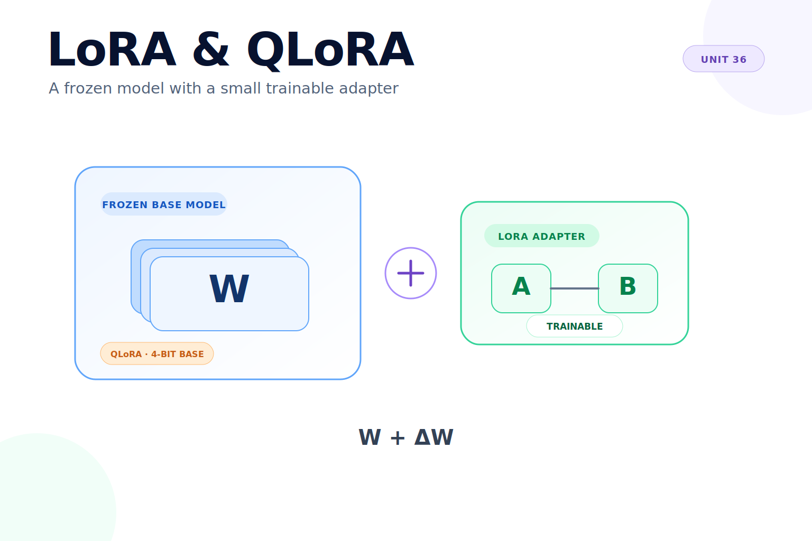
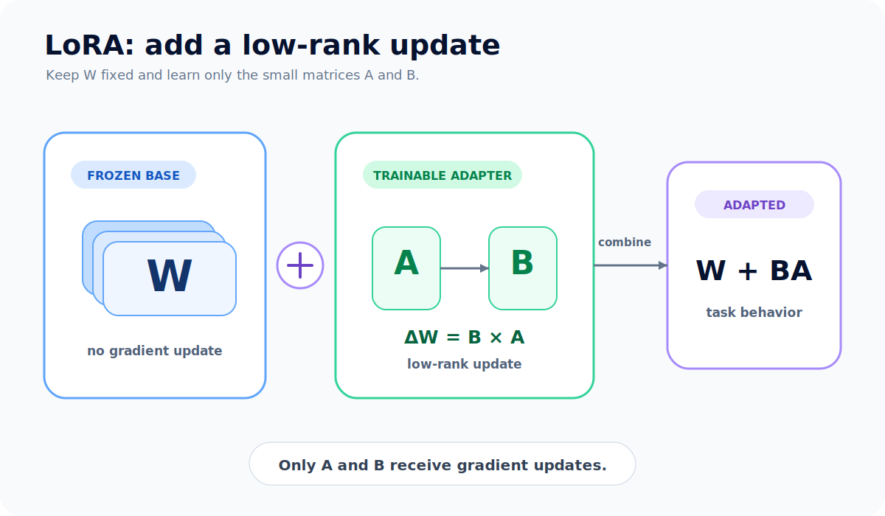
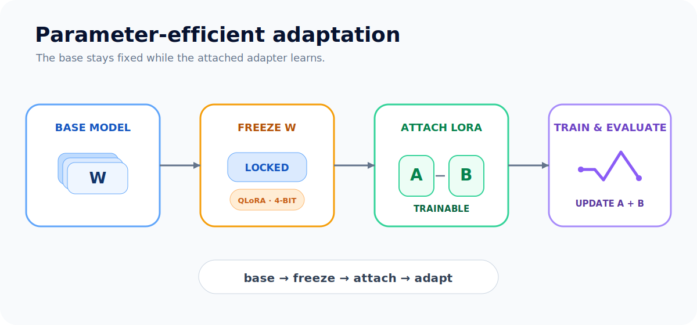

# Unit 36: LoRA / QLoRAによるLLM適応の基礎

<p class="unit-hero">
  
</p>

> [!WARNING]
> 学習データに個人情報や秘密情報を含めないでください。モデルとデータのライセンス、GPU費用、評価用データの分離も確認します。

## 1. ファインチューニングとLoRAの理解

LLMのファインチューニングは、既存モデルの重みをタスクやドメインに合わせて調整する方法です。全パラメータを更新するとGPUメモリと保存容量が大きくなるため、LoRA（Low-Rank Adaptation）は元の重みを凍結し、小さな低ランク行列だけを学習します。

概念的には、元の線形変換`W`に、学習する更新量`ΔW = B × A`を加えます。LoRAは学習対象を減らせますが、品質・安全性・ライセンスの問題を自動的に解決するものではありません。

QLoRAは、量子化したベースモデルにLoRAを組み合わせる方法です。少ないメモリで学習できる可能性がありますが、4-bit量子化の実装、GPU、ライブラリの組み合わせに依存します。本UnitではまずLoRAの仕組みを小さなモデルで確認し、QLoRAは設計上の違いと注意点を学びます。

下図は、凍結したベース重み`W`に、学習可能な低ランク更新`B × A`を加えるLoRAの構造です。



下図は、ベースモデルを凍結し、必要に応じて量子化してからLoRAアダプターを取り付け、学習・評価する流れです。



## 2. 実装例 (Implementation Example)

PyTorchだけでLoRAの更新を確認します。これは仕組みを理解するための最小例で、実際のLLMを学習するコードではありません。

```python
import torch
from torch import nn


class LoRALinear(nn.Module):
    def __init__(self, in_features, out_features, rank=2, alpha=1.0):
        super().__init__()
        self.base = nn.Linear(in_features, out_features)
        for parameter in self.base.parameters():
            parameter.requires_grad = False
        self.adapter_a = nn.Parameter(torch.randn(rank, in_features) * 0.01)
        self.adapter_b = nn.Parameter(torch.zeros(out_features, rank))
        self.scale = alpha / rank

    def forward(self, x):
        base_output = self.base(x)
        update = (x @ self.adapter_a.T) @ self.adapter_b.T
        return base_output + self.scale * update


model = LoRALinear(8, 4, rank=2)
trainable = sum(p.numel() for p in model.parameters() if p.requires_grad)
total = sum(p.numel() for p in model.parameters())
print("trainable parameters:", trainable)
print("total parameters:", total)
```

`base`の重みは更新されず、`adapter_a`と`adapter_b`だけが学習対象です。実際のLLMでは、PEFTなどのライブラリを使い、対象層、学習率、ランク、評価方法を設計します。

## 3. 実践 (Practice)

次の順番で小さな実験を行ってください。

1. `rank`を1、2、4に変え、学習対象パラメータ数と表現力の違いを記録する。
2. ベース重みの`requires_grad`がすべて`False`であることを確認する。
3. 同じ小規模データを使い、全層更新とLoRA更新の学習対象パラメータ数を比較する。
4. QLoRAについて、量子化によるメモリ削減の利点と、精度・速度・GPU依存性のトレードオフを説明する。

本番モデルを学習する場合は、訓練データと評価データを分離し、元モデル、アダプター、Tokenizer、学習設定、評価結果を記録してください。

## 4. 答え合わせ (Answer Key)

<details>
<summary>解答例を見る（クリックで展開）</summary>

- ランクを大きくするとアダプターのパラメータ数と表現力は増えますが、メモリ・学習時間・過学習リスクも増えます。
- LoRAではベースモデルの重みを凍結し、低ランク行列だけを更新します。
- QLoRAは「LoRAなら必ず量子化される」という意味ではなく、量子化ベースモデルとLoRAを組み合わせた構成です。実際の利用では使用ライブラリとGPUの対応を確認します。

</details>
