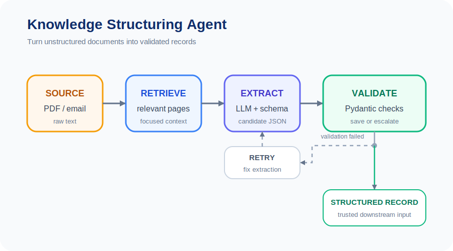
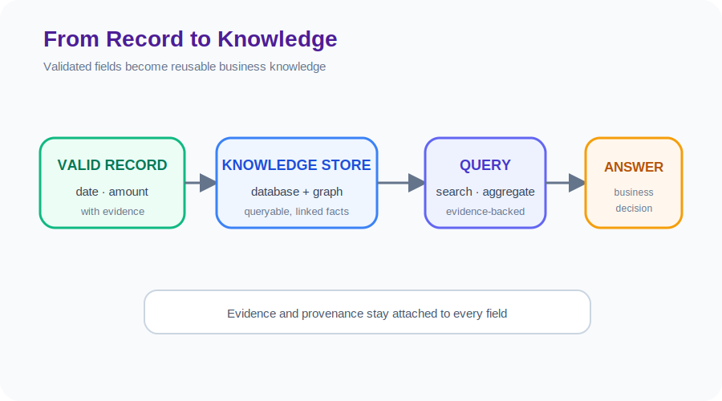

# Unit 39: 自律型ナレッジ抽出・構造化エージェント

<p class="unit-hero">
  
</p>

## 1. 非構造化データからナレッジ抽出と構造化の理解

これまで、Unit 26 において RAG 特化フレームワークである `LlamaIndex` を学び、Unit 31 において Python コードを自ら書きながら自律的に動作する `smolagents` （CodeAgent）を学習しました。

実務における「生成AIを最も強力に業務に活かすユースケース」の一つが、 **「企業に眠る大量の未構造化データ（自由形式のPDF、スキャン画像、契約書、メール文など）から、必要なビジネス情報（契約日、金額、違約金条項、顧客の苦情カテゴリなど）を自動で抽出し、データベースへ保存可能な綺麗なJSON形式（構造化データ）に変換する」** というナレッジ抽出・構造化（Structured Extraction）パイプラインです。

### なぜ単なる LLM 呼び出しでは本番運用に不十分なのか？

「この契約書から金額をJSONで抜いて」とLLMにプロンプトを投げるだけでは、本番環境の業務では使い物になりません。以下の理由があるからです。

1. **スキーマ違反** : LLMが出力したJSONのキー名が違っていたり、日付の形式（`YYYY-MM-DD`）が崩れていると、DB挿入時にシステムがエラーで即座に落ちる。
2. **ハルシネーション（情報の捏造）** : 契約書に書かれていない適当な金額を「これだと思います」とLLMが捏造して出力する危険がある。
3. **契約書の長文限界（Token Limit）** : 1枚のPDFならともかく、100ページにおよぶドキュメントを一括で入力するとコストが跳ね上がり、かつ重要な情報を見落とす（Lost in the Middle）。

### 自律型構造化エージェントのアーキテクチャ

これを解決するプロのアーキテクチャは、 **「LlamaIndexによるピンポイント検索（Retrieve）」と「smolagents（Codeエージェント）によるPythonコード実行と自己修正（Self-Correction）ループ」の融合** です。

1. **Retrieve（検索）** : `LlamaIndex` を使って、巨大な契約書から「違約金や支払条件について書かれているページ」だけをセマンティック検索で特定する。
2. **Extraction（抽出）** : 抽出したテキストをLLMに渡し、Pydanticなどのスキーマに基づいて構造化JSONを出力させる。
3. **Validation & Correction（検証と自己修正）** :
   - 出力されたJSONが、規定のスキーマ（Pydanticモデル）に適合しているかプログラムで厳密に検証。
   - バリデーションエラーが起きた場合、エージェント（`smolagents`）が **「エラーログを自ら解析し、コードやプロンプトをその場で修正して、正しいJSONが得られるまで自動で再試行（Self-Correction）」** する。

なお、本ユニットの実装は、このうち **「Extraction（抽出）」と「Validation & Correction（検証と自己修正）」に集中** します。冒頭の「Retrieve（検索）」部分、すなわち巨大なドキュメント群から関連ページだけをセマンティック検索で絞り込む処理は、Unit 26 で学んだ `LlamaIndex` をそのまま前段に組み合わせることで実現できます。本ユニットでは検索済みのテキスト（生データ）が手元にある前提で、スキーマに適合する候補JSONを作り、検証できない値は保存せずに人間へ回すパイプラインを構築します。

下図は、 **PDF → Agent 抽出 → JSON スキーマ** のナレッジ構造化パイプラインです。



---

下図は、構造化したデータを **データベースに保存し、クエリ（検索・集計）可能なレコード** として活用する流れです（構造化データ同士を関係で繋げば「ナレッジグラフ」と呼ばれる知識ネットワークにも発展させられます）。



## 2. 実装例 (Implementation Example) - スキーマ検証の最小パイプライン

> **Colab セットアップ:** 現行の Colab には Pydantic が含まれています。後半の `OpenAIServerModel` を使う自己修正エージェントでは、smolagents の OpenAI オプションだけを追加します。
>
> ```python
> %pip install "smolagents[openai]"
> ```

まず、LLMを呼び出す前に、構造化された候補データをPydanticで検証する最小例を動かします。これは「JSONの形・型・業務上の範囲」を検証する例であり、原文に本当に書かれているか、抽出内容が正しいかまでは保証しません。本番では、原文の引用、フィールドごとの根拠、信頼度、人間確認を追加します。

```python
from datetime import date
from pydantic import BaseModel, ValidationError, field_validator

class ContractRecord(BaseModel):
    client_name: str
    vendor_name: str
    agreement_date: date
    total_budget_yen: int
    duration_months: int

    @field_validator("total_budget_yen", "duration_months")
    @classmethod
    def must_be_positive(cls, value):
        if value <= 0:
            raise ValueError("正の値が必要です")
        return value

candidate = {
    "client_name": "AIテクノロジー株式会社",
    "vendor_name": "株式会社ミライシステム",
    "agreement_date": "2026-05-12",
    "total_budget_yen": 12_000_000,
    "duration_months": 24,
}

try:
    record = ContractRecord.model_validate(candidate)
    print(record.model_dump(mode="json"))
except ValidationError as error:
    print("入力を保存せず、人間確認へ回します:", error)
```

この例を動かしたら、意図的に日付の形式や金額を壊し、検証で止まることを確認してください。次の実践では、汚れた原文からこの候補データを作る抽出器を設計します。

## 3. 実践 (Practice) - 🧠 自分で設計し決定するナレッジ抽出パイプライン

まずは実装例のスキーマ検証を壊して、どの入力が止まるか確認してください。次に、 **「LlamaIndexの検索結果と抽出器、検証器、必要に応じた自己修正ループをどのように組み合わせるか」** を設計し、最後に検証できない値を人間へ回す条件を設計メモにまとめます。

**【課題の要件】**
以下の「生データ（汚れた契約内容の報告テキスト）」を初期化コードとし、ここから契約情報を抽出し、 **指定されたJSONスキーマに適合する候補データを検証付きで生成するシステム** を構築してください。検証できない値は、無理に保存せず人間確認へ回します。

```python
# 1. 監査対象の「汚れた生データ」
dirty_contract_text = """
【業務提携合意書】
本契約は、AIテクノロジー株式会社（以下、甲）と、株式会社ミライシステム（以下、乙）の間で締結される。
合意日：2026年の5月12日。
本プロジェクトの総予算は一千二百万円（税別）とし、甲は乙に対して月々分割で支払うものとする。
支払期日は毎月末日とする。
また、本契約の有効期間は合意日から満2か年（24ヶ月）とする。
"""

# 2. 厳格に遵守しなければならないJSONスキーマ（Pydanticモデル）
from pydantic import BaseModel, Field, field_validator
from datetime import date

class ContractSchema(BaseModel):
    client_name: str = Field(description="甲（発注者）の会社名。株式会社等を含めた正式名称。")
    vendor_name: str = Field(description="乙（受注者）の会社名。")
    agreement_date: date = Field(description="契約合意日。必ず YYYY-MM-DD の日付型である必要がある。")
    total_budget_yen: int = Field(description="総予算（円）。テキストから数値を抽出し、必ず『整数型（int）』に変換すること。税別・税込などの文字は含めない。")
    duration_months: int = Field(description="契約期間の月数。必ず整数型。")

    # field_validator による業務ルール検証: 型が合っていても、金額・期間が0以下なら抽出ミスとして弾く
    @field_validator("total_budget_yen", "duration_months")
    @classmethod
    def must_be_positive(cls, v: int) -> int:
        if v <= 0:
            raise ValueError("金額・契約期間は正の整数である必要があります")
        return v
```

**【あなたのミッション：堅牢な抽出＆自己修正エージェントの設計決定】**

あなたは、上記の「汚れたテキスト」を入力とし、`ContractSchema` の検証を一発でパスするJSONデータを **自動生成・検証・エラー自動修正** するエージェントシステムを構築しなければなりません。

---

**【コード内にコメントで記述すべき「設計判断ノート」】**

1. **JSONの完全性保証の手法選択** :
   - LLMに「JSONで出力して」と頼むだけでなく、スキーマ違反や日付パースエラーが起きた際、どのようにエージェント（`smolagents` やプログラムバリデータ）を協調させてエラーを検知・自動修正させるかの設計判断を記述してください。
2. **数値・日付変換の堅牢性設計** :
   - 「一千二百万円」という日本語の漢数字表現を、プログラムで扱える `12000000`（整数）へ、また「2026年の5月12日」を `2026-05-12`（日付オブジェクト）へ、変換ミスやエラーなしで確実に変換させるための設計（プロンプトでのFew-Shot適用やPythonコードインタープリタの利用など）を記述してください。
3. **最終適用意思決定** :
   - **あなたが企業に納品する本番システムとして決定したエージェント評価パイプラインと、その論理的な理由** を記述してください。


## 4. 答え合わせ (Answer Key) - 💡 プロの構造化データ抽出設計

<details>
<summary>解答例を見る（クリックで展開）</summary>

### 💡 AIエンジニアとしてのナレッジ抽出意思決定ノート

実務における構造化データ抽出では、LLMの出力をプログラムで検証し、不正なデータを下流へ流さない設計が重要です。スキーマ検証だけでは原文との意味的一致までは保証できないため、根拠引用、信頼度、再検証、人間へのエスカレーションを組み合わせます。

#### 構造化抽出の設計意思決定マトリクス

| 評価軸                       | アプローチA（プロンプト頼みのJSON出力）                      | アプローチB（バリデータ＋自己修正エージェント）                                            | 今回の設計判断のポイント                                               |
| :--------------------------- | :----------------------------------------------------------- | :----------------------------------------------------------------------------------------- | :--------------------------------------------------------------------- |
| **スキーマ突破率**           | 出力形式やキー欠落により、パースエラーが起きる可能性がある。 | バリデータとリトライで形式エラーを減らせるが、有限回の再試行で成功を保証するものではない。 | 形式エラーと意味エラーを分けて測定し、失敗時は保存せず人間確認へ送る。 |
| **漢数字・不規則日付の処理** | LLMの抽出結果だけに依存すると誤変換の可能性がある。          | 明示的な変換関数、テスト、バリデータ、必要に応じたLLMリトライを組み合わせる。              | 変換をエージェントに丸投げせず、決定的な処理を優先する。               |

---

### バリデータ ＆ 自己修正エージェント（smolagents）による完全構造化抽出コード

````python
import os
import json
import re
from datetime import date
from pydantic import BaseModel, Field, ValidationError, field_validator
from smolagents import CodeAgent, OpenAIServerModel

# 1. 意思決定:
# 「医療や金融、企業データベース連携において、形式エラーによるシステムダウンは致命的である。」
# 「そのため、Pydanticによる厳格な型検証（日付型、整数型）と、エラー検知時に自動でコードを修正し再実行する smolagents CodeAgent を採用。」
# 「漢数字（一千二百万）などの曖昧な表現も、エージェントがPythonコードでのパースロジックを自律生成して解決させる。」

model = OpenAIServerModel(
    model_id="gpt-4o-mini",
    api_key=os.environ.get("OPENAI_API_KEY")
)

# 2. Pydanticスキーマの定義（クライアントに合致するよう定義）
class ContractSchema(BaseModel):
    client_name: str
    vendor_name: str
    agreement_date: date  # YYYY-MM-DD
    total_budget_yen: int # 変換・検証済みの整数。原文の根拠も別途保存する
    duration_months: int  # 整数

    # field_validator による業務ルール検証: 金額・期間は必ず正の数（0以下は抽出ミスとして弾く）
    @field_validator("total_budget_yen", "duration_months")
    @classmethod
    def must_be_positive(cls, v: int) -> int:
        if v <= 0:
            raise ValueError("金額・契約期間は正の整数である必要があります")
        return v

# 3. 自己修正ループを内包したエージェントの定義
agent = CodeAgent(tools=[], model=model, add_base_tools=True)
# 注意: CodeAgentは生成コードを実行するため、実データや本番環境で直接動かさない。
# 本番ではネットワーク・ファイルシステム・秘密情報を隔離したサンドボックスを使い、
# ツールを最小権限にし、実行前後の監査ログと人間承認を設ける。

# 4. エージェントへの指示と実行
# 「ContractSchema のフィールド名に完全に一致するJSONを生成し、エラーがある場合は修正せよ」という監査命令
task_instruction = f"""
以下の【生データ】から契約情報を抽出し、指定された【JSON形式のスキーマ】に適合するJSONテキストのみを出力してください。判断できない値は推測せず、エラーとして返してください。

【生データ】:
{dirty_contract_text}

【JSON形式のスキーマ】:
- "client_name": 甲（発注者）の正式名称 (文字列)
- "vendor_name": 乙（受注者）の正式名称 (文字列)
- "agreement_date": 契約合意日。必ず 'YYYY-MM-DD' の形式の日付文字列 (文字列)
- "total_budget_yen": 総予算（円）。「一千二百万円」などの漢数字表記を、必ず『12000000』のような「整数（int）」に変換すること。
- "duration_months": 契約期間の月数。満2か年であれば『24』のような「整数（int）」に変換すること。

出力は余計な説明文（JSON用のマークダウン装飾も含む）を一切含めず、純粋なJSON文字列オブジェクトのみを出力してください。
"""

# --- ステップ5: バリデーション ＋ 自己修正ループ（Self-Correction Loop）の実装 ---
# バリデーション失敗時は、エラーメッセージをそのままエージェントへフィードバックし、
# 正しいJSONが得られるまで（最大 MAX_RETRIES 回まで）agent.run を自動で再試行する。
MAX_RETRIES = 3
validated_contract = None
current_task = task_instruction

print("--- 自律型ナレッジ抽出エージェント 起動 ---")
for attempt in range(1, MAX_RETRIES + 1):
    print(f"\n--- 抽出試行 {attempt}/{MAX_RETRIES} ---")
    raw_output = agent.run(current_task)
    try:
        # マークダウン装飾がある場合はクリーンアップ
        cleaned_json = str(raw_output).strip()
        # LLMが返す ```json ... ``` のコードフェンスだけを除去する。
        cleaned_json = re.sub(r"^```(?:json)?\s*", "", cleaned_json, flags=re.IGNORECASE)
        cleaned_json = re.sub(r"\s*```$", "", cleaned_json)
        data_dict = json.loads(cleaned_json)

        # Pydanticによる型・範囲検証（原文との意味的一致は別途確認が必要）
        validated_contract = ContractSchema(**data_dict)

        print("\n✅ バリデーション完全パス！構造化ナレッジ抽出に成功しました:")
        print(validated_contract.model_dump_json(indent=2))
        break

    except (json.JSONDecodeError, ValidationError) as e:
        print(f"❌ バリデーションエラー発生。エラー内容をエージェントへフィードバックして再試行します...")
        # エラーメッセージ全文を差し戻し、修正済みJSONの再生成を指示する
        current_task = f"""{task_instruction}

【前回のあなたの出力】:
{raw_output}

【前回の出力に対するバリデーションエラー】:
{e}

上記のエラーを確認し、修正できる項目だけを再出力してください。検証に失敗した場合は、推測で埋めずにエラーを返してください。
"""

if validated_contract is None:
    print(f"\n🚨 {MAX_RETRIES} 回の再試行でも有効なJSONが得られませんでした。人間のオペレーターへエスカレーションします。")
````

### 💡 プロフェッショナルとしての最終適用決定

- **最終適用判断（Decision）** :
  - **「本番ナレッジ抽出パイプラインとして、アプローチB（Pydanticバリデータ ＋ 自己修正型CodeAgent）を採用する。」**
  - **意思決定の根拠** :
    1. **システム安定性の向上** : Pydanticは不正な型や範囲のデータを下流へ流さないゲートになります。リトライが上限に達した場合は保存せず、人間に引き継ぐことで障害波及を抑えます。ただし、正しい内容の抽出や障害ゼロを保証するものではありません。
    2. **決定的な変換の優先** : 漢数字や日付の変換は、可能な限りテスト済みの明示的なPython関数で行い、エージェントは曖昧な箇所の候補生成とエラー修正に限定します。抽出値には原文の根拠を付け、意味の正しさを別途評価します。

</details>
