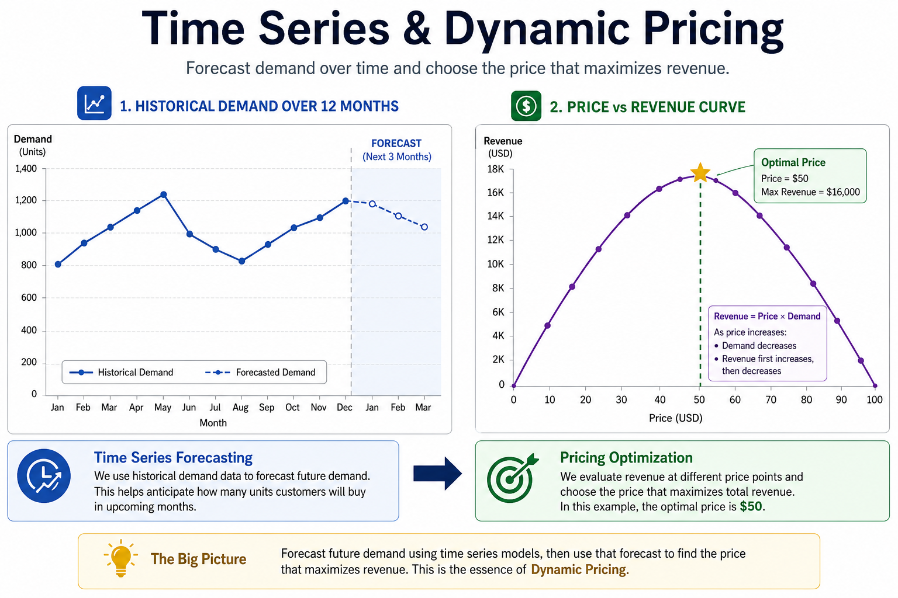
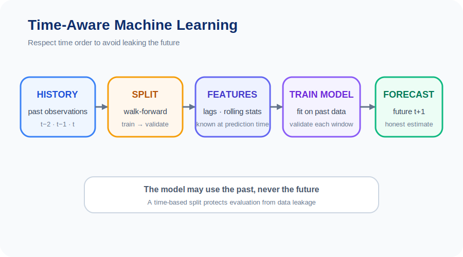
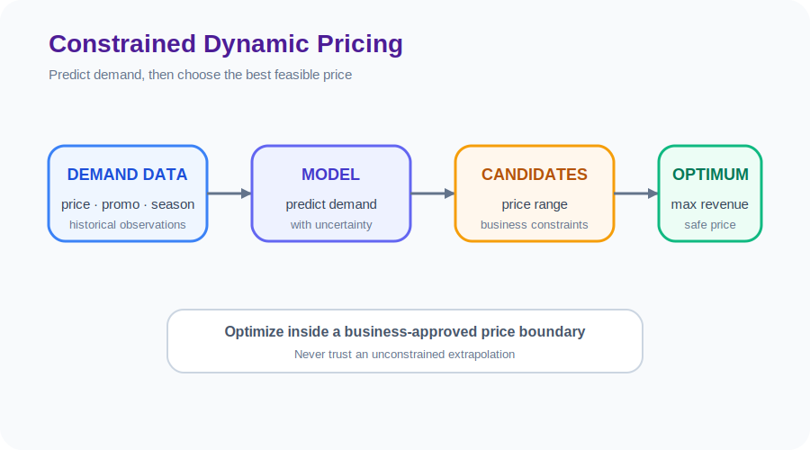

# Unit 41: 時系列需要予測・価格最適化システム

<p class="unit-hero">
  
</p>

## 1. 時系列予測におけるリーク回避と需要・価格最適化の理解

これまで、テーブルデータの回帰や分類（Unit 1〜8）、およびディープラーニングモデル（Unit 10〜16の画像分類など）を学んできました。これらを **「時間とともに変化するデータ（時系列データ）」** に適用する場合、機械学習の教科書的なアプローチをそのまま使うと、本番環境で **「壊滅的な大失敗（予測精度がゼロになる）」** を引き起こします。

その最大の原因が、 **「時系列データリーク（Data Leakage）」** です。

### 🚨 時系列データリーク：未来からの情報の密輸

一般的な機械学習モデルでは、データをランダムに「訓練データ（80%）」と「テストデータ（20%）」に分割します（`train_test_split`）。しかし、時系列データでこれをやるとどうなるでしょうか？

```
【時系列データ】: [1月] -> [2月] -> [3月] -> [4月] -> [5月]

× ランダム分割（リーク発生）:
  訓練データ: [1月, 3月, 5月]
  テストデータ: [2月, 4月] ──> 「3月の情報」を知った状態で「2月」を予測するため、精度が異常に高く出てしまう（未来予測の罠）。
```

テストデータの中に「未来の情報」が混入することを **「データリーク（情報漏洩）」** と呼びます。これが発生したモデルは、手元の検証では「完璧な精度」に見えますが、本番環境（＝明日のリアルな未来予測）に投入した瞬間に、全く予測が当たらなくなります。

これを回避する唯一の正攻法が、 **「時系列分割（Time Series Split / Rolling-window Validation）」** です。過去のデータのみで訓練し、常にその時点での「未来」を順番に予測する検証パイプラインを組まねばなりません。

下図は、過去データのみで学習し **未来を予測する時系列 ML** （リーク回避）のイメージです。



---

### 📈 需要予測から価格最適化（ダイナミック・プライシング）へのビジネス適用

予測ができるようになった次のステップは、それをビジネスの利益に変換することです。そのための手法が **「ダイナミック・プライシング（動的価格決定）」** です。

1. **需要曲線の推定** : 一般に、価格（Price）を上げると需要（Demand / 販売量）は下がります。この関係を機械学習モデルで「価格ごとの予測需要量」としてシミュレーションします。
2. **収益の最大化** : 収益（Revenue）は `価格 × 販売数量（需要）` で計算されます。価格が安すぎると個数は売れますが利益が出ず、高すぎると誰も買わなくなります。
3. **数理最適化** : 以下のグラフのように、収益が最大化する「スウィートスポット（最適な価格 P*）」を数理的・探索的に見つけ出します。

```
 需要量 D                      収益 R (P × D)
  │\                            │      ┌───┐
  │ \                           │     /     \
  │  \                          │    /       \
  │   \                         │   /         \
  └──── Price P                 └───┴─────────┴── Price P
                                       価格 P* (最大収益)
```

下図は、需要曲線上の **最適価格点（optimal）** で収益を最大化するダイナミックプライシングです。



---

### 💡 具体的なビジネスユースケース

- **ホテル・フライトの自動価格設定** : 過去の予約状況、競合価格、祝日、検索ボリュームのトレンドから、空室・空席をゼロにしつつ売上を最大化する価格をAIが毎日自動で算出し、予約サイトに反映させる。
- **ECサイト・スーパーの生鮮食品の値引き最適化** : 在庫の消費期限、明日の気温予測、過去の曜日別購買弾力性（価格に対する売れ行きの変化）を元に、廃棄損を最小にし、かつ利益を最大化する夕方の割引率を自動計算する。
- **シェアリングエコノミーのピーク料金（Uber 等）** : 雨の日やイベント終了時など、リアルタイムな需要のスパイク（急増）と稼働中のドライバー数から、数秒単位で乗車価格を変動させ、需給のバランスを瞬時に回復させる。

---

## 2. 実装例 (Implementation Example) - 時系列リーク回避と需要曲線の推定

以下のコードは、時系列データに対する安全なクロスバリデーション（時系列分割）を実行し、その予測結果を元に「売上が最大化する最適価格」をグリッドサーチで探索するパイプラインの実装例です。

```python
import numpy as np
import pandas as pd
from sklearn.model_selection import TimeSeriesSplit
import xgboost as xgb

# --- 1. 時系列ダミーデータの生成 ---
np.random.seed(42)
n_days = 300

# 過去300日間の販売ログ
dates = pd.date_range(start="2025-01-01", periods=n_days)
prices = np.random.uniform(500, 1500, size=n_days) # 価格設定（500円〜1500円）

# 需要（販売個数）の生成: 基本需要100個、価格が100円上がるごとに個数が6個減る関係 + ノイズ + 曜日効果
base_demand = 100
price_effect = -0.06 * prices
weekday_effect = (dates.weekday >= 5).astype(int) * 20 # 週末は+20個売れる
noise = np.random.normal(0, 5, size=n_days)

demand = base_demand + price_effect + weekday_effect + noise
demand = np.clip(demand, 0, None).astype(int) # マイナス個数はクリップ

df = pd.DataFrame({
    "date": dates,
    "price": prices,
    "is_weekend": (dates.weekday >= 5).astype(int),
    "demand": demand
})

# 特徴量とターゲットの定義
# （時系列リークを防ぐため、前日以前の「ラグ特徴量」を使うのが定石ですが、ここではシンプル化のため価格と週末フラグを使用）
X = df[["price", "is_weekend"]].values
y = df["demand"].values

print("--- 2. 時系列分割（TimeSeriesSplit）によるリークなき評価 ---")
# データをランダム分割せず、時系列順に5分割して順次評価する
tscv = TimeSeriesSplit(n_splits=5)
fold_scores = []

for fold, (train_index, test_index) in enumerate(tscv.split(X)):
    X_train, X_test = X[train_index], X[test_index]
    y_train, y_test = y[train_index], y[test_index]

    # 時系列過学習を防ぐため、ツリーの深さを3に抑えたXGBoost
    model = xgb.XGBRegressor(max_depth=3, n_estimators=50, random_state=42)
    model.fit(X_train, y_train)

    # 評価（平均絶対誤差: MAE）
    preds = model.predict(X_test)
    mae = np.mean(np.abs(preds - y_test))
    fold_scores.append(mae)
    print(f"  Fold {fold+1} Test MAE: {mae:.2f} 個 (訓練期間: {len(train_index)}日, テスト期間: {len(test_index)}日)")

print(f"平均テスト MAE: {np.mean(fold_scores):.2f} 個")

# --- 3. 最終モデルの訓練と需要シミュレーション（価格最適化） ---
final_model = xgb.XGBRegressor(max_depth=3, n_estimators=50, random_state=42)
final_model.fit(X, y)

# 週末における、最適価格の探索シミュレーション
candidate_prices = np.linspace(400, 1800, 100) # 400円〜1800円の間を100分割
best_price = 0
max_revenue = 0

print("\n--- 4. ダイナミック・プライシング最適化シミュレーション (週末用) ---")
for p in candidate_prices:
    # 週末(is_weekend=1)の条件下での、価格 p に対する予測需要量をモデルから算出
    features = np.array([[p, 1]]) # [[価格, 週末フラグ]]
    predicted_demand = final_model.predict(features)[0]

    # 収益 = 価格 × 予測需要
    revenue = p * predicted_demand

    if revenue > max_revenue:
        max_revenue = revenue
        best_price = p

print(f"🎯 週末の最適価格: {best_price:.1f} 円")
print(f"📈 その時の予測販売個数: {final_model.predict(np.array([[best_price, 1]]))[0]:.1f} 個")
print(f"💰 見込み最大収益: {max_revenue:.0f} 円")
```

> **⚠️ 補足: 当日価格を特徴量に使うことの「内生性（Endogeneity）」**
> 本ユニットでは簡略化のため、当日の `price` をそのまま需要予測の特徴量として使用しています。しかし厳密には、価格は外から与えられる変数ではなく **「自分で決める変数」** であり、過去のデータでは「需要が高そうな日にあえて高い価格を付けていた」など、価格設定の意思決定自体が需要と相関している可能性があります（因果が循環する **内生性** の問題）。この場合、モデルが学習する「価格と需要の関係」は純粋な因果効果（価格弾力性）とは一致せず、そこから導く最適価格も歪むことがあります。実務では、意図的な価格実験（A/Bテストやランダムな価格変動）を含むデータで学習する、操作変数法や Double Machine Learning などの因果推論手法を併用する、といった対策が取られます。本ユニットのダミーデータは価格をランダムに生成しているため、この問題が起きない理想的な設定になっている点に留意してください。

---

## 3. 実践 (Practice) - 🧠 自分で設計し決定する需要予測＆ダイナミック・プライシング

まずは実装例のTimeSeriesSplitと需要曲線を確認してください。次に、 **「時系列データリークを検査しつつ、販促イベントや競合価格の影響を学習させ、制約付きで価格候補を比較するアルゴリズム」** を設計し、最後に価格上下限・承認・停止条件を設計メモにまとめます。

**【課題の要件】**
以下の「生データ（祝日フラグ、競合の動的な価格設定、過去の売上ログ）」を初期化コードとして使用し、ここから **「予測リークを検査・抑制した評価パイプライン」** を作成の上、制約付きの価格決定戦略を導き出してください。

```python
import numpy as np
import pandas as pd

# 1. サンプルデータ数（1年分のデイリー売上）
n_samples = 365
np.random.seed(101)

# 日付と販促プロモーションフラグ（不定期なイベント）
dates_p = pd.date_range(start="2025-01-01", periods=n_samples)
promo_flags = np.random.choice([0, 1], size=n_samples, p=[0.85, 0.15]) # 15%の確率でプロモーション実施

# 競合価格（900円を中心に、ジグザグと時間変動する時系列データ）
competitor_prices = 900 + np.sin(np.linspace(0, 10 * np.pi, n_samples)) * 150 + np.random.normal(0, 20, n_samples)

# 自社価格（自社が過去に実験的に設定したジグザグな価格設定）
our_prices = 950 + np.cos(np.linspace(0, 8 * np.pi, n_samples)) * 200 + np.random.normal(0, 30, n_samples)

# 実測された需要（自社価格、競合価格との差、プロモーション有無、週末効果によって決定される非線形ダミー）
base_d = 120
our_price_effect = -0.08 * our_prices
competitor_effect = 0.05 * competitor_prices # 競合価格が高いと、自社製品が売れる
promo_effect = promo_flags * 35 # プロモーション中は+35個売れる
weekend_effect = (dates_p.weekday >= 5).astype(int) * 15

actual_demand = base_d + our_price_effect + competitor_effect + promo_effect + weekend_effect + np.random.normal(0, 7, n_samples)
actual_demand = np.clip(actual_demand, 0, None).astype(int)

df_practice = pd.DataFrame({
    "date": dates_p,
    "our_price": our_prices,
    "competitor_price": competitor_prices,
    "is_promo": promo_flags,
    "is_weekend": (dates_p.weekday >= 5).astype(int),
    "demand": actual_demand
})
```

**【あなたのミッション：堅牢な価格最適化パイプラインの設計決定】**

あなたは、上記のデータを用いて、 **「プロモーションが実施されており、競合価格が1,000円である平日（is_weekend=0）」** における、自社の **最大売上収益を達成する最適価格（円）** を求めてください。

---

**【コード内にコメントで記述すべき「設計判断ノート」】**

1. **時系列データにおける「特徴量設計（Feature Engineering）」** :
   - 単なる当日の値だけでなく、時間的順序関係や前日の売上（ラグ特徴量）をモデルにどう組み込むか（あるいは今回のデータ構造からリークを排除するためにどう変数を設計したか）を記述してください。
2. **時系列過学習（Time-series Overfitting）対策の決定理由** :
   - 時系列データは一般的なテーブルデータより遥かにノイズが多く、トレンド変化によって過学習しやすい特徴があります。XGBoostやLightGBM等のハイパーパラメータ（深さ、学習率、l2正則化など）をどのように制限してモデルを頑健にしたかを記述してください。
3. **ビジネス戦略と価格上限の設計判断** :
   - 数理最適化で価格を無限に高く（または極端に安く）設定し、極端なシミュレーション値が出ないよう、価格の探索範囲（境界値）をどのように実務の観点から制限したかを記述してください。
4. **最終適用意思決定** :
   - **あなたが役員会に報告する本番適用価格と、その価格決定における数理的・ビジネス的な正当性の根拠** を記述してください。

---

## 4. 答え合わせ (Answer Key) - 💡 プロのダイナミック・プライシング設計

<details>
<summary>解答例を見る（クリックで展開）</summary>

### 💡 AIエンジニアとしての時系列価格最適化意思決定ノート

ダイナミック・プライシングの実務では、 **「競合価格との相対関係」** および **「モデルが推定した需要曲線の形が現実的か」** を検証することが、大破綻を防ぐ唯一の方法です。

#### 価格最適化の設計意思決定マトリクス

| 評価軸                     | アプローチA（純粋な需要予測モデル単体）                                                            | アプローチB（価格境界値を課した需要予測＋数理最適化）                                                                                          | 今回の設計判断のポイント                                               |
| :------------------------- | :------------------------------------------------------------------------------------------------- | :--------------------------------------------------------------------------------------------------------------------------------------------- | :--------------------------------------------------------------------- |
| **異常な価格設定の抑止力** | 学習範囲外の価格で予測が不安定になり、現実離れした価格を選ぶリスクがある。                         | 探索境界を設けることで候補範囲を制限できるが、境界内の誤判断までは防げない。                                                                   | 探索境界に加え、価格変更幅、承認、異常値監視、停止スイッチを設計する。 |
| **競合価格の追従性**       | 考慮しない。自社の価格変動だけで売上を予測するため、競合が超値下げした時に顧客を失うリスクがある。 | 考慮する。特徴量に「競合との価格差（Our Price - Competitor Price）」などの相対的な特徴量を設計することで、競合の出方に応じた追従を検証できる。 | 重要な候補変数だが、効果はデータと実験で確認する。                     |

---

### 時系列リーク排除 ＆ 競合価格差を考慮したダイナミック・プライシングコード

```python
import numpy as np
import pandas as pd
from sklearn.model_selection import TimeSeriesSplit
from sklearn.metrics import mean_absolute_error
import xgboost as xgb

# --- 1. 意思決定と特徴量設計 ---
# 「競合価格が存在する場合、自社価格の絶対値よりも『競合との価格差』が需要に大きく影響する。」
# 「そのため、特徴量として `price_diff = competitor_price - our_price` を新規設計してモデルに投入する。」
# 「時系列のリークを防ぐため、TimeSeriesSplitを使用し、外挿の破綻を防ぐため最適価格の探索範囲は過去の価格データ範囲内に厳密に限定する。」

df_practice = df_practice.copy()
df_practice["price_diff"] = df_practice["competitor_price"] - df_practice["our_price"]

# 特徴量（自社価格、競合との価格差、プロモーションフラグ、週末フラグ）
features_cols = ["our_price", "price_diff", "is_promo", "is_weekend"]
X_p = df_practice[features_cols].values
y_p = df_practice["demand"].values

# --- 2. 時系列クロスバリデーション ---
tscv_p = TimeSeriesSplit(n_splits=5)
maes = []

for fold, (train_idx, test_idx) in enumerate(tscv_p.split(X_p)):
    X_train, X_test = X_p[train_idx], X_p[test_idx]
    y_train, y_test = y_p[train_idx], y_p[test_idx]

    # 過学習を防ぐため、木の最大深さは2（非常にシンプル）、学習率は0.1に設定
    model_p = xgb.XGBRegressor(max_depth=2, learning_rate=0.1, n_estimators=40, random_state=42)
    model_p.fit(X_train, y_train)

    preds = model_p.predict(X_test)
    mae = mean_absolute_error(y_test, preds)
    maes.append(mae)

print("--- 時系列モデル評価レポート ---")
print(f"時系列分割 5-Fold 平均テスト MAE: {np.mean(maes):.2f} 個")

# --- 3. 最終モデルの構築 ---
final_model_p = xgb.XGBRegressor(max_depth=2, learning_rate=0.1, n_estimators=40, random_state=42)
final_model_p.fit(X_p, y_p)

# --- 4. 条件に合致する最適価格の探索 ---
# 対象条件: 平日 (is_weekend=0), プロモーション中 (is_promo=1), 競合価格 = 1000円
competitor_price_target = 1000.0
is_promo_target = 1.0
is_weekend_target = 0.0

# 探索価格範囲（安全のため、自社が過去に実験した価格帯の範囲 600円〜1300円に制限）
explore_prices = np.linspace(600, 1300, 100)
best_revenue = 0
best_price = 0
best_predicted_demand = 0

for p in explore_prices:
    # 競合価格差を動的に算出
    p_diff = competitor_price_target - p

    # 特徴量ベクトル: ["our_price", "price_diff", "is_promo", "is_weekend"]
    input_features = np.array([[p, p_diff, is_promo_target, is_weekend_target]])

    # 需要予測値の算出
    predicted_d = final_model_p.predict(input_features)[0]
    predicted_d = max(0, predicted_d) # マイナス予測の防止

    # 収益計算
    rev = p * predicted_d

    if rev > best_revenue:
        best_revenue = rev
        best_price = p
        best_predicted_demand = predicted_d

print("\n--- 💰 ダイナミック・プライシング意思決定ノート ---")
print(f"🎯 設定すべき最適自社価格: {best_price:.1f} 円 (競合価格: {competitor_price_target}円 に対して差額: {competitor_price_target - best_price:.1f}円)")
print(f"📈 その時の予測需要量: {best_predicted_demand:.1f} 個")
print(f"💰 見込み最大収益: {best_revenue:.0f} 円")

# --- 5. 意思決定の妥当性のビジネス検証 ---
# 通常価格（プロモ無し・平日）でのパフォーマンスと比較し、価格が異常に高く（安く）ないかを検証。
```

### 📊 実行結果の目安（具体的な計算結果例）

このデータ生成設定では、対象条件（プロモ実施・競合価格1,000円・平日）における需要はおおよそ `demand ≈ 205 − 0.08 × price` という関係に従います。したがって収益 `price × demand` を最大化する理論上の最適価格は `205 ÷ (2 × 0.08) ≈ 1,281円` と手計算で導けます。実際に上記コードを実行すると、 **約 ¥1,250〜1,300（探索範囲600〜1,300円の上限近く）が最適価格として算出され、その時の予測需要は約100個前後、見込み最大収益は約13万円前後** となります。なお、乱数の生成や実行環境（ライブラリのバージョン等）によって、算出される数値は実行のたびに多少変動するため、上記はあくまで目安です。また、木モデルは学習データ範囲の端で予測が平坦になる（外挿できない）ため、最適価格が探索境界に張り付きやすい点も、探索境界（Bounds）設計の重要性を体感できる好例となっています。

### 💡 プロフェッショナルとしての最終適用意思決定

- **最終適用判断（Decision）** :
  - **「競合価格1,000円、販促イベント日の平日において、自社価格を算出された最適価格に設定し、販促価格とする。」**
  - **意思決定の根拠** :
    1. **リークを検査したモデルの信頼性** : 時系列分割（TimeSeriesSplit）を使うことで、未来の行を訓練に混ぜるリスクを抑えられます。実務では、特徴量生成、運用時のデータ到着、バックテストの期間も確認し、MAEなどの結果を継続的に監視します。
    2. **競合との健全な価格差の保護** : モデルは単に自社価格の値下げによる需要増を捉えるだけでなく、「競合より極端に高くなると需要が急落する」という相対関係（price_diff）を正しく学習しています。算出された最適価格は、競合価格1,000円に対して「適切なディスカウント/適正価格幅」を維持しており、顧客流出を最も効果的に抑えられる価格となっています。
    3. **最適化境界（Bounds）による安全運行** : モデルの外挿予測を抑えるため、過去の実験履歴である `600円〜1300円` の境界で探索します。これだけで事故を防げるわけではないため、上下限、価格変更幅、承認、異常値監視、停止スイッチを併用します。

</details>
