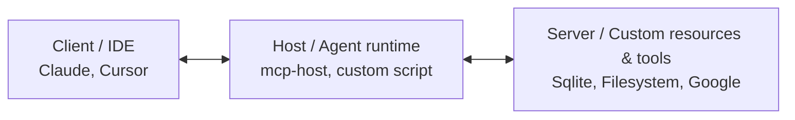

# Unit 30: Model Context Protocol (MCP) Fundamentals and Building Your Own Server

<p class="unit-hero">
  
</p>

> [!IMPORTANT]
> **Preparing your OpenAI API key**
> Chapter 4 requires an **OpenAI API key**. For how to obtain a key, billing notes, and secure environment-variable setup with Google Colab secrets, read [Appendix (Learning Environment and API Setup)](../appendix/index.md#🔑-3-openai-api-key-acquisition-and-secure-management-chapter-4) first.

## 1. Understanding Model Context Protocol (MCP)


When giving AI agents tools—file ops, DB search, external APIs—teams traditionally implemented custom interfaces per framework (LangChain, LlamaIndex) or vendor API, **by hand**.

That tied you to specific frameworks and forced rewriting the same tool wiring for every new agent—a serious scalability problem.

**Model Context Protocol (MCP)**, published by Anthropic on **November 25, 2024**, is an open standard that normalizes how LLMs (AI clients) connect to external data and tools—**“USB for the AI world”**—so one tool can be reused across MCP-compatible clients.

### 1.1 MCP three-layer architecture

MCP uses three cooperating roles:



#### Text alternative for system structure

1. **Client**: UI the user operates (Cursor IDE, Claude Desktop)—handles LLM dialog and tool approval.
2. **Host**: Mediator driving the agent; receives client intent and routes to the right MCP server.
3. **Server**: Process hosting real tools and data; responds to Host requests (via JSON-RPC) with Resources or Tools—not roaming autonomously.

### 1.2 MCP’s three pillars (Resources, Prompts, Tools)

MCP servers expose three standard data forms to LLMs:

- **Resources**:
  - Read-only static data agents can fetch (files, DB contents, API responses).
  - Addressed like URLs (e.g., `mysql://customer_db/profile`) for context.
- **Prompts**:
  - Reusable prompt templates on the server (e.g., `/analyze-log`).
  - Inject user args and give optimal instructions to the LLM.
- **Tools**:
  - Dynamic functions with writes/changes/irreversible actions (save file, payment, run command).
  - Designed for easy **human-in-the-loop** approval before execution.

### 1.3 JSON-RPC over Standard I/O (stdio)

MCP’s base protocol is lightweight **JSON-RPC 2.0**.
For local runs, **stdio** (stdin/stdout) avoids open network ports—strong local security.

### 💡 Concrete business use cases

- **Secure database audit**: Run SQL MCP server locally over stdio; Host requests data through audit hooks only.
- **Shared dev-tool connection**: MCP-wrap internal APIs once; Cursor IDE and Claude Desktop plug in with zero extra code for all devs.

---


## 2. Implementation Example

Use the lightweight Python **`mcp` (MCP SDK)** library to build an MCP server so agents can **search a customer profile database via the standard protocol**.

> **Colab setup:** Add only the MCP Python SDK.
>
> ```python
> %pip install mcp
> ```

### Sample implementation (mcp_server.py)

```python
import sys
from mcp.server.fastmcp import FastMCP

# 1. Initialize FastMCP server (register name)
# FastMCP uses Python decorators to add resources and tools intuitively.
mcp = FastMCP("customer-insights-server")

# Mock customer database
CUSTOMER_DATABASE = {
    "cust_001": {
        "name": "Alice",
        "tier": "VIP",
        "email": "alice@example.com",
        "status": "Active"
    },
    "cust_002": {
        "name": "Bob",
        "tier": "Regular",
        "email": "bob@example.com",
        "status": "Suspended"
    }
}

# ==========================================
# 2. Define Resources
# ==========================================
# @mcp.resource() provides static reference data to the agent.
# Returns a static list of all customer IDs.
@mcp.resource("customer://list")
def get_customer_list() -> str:
    """Return a list of all registered customer IDs."""
    return ", ".join(CUSTOMER_DATABASE.keys())

# Resource with dynamic path (URL parameter)
@mcp.resource("customer://{customer_id}/profile")
def get_customer_profile(customer_id: str) -> str:
    """Return profile details for the specified customer ID."""
    cust = CUSTOMER_DATABASE.get(customer_id.lower())
    if cust:
        return (
            f"--- Customer Profile ({customer_id}) ---\n"
            f"Name: {cust['name']}\n"
            f"Membership tier: {cust['tier']}\n"
            f"Status: {cust['status']}"
        )
    return f"Error: Customer ID '{customer_id}' does not exist."

# ==========================================
# 3. Define Tools
# ==========================================
# @mcp.tool() provides executable actions to the agent.
# Type hints and docstrings automatically become the LLM tool schema description.
@mcp.tool()
def update_member_tier(customer_id: str, new_tier: str) -> str:
    """
    Update the membership tier for the specified customer ID.

    Args:
        customer_id: Target customer ID (e.g., cust_001)
        new_tier: New tier name (e.g., VIP, Regular)
    """
    cust = CUSTOMER_DATABASE.get(customer_id.lower())
    if not cust:
        return f"Error: Customer ID '{customer_id}' not found."

    old_tier = cust["tier"]
    cust["tier"] = new_tier
    return f"Success: Updated customer {customer_id} tier from {old_tier} to {new_tier}."

# ==========================================
# 4. Start server over stdio
# ==========================================
if __name__ == "__main__":
    # Launch as a standard stdio process invoked by the MCP Host.
    print("🚀 MCP Customer Insights Server Starting...", file=sys.stderr)
    mcp.run(transport="stdio")
```

### 💡 Note: invoking from Host (client side)

Add this server path to `mcpServers` in Claude Desktop / Cursor config—it plugs in as agent capability immediately.

```json
"mcpServers": {
  "customer-insights": {
    "command": "python",
    "args": ["/absolute/path/to/mcp_server.py"]
  }
}
```

---

## 3. Practice

### 🧠 Design and implement: customer-support MCP server

Support agents handle “show recent purchases” and “calculate applicable discount” through MCP’s clean standard interface.

**【Requirements】**
Using `FastMCP`, build **`support_mcp_server.py`**—a **customer-support MCP server** meeting:

1. **Static Resources**:
   - Define resource path `support://{order_id}/items`.
   - Return purchased item list and payment amount for order ID (e.g., `order_101`).
2. **Dynamic Tools**:
   - Define `calculate_loyalty_points(amount: int, tier: str)`.
   - Input: payment amount (JPY) and tier (VIP / Regular). Compute loyalty points:
     - **VIP**: 5% of amount
     - **Regular**: 1% of amount
3. **Safety**:
   - Validate inputs (e.g., negative amount) and return error strings.
4. Complete runnable Python script starting with stdio transport.

---

## 4. Answer Key

<details>
<summary>View sample solution (click to expand)</summary>

Complete support MCP server implementation:

```python
import sys
from mcp.server.fastmcp import FastMCP

# 1. Instantiate MCP server
mcp = FastMCP("enterprise-support-server")

# Mock order history database
ORDERS_DATABASE = {
    "order_101": {
        "items": ["Sneakers", "T-Shirt"],
        "total_jpy": 15000
    },
    "order_202": {
        "items": ["Premium Jacket"],
        "total_jpy": 25000
    }
}

# ==========================================
# 2. Define static Resources
# ==========================================
@mcp.resource("support://{order_id}/items")
def get_order_items(order_id: str) -> str:
    """
    Return order items and total amount for the specified order ID.
    """
    order = ORDERS_DATABASE.get(order_id.lower())
    if order:
        items_str = ", ".join(order["items"])
        return (
            f"--- Order History ({order_id}) ---\n"
            f"Items purchased: {items_str}\n"
            f"Total paid: {order['total_jpy']} yen"
        )
    return f"Error: No history found for order ID '{order_id}'."

# ==========================================
# 3. Define dynamic Tools
# ==========================================
@mcp.tool()
def calculate_loyalty_points(amount: int, tier: str) -> str:
    """
    Calculate loyalty points (yen equivalent) earned from purchase amount and membership tier.

    Args:
        amount: Purchase amount (JPY)
        tier: Customer membership tier (VIP or Regular)
    """
    # Safety: validate inputs
    if amount < 0:
        return "Error: Purchase amount must be a non-negative integer."

    clean_tier = tier.strip().upper()
    if clean_tier not in ["VIP", "REGULAR"]:
        return "Error: Membership tier must be 'VIP' or 'Regular'."

    # Execute business logic
    if clean_tier == "VIP":
        points = int(amount * 0.05)
        rate_str = "5% (VIP benefit)"
    else:
        points = int(amount * 0.01)
        rate_str = "1% (standard member benefit)"

    return (
        f"--- Points Calculation Result ---\n"
        f"Purchase amount: {amount} yen\n"
        f"Applied rate: {rate_str}\n"
        f"Points to be awarded: {points} pt (1 pt = 1 yen)"
    )

# ==========================================
# 4. Startup
# ==========================================
if __name__ == "__main__":
    # Start with stdio transport for secure communication with external host/agent process
    print("🚀 Support MCP Server Starting...", file=sys.stderr)
    mcp.run(transport="stdio")
```

</details>
