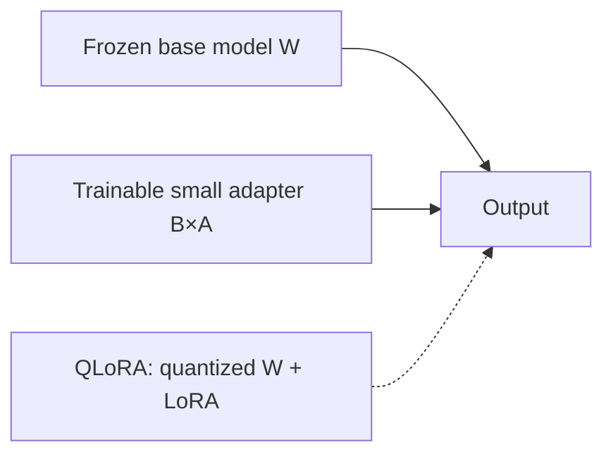

# Unit 36: LLM Adaptation with LoRA / QLoRA

<p class="unit-hero">
  
</p>

> [!WARNING]
> Do not include personal or secret information in training data. Check model and dataset licenses, GPU cost, and separation of training and evaluation data.

## 1. Understanding Fine-Tuning and LoRA

Fine-tuning adjusts an existing LLM for a task or domain. Updating every parameter can require substantial GPU memory and storage. **LoRA (Low-Rank Adaptation)** freezes the base weights and trains small low-rank matrices instead.

Conceptually, LoRA adds a learned update `ΔW = B × A` to the original linear transformation `W`. It reduces the number of trainable parameters, but it does not automatically solve quality, safety, or licensing concerns.

**QLoRA** combines LoRA with a quantized base model. It may reduce memory requirements, but depends on 4-bit backends, GPU support, and library versions. This unit focuses on the LoRA mechanism and uses QLoRA to discuss design trade-offs.



## 2. Implementation Example

The following minimal PyTorch module makes the frozen base and trainable adapter visible. It is not a script for training a full LLM.

```python
import torch
from torch import nn


class LoRALinear(nn.Module):
    def __init__(self, in_features, out_features, rank=2, alpha=1.0):
        super().__init__()
        self.base = nn.Linear(in_features, out_features)
        for parameter in self.base.parameters():
            parameter.requires_grad = False
        self.adapter_a = nn.Parameter(torch.randn(rank, in_features) * 0.01)
        self.adapter_b = nn.Parameter(torch.zeros(out_features, rank))
        self.scale = alpha / rank

    def forward(self, x):
        base_output = self.base(x)
        update = (x @ self.adapter_a.T) @ self.adapter_b.T
        return base_output + self.scale * update


model = LoRALinear(8, 4, rank=2)
trainable = sum(p.numel() for p in model.parameters() if p.requires_grad)
total = sum(p.numel() for p in model.parameters())
print("trainable parameters:", trainable)
print("total parameters:", total)
```

The base weights are frozen; only `adapter_a` and `adapter_b` are trainable. Real LLM projects commonly use PEFT-style libraries and must choose target layers, learning rate, rank, and evaluation procedures.

## 3. Practice

1. Set `rank` to 1, 2, and 4 and record parameter counts and output capacity.
2. Verify that all base-model parameters have `requires_grad=False`.
3. Compare trainable parameter counts for full-layer updates and LoRA updates on a small model.
4. Explain QLoRA’s memory benefit and its accuracy, speed, and GPU-dependency trade-offs.

For real training, separate training and evaluation data and record the base model, adapter, tokenizer, training configuration, and evaluation results.

## 4. Answer Key

<details>
<summary>View sample answer</summary>

- A higher rank increases adapter parameters and capacity, but also memory, training time, and overfitting risk.
- LoRA freezes the base model and updates only low-rank matrices.
- QLoRA means a quantized base model combined with LoRA; it does not mean that every LoRA model is automatically quantized. Verify library and GPU compatibility.

</details>
