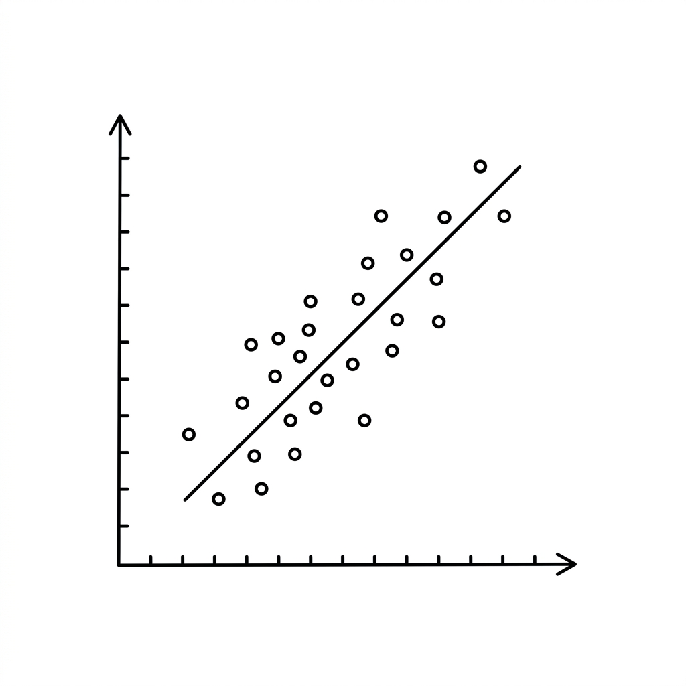

# Unit 1: Linear & Regularized Regression


## 1. Understanding Linear Regression and Regularization



### What Is Linear Regression? — Predicting Rent
In everyday terms, linear regression is like **using one straight ruler to predict the future from past data**.

Suppose you want to predict **rent (in 10,000 yen)** from **room size (square meters)**.
When you plot the data, you usually see that larger rooms tend to cost more. Linear regression draws **one line that best fits the middle of the data**.

| Room size (feature) | Rent (target) |
| :--- | :--- |
| 20㎡ | 60,000 yen |
| 30㎡ | 80,000 yen |
| 40㎡ | 100,000 yen |

In formula form, this line looks like:
**Rent = (coefficient × room size) + base fee (intercept)**
The algorithm's job is to find the **coefficient** and **base fee** that best fit the historical data.

### What Is Regularization? — A Brake Against Overfitting
In reality, rent depends on many factors: distance from the station, building age, nearby convenience stores, and more.
When data gets complex, a model may try **too hard to fit the training data perfectly**. That is called **overfitting**.

Think of it like **a student who memorizes past exam questions but cannot solve new problems on test day**.

**Regularization** is the brake that prevents this. There are two main types:
1. **Ridge regression**: Shrinks coefficients overall to prevent extreme assumptions.
2. **Lasso regression**: Sets unimportant feature coefficients to **exactly zero**, effectively ignoring them. It is good at decluttering.

### 💡 Real-World Business Use Cases

- **Real estate valuation AI**: Predict fair rent or sale price from features such as floor area, building age, and distance to the nearest station.
- **Retail sales forecasting**: Predict next-day store revenue from past sales, temperature, and holidays to optimize ordering.
- **Marketing mix modeling (ad ROI analysis)**: Estimate how much each channel (TV, web ads, etc.) contributes to revenue and optimize budget allocation.

---

## 2. Implementation Example

Here we use Python and the `scikit-learn` library to build linear regression and Ridge regression models that predict housing prices.

First, import the libraries and prepare the data.

```python
# 必要なツールのインポート
import numpy as np
import pandas as pd
from sklearn.model_selection import train_test_split
from sklearn.linear_model import LinearRegression, Ridge
from sklearn.metrics import mean_squared_error

# 1. データの準備 (今回はダミーデータを作成します)
# np.random.seed(42) で毎回同じランダムな数値が出るように固定します
np.random.seed(42)

# X: 部屋の広さ（20〜80平米のデータを100件）
X = np.random.randint(20, 80, size=(100, 1))

# y: 家賃（広さ × 0.2 + 誤差を少し加える）
y = X * 0.2 + np.random.randn(100, 1) * 2

# 2. データを「学習用」と「テスト用」に分割
# 全データのうち、80%を学習（過去問）に、20%をテスト（本番試験）に使います
X_train, X_test, y_train, y_test = train_test_split(X, y, test_size=0.2, random_state=42)
```

**Code walkthrough**
We created mock data to predict rent from room size. To prevent cheating, we used `train_test_split` to separate training data from test data used for scoring later.

Next, train the model and make predictions.

```python
# 3. モデルの準備と学習
# 普通の線形回帰モデルを作成
model_lr = LinearRegression()

# 学習データ（X_train, y_train）を使って、最適な直線を引く（学習）
model_lr.fit(X_train, y_train)

# 4. テストデータで予測
y_pred_lr = model_lr.predict(X_test)

# 5. 答え合わせ（精度評価）
# MSE (平均二乗誤差): 予測と実際の値がどれくらいズレているかを計算
mse_lr = mean_squared_error(y_test, y_pred_lr)
print(f"通常の線形回帰のMSE: {mse_lr:.2f}")
```

**Code walkthrough**
Create a model with `LinearRegression()`, then call `.fit()` and the algorithm finds the best line. That is the training phase. After that, `.predict()` forecasts rent on unseen test data, and we measure error with MSE.

Let's also build a regularized (Ridge) version.

```python
# 6. 正則化モデル (Ridge) の準備と学習
# alpha はブレーキの強さです。大きいほどブレーキが強くかかります
model_ridge = Ridge(alpha=1.0)
model_ridge.fit(X_train, y_train)

# テストデータで予測
y_pred_ridge = model_ridge.predict(X_test)

# 答え合わせ（精度評価）
mse_ridge = mean_squared_error(y_test, y_pred_ridge)
print(f"Ridge回帰のMSE: {mse_ridge:.2f}")
```

On this simple dataset the results are nearly identical, but with hundreds or thousands of features, Ridge's "brake" often improves accuracy.

---

## 3. Practice

Now it's your turn! Build a model following the requirements below.

**Requirements**
Use the **Diabetes dataset** — predict one-year diabetes progression from numeric features such as age, BMI, and blood pressure.

1. Load data with `load_diabetes` from `sklearn.datasets`.
2. Split the data into 80% training and 20% test.
3. Create and train a **Lasso** model with `alpha=0.1`.
4. Predict on the test set and print MSE (mean squared error).

**Hints**
- Add `from sklearn.linear_model import Lasso`.
- Load with `from sklearn.datasets import load_diabetes`, then set `X = data.data` and `y = data.target` after `data = load_diabetes()`.

---

## 4. Answer Key

Write your own code first, then open the answer below to check your work.

<details>
<summary>View sample solution (click to expand)</summary>

```python
import numpy as np
from sklearn.datasets import load_diabetes
from sklearn.model_selection import train_test_split
from sklearn.linear_model import Lasso
from sklearn.metrics import mean_squared_error

# 1. データの読み込み
diabetes = load_diabetes()
X = diabetes.data
y = diabetes.target

# 2. データの分割
X_train, X_test, y_train, y_test = train_test_split(X, y, test_size=0.2, random_state=42)

# 3. Lasso回帰モデルの作成と学習
# alpha=0.1 を指定して、Lasso回帰モデルを作ります
model_lasso = Lasso(alpha=0.1)
model_lasso.fit(X_train, y_train)

# 4. 予測と評価
y_pred = model_lasso.predict(X_test)
mse = mean_squared_error(y_test, y_pred)

print(f"Lasso回帰のMSE: {mse:.2f}")

# (おまけ) Lasso回帰の特徴である「使われなかった特徴量」を確認してみましょう
print(f"ゼロになった係数の数: {np.sum(model_lasso.coef_ == 0)} 個")
```

**Solution walkthrough**
The standout feature of Lasso is that it **sets coefficients of irrelevant features to exactly zero**. That makes it easier for humans to see which inputs truly matter — a big win for interpretability!
</details>
