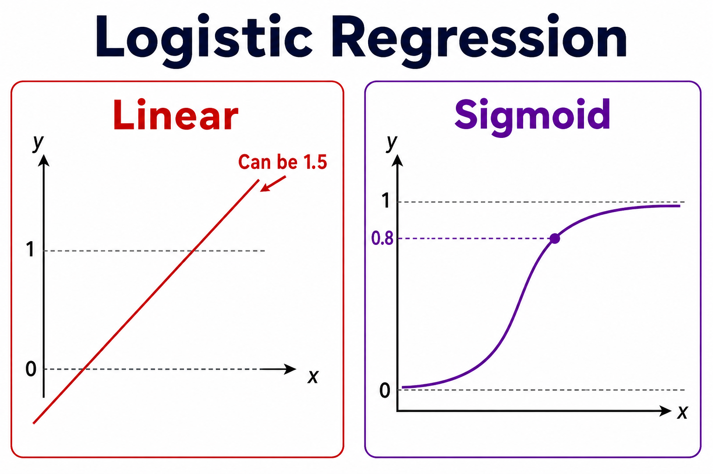
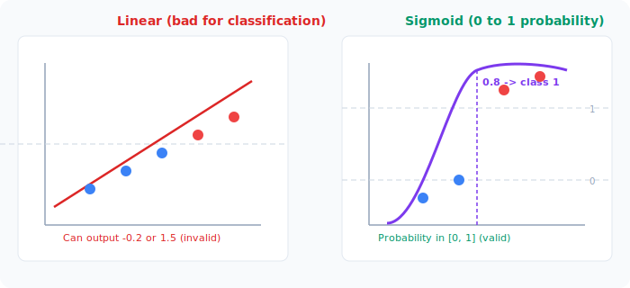
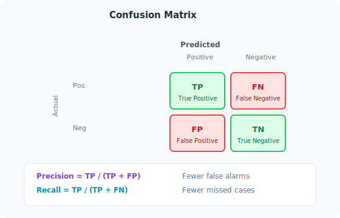

# Unit 2: Logistic Regression & Classification Metrics

<p class="unit-hero">
  
</p>

## 1. Understanding Logistic Regression and Classification Metrics

### What Is Logistic Regression? — Drawing the Line Between 0 and 1
Despite the name "regression," this algorithm is actually for **classification**.

Unit 1's linear regression predicts continuous values like "How much is the rent?" or "What will tomorrow's temperature be?"
Logistic regression predicts categories: **"Is this email spam? (Yes/No)"**, **"Is this image a dog or a cat?"**, **"Will this customer buy?"**

#### Analogy: Predicting Pass or Fail
Suppose you predict exam pass/fail (pass = 1, fail = 0) from study hours.
If you force a straight line from linear regression onto this problem, you might get nonsense like −0.2 or 1.5.

That's where the **sigmoid curve** comes in — a magic S-shaped curve that squeezes values into **0 to 1**.
A prediction of 0.8 means "80% chance of passing, so probably pass (1)." A prediction of 0.2 means "20% chance, so probably fail (0)." You decide **0 or 1 based on probability**.



### Classification Metrics — Why Accuracy Alone Is Not Enough
After building a model, you need to measure how good it is.
**Accuracy** (fraction of correct predictions) is easy to understand, but it can mislead you.

#### Analogy: The Boy Who Cried Wolf and Medical Screening
Imagine a screening AI for a rare disease that affects 1 in 100 people.
If the AI always says "You are healthy!" to everyone, accuracy is 99% because 99 out of 100 are healthy — yet it misses every sick patient. Useless.

That's why we use several **metrics**:



| Metric | English name | What it measures | When to prioritize it |
| :--- | :--- | :--- | :--- |
| **Precision** | Precision | Of all **positive** predictions, how many were truly positive. Penalizes false alarms. | Spam filtering (don't misfile important mail) |
| **Recall** | Recall | Of all **actual positives**, how many the model found. Penalizes misses. | Disease screening (missing a case is worst) |
| **F1 score** | F1-Score | Balanced average of precision and recall. | When both matter roughly equally |

### 💡 Real-World Business Use Cases

- **Credit scoring**: Predict default probability from income, outstanding debt, and payment history to approve or deny loans.
- **Subscription churn prediction**: Flag users likely to cancel next month from login frequency, feature usage, and support tickets — then run retention campaigns.
- **Spam filtering**: Score emails from word frequencies and sender metadata and route likely spam automatically.

---

## 2. Implementation Example

Let's implement logistic regression in Python using the **Breast Cancer dataset** to classify tumors as malignant (0) or benign (1) from features such as size and shape.

```python
# Import required libraries
import pandas as pd
from sklearn.datasets import load_breast_cancer
from sklearn.model_selection import train_test_split
from sklearn.linear_model import LogisticRegression
from sklearn.metrics import accuracy_score, precision_score, recall_score, f1_score

# 1. Prepare the data
cancer_data = load_breast_cancer()
X = cancer_data.data      # numeric features such as tumor size and shape
y = cancer_data.target    # labels: malignant (0) or benign (1)

# Split into 80% training and 20% test
X_train, X_test, y_train, y_test = train_test_split(X, y, test_size=0.2, random_state=42)
```

**Code walkthrough**
We load data with `load_breast_cancer()` and split with `train_test_split`, same as Unit 1, to avoid peeking at the test set during training.

```python
# 2. Prepare and train the model
# Create logistic regression (max_iter is the solver iteration limit)
model = LogisticRegression(max_iter=10000)

# Fit the best decision boundary using training data
model.fit(X_train, y_train)

# 3. Predict on the test set
y_pred = model.predict(X_test)
```

**Code walkthrough**
Create `LogisticRegression`, train with `.fit()` (`max_iter=10000` tells the solver to try up to 10,000 iterations on this slightly harder data), then predict with `.predict()`. Same flow as linear regression!

```python
# 4. Evaluate classification metrics
acc = accuracy_score(y_test, y_pred)
prec = precision_score(y_test, y_pred)
rec = recall_score(y_test, y_pred)
f1 = f1_score(y_test, y_pred)

print(f"Accuracy:  {acc:.3f}")
print(f"Precision: {prec:.3f}")
print(f"Recall:    {rec:.3f}")
print(f"F1-Score:  {f1:.3f}")
```

**Code walkthrough**
Compare predictions (`y_pred`) to labels (`y_test`) and compute all four metrics. `sklearn.metrics` has ready-made functions for each.

---

## 3. Practice

Your turn! Build a classifier following the requirements below.

**Requirements**
Use the **Wine dataset** to classify which of **three wineries** produced a wine from chemical features such as alcohol content and color intensity. (Three-way classification — logistic regression handles it!)

1. Load data with `load_wine` from `sklearn.datasets`.
2. Split into 70% training and 30% test (`test_size=0.3`).
3. Create and train `LogisticRegression` with `max_iter=10000`.
4. Predict on the test set and print **accuracy**.

**Hints**
- With three classes, precision/recall need extra settings. Start with simple `accuracy_score` only.

---

## 4. Answer Key

Write your own code first, then open the answer below to check your work.

<details>
<summary>View sample solution (click to expand)</summary>

```python
from sklearn.datasets import load_wine
from sklearn.model_selection import train_test_split
from sklearn.linear_model import LogisticRegression
from sklearn.metrics import accuracy_score

# 1. Load the data
wine = load_wine()
X = wine.data
y = wine.target

# 2. Split the data (30% held out for testing this time)
X_train, X_test, y_train, y_test = train_test_split(X, y, test_size=0.3, random_state=42)

# 3. Create and train a logistic regression model
model = LogisticRegression(max_iter=10000)
model.fit(X_train, y_train)

# 4. Predict and evaluate (compute accuracy)
y_pred = model.predict(X_test)
accuracy = accuracy_score(y_test, y_pred)

print(f"Wine classification accuracy: {accuracy:.3f}")
```

**Solution walkthrough**
Logistic regression is classic for binary problems, but scikit-learn's implementation automatically handles **multiclass** (three or more labels). Under the hood it runs one-vs-rest style comparisons — very handy!
</details>
