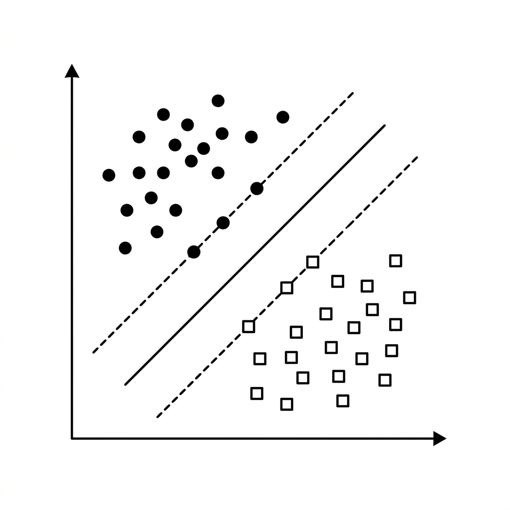

# Unit 3: K-NN and Support Vector Machines

## 1. Understanding K-NN and SVM



This unit covers two famous classifiers with very different philosophies: **K-NN (K-Nearest Neighbors)** and **SVM (Support Vector Machine)**. Both are intuitive and have distinctive strengths.

### What Is K-NN? — "Birds of a Feather Flock Together"
K-NN is sometimes called the **"laziest"** algorithm in machine learning because it does not learn a complex formula upfront — it simply **memorizes past data**.

How does it predict on new data?
By **majority vote among nearby neighbors**: "You're probably the same category as the people closest to you."

#### Analogy: Guessing a Transfer Student's Club
A transfer student arrives (unknown data). Will they join sports or culture club?
K-NN works like this:
1. Find the **K students** (e.g., 3) most similar in hobbies and personality (features).
2. If those three are "sports, sports, culture," predict **sports** by majority vote.

| Choice of K (how many neighbors?) | Pros | Cons |
| :--- | :--- | :--- |
| **K too small (e.g., K=1)** | Can draw complex boundaries | Easily fooled by noisy outliers |
| **K too large (e.g., K=100)** | Stable against noise | Ignores fine detail; predictions become coarse |

### What Is SVM? — The Craftsman Who Draws the Widest Road
SVM is a strict, skilled **"boundary drawer."**

When splitting data into two groups (red team vs. blue team), any line is not enough. SVM seeks a boundary **as far as possible from both sides** — the safest dividing line.

#### Analogy: Borders and Margins
Draw a border between red country and blue country.
If the border hugs a red house too closely, small shifts cause misclassification. SVM finds the closest red and blue houses (**support vectors**) and draws the border to maximize the **margin** — the buffer zone between them.

SVM also has the **kernel trick**.
When data cannot be separated by a straight line, the kernel "lifts" points into higher dimensions so a plane can slice them apart — enabling complex classification.

### 💡 Real-World Business Use Cases

- **Similar-product recommendations (K-NN)**: Find products with similar price, category, and ratings — "Customers who bought this also viewed…"
- **Visual inspection and anomaly detection (SVM)**: Learn complex boundaries between good and defective products from surface images to automate QC.
- **Clinical decision support (SVM)**: Classify disease status from lab values and vitals with high accuracy to assist physicians.

---

## 2. Implementation Example

We use the famous **Iris dataset** to classify three iris species from sepal and petal measurements. We'll implement both K-NN and SVM and compare them.

```python
# 必要なツールのインポート
from sklearn.datasets import load_iris
from sklearn.model_selection import train_test_split
from sklearn.neighbors import KNeighborsClassifier
from sklearn.svm import SVC
from sklearn.metrics import accuracy_score

# 1. データの準備
iris = load_iris()
X = iris.data
y = iris.target

# 学習用（80%）とテスト用（20%）に分割
X_train, X_test, y_train, y_test = train_test_split(X, y, test_size=0.2, random_state=42)
```

**Code walkthrough**
Standard load and split. Four flower features and three species labels.

```python
# 2. K-NNモデルの学習と予測
# K=3 (一番近い3つのデータを見て多数決する) に設定
knn_model = KNeighborsClassifier(n_neighbors=3)

# 過去のデータを丸暗記（学習）
knn_model.fit(X_train, y_train)

# 予測して正解率を計算
knn_pred = knn_model.predict(X_test)
knn_acc = accuracy_score(y_test, knn_pred)

print(f"K-NNの正解率: {knn_acc:.3f}")
```

**Code walkthrough**
`KNeighborsClassifier` with `n_neighbors=3` means "ask three nearest neighbors." For K-NN, `.fit()` mostly stores data in memory rather than computing weights.

```python
# 3. SVMモデルの学習と予測
# kernel='rbf' は、先ほど説明した「次元を飛ばして曲線を引く魔法（カーネルトリック）」の設定です
svm_model = SVC(kernel='rbf', random_state=42)

# 最大の道路幅を見つける（学習）
svm_model.fit(X_train, y_train)

# 予測して正解率を計算
svm_pred = svm_model.predict(X_test)
svm_acc = accuracy_score(y_test, svm_pred)

print(f"SVMの正解率:  {svm_acc:.3f}")
```

**Code walkthrough**
`SVC` (Support Vector Classification) is the SVM class. `kernel='rbf'` is the popular default for nonlinear boundaries. Both algorithms perform very well on this task!

---

## 3. Practice

Build an SVM classifier following the requirements below.

**Requirements**
Use the **Digits dataset** — coarse 8×8 pixel images of handwritten digits 0–9.

1. Load data with `load_digits` from `sklearn.datasets`.
2. Split into 80% training and 20% test.
3. Create and train an `SVC` model.
4. Predict on the test set and print accuracy.

**Hints**
- Load with `digits = load_digits()`. Images are already flattened to numeric vectors — use `X = digits.data` as usual.

---

## 4. Answer Key

Write your own code first, then open the answer below to check your work.

<details>
<summary>View sample solution (click to expand)</summary>

```python
from sklearn.datasets import load_digits
from sklearn.model_selection import train_test_split
from sklearn.svm import SVC
from sklearn.metrics import accuracy_score

# 1. データの読み込み
digits = load_digits()
X = digits.data
y = digits.target

# 2. データの分割
X_train, X_test, y_train, y_test = train_test_split(X, y, test_size=0.2, random_state=42)

# 3. SVMモデルの作成と学習
# 今回はデフォルトの設定で作成します
svm_model = SVC(random_state=42)
svm_model.fit(X_train, y_train)

# 4. 予測と評価
y_pred = svm_model.predict(X_test)
accuracy = accuracy_score(y_test, y_pred)

print(f"手書き数字認識(SVM)の正解率: {accuracy:.3f}")
```

**Solution walkthrough**
Even on pixel-style data like handwritten digits, SVM often reaches ~98% accuracy with minimal code — a strong, practical algorithm!
</details>
