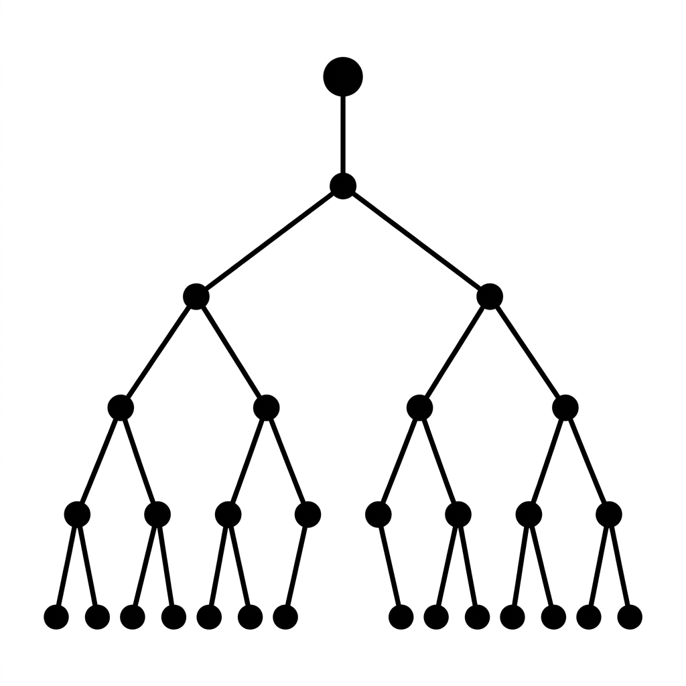

# Unit 4: Decision Trees and Random Forests

## 1. Understanding Decision Trees and Random Forests



So far we've split data with formulas and boundaries. This unit introduces algorithms closer to human reasoning: **decision trees** and their evolved form, **random forests**.

### What Is a Decision Tree? — The "20 Questions" Game
A decision tree **narrows down the answer by repeating yes/no questions**.

Think of the character-guessing game Akinator: "Is this person real?" "Male?" "A YouTuber?" — step by step you reach one answer from thousands of possibilities. A decision tree does exactly that.

#### Analogy: Classifying Animals
Split data into dog, cat, and bird.

1. **Question 1:** "Does it have feathers?"
   - Yes → Bird! 🐦
   - No → Next question
2. **Question 2:** "Does it like walks?"
   - Yes → Dog! 🐶
   - No → Cat! 🐱

| Decision tree pros | Decision tree cons |
| :--- | :--- |
| Easy for humans to read and explain (best interpretability) | Tends to memorize training data (overfitting) |
| Works without scaling features | Deep trees become unstable — small data changes flip predictions |

### What Is a Random Forest? — "Two Heads Are Better Than One"
A single deep tree overfits — it becomes a picky expert asking odd questions.

**Random forest** fixes this: **"If one tree fails, build 100 diverse trees and vote!"** (This is **ensemble learning**.)

#### Analogy: Finding a Great Restaurant
- **Decision tree (one person)**: "In my experience, red signs with only three menu items are always best!" (Too biased.)
- **Random forest (100-person panel)**:
  - Person A: "Four stars or higher."
  - Person B: "Places with a line out the door."
  - Person C: "Clean interior."
  👉 **Vote on the final pick.**

Each person may err slightly, but together they form wisdom. Random forest builds many trees with **slightly randomized data and question choices**, then majority-votes for the final prediction.

### 💡 Real-World Business Use Cases

- **Call center routing**: Route customers to the right department with yes/no decision rules from keywords and menu choices.
- **Employee attrition risk**: Predict turnover from overtime, pay band, and review scores so managers know whom to follow up with.
- **Fraud detection**: Flag suspicious card transactions from location, amount, and time patterns that deviate from normal behavior.

---

## 2. Implementation Example

Using **breast cancer diagnosis data**, compare accuracy of a single decision tree vs. a random forest vote.

```python
# Import required libraries
from sklearn.datasets import load_breast_cancer
from sklearn.model_selection import train_test_split
from sklearn.tree import DecisionTreeClassifier
from sklearn.ensemble import RandomForestClassifier
from sklearn.metrics import accuracy_score

# 1. Prepare and split the data
cancer = load_breast_cancer()
X = cancer.data
y = cancer.target

X_train, X_test, y_train, y_test = train_test_split(X, y, test_size=0.2, random_state=42)
```

**Code walkthrough**
Load data and split into train and test as usual.

```python
# 2. Train and predict with a single decision tree
# max_depth limits tree depth (number of questions); no limit here
tree_model = DecisionTreeClassifier(random_state=42)
tree_model.fit(X_train, y_train)

tree_pred = tree_model.predict(X_test)
print(f"Decision tree accuracy: {accuracy_score(y_test, tree_pred):.3f}")
```

**Code walkthrough**
`DecisionTreeClassifier` builds one tree. Training is very fast.

```python
# 3. Train and predict with random forest (majority vote)
# n_estimators=100 means build 100 trees and vote
rf_model = RandomForestClassifier(n_estimators=100, random_state=42)
rf_model.fit(X_train, y_train)

rf_pred = rf_model.predict(X_test)
print(f"Random forest accuracy: {accuracy_score(y_test, rf_pred):.3f}")
```

**Code walkthrough**
`RandomForestClassifier` uses the same API as a single tree but trains 100 trees internally and votes. Random forest is usually more accurate and stable.

---

## 3. Practice

Random forests work for **regression** (numeric prediction) too. Try the exercise below.

**Requirements**
Use the **Diabetes dataset** from Unit 1 with random forest **regression**.

1. Load with `load_diabetes` from `sklearn.datasets`.
2. Split into 80% training and 20% test.
3. Use **`RandomForestRegressor`** (not `RandomForestClassifier`) with 100 trees.
4. Predict on the test set and print MSE with `mean_squared_error`.

**Hints**
- Import `from sklearn.ensemble import RandomForestRegressor`.
- Also import `from sklearn.metrics import mean_squared_error`.

---

## 4. Answer Key

Write your own code first, then open the answer below to check your work.

<details>
<summary>View sample solution (click to expand)</summary>

```python
from sklearn.datasets import load_diabetes
from sklearn.model_selection import train_test_split
from sklearn.ensemble import RandomForestRegressor
from sklearn.metrics import mean_squared_error

# 1. Load the data
diabetes = load_diabetes()
X = diabetes.data
y = diabetes.target

# 2. Split the data
X_train, X_test, y_train, y_test = train_test_split(X, y, test_size=0.2, random_state=42)

# 3. Create and train a random forest regression model
# Use Regressor for numeric prediction
rf_reg_model = RandomForestRegressor(n_estimators=100, random_state=42)
rf_reg_model.fit(X_train, y_train)

# 4. Predict and evaluate
y_pred = rf_reg_model.predict(X_test)
mse = mean_squared_error(y_test, y_pred)

print(f"Random forest regression MSE: {mse:.2f}")
```

**Solution walkthrough**
Only the class name differs between classification (`Classifier`) and regression (`Regressor`) — usage is identical!
Random forest is a go-to **baseline** in production: strong on almost any tabular dataset.
</details>
