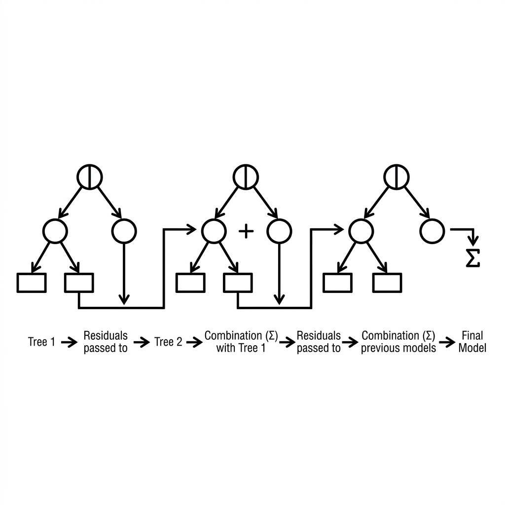

# Unit 5: Gradient Boosting and XGBoost

## 1. Understanding Gradient Boosting and XGBoost



Unit 4's random forest is an ensemble that **votes in parallel**. This unit covers a different ensemble idea: **gradient boosting** and its powerhouse implementation, **XGBoost**.

### What Is Gradient Boosting? — A Relay That Covers Weaknesses
Random forest is like **100 people predicting at once and voting**.
Gradient boosting is a **relay where each runner fixes the previous runner's mistake (error)**.

#### Analogy: Team Golf Toward the Cup
The cup (correct answer) is far from the tee.
1. **Tree 1**: A bold shot — close, but still 5 meters to the **right**.
2. **Tree 2**: Aims only at correcting that **5-meter right error** — now 1 meter **short**.
3. **Tree 3**: Gently fixes the **1-meter short** error.
4. Repeat until you land on target.

Each new tree predicts the **residual error** of the previous trees. Boosting stacks corrections to improve accuracy step by step.

| Method | Approach | Pros and cons |
| :--- | :--- | :--- |
| **Random forest** | Parallel (everyone solves at once) | Fast; resists overfitting. |
| **Boosting** | Sequential (learn from prior errors) | **Often highest accuracy.** Slower; tuning is harder. |

### What Is XGBoost? — Fastest, Strongest Boosting
Boosting is accurate but **slow** because trees are built one after another.

**XGBoost (eXtreme Gradient Boosting)** speeds this up with algorithmic tricks that enable **parallel computation** where possible. It also handles **missing values** automatically.

Because of its speed and accuracy, XGBoost dominated competitions like **Kaggle** for years — many winners used it on tabular data.

### 💡 Real-World Business Use Cases

- **Dynamic pricing**: Predict optimal hotel or airline prices from demand, competitor rates, and seasonality — update prices in real time.
- **Click-through rate (CTR) prediction**: Score ad click probability from browsing history and creative features to serve the best ads.
- **Inventory and demand forecasting**: Forecast weekly demand across thousands of SKUs using weather, trends, and promotion history to cut overstock and stockouts.

---

## 2. Implementation Example

We'll use the **XGBoost library** to classify breast cancer data. (`xgboost` is separate from scikit-learn and must be installed.)

```python
# 必要なツールのインポート
import xgboost as xgb
from sklearn.datasets import load_breast_cancer
from sklearn.model_selection import train_test_split
from sklearn.metrics import accuracy_score

# 1. データの準備と分割
cancer = load_breast_cancer()
X = cancer.data
y = cancer.target

X_train, X_test, y_train, y_test = train_test_split(X, y, test_size=0.2, random_state=42)
```

**Code walkthrough**
Data prep is the same as before. scikit-learn datasets plug directly into XGBoost.

```python
# 2. XGBoostモデルの作成
# XGBClassifier を使います。
# n_estimators: 作る木の数（リレーのバトンを渡す回数）
# learning_rate: 学習率（1回のスイングの強さ。大きすぎるとカップを通り過ぎてしまいます）
xgb_model = xgb.XGBClassifier(
    n_estimators=100,
    learning_rate=0.1,
    random_state=42,
    eval_metric='logloss' # 警告を消すためのおまじない
)

# 3. 学習
xgb_model.fit(X_train, y_train)

# 4. 予測と評価
y_pred = xgb_model.predict(X_test)
acc = accuracy_score(y_test, y_pred)

print(f"XGBoostの正解率: {acc:.3f}")
```

**Code walkthrough**
`xgb.XGBClassifier` mirrors scikit-learn's `.fit()` / `.predict()` API.
`learning_rate` controls how aggressively each tree corrects errors — one of XGBoost's most important knobs.

---

## 3. Practice

Build your own XGBoost model.

**Requirements**
Use the **Wine dataset** to classify three wine types with XGBoost.

1. Load with `load_wine` from `sklearn.datasets`.
2. Split into 80% training and 20% test.
3. Create `xgb.XGBClassifier` with `n_estimators=50` and `learning_rate=0.2`.
4. Train, predict on the test set, and print accuracy.

**Hints**
- Don't forget `import xgboost as xgb` and `from sklearn.metrics import accuracy_score`.

---

## 4. Answer Key

Write your own code first, then open the answer below to check your work.

<details>
<summary>View sample solution (click to expand)</summary>

```python
import xgboost as xgb
from sklearn.datasets import load_wine
from sklearn.model_selection import train_test_split
from sklearn.metrics import accuracy_score

# 1. データの読み込み
wine = load_wine()
X = wine.data
y = wine.target

# 2. データの分割
X_train, X_test, y_train, y_test = train_test_split(X, y, test_size=0.2, random_state=42)

# 3. XGBoostモデルの作成と学習
# wineデータは3クラス分類（0, 1, 2）ですが、XGBoostは自動的に対応してくれます
xgb_model = xgb.XGBClassifier(
    n_estimators=50,
    learning_rate=0.2,
    random_state=42,
    eval_metric='mlogloss' # 多クラス分類用の評価指標
)
xgb_model.fit(X_train, y_train)

# 4. 予測と評価
y_pred = xgb_model.predict(X_test)
accuracy = accuracy_score(y_test, y_pred)

print(f"ワイン分類(XGBoost)の正解率: {accuracy:.3f}")
```

**Solution walkthrough**
In just a few dozen lines you run one of the strongest algorithms on tabular data. XGBoost remains a production workhorse for spreadsheet-style datasets.
</details>
