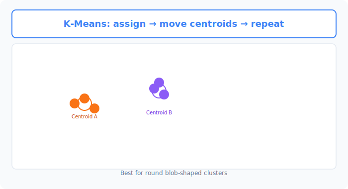
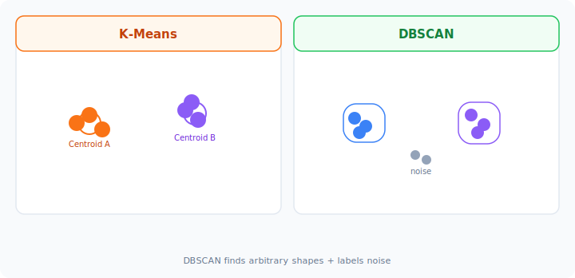

# Unit 6: Clustering Algorithms

<p class="unit-hero">
  
</p>

## 1. Understanding Clustering




Units so far (linear regression, random forest, etc.) used data with **known labels (targets)** to predict "Is this A or B?" That is **supervised learning**.

In the real world, most data has **no labels**. For example, with purchase history for 100,000 customers, nobody knows the "correct" segment for each person.

**Clustering (unsupervised learning)** automatically **groups similar records together** without labeled answers.

### What Is K-Means? — Seating Guests at a Party
The most famous and simple method is **K-Means**.
It splits data into **K groups (clusters)** — like automatic seating at a standing reception.

#### Analogy: Cocktail Party Table Assignment
Guests stand scattered in a large room. You want **three groups (tables)**.
K-Means runs these steps:

1. **Place tables randomly (initialization)**
   Put three tables (red, blue, green) at random spots.
2. **Assign each guest to the nearest table**
   Everyone gets a badge for their closest table color.
3. **Move each table to the center of its group**
   Move the red table to the **centroid** of red-badge guests. Same for blue and green.
4. **Repeat steps 2 and 3**
   Reassign badges as tables move. Stop when **no one switches tables (tables stop moving)** — seating done!

| K-Means trait | Explanation |
| :--- | :--- |
| **Required setting** | You must choose **how many groups (K)** upfront. |
| **Strengths** | Clean separation of **round, blob-shaped** clusters. |
| **Weaknesses** | Struggles with crescent-shaped clusters; sensitive to outliers. |

### 💡 Real-World Business Use Cases

- **Customer segmentation**: Group shoppers by behavior to discover personas like "high value" or "at risk of churn" and target campaigns.
- **Area marketing for real estate**: Cluster regions by demographics and store density to find similar areas for new locations.
- **News article grouping**: Cluster daily articles by topic (politics, sports, entertainment) for personalized feeds.

---



## 2. Implementation Example

We'll create **unlabeled random blob data** and let K-Means discover groups automatically.

```python
# Import required libraries
import matplotlib.pyplot as plt
from sklearn.datasets import make_blobs
from sklearn.cluster import KMeans

# 1. Prepare unlabeled data
# make_blobs creates artificial clusters for experimentation
# Create 4 blobs (centers=4) but do not tell K-Means the true labels
X, _ = make_blobs(n_samples=300, centers=4, cluster_std=0.6, random_state=42)

# Plot the data to inspect it
plt.scatter(X[:, 0], X[:, 1], c='gray', s=30)
plt.title("Grouping without answers")
plt.show()
# Gray points scattered across the plot will appear
```

**Code walkthrough**
`make_blobs` gives `X` with only x/y coordinates. We ignore the true group labels (`y`) and proceed without them.

```python
# 2. Create and train a K-Means model
# n_clusters=4: split into 4 groups
kmeans = KMeans(n_clusters=4, random_state=42)

# Train (unsupervised — pass only X, no labels y)
kmeans.fit(X)

# 3. Predict cluster assignments for each point
labels = kmeans.predict(X)

# 4. Plot clusters with color-coded labels
plt.scatter(X[:, 0], X[:, 1], c=labels, cmap='viridis', s=30)
plt.title("K-Means Clustering Result")
plt.show()
```

**Code walkthrough**
`KMeans(n_clusters=4)` then `.fit(X)` — note we pass **only X, no labels**.
`.predict(X)` returns cluster IDs (0, 1, 2, …). Coloring the plot shows four distinct groups.

---

## 3. Practice

Cluster real data this time.

**Requirements**
Use the **Iris dataset**. True species labels exist, but **hide them** and cluster using numeric features only.

1. Load with `load_iris` from `sklearn.datasets`.
2. Take numeric features only: `X = iris.data`.
3. Use `KMeans` with **`n_clusters=3`**.
4. Get cluster assignments and print the first 20: `print(labels[:20])`.

**Hints**
- Unsupervised learning — no `train_test_split`. Fit on all data at once.

---

## 4. Answer Key

Write your own code first, then open the answer below to check your work.

<details>
<summary>View sample solution (click to expand)</summary>

```python
from sklearn.datasets import load_iris
from sklearn.cluster import KMeans

# 1. Load the data
iris = load_iris()
# Unsupervised learning — ignore the true species labels
X = iris.data

# 2. Create a K-Means model
# Iris has 3 species, so set n_clusters=3
kmeans = KMeans(n_clusters=3, random_state=42)

# 3. Train (run clustering)
kmeans.fit(X)

# 4. Get cluster assignments
labels = kmeans.predict(X)

# Show the first 20 cluster assignments
print("First 20 cluster assignments:")
print(labels[:20])

# Bonus: show centroid coordinates for each discovered cluster
print("\nCluster center coordinates:")
print(kmeans.cluster_centers_)
```

**Solution walkthrough**
Without ever seeing species labels, the model groups similar flowers by petal/sepal measurements. When you face a large unlabeled dataset, K-Means is a powerful first step to explore structure.
</details>
