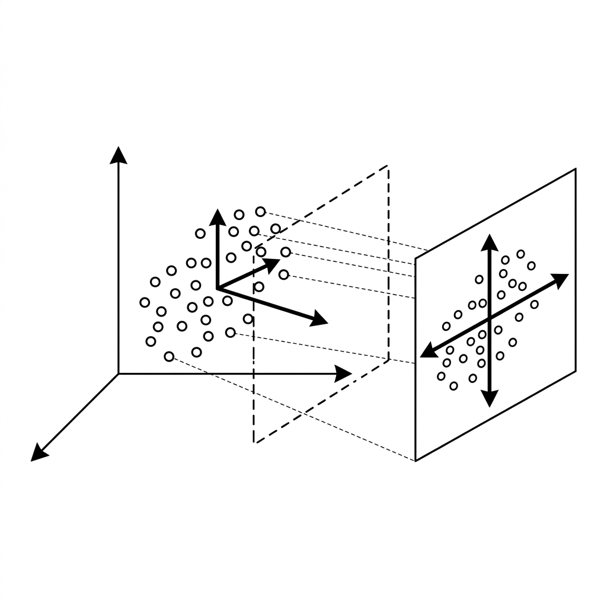

# Unit 7: Dimensionality Reduction and PCA

## 1. Understanding Dimensionality Reduction and PCA



More features is not always better. Too many dimensions slow computation, add noise, and make visualization impossible — the **curse of dimensionality**.

**Dimensionality reduction** keeps what matters and compresses the rest. The classic method is **PCA (Principal Component Analysis)**.

### What Is Dimensionality Reduction? — Summaries and Photographs
Everyday analogy: **compress a 100-page book into a 5-page summary** without losing the core story. Fewer dimensions, same essence.

Visually: **photograph a 3D object as a 2D image**.
Shoot a teacup from above and you see a circle — the handle disappears. Shoot from an angle and shape and handle appear in one flat image.

PCA finds the **best viewing angle** and **projects** data onto it.

### How PCA Works — Find the Direction of Greatest Spread
How does PCA pick the angle?
It finds directions where **data varies the most (maximum variance)**.

1. **First principal component (PC1)**: The line along the widest spread — the richest single direction.
2. **Second principal component (PC2)**: Perpendicular to PC1, the next widest spread.

| Benefit of reduction | Example |
| :--- | :--- |
| **Visualization** | 30 features can't be plotted; compress to 2 with PCA and inspect visually. |
| **Faster training** | Less noise and smaller matrices speed up model training. |

### 💡 Real-World Business Use Cases

- **Survey factor analysis**: Summarize dozens of satisfaction questions into a few principal factors (e.g., service quality vs. product quality).
- **Sensor data compression in manufacturing**: Reduce hundreds of factory sensor streams while keeping critical signals — cut bandwidth and storage.
- **Genomics visualization**: Project thousands of gene expression values to 2D/3D to compare healthy vs. diseased patterns.

---

## 2. Implementation Example

We use **breast cancer data** with **30 features** — impossible to plot directly. Compress to **2 dimensions** with PCA and visualize.

```python
# 必要なツールのインポート
import matplotlib.pyplot as plt
from sklearn.datasets import load_breast_cancer
from sklearn.preprocessing import StandardScaler
from sklearn.decomposition import PCA

# 1. データの準備
cancer = load_breast_cancer()
X = cancer.data
y = cancer.target

# 2. データの標準化（PCAの超重要ステップ！）
# PCAは「数字のスケール(単位)」に非常に敏感です。必ず StandardScaler で数値を整えます。
scaler = StandardScaler()
X_scaled = scaler.fit_transform(X)
```

**Code walkthrough**
Before PCA, **always scale features**. Height (170 cm) vs. eyesight (1.2) have different scales; unscaled PCA overweight large numbers. `StandardScaler` puts every column on comparable footing (mean 0, variance 1).

```python
# 3. PCAモデルの作成と実行
# n_components=2：30次元のデータを「2次元」に圧縮するように指示します
pca = PCA(n_components=2)

# 圧縮を実行！ (fit でベストアングルを探し、transform で実際にデータを圧縮します)
X_pca = pca.fit_transform(X_scaled)

print(f"圧縮前のデータサイズ: {X.shape}")      # (569, 30) -> 30次元
print(f"圧縮後のデータサイズ: {X_pca.shape}")  # (569, 2)  -> 2次元に減った！
```

**Code walkthrough**
`PCA(n_components=2)` plus `.fit_transform()` collapses 30 features into PC1 and PC2 instantly.

```python
# 4. 圧縮したデータをグラフに描画
# X_pca[:, 0] が第1主成分(PC1)、X_pca[:, 1] が第2主成分(PC2)です
plt.figure(figsize=(8, 6))

# y=0(悪性)と y=1(良性)で色を分けてプロットします
plt.scatter(X_pca[:, 0], X_pca[:, 1], c=y, cmap='bwr', alpha=0.7)

plt.xlabel('First Principal Component (PC1)')
plt.ylabel('Second Principal Component (PC2)')
plt.title('PCA of Breast Cancer Dataset')
plt.show()
```

**Code walkthrough**
Even in 2D, malignant (0) and benign (1) cases often separate left vs. right — that's PCA's summarizing power.

---

## 3. Practice

Reduce dimensions on another dataset yourself.

**Requirements**
Use the **Iris dataset** with **4 features**. Compress to **2 dimensions** with PCA.

1. Load with `load_iris` from `sklearn.datasets`.
2. Standardize `X` with `StandardScaler`.
3. Use `PCA` with **`n_components=2`**.
4. Print the compressed shape: `print(X_pca.shape)`. (Plotting optional this time.)

**Hints**
- Always run `StandardScaler().fit_transform()` before PCA.

---

## 4. Answer Key

Write your own code first, then open the answer below to check your work.

<details>
<summary>View sample solution (click to expand)</summary>

```python
from sklearn.datasets import load_iris
from sklearn.preprocessing import StandardScaler
from sklearn.decomposition import PCA

# 1. データの読み込み
iris = load_iris()
X = iris.data

# 2. データの標準化（PCAの前の必須作業！）
scaler = StandardScaler()
X_scaled = scaler.fit_transform(X)

# 3. PCAによる次元削減
# 4次元から2次元に圧縮します
pca = PCA(n_components=2)
X_pca = pca.fit_transform(X_scaled)

# 4. 結果の確認
print("オリジナルのデータサイズ:", X.shape)     # (150, 4)
print("PCA圧縮後のデータサイズ:", X_pca.shape) # (150, 2)

# (おまけ) 圧縮しても、どれくらい元の情報が残っているか（寄与率）を確認できます
# 2次元に圧縮しても、元データの約95%の情報が保持されていることが分かります！
print(f"情報保持率（分散説明率）: {sum(pca.explained_variance_ratio_):.2%}")
```

**Solution walkthrough**
PCA is a compression tool. The bonus output shows that 2 components can retain **~95% of variance** from 4 features — useful for visualization and faster downstream models like logistic regression.
</details>
