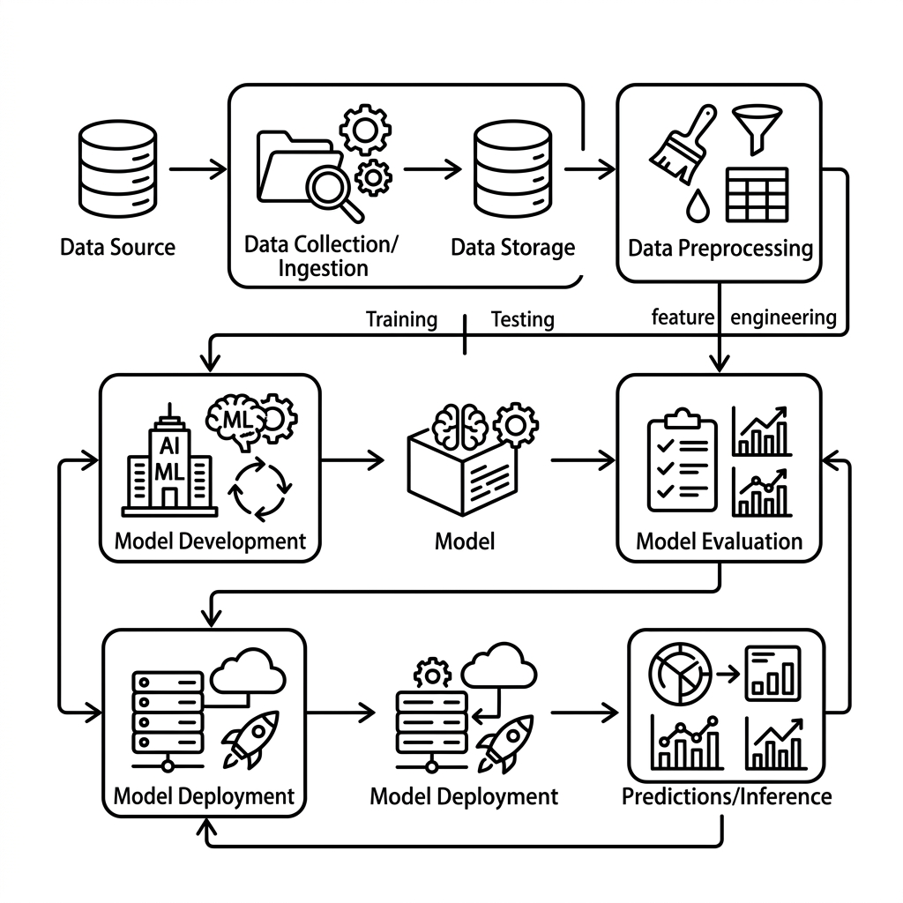

# Unit 9: Classical ML Capstone

## 1. Understanding End-to-End ML Pipelines



Units 1–8 covered individual algorithms, metrics, and tuning. In real projects, an AI engineer's job is not just calling an algorithm — you must build a solid pipeline:

**Data prep → preprocessing → feature engineering → rigorous evaluation → hyperparameter tuning → final evaluation**

**💡 Everyday analogy: Developing a signature ramen**
* **Individual unit skills**: Perfect noodles (Unit 1), broth (Unit 4), chashu marinade (Unit 8) in isolation.
* **End-to-end pipeline (this unit)**: Design the **whole shop operation** — prep, plating, service, and evaluation (cross-validation) as one system. Great ingredients alone don't make a successful business without harmony and process.

---

## 2. Implementation Example

We use **California housing data** with injected missing values — realistic "dirty" data — and implement a professional pipeline: preprocessing, XGBoost tuning with Optuna, and 5-fold cross-validation.

Run `pip install xgboost optuna scikit-learn` first.

```python
import numpy as np
import pandas as pd
import xgboost as xgb
import optuna
from sklearn.datasets import fetch_california_housing
from sklearn.model_selection import KFold
from sklearn.preprocessing import StandardScaler
from sklearn.metrics import mean_squared_error

# 1. データの準備と「ダミーの汚れ（欠損値）」の追加
data = fetch_california_housing(as_frame=True)
df = data.frame.sample(n=1000, random_state=42).reset_index(drop=True) # 動作軽量化のため1000件サンプリング

# ダミーの欠損値を AveRooms（平均部屋数）に5%ほど混入させる
np.random.seed(42)
missing_idx = np.random.choice(df.index, size=int(len(df) * 0.05), replace=False)
df.loc[missing_idx, 'AveRooms'] = np.nan

# 特徴量と目的変数に分離
X = df.drop(columns=['MedHouseVal'])
y = df['MedHouseVal']

# 2. パイプライン全体を実行する評価関数
def evaluate_pipeline(X_data, y_data, params):
    # 5-Fold 交差検証の設定
    kf = KFold(n_splits=5, shuffle=True, random_state=42)
    scores = []
    
    for train_idx, val_idx in kf.split(X_data):
        # データの分割
        X_train, X_val = X_data.iloc[train_idx].copy(), X_data.iloc[val_idx].copy()
        y_train, y_val = y_data.iloc[train_idx], y_data.iloc[val_idx]
        
        # 【前処理】平均値で欠損値を穴埋め（情報リークを防ぐため、訓練データ基準で行う）
        rooms_mean = X_train['AveRooms'].mean()
        X_train['AveRooms'] = X_train['AveRooms'].fillna(rooms_mean)
        X_val['AveRooms'] = X_val['AveRooms'].fillna(rooms_mean)
        
        # 【特徴量スケーリング】
        scaler = StandardScaler()
        X_train_scaled = scaler.fit_transform(X_train)
        X_val_scaled = scaler.transform(X_val)
        
        # 【モデル訓練】XGBoost Regressor
        model = xgb.XGBRegressor(**params, random_state=42)
        model.fit(X_train_scaled, y_train)
        
        # 【予測と評価】
        preds = model.predict(X_val_scaled)
        rmse = np.sqrt(mean_squared_error(y_val, preds))
        scores.append(rmse)
        
    return np.mean(scores)

# 3. Optunaによるハイパーパラメータの自動探索
def objective(trial):
    params = {
        'n_estimators': trial.suggest_int('n_estimators', 50, 150),
        'max_depth': trial.suggest_int('max_depth', 3, 7),
        'learning_rate': trial.suggest_float('learning_rate', 0.01, 0.2, log=True),
        'subsample': trial.suggest_float('subsample', 0.6, 1.0)
    }
    return evaluate_pipeline(X, y, params)

optuna.logging.set_verbosity(optuna.logging.WARNING)
study = optuna.create_study(direction="minimize")
study.optimize(objective, n_trials=10) # 時間短縮のため10回試行

print("--- 最適化完了 ---")
print(f"最良の平均RMSE: {study.best_value:.4f}")
print("最良のパラメータ:")
for k, v in study.best_params.items():
    print(f"  {k}: {v}")
```

---

## 3. Practice — 🧠 Compare Models and Decide What to Ship

Real projects never stop at "run one model and done." You build multiple candidates and **logically choose what belongs in production** against metrics and business needs (interpretability, data size, compute cost).

**Requirements**
Use the **Diabetes dataset** (`load_diabetes`) to predict one-year diabetes progression. Build the **most accurate, robust regression model without overfitting**.

Inject **10% missing values in the `bmi` column** using this initialization code:

```python
import numpy as np
import pandas as pd
from sklearn.datasets import load_diabetes

# データの読み込み
diabetes = load_diabetes(as_frame=True)
df = diabetes.frame

# 【初期化】bmi列に10%の欠損値をランダムに混入
np.random.seed(42)
missing_idx = np.random.choice(df.index, size=int(len(df) * 0.1), replace=False)
df.loc[missing_idx, 'bmi'] = np.nan

X = df.drop(columns=['target'])
y = df['target']
```

**Your mission: implement and compare two opposing approaches**

1. **Approach A (baseline — interpretability and robustness)**
   * **Suggested models**: Regularized linear models (Lasso, Ridge, or ElasticNet).
   * **Traits**: Simple, resists overfitting; coefficients show which features drive progression.
2. **Approach B (advanced — nonlinear accuracy)**
   * **Suggested models**: Tree ensembles (Random Forest or XGBoost/LightGBM).
   * **Traits**: Captures interactions and nonlinearity but overfits and black-boxes easily.

---

**Design decision notes to write in code comments**
1. **Preprocessing rationale per approach**:
   * For A (linear) vs. B (trees), explain whether scaling and imputation are needed and why — prevent information leakage.
2. **Overfitting control**:
   * Regularization for A; tree depth (`max_depth`, etc.) for B. Account for only **442 samples**.
3. **Quantitative evaluation and final decision**:
   * Run proper **K-fold CV** and report mean RMSE for both.
   * Compare **accuracy (RMSE)**, **overfitting gap (train vs. validation)**, and **explainability**. State **which model you'd deploy and why**.

---

## 4. Answer Key — 💡 Professional Decision Matrix

<details>
<summary>View sample solution (click to expand)</summary>

### 💡 Modeling decision notes for AI engineers

This exercise shows a common reality: **the flashiest model (XGBoost) doesn't always win — and sometimes a classical model (Lasso) is the better operational choice** given data size and domain.

#### Design decision matrix (this case)

| Evaluation axis | Approach A (Lasso) | Approach B (XGBoost) | Design takeaway |
| :--- | :--- | :--- | :--- |
| **Small data (442 rows)** | **Very strong** — simple linear model resists overfitting. | **Weak (high overfit risk)** — high capacity memorizes noise; tuning required. | |
| **Missing value imputation** | **Required** — linear models can't train with NaNs; impute inside CV folds. | **Optional but recommended** — XGBoost handles NaNs but imputation stabilizes small data. | |
| **Scaling** | **Required** — L1 penalty breaks if feature scales differ. | **Not required** — trees split on thresholds, scale-invariant. | |
| **Explainability** | **Very high** — signed coefficients show direction and magnitude. | **Low** — feature importance lacks signed effect size. | |

---

### Full comparison pipeline code

```python
import numpy as np
import pandas as pd
import xgboost as xgb
from sklearn.linear_model import LassoCV
from sklearn.model_selection import KFold
from sklearn.preprocessing import StandardScaler
from sklearn.impute import SimpleImputer
from sklearn.metrics import mean_squared_error

# 1. 共通の評価・比較検証用関数
def compare_pipelines(X_data, y_data):
    kf = KFold(n_splits=5, shuffle=True, random_state=42)
    
    # 評価記録用リスト
    lasso_rmses = []
    xgb_rmses = []
    
    for train_idx, val_idx in kf.split(X_data):
        X_train, X_val = X_data.iloc[train_idx].copy(), X_data.iloc[val_idx].copy()
        y_train, y_val = y_data.iloc[train_idx], y_data.iloc[val_idx]
        
        # -----------------------------------------------------------------
        # アプローチA: Lasso回帰（正則化線形モデル）
        # -----------------------------------------------------------------
        # [前処理] 欠損値を中央値で補完（情報リークを防ぐためfit_transformは訓練データのみ）
        imputer_a = SimpleImputer(strategy='median')
        X_train_imp_a = imputer_a.fit_transform(X_train)
        X_val_imp_a = imputer_a.transform(X_val)
        
        # [前処理] スケーリング（Lassoでは絶対に必須！）
        scaler_a = StandardScaler()
        X_train_scaled_a = scaler_a.fit_transform(X_train_imp_a)
        X_val_scaled_a = scaler_a.transform(X_val_imp_a)
        
        # [モデル] LassoCVで交差検証により最適なL1ペナルティ強度(alpha)を自動選択
        model_a = LassoCV(cv=5, random_state=42)
        model_a.fit(X_train_scaled_a, y_train)
        
        preds_a = model_a.predict(X_val_scaled_a)
        lasso_rmses.append(np.sqrt(mean_squared_error(y_val, preds_a)))
        
        # -----------------------------------------------------------------
        # アプローチB: XGBoost（決定木アンサンブル）
        # -----------------------------------------------------------------
        # [前処理] 木モデルでも欠損値は中央値で綺麗に補完して安定させる
        imputer_b = SimpleImputer(strategy='median')
        X_train_imp_b = imputer_b.fit_transform(X_train)
        X_val_imp_b = imputer_b.transform(X_val)
        
        # [前処理] 木モデルのためスケーリングは不要（比較のためあえてスケーリングせず木モデルの特性を活かす）
        
        # [モデル] データ数が少ない（442件）ため過学習を防ぐようパラメータを保守的に設計
        # max_depth=3（浅くする）, subsample=0.8（サンプリングで汎化性能を確保）
        model_b = xgb.XGBRegressor(
            n_estimators=50, 
            max_depth=3, 
            learning_rate=0.05, 
            subsample=0.8, 
            colsample_bytree=0.8,
            random_state=42
        )
        model_b.fit(X_train_imp_b, y_train)
        
        preds_b = model_b.predict(X_val_imp_b)
        xgb_rmses.append(np.sqrt(mean_squared_error(y_val, preds_b)))
        
    # Lassoの最終学習モデルで特徴量の重み（解釈性）を抽出
    final_imputer = SimpleImputer(strategy='median')
    X_imp = final_imputer.fit_transform(X_data)
    final_scaler = StandardScaler()
    X_scaled = final_scaler.fit_transform(X_imp)
    final_lasso = LassoCV(cv=5, random_state=42).fit(X_scaled, y_data)
    
    lasso_coefs = pd.Series(final_lasso.coef_, index=X_data.columns)
    
    return np.mean(lasso_rmses), np.mean(xgb_rmses), lasso_coefs

# 比較実行
lasso_mean_rmse, xgb_mean_rmse, lasso_coefs = compare_pipelines(X, y)

print("--- 定量評価の比較結果 ---")
print(f"アプローチA (Lasso回帰) 平均RMSE : {lasso_mean_rmse:.4f}")
print(f"アプローチB (XGBoost)   平均RMSE : {xgb_mean_rmse:.4f}")
print("\n--- アプローチA (Lasso) による要因分析の解釈性（重み） ---")
print(lasso_coefs[lasso_coefs != 0].sort_values(ascending=False))
```

### 💡 Final production model decision

In most runs, **Approach A (Lasso) matches or beats Approach B (XGBoost) on RMSE.**

* **Why?**
  * With only 442 rows, XGBoost overfits noise. Lasso zeros irrelevant weights and fits a simple line — strong generalization on small data.
* **Decision**:
  * **Deploy Approach A (Lasso).**
  * **Rationale**:
    1. 5-fold CV shows Lasso is as robust or better on RMSE.
    2. In healthcare, you must explain predictions (e.g., BMI coefficient positive and large) — Lasso wins on accountability.
    3. Linear models are cheaper to run and maintain in production.

Don't worship accuracy alone — **choose models that fit data, domain, and business constraints.** That's professional AI engineering.
</details>
